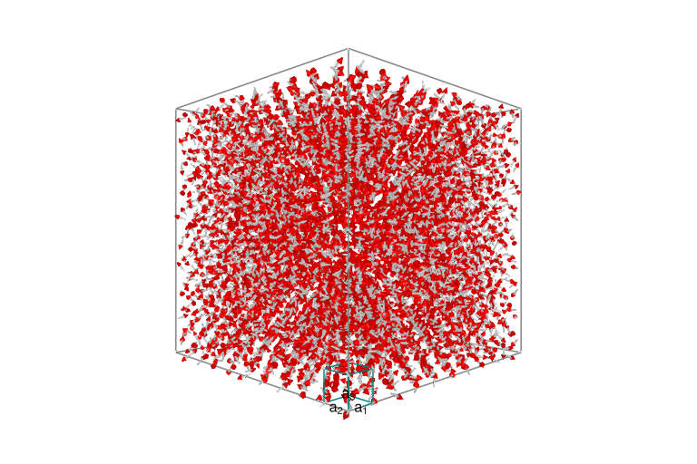
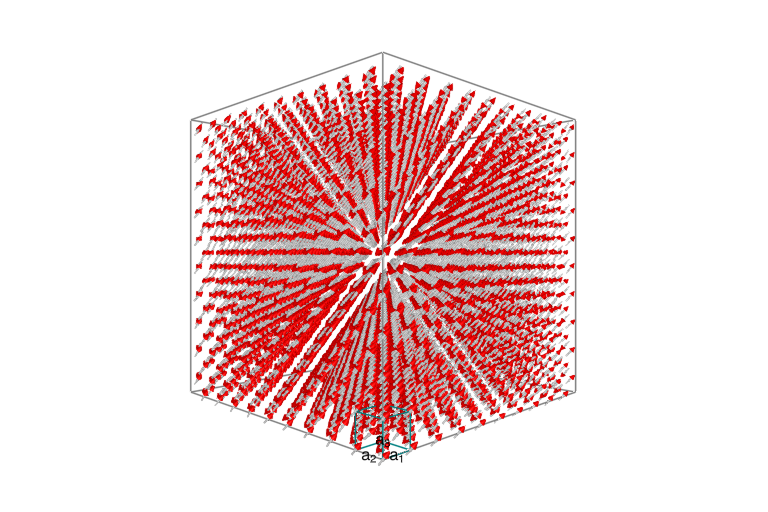
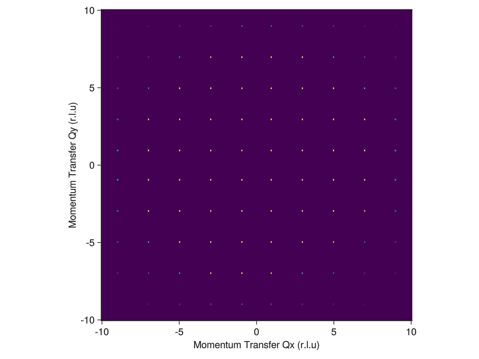
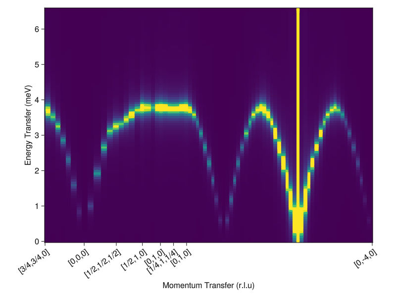
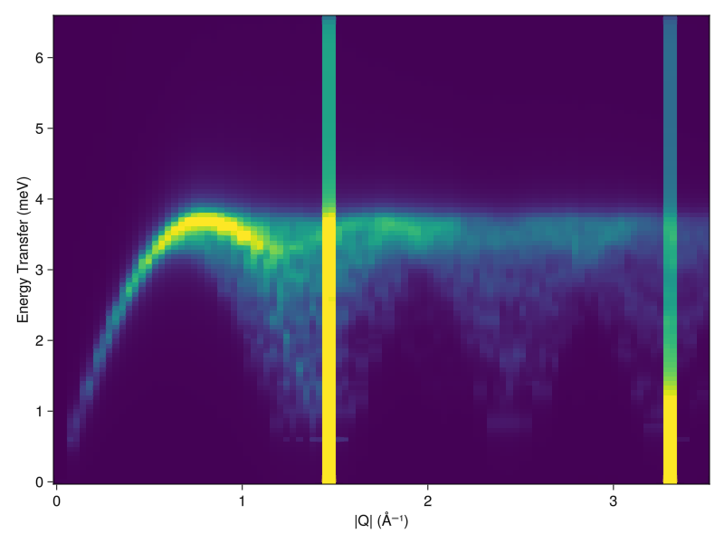
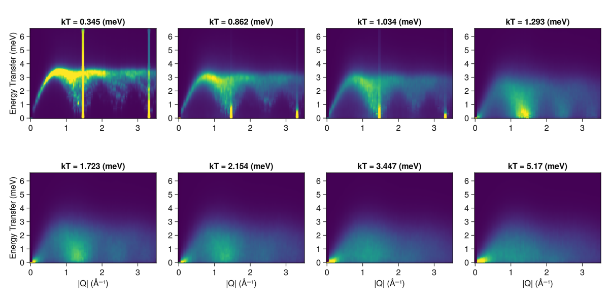

> 
_This is a [tutorial](https://github.com/SunnySuite/SunnyTutorials/tree/main/tutorials)
 for the [Sunny](https://github.com/SunnySuite/Sunny.jl/) package,
 which enables dynamical simulations of ordered and thermally disordered spins with dipole
 and higher order moments._

## Welcome to a Sunny Tutorial on the Diamond Lattice System CoRh₂O₄</sub>
**Script**: Diamond Lattice Finite Temperature Calculation <br>
**Inspired by**: [Ge et al., Phys. Rev. B 96, 064413 (2017)](https://doi.org/10.1103/PhysRevB.96.064413) <br>
**Authors**: Martin Mourigal, David Dahlbom <br>
**Date**: August 21, 2023  (Sunny 0.5.0) <br>
**Goal**: This script is to calculate the temperature dependence of the magnon excitations in the
spin-3/2 Heisenberg Diamond Antiferromagnet and compare to powder-averaged results obtained for
the compound CoRh₂O₄ <br>

---
#### Loading Packages

````julia
using Sunny, GLMakie, ProgressMeter, Statistics, Random, Brillouin
Sunny.offline_viewers()
cif_path = pkgdir(Sunny, "examples", "longer_examples", "CoRh2O4_#109301.cif");
````

````
┌ Warning: This function is deprecated and does nothing.
└ @ Sunny ~/.julia/packages/Sunny/pnbBZ/src/Sunny.jl:139

````

#### Defining Custom functions

The function `quench!` randomizes the spins of a given `System`, fixes a
target temperature, and lets the system relax at this temperature for `nrelax`
integration steps.

````julia
function quench!(sys, integrator; kTtarget, nrelax)
    randomize_spins!(sys);
    integrator.kT = kTtarget;
    prog          = Progress(nrelax; dt=10.0, desc="Quenched and now relaxing: ", color=:green);
    for _ in 1:nrelax
        step!(sys, integrator)
        next!(prog)
    end
end
````

````
quench! (generic function with 1 method)
````

`dwell!` takes a `System`, sets a target temperature, and has the system
dwell at this temperature for `ndwell` integration steps.

````julia
function dwell!(sys, integrator; kTtarget, ndwell)
    integrator.kT = kTtarget;
    prog          = Progress(ndwell; dt=10.0, desc="Dwelling: ", color=:green);
    for _ in 1:ndwell
        step!(sys, integrator)
        next!(prog)
    end
end
````

````
dwell! (generic function with 1 method)
````

`anneal!` takes a temperature schedule and cools the `System` through it,
with `ndwell` steps of the integrator at each temperature in the schedule.
Returns the energy at the end of the dwell for each scheduled temperature.

````julia
function anneal!(sys,  integrator;  kTschedule, ndwell)
    nspins = prod(size(sys.dipoles));
    ensys  = zeros(length(kTschedule))
    prog   = Progress(ndwell*length(kTschedule); dt=10.0, desc="Annealing: ", color=:red);
    for (i, kT) in enumerate(kTschedule)
        integrator.kT = kT
        for _ in 1:ndwell
            step!(sys, integrator)
            next!(prog)
        end
        ensys[i] = energy(sys)
    end
    return ensys/nspins
end
````

````
anneal! (generic function with 1 method)
````

`sample_sf!` samples a structure factor, which may be either an instant or
dynamical structure factor. The integrator is run `ndecorr` times before each
one of the samples is taken.

````julia
function sample_sf!(sf, sys, integrator; nsamples, ndecorr)
    prog  = Progress(nsamples*ndecorr; dt=10.0, desc="Sampling SF: ", color=:red);
    for _ in 1:nsamples
        for _ in 1:ndecorr
            step!(sys, integrator)
            next!(prog)
        end
        add_sample!(sf, sys)    # Accumulate the newly sampled structure factor into `sf`
    end
end
````

````
sample_sf! (generic function with 1 method)
````

`powder_average` powder averages a structure factor. Works for both instant
and dynamical structure factors. To prevent smearing, removes Bragg peaks
before introducing energy broadening. Bragg peaks are added back at ω=0 after
broadening.

````julia
function powder_average(sc, rs, npts, formula; η=0.1)
    prog   = Progress(length(rs); dt=10., desc="Powder Averaging: ", color=:blue)
    ωs = available_energies(sc)
    output = zeros(Float64, length(rs), length(ωs))
    for (i, r) in enumerate(rs)
        qs = reciprocal_space_shell(sc.crystal, r, npts)
        vals = intensities_interpolated(sc, qs, formula)
        bragg_idxs = findall(x -> x > maximum(vals)*0.9, vals)
        bragg_vals = vals[bragg_idxs]
        vals[bragg_idxs] .= 0
        vals = broaden_energy(sc, vals, (ω,ω₀)->lorentzian(ω-ω₀, η))
        vals[bragg_idxs] .= bragg_vals
        output[i,:] .= mean(vals, dims=1)[1,:]
        next!(prog)
    end
    return output
end
````

````
powder_average (generic function with 1 method)
````

---
### System Definition for CoRh₂O₄

Define the crystal structure of CoRh₂O₄ in the conventional cell

````julia
xtal    = Crystal(cif_path; symprec=1e-4)
magxtal = subcrystal(xtal,"Co1")
view_crystal(magxtal,6.0)
print_symmetry_table(magxtal, 4.0)
````

````
Atom 1
Type 'Co1', position [0, 0, 0], multiplicity 8
Allowed g-tensor: [A 0 0
                   0 A 0
                   0 0 A]
Allowed anisotropy in Stevens operators:
    c₁*(𝒪[4,0]+5𝒪[4,4]) +
    c₂*(𝒪[6,0]-21𝒪[6,4])

Sunny.Bond(1, 3, [0, 0, 0])
Distance 3.6784429025744, coordination 4
Connects 'Co1' at [0, 0, 0] to 'Co1' at [1/4, 1/4, 1/4]
Allowed exchange matrix:[A B B
                         B A B
                         B B A]


````

Assign local Hilbert space

````julia
S = 3/2
lhs = [SpinInfo(1, S=S, g=2)]
formfactors = [FormFactor("Co2")];
````

Create `System` and randomize it

````julia
sunmode = :dipole
latsize = (10,10,10)
sys     = System(magxtal, latsize, lhs, sunmode; seed=1)
randomize_spins!(sys)
plot_spins(sys)
````


Define Exchange Interactions

````julia
scaleJ = 0.63
valJ1  = 1.00*scaleJ
set_exchange!(sys, valJ1, Bond(1, 3, [0, 0, 0]));
````

---
### System thermalization to an ordered, yet finite temperature, state

Define Langevin Integrator and Initialize it

````julia
Δt0        = 0.05/abs(scaleJ*S); ## Time steps in Langevin
λ0         = 0.1; ## Langevin damping, usually 0.05 or 0.1 is good.
kT0        = 0.01*abs(scaleJ*S); ## Initialize at some temperature
integrator = Langevin(Δt0; λ=λ0, kT=kT0);
````

Thermalization
Option 1: Quench the system from infinite temperature to a target temperature.
Note: this may lead to a poorly thermalized sample

````julia
quench!(sys, integrator; kTtarget=kT0, nrelax=10000);
````

Option 2: Anneal (according to a temperature schedule) than dwell once reach base
Note: starting from very high temperature here

````julia
# kTs = [abs(scaleJ)*valS*100 * 0.9^k for k in 0:100]
# anneal!(sys,integrator;kTschedule=kTs,ndwell=500)
# dwell!(sys,integrator;kTtarget=kTs[end],ndwell=2000)
````

Plot the resulting spin system to check ordering in real space

````julia
plot_spins(sys)
````


---
### Calculation of Neutron Scattering Responses

#### Fourier transformed instantaneous two-point correlation functions

Calculate the Instantaneous/Equal-time Structure Factor

````julia
eqsf = instant_correlations(sys)
````

````
SampledCorrelations (6.252 MiB)
[S(q) | 0 sample]
Lattice: (10, 10, 10)×8
6 correlations in Dipole mode:
╔ ⬤ ⬤ ⬤ Sx
║ ⋅ ⬤ ⬤ Sy
╚ ⋅ ⋅ ⬤ Sz

````

If desired, add additional samples by decorrelating and then re-calculating the eqsf

````julia
nsamples   = 1
ndecorr    = 1000
@time sample_sf!(eqsf, sys, integrator; nsamples=nsamples, ndecorr=ndecorr);
````

````
  0.925283 seconds (1.89 M allocations: 118.813 MiB, 3.98% gc time, 48.32% compilation time)

````

Project onto a constant Q-Slice in momentum space

````julia
nQpts  = 200
Qxpts  = range(-10.0, 10.0, length=nQpts)
Qypts  = range(-10.0, 10.0, length=nQpts)
qz     = 1.0
Qpts   = [[qx, qy, qz] for qx in Qxpts, qy in Qypts]
instant_formula = intensity_formula(eqsf, :perp; formfactors)
iq = instant_intensities_interpolated(eqsf, Qpts, instant_formula)
````

````
200×200 Matrix{Float64}:
 1.05401e-5   1.89493e-6   7.17608e-6   4.82607e-6   1.02584e-5   1.80671e-5   1.24966e-6   1.07144e-5   0.000104657  2.23201e-5      5.18359e-5   2.84989e-5   0.000170468  2.30604e-5   3.28746e-6   6.5498e-5    4.58836e-5   2.61642e-5   6.09848e-5   1.3953e-5    0.000139496  0.000199583  0.000385167  8.52852e-6   0.000243824  0.000182751  0.000209873  1.09997e-5   0.000284189  2.46586e-5       0.000126132  2.85122e-5   0.000371629  1.74116e-5   0.000362146  0.000346728  0.000577551  1.77853e-5   0.00113177   0.000635523  0.000525173  4.66304e-5   0.000384963  0.000136032  0.000321929  0.000657908  4.87668e-5   0.000315964  0.00214343   0.000445743      0.000917517  0.000487308  0.00253129   0.00042699   8.44163e-5   0.00110303   0.000538268  0.000228013  0.000877031  0.000110392  0.00116416   0.00146432   0.00307369   6.02546e-5   0.00218365   0.00109352   0.0014889    0.000164718  0.0016916    0.000184471      0.000304582  0.000195762  0.00184381   0.000224629  0.00182225   0.00130742   0.00306771   0.000120939  0.00435858   0.00202728   0.00173262   0.000326271  0.00191715   0.000380231  0.00105473   0.00303465   0.000425604  0.00125621   0.00565331    0.00135921       0.00223779    0.00138737   0.00574717   0.00136393   0.000540601  0.00356093   0.00113983   0.000411752  0.00240769   0.000623869  0.00205461   0.00476385   0.000309789  0.00409997   0.00130887   0.00237042   0.000644693  0.00205417    0.000305284       0.000274281   0.000301338  0.00193354   0.000680843  0.0022113    0.0011111    0.00373683   0.000380378  0.00381977   0.00156574   0.00131758   0.000853194  0.00216093   0.000345906  0.000846798  0.00330138   0.000697975  0.00116034   0.00356911   0.00108058       0.00124574   0.00103054   0.00316389   0.00100815   0.000625187  0.00266479   0.000608702  0.000261027  0.00148463   0.000729048  0.000703382  0.000823054  0.00183184   0.000305413  0.00180559   0.000440164  0.000969431  0.000439508  0.000601458  0.000116325      0.000270431  0.000106451  0.000492453  0.000355887  0.000682254  0.000278832  0.0010501    0.00019544   0.000849457  0.0003711    0.00027039   0.000358873  0.000520609  9.84506e-5   0.000168759  0.000757111  0.000195249  0.000227303  0.000556948  0.000199401      0.000161684  0.000174331  0.00041963   0.000150483  0.000117694  0.000385617  7.3195e-5    4.12145e-5   0.000171136  0.000119996  6.57549e-5   8.47074e-5   0.000149619  3.943e-5     0.000140056  3.47944e-5   7.07058e-5   3.84548e-5   3.1546e-5    6.55941e-6      2.87406e-5   5.11855e-6   1.90873e-5   1.87919e-5   2.63445e-5   1.03541e-5   3.04815e-5   7.29025e-6   1.90111e-5   8.83246e-6   4.81312e-6
 1.27245e-6   4.16656e-6   1.32437e-5   2.56216e-6   1.21911e-5   5.58487e-5   3.46299e-6   7.6748e-6    4.74442e-5   9.0301e-5       1.58381e-5   0.000122559  4.51513e-5   3.58411e-5   1.27312e-5   0.000180763  1.70646e-5   8.1272e-5    4.64325e-6   0.000153144  8.77483e-5   5.06587e-5   1.32298e-5   0.000276452  0.000201753  2.53983e-5   0.000133573  1.97504e-5   9.69557e-5   0.000507031      0.000184302  0.00029273   0.000941071  0.000134426  5.56215e-5   0.000418578  0.000219912  0.000133287  0.000600107  0.000143371  2.54493e-5   0.000162896  0.000224362  0.000123162  0.000149716  0.00148546   6.57554e-5   3.13534e-5   0.000748621  0.00122947       0.000306594  0.00169782   0.000863677  0.000666339  0.00021963   0.00191211   3.94946e-5   0.000369365  5.90352e-5   0.00118093   0.000872262  0.000499605  0.00015125   0.00253019   0.00141792   0.000155176  0.00103899   4.23958e-5   0.00067673   0.00175967       0.000995159  0.00182602   0.00506189   0.00052768   0.000353003  0.00133423   0.000588558  3.58487e-5   0.00288048   0.000196201  5.8233e-5    0.000517911  0.000403164  0.000840104  0.000399926  0.00443451   0.000169003  0.00010521   0.00143778    0.00201232       0.000935804   0.00334817   0.00293709   0.00302922   0.000697732  0.00328661   0.000120892  0.000748428  0.000222323  0.00165732   0.00106768   0.000376349  0.00477044   0.00216378   0.000533234  0.00170081   7.05985e-5   0.000983853   0.00126076        0.001354      0.0032372    0.00602068   0.00130026   0.000971318  0.00107212   0.0004287    0.000425844  0.00332618   0.000186611  0.000212906  0.000372904  0.00109525   0.00126388   0.00116031   0.00295059   0.000146818  0.000614377  0.000704488  0.000866469      0.000683004  0.0015412    0.00233618   0.00314919   0.000508781  0.00136741   0.000391626  0.00124307   0.000196061  0.000669525  0.000967023  0.000561792  0.00021248   0.00208567   0.000887271  0.000447081  0.000643421  9.78929e-5   0.00032359   0.000565348      0.000517086  0.0014449    0.00172716   0.000811572  0.000527942  0.000353591  0.000169516  0.000460638  0.000906149  0.000150739  0.000120737  7.03053e-5   0.000585518  0.000366667  0.000518546  0.000461269  3.79832e-5   0.000258132  0.00013001   0.000179374      0.000110557  0.000197965  0.000381577  0.000599022  7.43814e-5   0.000154811  0.000104109  0.000291121  2.98198e-5   8.00253e-5   0.000103218  5.74261e-5   2.12333e-5   0.000169215  7.57766e-5   5.1596e-5    4.23769e-5   1.30861e-5   1.74392e-5   6.28198e-5      3.25405e-5   8.88943e-5   7.40734e-5   5.23774e-5   2.86963e-5   1.83219e-5   9.10842e-6   2.4489e-5    2.35827e-5   6.55051e-6   3.67265e-6
 3.56074e-6   1.15243e-5   1.33216e-6   1.67613e-5   1.55889e-5   1.6665e-5    1.16008e-5   1.76376e-5   4.91571e-5   7.03839e-5      0.000139818  0.000100409  5.01658e-5   5.84713e-5   5.32073e-5   7.30642e-6   7.40772e-5   5.7201e-5    7.15056e-5   0.000273082  0.000185019  0.000314153  0.000167138  1.26554e-5   1.23054e-5   0.000134317  0.000542611  5.31666e-5   4.99206e-5   0.000219368      0.000303838  0.000165328  0.00040253   0.000175146  0.000164097  0.000245625  0.000390082  0.000127953  0.000679721  7.93266e-5   9.64044e-5   0.000376991  1.93898e-5   0.000580079  0.00037664   0.000277286  0.000281376  0.000148934  0.000684166  0.00138513       0.00192848   0.00120084   0.000541753  0.000379278  0.000806011  8.4727e-6    0.000691387  0.000586643  0.000393116  0.00109215   0.00143149   0.00257965   0.000927747  0.000125293  6.89322e-5   0.000750179  0.00291284   0.000167635  8.22479e-5   0.00177819       0.00151807   0.00111112   0.00145387   0.00112063   0.00115022   0.0012679    0.00186186   0.000647166  0.00231727   0.000916412  0.000153899  0.00104529   4.47881e-5   0.00291759   0.000983988  0.000571709  0.00104278   0.000120051  0.00134072    0.00417307       0.0037251     0.00239422   0.000868651  0.000614368  0.00223771   0.000248237  0.00110403   0.00109822   0.000481419  0.000663074  0.00418483   0.000955635  0.000718423  0.000306181  0.000813089  0.00309223   0.000161466  0.000472434   0.00331276        0.00189012    0.00188178   0.00114272   0.00167419   0.00179339   0.0016636    0.00201977   0.000744498  0.00173305   0.0031935    9.19793e-5   0.000656491  0.000139792  0.00378979   0.000593235  0.000539617  0.0010086    0.000420256  0.000954254  0.00294288       0.00169731   0.00158456   0.000402002  0.000971468  0.00144647   0.000548047  0.000452336  0.000488959  0.000454317  0.00114905   0.000724872  0.00165923   0.000377587  0.000678752  0.000294762  0.000241465  0.000903759  0.000138481  0.00055625   0.00138761       0.000695669  0.000758787  0.00034119   0.000571991  0.000604802  0.000541041  0.000517495  0.000195332  0.000347333  0.00153113   5.81515e-5   0.000127375  7.12054e-5   0.00105687   0.000102414  0.000186354  0.000224937  0.000215285  0.00024793   0.000469404      0.000240479  0.000325919  7.3417e-5    0.000289851  0.000197455  0.000133009  5.48515e-5   5.05359e-5   0.000102476  0.000322871  6.75695e-5   0.000146831  5.35463e-5   8.8907e-5    3.83301e-5   1.98911e-5   7.00307e-5   1.89938e-5   6.40008e-5   8.95644e-5      4.63621e-5   4.46737e-5   2.36198e-5   2.64076e-5   2.54017e-5   2.22442e-5   1.63851e-5   5.67742e-6   9.47778e-6   5.22631e-5   2.49534e-6
 6.46853e-6   7.88419e-6   1.68043e-5   6.07377e-6   1.20697e-5   1.43851e-5   9.03506e-6   4.01736e-5   3.14295e-5   1.31683e-5      0.000104871  8.83706e-6   0.00010883   9.17466e-5   2.2116e-5    3.62136e-5   6.20568e-5   0.000190352  0.000102383  0.000473736  9.67158e-5   2.3988e-5    4.71985e-5   0.00033334   7.67689e-5   8.49074e-5   0.000218658  4.45633e-5   0.000525116  0.000189319      1.33603e-5   0.000794581  0.000563509  0.0001942    0.000184634  5.6061e-5    0.000229169  0.00153578   8.4247e-5    8.47915e-5   0.000264332  0.000342257  0.000377695  0.000232113  0.000306183  0.000439702  0.000101499  0.000878534  0.000403879  0.000297216      0.00162829   5.50456e-5   0.00130671   0.00103158   0.00022592   0.000386339  0.00048617   0.00246087   0.0010227    0.00398947   0.00122194   0.000157732  0.000445527  0.00242747   0.00061923   0.000795129  0.00172621   0.000370893  0.00453911   0.000733838      3.0223e-5    0.00438709   0.0029244    0.00120196   0.000786946  0.0002646    0.000809127  0.00622945   0.000870009  0.000441658  0.00100144   0.00169119   0.000763868  0.00111391   0.000950409  0.00203418   0.000137358  0.00282811   0.00188182    0.00201071       0.00405508    0.000101394  0.00263529   0.00209545   0.00053079   0.00120213   0.000635426  0.00660934   0.00195448   0.00632904   0.000462682  0.00088821   0.00386936   0.00136528   0.00163191   0.00311801   0.0011774    0.0088855     0.00103419        0.000419853   0.00531702   0.00341109   0.00174992   0.000714312  0.000288416  0.001173     0.00587993   0.00197402   0.00108122   0.000877022  0.00199205   0.000439324  0.0012137    0.000697311  0.00221953   0.000208726  0.0021336    0.00302337   0.00283734       0.00244455   0.00022266   0.00141616   0.00120802   0.000418738  0.00111768   0.00026922   0.00415795   0.000873245  0.00243259   0.00242746   0.000419187  0.000409922  0.00162236   0.000779876  0.000750224  0.00133538   0.000795892  0.00385322   0.000625416      0.000390648  0.0015297    0.00097313   0.000588162  0.00015842   7.68551e-5   0.000535243  0.00141401   0.000800123  0.000496451  0.000187309  0.000521132  0.00014467   0.000284425  0.000128926  0.000517487  9.76502e-5   0.000371459  0.000886121  0.000706726      0.000366945  7.55809e-5   0.000219884  0.000195179  7.93965e-5   0.000208427  4.72399e-5   0.000534217  8.7012e-5    0.000233707  0.000300361  6.38072e-5   3.71924e-5   0.000150229  8.14287e-5   6.12978e-5   0.000103778  7.82517e-5   0.000272136  6.19747e-5      3.70428e-5   7.44371e-5   4.60788e-5   2.82251e-5   5.93699e-6   2.91587e-6   2.78725e-5   4.54192e-5   2.97385e-5   1.83969e-5   4.12302e-6
 1.13004e-5   8.44622e-6   2.66351e-5   7.14949e-6   4.05552e-5   2.20262e-5   2.05217e-5   5.87239e-6   5.13004e-5   0.000140158     5.35117e-5   0.000103545  0.000119463  0.000291331  2.87888e-5   8.49648e-5   3.15098e-5   8.95453e-5   0.000151984  7.97987e-5   2.85178e-5   8.37668e-5   7.11678e-5   6.29613e-5   0.000150783  0.000186519  0.000173789  0.00110955   3.35001e-5   0.000491837      0.000146084  0.0021488    0.000182291  0.000401913  0.000272544  0.000360083  0.000731259  0.000188351  8.15222e-5   9.45353e-5   0.000231009  0.000291527  0.000561831  0.000223073  0.00109562   0.000663212  0.000307434  0.00010001   0.000748539  0.00213443       0.00101106   0.00151498   0.00122325   0.0033921    0.000306344  0.000798828  0.000223855  0.000635232  0.00162892   0.000966248  0.000187758  0.000699743  0.0008776    0.000494556  0.000896575  0.000600397  0.000738534  0.00763326   0.000169925  0.00261046       0.00118344   0.0104769    0.000194605  0.00135328   0.00281617   0.00272203   0.00248706   0.000446967  0.000152059  0.000280925  0.000518457  0.00113102   0.00134882   0.000910838  0.00447832   0.00344329   0.000930155  0.000245674  0.00178185    0.00503268       0.00366352    0.00378735   0.0018497    0.00738571   0.00379436   0.00153529   0.000258607  0.000928974  0.00355881   0.00257699   0.00140862   0.00324167   0.00101554   0.00139885   0.000540808  0.000781892  0.0116145    0.00027376    0.0029762         0.00211956    0.0110417    0.000940181  0.00162625   0.0066209    0.00473406   0.00226751   0.000628421  0.000428666  0.000252444  0.000965201  0.0010545    0.00123714   0.000875224  0.00466337   0.00419302   0.00116268   0.000148822  0.00129976   0.00282535       0.00319836   0.00223949   0.000674002  0.00430704   0.00582135   0.000920263  0.00011572   0.000560611  0.00183117   0.00157773   6.86142e-5   0.000764709  0.00247739   0.000559022  0.000722532  0.00054391   0.000408824  0.0041722    0.000143732  0.000845387      0.000821734  0.00289081   0.00105098   0.000803072  0.00296117   0.00172822   0.000712436  0.00035746   0.000280996  8.08939e-5   0.000507937  0.000239131  0.000436763  0.000192036  0.00112066   0.0010553    0.000357554  2.56717e-5   0.000286215  0.000422252      0.000601893  0.00031802   0.000107617  0.000662424  0.0013033    0.000152405  2.51115e-5   0.000105409  0.000203736  0.000191518  8.09592e-6   8.91523e-5   0.000316543  6.13025e-5   8.26368e-5   9.37053e-5   5.21957e-5   0.000284308  1.36114e-5   4.983e-5        5.04172e-5   0.000147848  0.000100895  6.02738e-5   0.000163934  7.97962e-5   3.57674e-5   2.04578e-5   1.46065e-5   3.16453e-6   2.04334e-5
 3.51864e-5   1.3217e-5    1.18089e-5   6.4149e-5    7.54849e-6   3.45136e-5   5.01349e-5   1.60005e-5   2.43358e-5   0.000168128     2.61626e-5   0.000153187  0.000154966  3.92004e-5   0.000340075  4.01582e-5   0.000153248  0.000110755  0.000138434  6.1424e-5    0.000184744  3.1351e-5    0.000187995  0.000450219  1.80862e-5   6.91472e-5   0.000161393  0.000116597  0.000655787  0.000870105      0.00030713   0.000229633  0.000643901  0.000110137  0.0001749    0.000150056  0.000953314  6.16341e-5   4.27253e-5   0.000595956  0.000930456  0.000278784  0.000237818  0.000846129  0.000258101  0.000787648  0.000393043  0.00020734   0.000389595  0.000916521      0.000406268  0.00105564   0.00219559   0.000658115  0.00403956   0.000369544  0.00127205   0.00150315   0.00165285   0.000710117  0.00143832   0.00042973   0.00130931   0.00424181   0.000116606  0.000484325  0.00114622   0.000788689  0.00574804   0.00178902       0.00121269   0.000332875  0.00421443   0.000915639  0.000745785  0.00106485   0.00398671   0.000191458  0.000116404  0.00265138   0.00222415   0.000507306  0.000490865  0.000813997  0.00138676   0.00288021   0.00100502   0.000877197  0.000973857   0.000966066      0.00174367    0.000811274  0.00658437   0.00385673   0.00913419   0.000582367  0.00186742   0.00483751   0.00446016   0.001877     0.0017084    0.0029917    0.00894093   0.000205227  0.000797414  0.00389508   0.00132773   0.0119739     0.00319767        0.00331698    0.000868214  0.00664911   0.00236512   0.00077888   0.00296987   0.00373414   0.000136468  0.000131207  0.00282236   0.00117839   0.000221444  0.000278468  0.000994552  0.00166845   0.00268051   0.00289876   0.00137668   0.00057855   0.00415158       0.00200811   0.00105383   0.00511558   0.00463264   0.00496144   0.00021362   0.00072294   0.00358127   0.00282745   0.00115636   0.000851003  0.00136102   0.00208532   0.00430566   0.000108874  0.000335086  0.00291835   0.000566956  0.00549274   0.00367962       0.00241412   0.00102372   0.00241245   0.00120058   0.000227119  0.00153665   0.000856033  3.28868e-5   5.77487e-5   0.000712668  0.000281786  8.87753e-5   8.70917e-5   0.000740544  0.000416178  0.000594528  0.00121632   0.000422009  9.08684e-5   0.00180264       0.000465743  0.000489637  0.000903687  0.000977994  0.000646637  2.45905e-5   9.84453e-5   0.000525814  0.000368596  0.000144188  8.27528e-5   0.000185421  0.000283356  0.000406002  1.22116e-5   2.94027e-5   0.00033313   4.65682e-5   0.000427628  0.00046642      0.000234038  0.000112717  0.000138638  7.98566e-5   1.17422e-5   9.20618e-5   3.09968e-5   1.53971e-6   2.96585e-6   2.15313e-5   1.22067e-5
 4.42617e-6   8.62327e-6   1.59533e-5   1.23976e-5   2.61527e-6   2.42776e-5   3.3312e-6    0.000118432  0.000177389  7.54057e-5      5.3426e-5    0.000324858  5.87352e-5   0.000159246  6.26886e-5   4.53441e-5   5.77114e-5   7.22802e-5   5.063e-5     0.00019218   0.000304623  0.000186793  9.61066e-5   8.1122e-5    0.000115034  3.80162e-5   0.000102304  0.000341712  0.00155758   0.000653757      0.000125797  0.000629984  0.000234076  0.000330452  0.000321597  0.000354543  0.000181534  9.21424e-5   0.000204611  0.000246484  0.000113083  0.000255991  0.000432113  0.000215018  2.38934e-5   0.000436169  5.74223e-5   0.00197081   0.00324448   0.000646741      0.000171453  0.00392716   0.000561965  0.0014335    0.000581757  0.000384678  0.00012355   0.000882363  0.000512237  0.00157726   0.00156477   0.00147158   0.000589416  0.000313857  0.00108603   0.000530712  0.000165108  0.00239456   0.00755554   0.00331702       0.000272054  0.00277377   0.00164325   0.00141964   0.000141537  0.000717893  0.000276144  0.000144296  0.000227254  0.000282497  0.00121289   0.00115842   0.00179379   0.000878397  7.82363e-5   0.001777     0.000149412  0.00507691   0.0100814     0.0006649        0.00206336    0.01051      0.00142791   0.00206779   0.000923369  0.000582902  0.00119134   0.00414631   0.00113381   0.00307695   0.00253596   0.00196787   0.00106572   0.00245419   0.00292293   0.000829072  0.00378752   0.00804577    0.00373475        0.00358717    0.00333058   0.00266255   0.00136067   0.00253664   0.000623525  0.000787584  0.000210905  0.00121643   0.000373447  0.00294214   0.00144405   0.00200507   0.00144467   0.000227948  0.00232758   9.53262e-5   0.00304555   0.00725506   0.000557373      0.0053427    0.00867332   0.00141882   0.000788768  0.000353598  0.000242628  0.00248761   0.00419499   0.00061204   0.0017125    0.000541119  0.00110309   0.0018092    0.00117576   0.00126214   0.00241941   0.001132     0.00139403   0.0024709    0.00110303       0.00333862   0.00128491   0.000951125  0.000341402  0.00250934   0.00045294   0.000629258  0.000165471  0.000911065  0.000328956  0.00118571   0.000424488  0.000540222  0.000516493  0.000100066  0.000682681  1.71789e-5   0.000481765  0.00121294   0.000260316      0.00168566   0.00179833   0.00033523   0.000139322  4.68953e-5   3.7008e-5    0.000608009  0.000745661  7.44087e-5   0.000230267  0.000124786  0.00011365   0.000275321  0.000188102  0.000124133  0.000295901  0.000167796  0.000100473  0.000197952  7.43529e-5      0.000346892  9.88623e-5   5.46854e-5   1.7533e-5    0.000214725  3.94853e-5   4.5819e-5    1.16831e-5   5.44148e-5   2.0302e-5    4.49552e-5
 3.30144e-5   1.16325e-5   2.08978e-5   6.24108e-5   1.1354e-5    0.00020954   0.000167601  0.000145434  4.68172e-5   0.000222496     0.000333082  0.000519379  0.000316076  0.00041647   0.000376563  9.69261e-5   0.000115446  0.000224632  0.000103288  0.000529893  1.89067e-5   0.000507927  0.000147105  0.000115802  0.00013226   0.00117463   0.00243696   0.000119581  0.000385257  0.000746417      0.00139177   0.00141524   0.000171658  0.00054659   0.00179701   0.00077144   0.000262508  0.00158872   0.00039884   0.000113161  0.000823967  0.000330677  0.000151211  0.00134707   8.05553e-5   0.00226068   0.00201353   0.00266378   0.000442301  0.00334786       0.0039691    0.00725104   0.00475158   0.00362658   0.00519112   0.00116799   0.000752557  0.00188662   0.000828658  0.00458744   9.95433e-5   0.00415425   0.000544881  0.000645858  0.000516974  0.00669757   0.0090423    0.0009524    0.00462634   0.00263152       0.00409827   0.0100077    0.0017729    0.000857356  0.00632159   0.00352896   0.000605273  0.00565711   0.000891383  0.000527487  0.00234429   0.00124518   3.61028e-5   0.00413935   0.000357458  0.00272636   0.00287498   0.00860772   0.00665801    0.00881357       0.00894462    0.0248229    0.0165213    0.00515826   0.0152579    0.00325117   0.0023197    0.00337952   0.00174962   0.00836968   0.00733482   0.000297858  0.00107126   0.000921131  0.0101836    0.00739953   0.00291898   0.0171464     0.00171929        0.00235062    0.0205799    0.00444419   0.00177832   0.00554234   0.00455045   0.0010898    0.00482834   0.000524998  0.000705227  0.00171851   0.0011198    0.00120636   0.00314187   0.00123163   0.0030698    0.00128045   0.00676363   0.0137308    0.00543151       0.00593644   0.0229542    0.0140942    0.00200826   0.0104507    0.00225175   0.00275918   0.0016989    0.00115566   0.00368128   0.00156754   0.0030792    0.000266145  0.000656334  0.000839429  0.00488836   0.00405145   0.00192549   0.0112031    0.000525606      0.00114514   0.00963829   0.00214311   0.00178279   0.00171463   0.00157929   0.000697531  0.00118829   0.000210349  0.00022815   0.000436062  0.000248023  0.000791111  0.000651711  0.000540399  0.00167296   0.000507171  0.00127811   0.00417229   0.000834034      0.00117754   0.00471165   0.00260169   0.000377231  0.00157057   0.000348109  0.000600544  0.00023797   0.000182483  0.000392072  0.000279468  0.000298153  7.17616e-5   9.10979e-5   0.000133128  0.000541842  0.000646036  0.000205559  0.00111687   6.81522e-5      0.000163439  0.00073102   0.000153162  0.000179635  0.000115343  8.8349e-5    5.04373e-5   5.30221e-5   1.43324e-5   9.20018e-6   1.7478e-5
 1.711e-5     1.33635e-6   7.73825e-6   3.91357e-5   2.97042e-5   0.000110988  6.008e-5     2.23182e-5   0.000290627  0.000253771     0.00019931   0.000170098  0.000432637  6.70986e-5   0.000207281  0.000334565  0.000187342  4.76885e-5   8.97793e-5   5.05644e-5   6.44624e-5   0.000142368  8.10103e-5   9.40986e-5   0.000195425  0.000793114  0.000101543  6.34763e-5   0.000869715  0.000698332      0.000227203  0.00313775   0.00231436   0.000642508  0.000791383  0.00157344   0.00098117   0.000854925  0.000182442  0.000133202  0.000347748  3.68332e-5   0.00015973   0.000888332  0.000486996  0.0019547    0.000543502  9.57961e-5   0.00488779   0.00342455       0.00229312   0.00237711   0.00613226   0.000576126  0.00169492   0.00311724   0.0010228    0.000349396  0.000600715  0.000157312  0.000799856  0.0015801    0.000911131  0.000983617  0.00184736   0.00450751   0.000495828  5.06128e-5   0.00589744   0.00315193       0.002118     0.0146536    0.0189284    0.00151202   0.00203838   0.00548213   0.0026744    0.00497201   0.000470759  0.000334332  0.00123096   0.000177108  0.00128438   0.00367019   0.00137131   0.00539633   0.0010127    5.23764e-5   0.01714       0.00795629       0.00914286    0.00671036   0.0212287    0.00533064   0.00265858   0.00794176   0.00126734   0.000527523  0.000850914  0.000683345  0.00440412   0.00442961   0.00241153   0.00491659   0.00551969   0.00171956   0.00205714   0.0104744     0.0030421         0.0129026     0.0157632    0.0377075    0.00604725   0.00128772   0.00650816   0.00205371   0.00681151   0.000906634  0.000590193  0.00191015   0.000231248  0.00263136   0.0041308    0.00129957   0.00358437   0.0018853    0.000733242  0.0155043    0.00428095       0.0114972    0.00460156   0.0184582    0.00834994   0.00139864   0.00628816   0.00128154   0.000253691  0.000424979  0.00109002   0.0020106    0.00274169   0.00390148   0.00128939   0.00296141   0.00178065   0.00144979   0.00232455   0.00456043   0.00082455       0.00964578   0.00452269   0.015804     0.00476399   0.000591427  0.00270182   0.000790084  0.00205704   0.000496648  0.000305854  0.000768232  6.90988e-5   0.000953723  0.00110523   0.000372785  0.000658319  0.000798657  0.000367128  0.00327309   0.000627891      0.00292916   0.000754502  0.00350437   0.00202064   0.000276273  0.00116707   0.000347763  4.12046e-5   7.2077e-5    0.000232609  0.000281309  0.000338767  0.000566007  0.000135621  0.000335962  0.000157897  0.000187633  0.00030806   0.000386004  6.38977e-5      0.00096136   0.000293402  0.00107346   0.000435684  5.92368e-5   0.000186942  5.82768e-5   8.97087e-5   3.01678e-5   1.69971e-5   3.48646e-5
 7.85683e-5   9.38524e-7   1.68567e-5   0.000203064  5.0108e-5    0.000230476  0.000219876  0.000293414  0.000141329  0.000224226     0.0106244    0.00153885   0.000108303  0.000885047  0.000157954  0.000119068  0.000165264  0.000154561  1.44803e-5   0.000131605  0.000476879  8.43037e-5   0.000171167  0.000472429  0.000503431  0.00101618   0.000674542  0.000670876  0.00066797   0.00119458       0.04875      0.00674492   0.000947141  0.00195916   0.000713255  0.000134486  0.000499618  0.0012903    0.00250232   0.000102467  0.00184862   3.76533e-5   0.000270164  0.0038359    0.000906478  0.00384009   0.00411353   0.00433988   0.00100433   0.000421502      0.127309     0.0186265    0.000838999  0.00690522   0.000553085  0.000548198  0.00216408   0.0015758    0.000160365  0.0012366    0.00308019   0.00107024   0.00116087   0.00186787   0.00305919   0.00512281   0.00569063   0.00322068   0.00228303   0.00186527       0.228376     0.0359121    0.0041293    0.00609087   0.00294462   0.00198025   0.000600875  0.00510522   0.00940198   0.000650824  0.00587671   0.000309276  0.000565267  0.0118155    0.00286867   0.0100892    0.0137255    0.0126997    0.00109869    0.00232166       0.269679      0.0421929    0.00134395   0.00889002   0.000541382  0.00204788   0.0066961    0.00340574   0.000367228  0.00335897   0.00366917   0.00220765   0.00157588   0.00492688   0.00509923   0.0114761    0.00339325   0.00167794    0.0221738         0.233298      0.0437787    0.00400185   0.00431959   0.00452296   0.00755266   0.000852921  0.00467968   0.00883497   0.00100144   0.00505609   0.000529634  0.000423597  0.0101708    0.00253269   0.00619403   0.0107874    0.0105601    0.00220609   0.0122983        0.131836     0.0221943    0.00111461   0.0038541    0.00202234   0.0034118    0.00470158   0.00167418   0.000178185  0.00234437   0.00178596   0.00260851   0.00125391   0.00107565   0.00238228   0.00137065   0.00515865   0.00106508   0.00079185   0.0226588        0.0610735    0.0127514    0.00101285   0.0014429    0.00205341   0.00409169   0.000907922  0.00108815   0.00226328   0.000323349  0.00134154   0.000171688  0.00015735   0.00252673   0.000613159  0.00108265   0.00202771   0.00235548   0.0010248    0.00477025       0.0187129    0.00308593   0.000310707  0.000949111  0.000708086  0.000865046  0.000701392  0.0001914    1.84753e-5   0.000346164  0.00024326   0.000350204  0.000164836  0.000220584  0.00027666   0.00013636   0.000458929  0.000100807  0.000117469  0.00274649      0.00403254   0.000764356  6.08721e-5   0.000135682  0.00015231   0.000284427  8.36224e-5   4.59528e-5   9.94744e-5   1.36828e-5   5.61047e-5
 0.00010147   6.14874e-5   0.000127331  2.73879e-5   0.000214607  6.75539e-5   0.000107817  1.72333e-5   0.000153355  0.00225699    180.665        0.0028249    0.000141895  7.28116e-5   0.000170027  0.000101516  0.00024445   2.554e-5     0.00019717   0.000187863  7.46002e-5   0.000220259  0.000261296  4.0376e-5    0.000464838  0.000203373  0.000410476  0.000115384  0.000353117  0.00741604     833.115        0.00777039   0.00115683   7.58288e-5   0.000681738  0.000692941  0.00280103   0.000334155  0.0017756    0.00116018   0.00232425   0.00127329   0.00210181   0.000436815  0.00425774   0.00113774   0.00113717   0.000138216  0.00306759   0.0122629     2286.67         0.0118665    0.000912358  7.27689e-5   0.00169791   0.000755887  0.00303788   0.000249289  0.00135149   0.00190631   0.000821317  0.00205984   0.0015041    0.000310132  0.00425923   0.000968997  0.00259612   0.000262894  0.00190564   0.0156844     4331.86         0.0188748    0.0089707    0.000578829  0.00327559   0.00286228   0.0126148    0.00112039   0.00461814   0.00350549   0.00698339   0.00355836   0.00467813   0.0012145    0.0143573    0.00325403   0.00495464   0.00117486   0.0140226     0.0380388     5806.87          0.0412269    0.00570717   0.00267661   0.00481022   0.00133044   0.00974629   0.000627746  0.00233302   0.00469627   0.00473212   0.00232458   0.000643871  0.010386     0.00131526   0.00525046   0.00484983   0.00888375    0.0818957      5499.94          0.0795619    0.01743      0.00242795   0.00879194   0.0028027    0.0134363    0.00126542   0.00319043   0.00236238   0.00479964   0.00223618   0.00294156   0.00118138   0.0114403    0.00224812   0.00886321   0.00253853   0.0147203    0.0949082     3717.59         0.105448     0.009727     0.00632126   0.00401339   0.000910992  0.00727905   0.000410369  0.00142642   0.00271071   0.00126615   0.00253853   0.00127821   0.000341173  0.00572772   0.000705669  0.00289088   0.00503284   0.00714359   0.0814949     1822.46         0.0682815    0.00720079   0.00151401   0.00497196   0.000725238  0.00348472   0.000476207  0.00103765   0.00048012   0.000978206  0.000431428  0.00087728   0.000364707  0.0022502    0.000422893  0.00298807   0.000835952  0.00325453   0.0338854      634.349        0.0347968    0.00260335   0.00176009   0.000773659  0.000189339  0.00115482   6.2006e-5    0.000245467  0.000345526  0.000155435  0.000296312  0.000185307  3.95691e-5   0.000631612  9.47064e-5   0.000322317  0.000668372  0.000844925  0.0101981     134.587        0.00746176   0.000512227  0.000128663  0.000396951  3.86662e-5   0.000164455  2.97489e-5   6.85975e-5   2.132e-5     3.91784e-5
 0.000100096  4.49757e-6   0.000177051  0.000104453  8.29562e-5   2.95407e-5   0.000114277  0.000370216  0.000182366  0.00141948      0.012834     0.000658853  0.000269136  0.000287866  0.000294361  0.000585799  0.000332545  0.000380892  0.000151505  8.35481e-5   0.00056468   0.000180465  2.34016e-5   0.000290183  0.00037206   0.000256356  0.000377176  0.00277569   0.000380605  0.00718148       0.0565095    0.000722002  0.000753105  0.0025146    0.00248941   0.00274944   0.000707495  0.00332954   0.000269332  3.70497e-5   0.00214554   0.000132413  0.00352987   0.00201803   0.000737959  0.000282839  0.00143509   0.00411656   0.00238486   0.019907         0.148879     0.00159089   0.00202001   0.00259221   0.00399912   0.00464628   0.00276781   0.00199899   0.00117738   0.00110425   0.0035616    0.00153188   0.00021372   0.00223043   0.00346543   0.0008126    0.000560031  0.010483     0.00133616   0.0372227        0.258221     8.8276e-5    0.00131259   0.0115758    0.0127564    0.0105047    0.00290559   0.0124928    0.000645602  0.000329236  0.00677071   0.000790737  0.0114404    0.0063687    0.000587918  0.00383769   0.00426342   0.00716753   0.00560417    0.054272         0.320083      0.0111046    0.00247444   0.00449334   0.0125113    0.00677879   0.00567288   0.00193188   0.00251059   0.0041225    0.00393407   0.000421809  0.00387008   0.00812855   0.00318323   0.00117623   0.00802601   0.0015234     0.0431825         0.256448      0.0104393    0.00200382   0.014976     0.0155395    0.00909968   0.00330472   0.0129242    0.000510984  0.000620626  0.00580087   0.00113401   0.00935874   0.00467821   0.00120626   0.00893568   0.00477294   0.00355677   0.00304676   0.0340604        0.158192     0.034283     0.00126574   0.00203847   0.00881621   0.00235401   0.0034973    0.00136281   0.00162236   0.00318584   0.0020443    0.00255816   0.000174412  0.00152126   0.00420976   0.00337972   0.0021852    0.00306543   0.000939601  0.012275         0.0656287    0.011057     0.00209294   0.00540814   0.00447221   0.00214298   0.00105101   0.00391833   0.000215172  0.000219021  0.00154957   0.000339345  0.0021142    0.000893073  0.000832559  0.00309691   0.00140555   0.000943276  0.000477052  0.00532875       0.022786     0.0112974    0.000390123  0.000329474  0.0013707    0.000328433  0.000585587  0.000386356  0.000260339  0.0004789    0.000287397  0.000352364  1.53971e-5   0.000137518  0.000446512  0.000521411  0.000390928  0.000463812  0.000127218  0.00085738      0.00459512   0.00127932   0.000255728  0.000391539  0.000247827  0.000118467  6.23191e-5   0.000220994  1.55789e-5   1.04444e-5   7.13958e-5
 2.84576e-5   1.5579e-5    2.53969e-5   6.50811e-5   0.000145723  0.000262821  0.00016516   0.000220759  0.000413896  0.000834959     0.000145412  0.000261986  0.000346101  6.31221e-5   7.13625e-5   0.000529386  0.000143758  7.72656e-5   8.95336e-5   0.000165092  8.85603e-5   8.41192e-5   0.000167638  0.000102722  0.000451394  0.000970187  0.000682793  0.000217762  0.0021198    0.000975156      0.00116681   0.00190545   0.00272691   0.000131575  0.000521489  0.0016082    0.00045821   0.000857087  0.000167806  4.37139e-5   0.000473694  0.000198567  0.00029219   0.00159816   0.00186187   0.00331058   0.00173383   0.00129757   0.00819434   0.0101712        0.000678808  0.00262897   0.00427404   3.38052e-5   0.00043324   0.00454249   0.00170112   0.00099115   0.000932558  0.00188986   0.0010389    0.00022091   0.000885716  0.000542569  0.0015555    0.00574921   0.00300705   0.00180188   0.0153727    0.00594399       0.00661117   0.00870688   0.0159487    2.2177e-5    0.00112521   0.00637265   0.00162166   0.00423174   0.00142021   0.000222032  0.00162148   0.000456731  0.000671421  0.00757455   0.00363836   0.00824558   0.00260578   0.00333713   0.0395513     0.0239335        0.00905763    0.00490598   0.012996     0.00137547   0.00172683   0.00794967   0.0060048    0.00307791   0.00539985   0.00575356   0.000973374  0.00108672   0.000661751  0.00170089   0.0112043    0.00315008   0.0104602    0.0318711     0.00894939        0.0165005     0.00883378   0.0254302    0.000696421  0.00231107   0.00591854   0.00189462   0.00589932   0.00355977   0.000314605  0.00255504   0.000798388  0.00124126   0.0083106    0.00236234   0.00777083   0.00138127   0.00947872   0.0427704    0.0136617        0.019199     0.00218784   0.0100051    0.00390858   0.00248039   0.00342314   0.00494846   0.00206872   0.00575998   0.00387188   0.00268724   0.00144465   0.000500389  0.000276198  0.00155856   0.00641344   0.00130273   0.00849277   0.0153481    0.00323256       0.00969221   0.00226659   0.00975407   0.000834665  0.00173014   0.00148638   0.000722502  0.00198514   0.00154649   0.000102155  0.00104528   0.000388639  0.000583982  0.00200267   0.000781335  0.00236889   0.000535757  0.00382825   0.00960389   0.00226314       0.00568766   0.000340295  0.0018191    0.00115044   0.000615522  0.000463946  0.00084805   0.000296538  0.00105854   0.000544988  0.000391187  0.000289207  7.72495e-5   3.80008e-5   0.000297016  0.00079404   0.000171711  0.00105809   0.00146441   0.00025391      0.000979459  0.000150071  0.000724965  9.39484e-5   0.000171135  8.52743e-5   5.06825e-5   0.000111944  9.14025e-5   5.0267e-6    5.70016e-5
 6.87618e-5   9.45459e-6   5.4633e-5    0.00020003   6.00297e-5   0.000130645  0.000395414  0.000206984  3.74687e-5   0.000423028     0.000618341  0.000362877  0.000209634  7.58913e-5   0.00186068   0.000951138  0.000138583  0.000128889  0.000196114  0.000705555  3.80754e-5   0.00100427   0.000229672  0.000576694  0.000334722  0.000344779  0.00160246   0.00189054   0.0018504    0.00343464       0.00244406   0.00205421   0.00029989   0.00193642   0.00205283   0.00269408   0.000121917  0.00155623   0.000274386  0.000457563  0.00129664   0.00019361   0.000749833  0.00330197   0.00056426   0.00197575   0.00485549   0.00133524   0.000738588  0.00595352       0.00483896   0.0029604    0.00269011   0.000752851  0.011745     0.00769647   0.000703599  0.000851291  0.000847935  0.00591858   0.000138614  0.00746424   0.00143822   0.0034468    0.00146587   0.00257452   0.0125192    0.00764452   0.0137309    0.0219976        0.0107727    0.0104216    0.00391016   0.010167     0.00485391   0.00461699   0.000329273  0.00585844   1.21006e-5   0.00183753   0.00359705   0.000837596  0.00136062   0.00922948   0.00101607   0.00643696   0.0105824    0.00131937   0.00470571    0.0249386        0.00545596    0.00381429   0.0188681    0.00350038   0.0130159    0.0155459    0.00125477   0.00160303   0.000482741  0.0112514    0.0126427    0.00270631   0.00499621   0.00413227   0.00518799   0.0243607    0.00614228   0.0284142     0.0438848         0.0127342     0.0122036    0.0205148    0.0131762    0.00237459   0.00427184   0.00179674   0.00537723   0.00175372   0.00176231   0.00257435   0.00105999   0.000724604  0.00631705   0.0017852    0.00604882   0.00645873   0.00359782   0.0062674    0.027301         0.00242836   0.001326     0.0255022    0.00418697   0.00780318   0.0100256    0.00151961   0.00118041   0.000433448  0.00496254   0.00248097   0.00508528   0.00158995   0.00208708   0.00371502   0.00250267   0.0106269    0.00186048   0.013378     0.0212474        0.00480163   0.00344685   0.0132623    0.00410583   0.00121485   0.0038187    0.00119582   0.00135817   0.00149269   0.000417995  0.000673115  0.000322507  0.00029423   0.00132069   0.000835675  0.00150526   0.00152074   0.00180172   0.00158091   0.00641153       0.000993942  0.000368449  0.00601465   0.000948842  0.00240731   0.00185278   0.000389059  0.000232514  0.000160554  0.000554175  0.000469693  0.000532282  0.000226405  0.000249737  0.000581639  0.000264707  0.000995319  0.000253072  0.00126988   0.00204139      0.000452937  0.00022771   0.00125748   0.000265181  0.000157568  0.000421687  9.81567e-5   7.30891e-5   0.000119049  1.80752e-5   3.65738e-5
 1.3691e-5    4.81282e-5   6.19381e-5   2.32032e-5   5.99682e-5   0.000104934  0.000183031  9.04985e-5   5.83566e-5   0.000253934     0.000138218  0.000331004  0.000950865  0.00021275   0.000122397  4.83277e-5   0.000112201  0.000123991  0.000156728  0.000308256  0.000617001  0.000434616  0.000131583  0.000224718  0.000199652  0.00018474   0.000297366  0.000865876  0.00036573   0.00245545       0.000319415  0.00067983   0.00240805   0.00177703   5.81506e-5   0.000478617  4.01229e-5   0.000306029  0.000618526  0.000406367  0.000198633  0.000517914  0.000461707  0.000217218  0.00044921   0.000965736  0.000778068  0.00118115   0.00104514   0.0026631        0.00027046   0.00347781   0.00879559   0.00251944   0.000353963  0.000434764  0.00133788   0.000497156  0.000896753  0.00242498   0.00288183   0.00296089   0.00102828   0.00199993   0.000269848  0.000881437  0.00140906   0.00352355   0.00159463   0.0123689        0.000796915  0.00148253   0.0133128    0.00762517   0.000231185  0.00236223   9.58218e-5   0.00128016   0.00286969   0.00192223   0.00205255   0.000485958  0.000419625  0.000244578  0.000520724  0.00119591   0.000590367  0.0029044    0.00417929    0.0060936        0.00249193    0.00742929   0.0162723    0.00670075   0.00081901   0.00399822   0.00412485   0.00158426   0.00320284   0.00447107   0.00540242   0.00199727   0.0082089    0.00301689   0.000894435  0.00136091   0.00282247   0.00289682    0.0197906         0.00808637    0.000904064  0.0172567    0.00737058   0.000216417  0.0044172    0.000390248  0.00263486   0.00372247   0.00261367   0.00533165   0.000714199  0.00243419   0.000416498  0.00164611   0.0011573    0.0061659    0.00164032   0.00370893   0.0043765        0.00841036   0.00377966   0.00764552   0.00401816   0.0024539    0.0054853    0.00286052   0.00240599   0.0035944    0.00203542   0.000962014  0.002819     0.000923126  0.00658861   0.00413991   0.000288045  0.0003605    0.000816384  0.00177622   0.00926378       0.00716491   0.000895058  0.00511575   0.00181393   5.67142e-5   0.00197089   0.000260084  0.00124151   0.00117816   0.000841511  0.00218836   0.000605313  0.00151661   0.000261198  0.000908574  0.000629192  0.00313897   0.000270591  0.000724524  0.000999096      0.00288366   0.000577878  0.00126545   0.000579642  0.000773647  0.00120713   0.000438506  0.000574292  0.000728266  0.000249338  0.000262278  0.000383936  0.000102672  0.000951537  0.000715811  3.61016e-5   3.80249e-5   0.000110621  0.000217882  0.00095028      0.000854717  0.00013988   0.000326807  0.000113969  3.77981e-6   0.000149833  2.21562e-5   8.858e-5     6.52398e-5   4.45023e-5   0.000119565
 0.000122164  6.18631e-5   8.78723e-6   1.20622e-5   0.000180547  5.34324e-5   4.93317e-5   4.00333e-5   0.000203566  0.000172632     0.00023019   0.000777785  0.000377917  9.0041e-5    0.000185686  7.27545e-5   2.37043e-5   0.000602442  0.000338362  6.19534e-5   0.00042173   0.000158842  0.000420656  0.000398623  0.000641656  0.000195443  0.00196082   0.000270449  0.00124333   0.00124398       0.000284174  0.00163655   0.000369238  0.000243594  0.000727384  0.000940481  0.000302121  0.00165839   0.000441192  0.000572296  0.00201345   0.00134843   0.000110644  0.000173099  0.00295882   0.000527936  0.000658581  0.000501827  0.00322628   0.000849865      0.00146107   0.00382401   0.00559498   0.000965278  0.00134905   0.000695846  0.000185493  0.00660956   0.00232118   0.000732059  0.00293932   0.00151712   0.00382194   0.00380983   0.00321976   0.000991012  0.0121203    0.00268388   0.00793379   0.00252419       0.00188581   0.00161783   0.00164099   0.00109625   0.00126695   0.00473843   0.00219107   0.00196295   0.00101085   0.0010741    0.00458439   0.00555017   0.000245344  0.0004083    0.00898427   0.00311916   0.00176163   0.0030136    0.0121281     0.000693645      0.00432074    0.00389933   0.02155      0.00261353   0.00618566   0.00161824   0.000406981  0.0177996    0.0058313    0.00337358   0.00386523   0.00926173   0.0104074    0.00335252   0.00101706   0.0177305    0.0103432    0.0143108     0.00148145        0.00466126    0.0059254    0.00166766   0.00289079   0.00537233   0.00630685   0.00373428   0.00180097   0.000581135  0.000436595  0.00222994   0.00547771   0.00026192   0.000228353  0.00607678   0.00626196   0.00121263   0.00472649   0.0107054    0.00271495       0.00747509   0.00964217   0.0183593    0.00180243   0.00803205   0.000940998  0.000280269  0.0105727    0.00479837   0.00299127   0.00163411   0.00219877   0.00503455   0.00614241   0.00102418   0.000260048  0.00617506   0.00696221   0.00631124   0.00224661       0.00251731   0.00776853   0.00043658   0.00167659   0.00431453   0.0020349    0.00128775   0.00207337   0.000220978  0.000215324  0.000592382  0.00128886   0.000107741  5.0612e-5    0.00105759   0.00215669   0.000248809  0.00136676   0.00215762   0.00125437       0.00235967   0.00389502   0.00337564   0.000310845  0.0018751    0.00014264   5.09527e-5   0.00143623   0.000885734  0.00049697   0.000180124  0.000276707  0.000606248  0.0007573    0.000128869  2.59817e-5   0.000546167  0.000825741  0.000611514  0.000408738     0.000251715  0.0010607    3.02943e-5   0.000158214  0.000442968  0.000131757  7.84921e-5   0.000220192  1.9644e-5    2.13175e-5   4.44267e-5
 5.55945e-5   1.73052e-5   3.08882e-5   6.24122e-5   0.000203177  6.95125e-5   6.97874e-5   0.000199338  0.000164027  0.00109536      6.61108e-5   0.000340579  3.08298e-5   0.00096619   0.000221724  0.00029838   0.000238952  0.000108487  0.0001466    0.000194768  7.9486e-5    0.000239918  0.000544874  0.000390632  0.000158077  0.000494047  0.000199299  0.00231666   0.00108661   0.00116032       0.000741638  0.00214778   0.000891502  0.000124874  0.000466027  0.000813195  0.00164984   0.000369124  0.00122392   0.000619538  0.000631059  0.000259468  0.000260373  0.00062469   0.00261668   0.00150452   0.00134499   0.00184206   0.000747681  0.0127766        0.00112091   0.00358741   0.000252165  0.0107941    0.00143023   0.0014117    0.0017047    0.000919188  0.00156625   0.00151688   0.000455278  0.00235558   0.00432046   0.00176846   0.00064116   0.00251475   0.00156228   0.0122242    0.00424839   0.00638337       0.00517503   0.00968309   0.00346718   0.000499552  0.00166966   0.00585614   0.00862685   0.00186162   0.00308313   0.0025413    0.00118854   0.000673186  0.000370176  0.00109414   0.00627632   0.00828655   0.00984702   0.00362142   0.000593912   0.0300731        0.0044455     0.00784536   0.000584909  0.0276102    0.00193018   0.0011907    0.00323939   0.00229716   0.00716246   0.00327328   0.00611005   0.00828685   0.00206058   0.000507158  0.00346331   0.0128474    0.0163024    0.00314196    0.00821528        0.00968792    0.00988212   0.00386208   0.000465881  0.00290971   0.0109726    0.0121614    0.00224544   0.00298796   0.00251767   0.00235747   0.000563485  0.00112438   0.00154155   0.00446062   0.0101016    0.0149285    0.00345893   0.00339165   0.0156931        0.00371715   0.00386169   0.000516597  0.0158746    0.00127766   0.00152703   0.00213346   0.00156913   0.00665086   0.0018967    0.000147916  0.00344594   0.00358108   0.00115627   0.000224388  0.001585     0.0113719    0.00605195   0.000790302  0.00250241       0.00400687   0.0026099    0.00148182   0.000124512  0.00151785   0.00418115   0.00400457   0.000614818  0.00131167   0.000614008  0.00133245   0.00018333   0.000642074  0.000748215  0.00119922   0.00251904   0.00414737   0.00115834   0.00160811   0.00232304       0.000671986  0.000550254  0.000123208  0.00226985   0.000344779  0.000541495  0.000410331  0.000260005  0.00116944   0.000277849  2.25338e-5   0.000430285  0.000377332  0.000201818  4.48362e-5   0.000204494  0.00156765   0.000615428  0.000105375  0.000192395     0.000345549  0.000195616  0.000140936  9.38611e-6   0.000140427  0.000290044  0.000255179  3.2964e-5    0.000104496  2.96367e-5   9.49453e-5
 3.54519e-5   2.837e-5     1.7231e-5    0.0003559    8.94204e-5   1.69265e-5   7.02701e-5   7.23869e-5   0.0002767    0.000445868     2.95448e-5   0.000200206  0.00040883   6.09162e-5   0.000257527  0.000109403  0.000135288  0.000675378  0.000103462  7.6631e-5    0.000292702  0.00176249   0.000436445  0.000942477  0.000372609  0.000255168  0.000179263  0.000868263  0.00120594   0.000104723      0.00165046   0.000255701  0.000609579  0.00111954   0.000226239  0.000633966  0.000566865  0.000418459  0.000967418  0.000800812  0.000726874  0.000283921  0.000279171  0.00578123   0.000962047  0.000260051  0.000940269  0.00114834   0.0035842    0.00565562       5.68135e-5   0.0014082    0.00589867   0.000504695  0.00288329   0.00135917   0.00120482   0.00543472   0.00100659   0.000403331  0.00309738   0.0115461    0.00312612   0.00811522   0.00164052   0.00147491   0.000881801  0.00421793   0.00561606   0.000188256      0.00830609   0.00247897   0.00273584   0.00590412   0.000377742  0.00412581   0.00229888   0.00253536   0.00211249   0.00425672   0.00269518   0.00120088   0.00260826   0.0182027    0.00245562   0.000830968  0.0024192    0.00432352   0.00995058    0.0154394        0.000434293   0.00250678   0.0217837    0.00245068   0.00816722   0.00421851   0.0034637    0.0105501    0.00238424   0.00120931   0.0165463    0.00513611   0.0183276    0.00147755   0.00366322   0.00149828   0.00522554   0.0062382     0.000473448       0.00987996    0.0083751    0.00843238   0.00739366   0.000502703  0.006819     0.00217      0.0035723    0.00118392   0.00553715   0.00229142   0.00308319   0.00548729   0.0134051    0.00310892   0.000615892  0.001315     0.00378096   0.00629573   0.00929493       0.00157847   0.00256683   0.0173925    0.00313716   0.00532606   0.00279472   0.00268581   0.00522019   0.00123548   0.00125898   0.00664155   0.00556426   0.0018816    0.00910064   0.000558604  0.00245329   0.00084484   0.00200064   0.00206588   0.000541712      0.00292704   0.00472776   0.00527885   0.00212736   0.000470461  0.00238054   0.000523621  0.00105822   0.00050697   0.00157924   0.000486155  0.00136185   0.00193023   0.00266447   0.0011325    0.000116493  0.000196702  0.000763372  0.00104438   0.00142303       0.000547508  0.000775496  0.00304996   0.000737675  0.000831262  0.000416739  0.000479995  0.000740496  0.000153373  0.000248591  0.000949524  0.000594737  0.000183139  0.00102839   9.63103e-5   0.000334564  0.000111273  0.000224463  0.000213332  8.08303e-5      0.000230413  0.000466313  0.000546639  0.000139021  5.67167e-5   0.000160457  3.05711e-5   5.93412e-5   4.89607e-5   8.17949e-5   2.16316e-5
 2.93977e-5   6.22081e-5   0.000174147  2.8797e-5    0.000112941  8.94865e-5   5.16221e-5   7.54295e-5   0.000295356  0.000107667     0.000271915  0.000175049  0.000109974  9.41122e-5   0.000878976  0.000252574  3.8029e-5    4.64586e-5   0.000511776  0.00100661   0.000709578  0.00139498   0.00040352   0.000340941  0.000525269  7.11201e-5   0.000515067  0.00065775   0.000662253  0.00155534       0.00257974   0.00163657   0.00122269   0.000449731  0.000465021  0.000672942  0.000855352  0.00127028   7.5413e-5    0.0011539    0.000359775  0.000364501  0.0027155    0.000550285  0.00188295   0.00132667   0.0010083    0.00119855   0.00280252   0.0014117        0.0026712    0.00247625   0.000343334  0.000501863  0.00689309   0.00187978   0.000160919  0.000239071  0.00283306   0.00755662   0.00455851   0.0040798    0.00142243   0.00220686   0.00273786   4.88748e-5   0.0038347    0.00153252   0.00255002   0.006122         0.0104149    0.00931297   0.00383687   0.000456857  0.0024497    0.00169246   0.00289677   0.00742814   0.000119906  0.00326458   0.000504097  0.00284228   0.00753317   0.00223278   0.00657605   0.00473836   0.00470762   0.00467674   0.00480407    0.00513115       0.00611971    0.00926778   0.000658191  0.000473326  0.0108692    0.00280755   0.000767524  0.0019029    0.003016     0.0130016    0.00176949   0.00140978   0.00325353   0.00306677   0.00125975   0.00711658   0.00245783   0.00210112    0.00677105        0.00870421    0.0126624    0.00358152   0.00100024   0.00367857   0.0017805    0.00213129   0.0127247    0.000457535  0.00199614   0.000277576  0.0108238    0.00449181   0.00204034   0.00518828   0.00443982   0.00473025   0.00420829   0.00221011   0.00469111       0.00406012   0.0076986    0.0023984    0.000560556  0.00410773   0.00101488   0.00117016   0.00258889   0.00127621   0.00518141   0.0020347    0.00425946   0.00147564   0.0011021    0.000945048  0.00165349   0.00287246   0.00286185   0.000722249  0.00299294       0.00212089   0.00389372   0.00168481   0.00132387   0.00132467   0.000987933  0.000471433  0.00464579   0.000304142  0.000430737  0.000225662  0.00494352   0.000813988  0.000426893  0.000994769  0.00103711   0.00101156   0.000862345  0.00056125   0.000993923      0.000846044  0.00141997   0.000840689  0.000212743  0.000651145  0.000158905  0.000277638  0.000551153  0.000293944  0.000601252  0.000242145  0.00127612   0.000337962  0.000107508  0.000113244  0.000276213  0.000270582  0.000487908  0.000100871  0.000367559     0.000206794  0.000283312  0.00019883   0.000175264  0.000100411  0.000103049  3.27933e-5   0.000310512  2.57763e-5   2.85852e-5   2.15344e-5
 1.62892e-5   6.96427e-5   0.000146811  0.000126473  0.000121058  0.000244667  5.02553e-5   0.000144626  0.000632816  0.000258091     0.000190532  0.000744166  0.000112795  4.94348e-5   0.000214815  7.60139e-5   0.000497465  0.000715061  3.91346e-5   0.000186888  0.00038273   0.000833006  3.08455e-5   0.000677154  0.000170403  0.00178598   0.000147141  0.000505101  0.000748078  0.00232514       0.000370582  0.00234483   0.00147755   0.000222351  0.000154552  0.00329994   0.000618153  0.000273827  0.000991392  0.000560937  0.000133758  0.000702586  0.00268695   0.000814048  0.00126768   0.00262055   0.00039561   0.000989767  0.0081008    0.00282618       0.00192178   0.00518254   0.0013377    0.000199943  0.00234458   0.000391723  0.00400431   0.00704116   0.000428265  0.00161389   0.00305556   0.00465404   0.000241271  0.00165184   0.000174853  0.00928949   0.00122947   0.00426243   0.00571157   0.0102561        0.00224532   0.00745515   0.00496571   5.49723e-5   0.000526869  0.0140029    0.000984279  0.00230821   0.00127916   0.00183335   0.000194014  0.000714257  0.0110027    6.94129e-5   0.00214909   0.00506867   0.0018684    0.00263456   0.0230652     0.00973003       0.00483401    0.00585224   0.00362445   0.000157949  0.00612189   0.00152533   0.00788505   0.0170424    0.0013199    0.00380459   0.00566069   0.000869331  0.00314032   0.000722396  0.0103222    0.00268773   0.0135028    0.0116042     0.00948719        0.00341609    0.00458147   0.00352131   0.00191747   0.00060735   0.012849     0.00416117   0.00490138   0.00408218   0.00131571   0.00085255   0.000733736  0.0110483    0.0022544    0.00128315   0.00298785   0.00375089   0.00520042   0.0147137    0.00991157       0.00347631   0.00292952   0.00203945   0.000471291  0.00343586   0.00215567   0.00404254   0.00890533   0.000866722  0.0021177    0.00338811   0.00209625   0.000676529  0.00479166   0.00154822   0.00290481   0.001226     0.00822682   0.0050025    0.00231416       0.00117922   0.00149839   0.00102701   0.00192063   0.000258615  0.00274499   0.00303513   0.00188613   0.00295789   0.000266064  0.000520733  0.000652478  0.00264315   0.00172381   0.00052456   0.0009165    0.00127999   0.00190612   0.00243507   0.00236573       0.000723197  0.00112927   0.000275498  0.000180928  0.000471783  0.000520847  0.000619098  0.00113719   0.000126353  0.000289806  0.000444237  0.000319831  0.000102965  0.00099243   0.000313576  0.000306303  0.000124682  0.000971866  0.000476336  0.000213395     9.64033e-5   0.00021637   0.000118143  0.000227058  2.48341e-5   0.00015351   0.00029469   0.000128658  0.000265891  1.46611e-5   3.94167e-5
 0.000137766  0.000213641  0.000380615  1.79974e-5   0.000219842  0.000210149  0.000221686  1.75433e-5   0.000310896  2.34856e-5      0.00023048   2.80403e-5   0.000437073  2.65072e-5   0.000437229  0.000480075  0.000635705  4.61838e-5   0.00149544   0.00095352   0.000753379  0.00012144   0.000407767  0.000236165  0.000458304  0.000759401  5.15078e-5   0.000379938  0.00331974   0.000667321      0.00143794   0.000750432  0.00418547   0.000560782  8.24413e-5   0.0014518    0.000925066  0.000488857  0.00118664   0.000239701  0.00233659   0.00317737   0.00604708   0.000122459  0.00372888   0.00252579   0.00292915   0.000171315  0.00368459   0.000328743      0.00131979   0.00036122   0.0043157    0.000244326  0.00407711   0.00359314   0.00645229   0.000183282  0.0113406    0.00597053   0.00493341   0.000482296  0.00399914   0.00116081   0.00289261   0.00653992   0.000605911  0.00297158   0.0174338    0.00375029       0.00719895   0.00395943   0.0190409    0.00363341   0.000951279  0.00934941   0.0038575    0.00148165   0.00696646   0.00111859   0.00724297   0.00863913   0.0190291    0.000595949  0.0146573    0.00592517   0.00915472   0.00157506   0.00927847    0.00116471       0.000992323   0.00119523   0.00934978   0.00196813   0.00978552   0.00579522   0.0167616    0.00109009   0.0198908    0.00842301   0.00279138   0.0102182    0.00167269   0.00458458   0.0159812    0.00291725   0.00606714   0.021448      0.00592833        0.00796784    0.0058483    0.0201662    0.00589322   0.00316739   0.0156513    0.00397256   0.00153384   0.00950219   0.00384612   0.00508494   0.00576987   0.0135889    0.00176437   0.013247     0.00330929   0.00724849   0.00295196   0.00499315   0.00092205       0.00151566   0.000875341  0.00434421   0.00274081   0.00587287   0.00241933   0.00956626   0.0015926    0.00811742   0.00341617   0.00264534   0.00325167   0.00530731   0.000950073  0.00179457   0.00814937   0.00207991   0.00259813   0.00651852   0.00235887       0.00202177   0.00217604   0.00543089   0.00201953   0.00158089   0.00545927   0.00106547   0.000596168  0.00269804   0.00189018   0.00107862   0.0014185    0.00268879   0.000733205  0.0027917    0.000692285  0.0015319    0.000880216  0.000751843  0.000169214      0.000755312  0.000149777  0.000584195  0.000635972  0.000956528  0.000398884  0.00133388   0.000355748  0.00101184   0.000530524  0.000331098  0.000601855  0.000623126  0.00015326   0.000196541  0.000918227  0.000267823  0.000252703  0.000584089  0.000229651     0.000147842  0.000194007  0.000415191  0.000150069  0.000137844  0.000388771  7.0371e-5    4.9991e-5    0.00015223   0.000138512  6.12656e-5
 7.78417e-5   4.49612e-5   1.07151e-5   0.000236176  0.000210134  4.43576e-5   0.000121453  3.82062e-5   9.06449e-5   0.00074505      0.000221068  0.000353716  0.00102921   0.000264682  0.000106061  0.000636245  0.000364983  0.000402639  0.000689877  0.000319856  7.93049e-5   0.000228535  0.0006382    0.000121349  0.000478389  0.00206658   0.00011702   0.00023114   0.00136962   0.00242757       0.000418511  0.00295979   0.00109097   0.000822714  0.000279707  0.00355407   0.000290959  0.00136462   8.72288e-5   0.0025145    0.00145091   0.000815935  0.000214359  0.00419291   0.00284698   0.000332475  0.00184328   0.000220443  0.00126057   0.00564997       0.00218026   0.00347804   0.0108256    0.00132074   0.000602314  0.00407633   0.00202202   0.000920304  0.00620648   0.00109062   0.000184288  0.00146593   0.00151236   0.0013685    0.000983491  0.012679     0.000519437  9.37411e-5   0.00539525   0.00838          0.00254183   0.0120883    0.00739419   0.00620465   0.00182863   0.0125988    0.000108903  0.00189446   0.000522548  0.00696415   0.00602362   0.00347538   0.00113122   0.0168152    0.00845922   0.00123683   0.00647078   0.000165461  0.00399634    0.00687306       0.00549557    0.0114311    0.0268636    0.00354458   0.00278632   0.00543525   0.00215313   0.000315105  0.0150269    0.000532263  0.00208879   0.0028915    0.00524385   0.0034007    0.0173125    0.000720576  0.0017195    0.00435296    0.00542779        0.00388456    0.0102394    0.0130236    0.0159668    0.00296178   0.00941239   0.00147106   0.0052861    0.00110376   0.00452077   0.00637781   0.00374488   0.00141053   0.0150096    0.00636359   0.00269389   0.00491596   0.000523067  0.00260945   0.00339044       0.00393802   0.0108718    0.0146308    0.00574584   0.00397673   0.00272247   0.00123465   0.00321692   0.00827939   0.00107297   0.000990979  0.000692507  0.00497646   0.00359027   0.00474858   0.0050484    0.00038489   0.00256381   0.00133831   0.00180581       0.00132717   0.0023505    0.00479442   0.00756114   0.000991779  0.00204645   0.00136819   0.00396774   0.000442647  0.00117708   0.00165562   0.000958096  0.000370104  0.00307892   0.00140719   0.00100112   0.000878754  0.000275387  0.000399793  0.00142648       0.0008214    0.00240964   0.00212702   0.00162095   0.000964847  0.000648517  0.000352526  0.00106966   0.00113825   0.000353748  0.000227762  7.85485e-5   0.0010934    0.000488515  0.000889062  0.000426604  5.48606e-5   0.000425216  0.000187539  0.00029525      0.000110483  0.000209701  0.000387639  0.000682362  7.14672e-5   0.000156214  0.000145035  0.000391801  3.14886e-5   8.92794e-5   9.04879e-5
 0.000176413  0.000286274  0.000193678  2.76453e-5   2.40252e-5   0.000149307  0.000612037  8.31215e-5   0.000120801  0.000192604     0.000366638  0.000170433  0.000553055  0.000169435  0.000140836  0.000281472  0.000429727  0.000133485  0.000908697  0.000286122  0.000193776  0.000562704  5.90215e-5   0.000695073  0.00056972   0.000555803  0.000370305  0.000495959  0.00132005   0.00184427       0.00335761   0.0022662    0.00107044   0.0011457    0.00108785   0.000126597  0.00132238   0.000999219  0.00111631   0.00403408   0.00283847   0.0047309    0.0023104    0.000174758  0.000158181  0.00172761   0.00676837   0.000593032  0.000490032  0.00282009       0.00344943   0.00196258   0.00414797   0.00201704   0.00191399   0.00260853   0.00404084   0.00133113   0.00632332   0.000860043  0.000733659  0.00321367   0.000137082  0.00567415   0.00304888   0.00200922   0.00246179   0.000745752  0.00476979   0.0113076        0.0135444    0.00821042   0.00348932   0.00201989   0.00626133   0.000150048  0.00432516   0.00388713   0.00192511   0.00401275   0.00841204   0.0158637    0.00459693   0.00131315   0.000605185  0.00382809   0.0146024    0.000642529  0.0006344     0.0115844        0.00791369    0.00683553   0.00600969   0.00657931   0.00695462   0.00689447   0.00932104   0.00335177   0.00945562   0.00905168   0.00381583   0.000387492  0.0162916    0.00349772   0.00230216   0.00492483   0.00097172   0.00475729    0.0167001         0.0110798     0.00851646   0.00244743   0.00366352   0.0086398    0.00227436   0.00303568   0.00331352   0.00202579   0.00396298   0.00520926   0.01177      0.00231826   0.00386267   0.00167905   0.0018046    0.0067931    0.000730825  0.00317797   0.0103966        0.00519762   0.00579118   0.00250051   0.00465566   0.00501298   0.0044937    0.00458921   0.0017523    0.00315954   0.0125937    0.000412096  0.00117343   0.000606058  0.0101279    0.0010147    0.00170361   0.0023275    0.00199959   0.00247609   0.00537068       0.0026523    0.00361712   0.000811895  0.00331044   0.00255802   0.00167192   0.000709588  0.000704676  0.0013673    0.00440461   0.00100418   0.00232215   0.000817803  0.0015133    0.000677694  0.000352485  0.00129687   0.000373173  0.0013568    0.00204396       0.00109346   0.00113669   0.000609966  0.000764514  0.000791437  0.00074219   0.000588138  0.000223823  0.000396566  0.00255534   0.000134808  0.00016521   0.000126215  0.00136488   0.000117649  0.000308033  0.000263543  0.000383052  0.000371585  0.000441118     0.000279481  0.000427251  0.000102453  0.000423405  0.00017553   0.000170377  5.83358e-5   4.15263e-5   0.000137827  0.000464733  6.14718e-5
 7.75981e-5   3.31068e-5   3.75064e-5   0.000320078  7.88778e-5   6.59541e-5   0.000194169  6.53109e-5   0.000426407  0.00027825      5.34913e-5   0.000808019  0.000598017  0.000186924  0.000214366  6.18543e-5   0.000370035  0.00183861   9.86657e-5   0.000177526  0.000319485  0.000357536  0.00066525   0.000230412  0.000409621  0.00046973   0.000254988  0.00111441   0.000803424  0.000345776      0.0024098    0.000182593  0.00222944   0.00179475   0.000411426  0.000655248  0.00104506   0.0033188    0.00166233   0.00729844   0.00155432   0.00033842   0.000687989  0.00454047   0.00103529   0.00116584   0.0028537    0.00056559   0.00676552   0.00201414       0.000110859  0.00887438   0.00611753   0.00216934   0.00186851   0.000572196  0.00209182   0.0147404    0.00102952   0.000758153  0.002422     0.00334072   0.00284798   0.00222962   0.00255717   0.00412774   0.0006013    0.00728098   0.00337214   0.00313517       0.0121616    0.000285904  0.00891888   0.00698351   0.00154725   0.00291679   0.00277764   0.0184583    0.00671485   0.0242341    0.00950389   0.00111958   0.00294958   0.014416     0.00415011   0.00533542   0.0108912    0.00297303   0.0299027     0.00360458       0.000617999   0.0229887    0.0149686    0.00688584   0.00356733   0.00130533   0.00418526   0.0283753    0.00651259   0.00328146   0.00881194   0.00229625   0.00562637   0.00377826   0.0103272    0.000609752  0.0115763    0.0119745     0.0123178         0.0143982     0.000753029  0.00847607   0.00704358   0.0021747    0.00569514   0.00162811   0.0250731    0.00588195   0.0169629    0.014627     0.00227629   0.00279843   0.0111681    0.0049933    0.00524129   0.00952153   0.00507987   0.0279647    0.00391359       0.00242865   0.0124199    0.00792873   0.00471927   0.00137053   0.000652237  0.00401394   0.0123558    0.00657392   0.00399555   0.00174407   0.00480665   0.00113493   0.00275779   0.0012812    0.00516196   0.000859044  0.00395319   0.00896025   0.00750955       0.00411895   0.0007937    0.00249819   0.0022789    0.000947998  0.00258941   0.000565677  0.00725596   0.00121534   0.00328617   0.00446028   0.000959566  0.000595818  0.00244821   0.00138924   0.00110348   0.00194032   0.00152174   0.00559245   0.00130275       0.000834924  0.00175678   0.00115022   0.000761621  0.000164731  8.89189e-5   0.000928189  0.00161123   0.00118867   0.00080897   0.000195691  0.000610318  0.000268863  0.000310255  0.000131384  0.000581901  0.000170135  0.000352969  0.00119293   0.000857173     0.0003478    0.000111621  0.000239633  0.000214919  9.15993e-5   0.000231274  6.34582e-5   0.000460485  6.55891e-5   0.000194856  0.000262037
 2.80972e-5   7.72516e-5   8.02755e-5   6.12795e-5   0.000167709  0.000272028  0.000222236  0.000997288  4.18799e-5   0.000511154     0.000110999  0.00230906   0.000441971  0.000603392  0.000257033  0.000301479  0.00100428   0.000353445  0.000199     0.000141904  0.000500207  0.000342396  0.0009733    0.000245474  0.00129566   0.000678742  0.000555296  0.000149652  0.00122868   0.00319618       0.00119918   0.00215149   0.0023029    0.0054656    0.000538495  0.00145157   0.000504031  0.00138689   0.00240527   0.00125585   0.000400021  0.001185     0.00106632   0.000835213  0.00188259   0.00208817   0.00196874   0.0134413    0.000369069  0.00547656       0.00175306   0.0227969    0.00148616   0.0037927    0.00335595   0.00405507   0.00664824   0.0015288    0.000590967  0.00079875   0.00170051   0.00260629   0.00429354   0.00199338   0.00967728   0.00634675   0.0023074    0.000745171  0.00539683   0.0155478        0.00840371   0.0111118    0.00758745   0.0232377    0.00429605   0.00511898   0.00119574   0.00357089   0.0110911    0.0070996    0.000995812  0.00450045   0.00746058   0.00315861   0.00501155   0.00219829   0.00333555   0.0440195    0.000925839   0.0131089        0.00741389    0.0505287    0.00117598   0.00617628   0.0206511    0.0170474    0.0105124    0.0020166    0.000990915  0.0011547    0.00507959   0.00532627   0.00419996   0.0215048    0.0184688    0.0046985    0.000847537  0.00664248    0.0168247         0.0163261     0.0132221    0.00445335   0.0250405    0.0256766    0.00520467   0.00062349   0.002988     0.0116501    0.00957483   0.000472808  0.0047695    0.0144576    0.00350934   0.0045128    0.00256148   0.00238423   0.0307892    0.000927062  0.00655583       0.00614446   0.0231418    0.00628631   0.00545527   0.0222996    0.0137221    0.00549001   0.00253533   0.00203085   0.000648479  0.00390297   0.00218677   0.00359812   0.00182786   0.0106346    0.0101881    0.00333113   0.000256574  0.00283485   0.00447987       0.00654966   0.0035783    0.00109429   0.00760745   0.0152124    0.00181483   0.000284435  0.00129165   0.0027561    0.00266584   0.000106357  0.00130509   0.00482654   0.000961878  0.00132835   0.00152777   0.000890121  0.00525925   0.000260217  0.00098489       0.00108449   0.00322851   0.00239187   0.00150593   0.00444289   0.0023071    0.00108643   0.00068283   0.000533298  0.000124612  0.000900419  0.000255847  0.000704651  0.00019837   0.00127191   0.00121503   0.000495578  2.75675e-5   0.000356596  0.000405096     0.000605673  0.000275873  0.000150209  0.000664704  0.00149568   0.000166536  3.57686e-5   0.000128308  0.000156912  0.000156832  9.24379e-6
 0.000159357  3.35919e-5   0.000210811  0.00033855   1.91088e-5   6.35693e-5   0.000246929  0.000111292  0.000525326  0.00158614      0.000546422  0.000475541  0.000582558  0.000148478  0.000202915  0.000270387  0.00105418   8.31742e-5   7.03632e-5   0.000636899  0.00140916   0.000482893  0.00039527   0.00198015   0.000231137  0.000954669  0.00126096   0.000385198  0.000554379  0.00349478       0.000554784  0.00288666   0.00295983   0.000764688  0.00591076   0.00065649   0.00239816   0.00181079   0.00214902   0.000931767  0.00255972   0.000469842  0.00243516   0.00603331   0.000223442  0.000844507  0.00188724   0.00137244   0.00801966   0.00813155       0.00300112   0.00193067   0.00701281   0.00123232   0.00168473   0.00154098   0.00896082   0.000539059  0.000347684  0.00552763   0.007317     0.00204494   0.00174263   0.00516552   0.00246082   0.00658294   0.00227726   0.00163038   0.00286085   0.00381851       0.0034316    0.00514305   0.0165907    0.00641344   0.0277507    0.00223721   0.00739957   0.0117138    0.0119901    0.005136     0.00837512   0.00370033   0.00837428   0.0279382    0.000686818  0.00282415   0.00891229   0.0046506    0.0379148     0.00682259       0.00803277    0.0012427    0.0244166    0.00681746   0.00345368   0.00832324   0.0178171    0.00073351   0.00049959   0.0126816    0.00128118   0.00145068   0.0020873    0.00727579   0.0128324    0.00846526   0.00526204   0.00332426    0.0107602         0.00907109    0.00282853   0.0268768    0.0214804    0.0299339    0.00144429   0.00463054   0.0199555    0.0166029    0.00691681   0.00576969   0.0076724    0.0118848    0.0283775    0.000680178  0.00227617   0.0173532    0.00391156   0.0380554    0.0197714        0.0149786    0.00573855   0.0182027    0.00852854   0.00176408   0.0111354    0.00723594   0.000264544  0.000425604  0.00616623   0.00212952   0.000608402  0.000661179  0.0054919    0.00388126   0.00565542   0.0107518    0.00396567   0.000920423  0.0168368        0.00482228   0.00463053   0.00996569   0.0109295    0.00755492   0.00027817   0.00112627   0.00664391   0.00480345   0.0019383    0.00111234   0.00263217   0.00410668   0.00621381   0.000190322  0.000477398  0.00564364   0.000822776  0.00794976   0.00888449       0.00473211   0.00238006   0.00311802   0.00191075   0.00029064   0.00249392   0.000864917  4.67349e-5   9.90908e-5   0.000773383  0.000471747  0.000191161  0.000152435  0.001474     0.000455015  0.000636325  0.00184367   0.000553313  8.537e-5     0.00277091      0.000526812  0.000810049  0.000887856  0.00105183   0.000534631  2.45645e-5   0.000109187  0.000466754  0.000305783  0.000117237  6.5482e-5
 0.000327432  0.000156908  0.000136233  0.000133122  8.88239e-5   8.61486e-5   0.0002115    0.000286836  0.00166364   0.000670369     0.000453929  0.000744978  0.000188506  0.000362359  0.000954923  0.000609024  0.000410767  0.000184882  0.000572545  0.000528874  0.000181075  0.000297763  0.000507692  0.000369408  7.20227e-5   0.000629805  8.01621e-5   0.00269405   0.0038823    0.00150816       0.00102392   0.00609235   0.00104717   0.00268294   0.00102146   0.000708752  0.000828938  0.00112084   0.000741358  0.00266932   0.00390279   0.0024515    0.00119241   0.000922619  0.00147877   0.000499602  0.00100363   0.00394015   0.016506     0.00687316       0.000986345  0.00621464   0.00253863   0.00317061   0.00215896   0.0028547    0.00131045   0.000668654  0.00128344   0.00166398   0.00128105   0.00226678   0.00372397   0.00175464   0.000160169  0.00356419   0.000426099  0.0144931    0.0251598    0.00354365       0.00145824   0.0278007    0.00378716   0.00841506   0.00350292   0.00224564   0.00098272   0.0076751    0.00339287   0.00975037   0.00701307   0.00872985   0.00423953   0.00202149   0.00728538   0.00549285   0.00102109   0.0137179    0.0355248     0.0160832        0.00500486    0.0132662    0.00959916   0.00632022   0.00267782   0.00223899   0.00150249   0.000498656  0.00204223   0.000750829  0.00590301   0.00863126   0.00519074   0.000667944  0.00936655   0.000521965  0.0172716    0.0387983     0.001825          0.0185597     0.0427356    0.00647049   0.00486182   0.00229316   0.00148399   0.0100348    0.0208732    0.0037113    0.0100759    0.00263529   0.00713865   0.00957643   0.00595135   0.00811369   0.0139072    0.00578431   0.00993215   0.0173976    0.00810924       0.0198661    0.0088552    0.00712225   0.0026612    0.0155905    0.00274826   0.00409635   0.00106667   0.00627884   0.0021686    0.00949799   0.00358556   0.00468003   0.00435581   0.000839718  0.00610339   0.000161492  0.00468789   0.0122451    0.00226449       0.016493     0.0184877    0.00347899   0.00138088   0.00049703   0.000400608  0.00698749   0.00901359   0.000936533  0.00293234   0.00149798   0.0015405    0.00385347   0.00270708   0.00189152   0.00464677   0.00270273   0.00169829   0.00335869   0.00132906       0.0067036    0.00197007   0.00116523   0.000378944  0.00512508   0.000990399  0.00123786   0.000337056  0.00170199   0.000685352  0.00165677   0.000515101  0.000628241  0.000713267  0.000151025  0.000851658  1.76409e-5   0.000438015  0.00103701   0.00044257      0.00216531   0.00196549   0.00039606   0.000186843  5.06604e-5   4.20394e-5   0.000705929  0.000729064  5.84634e-5   0.000206266  0.000170046
 5.14048e-5   0.000397393  0.000180165  0.000127609  0.000181816  0.00121747   0.00302344   0.000155655  0.00055741   0.00091488      0.00187567   0.00145522   0.000158357  0.0010775    0.00223547   0.000875203  0.000490888  0.00189835   0.000615202  0.000131417  0.00112241   0.000367775  0.000617069  0.00170446   0.000293542  0.0049682    0.00375564   0.00317704   0.00105213   0.00436882       0.0061851    0.00950328   0.00561314   0.00672051   0.0061994    0.00152024   0.00165492   0.00318495   0.00142745   0.00716861   0.000232523  0.00652016   0.00168705   0.0013539    0.00144687   0.0131436    0.0252376    0.0013547    0.00473007   0.0072568        0.0128915    0.015056     0.00200408   0.00430399   0.0159758    0.00710722   0.0020275    0.0136623    0.00306315   0.00101037   0.00648571   0.00277542   0.000659022  0.0105228    0.000500415  0.0132647    0.0125471    0.0206115    0.0058796    0.0241169        0.0265967    0.0553498    0.0368381    0.0208088    0.0382005    0.00830239   0.00485456   0.0112734    0.00515857   0.0278357    0.00139849   0.0247866    0.00194263   0.00351477   0.00258335   0.0357074    0.0353135    0.00709758   0.0395176     0.00978814       0.0133795     0.063586     0.0128225    0.00331301   0.0256141    0.0175775    0.00293281   0.0230777    0.00265068   0.00274052   0.00529501   0.00197332   0.0158035    0.00341672   0.00864682   0.00633311   0.0342092    0.0499952     0.0303448         0.0307235     0.109905     0.0705521    0.0118638    0.0574022    0.0122319    0.0122759    0.00996071   0.00629184   0.0234602    0.00751777   0.0201221    0.000954946  0.0037105    0.00430007   0.0301349    0.0207754    0.0116792    0.0694346    0.00308499       0.00583998   0.0658376    0.0148365    0.0103639    0.0121429    0.0117056    0.00460559   0.00935985   0.00137409   0.00181558   0.00342859   0.00213791   0.00594684   0.00569481   0.0044401    0.0129518    0.00383731   0.0122065    0.0387825    0.0083193        0.011416     0.0478654    0.0273005    0.00361195   0.01745      0.00392148   0.0067296    0.00274456   0.00218336   0.00487088   0.00355469   0.00393153   0.000915097  0.00126229   0.00190631   0.00803857   0.00966439   0.00334882   0.0189891    0.00113367       0.00288748   0.0141331    0.00311868   0.00381997   0.00252697   0.00208579   0.00127924   0.00138976   0.00040887   0.000285752  0.000577104  0.000244052  0.001346     0.000674395  0.0007875    0.00290529   0.000936188  0.00118297   0.00506408   0.00069726      0.00129261   0.00478472   0.00244661   0.000503254  0.00129174   0.000302061  0.000654302  0.000219912  0.00017342   0.000285827  0.000270551
 5.30141e-5   0.000103738  0.00012242   6.31193e-5   0.000171348  0.000741317  0.000164908  0.000226308  0.000781168  0.000728637     0.000760742  0.00319995   0.0018408    0.00143527   0.00112153   0.00210363   0.00137826   0.000727722  0.000346592  0.000250214  0.000548714  4.0034e-5    0.000228905  0.00102074   0.00071651   0.00252296   0.0012866    0.000453547  0.00578852   0.00472301       0.00362265   0.00295906   0.00735902   0.00111614   0.00311144   0.00493512   0.00256538   0.000644362  0.00117383   0.000609661  0.000885535  0.00187636   0.00104127   0.00118205   0.002383     0.00867114   0.00105872   0.000513938  0.00935449   0.00687212       0.00227574   0.0301624    0.0249       0.00502666   0.00653281   0.0133255    0.00789748   0.00815286   0.00137359   0.000973721  0.00272183   0.000320769  0.00157449   0.0073379    0.00354912   0.014378     0.00320457   0.000315984  0.0377403    0.023387         0.017489     0.0170665    0.0466579    0.00621088   0.00969382   0.0204808    0.00488639   0.00191829   0.00319701   0.000926015  0.00616681   0.0112348    0.00819891   0.00667512   0.0128803    0.0224174    0.00359187   0.00204481   0.0343776     0.0138803        0.0242055     0.0675388    0.119805     0.0114371    0.0064092    0.0243571    0.00935091   0.0263864    0.00258469   0.00173582   0.000913723  0.00879393   0.0174225    0.00558847   0.0188768    0.00571165   0.0015885    0.0732302     0.0246725         0.0480699     0.0245063    0.0905793    0.0345285    0.00742626   0.0313704    0.00510689   0.0014139    0.00232375   0.0046823    0.011081     0.0159566    0.0208158    0.00795609   0.0177279    0.0120474    0.00805192   0.0124764    0.0302989    0.00577241       0.0586872    0.0327866    0.110924     0.0293188    0.00344501   0.0184711    0.00520256   0.0161294    0.00347108   0.00217617   0.00580821   0.000564864  0.00770583   0.00936266   0.00308709   0.00583089   0.0065906    0.00308234   0.0307508    0.00599561       0.027966     0.00761812   0.0357883    0.0207005    0.00276995   0.0125514    0.00366452   0.000448367  0.000807376  0.00275317   0.00352088   0.00437191   0.00747588   0.00186248   0.00474625   0.00220512   0.00282193   0.00481087   0.00625547   0.00102332       0.0170337    0.00523494   0.0207512    0.0088578    0.0012358    0.00417427   0.00136811   0.00225547   0.000823226  0.000497027  0.00109518   8.05141e-5   0.00122044   0.00122802   0.000471286  0.000634003  0.00116989   0.00055107   0.00322042   0.00054017      0.00327913   0.000642837  0.00329013   0.00217786   0.000323982  0.00114961   0.000433531  4.3083e-5    7.6992e-5    0.000244004  0.000228047
 0.000423282  6.68564e-5   0.000160221  0.000546598  0.000479481  0.000986099  0.000488013  0.000673969  0.000811488  0.00331596      0.0480058    0.00608744   0.000965449  0.00246504   0.00092461   0.000366478  0.000970459  0.00135682   0.00279261   8.90615e-5   0.00231815   2.77093e-5   0.00043275   0.00491575   0.00114563   0.00496036   0.00455827   0.00575232   0.0025883    0.0039521        0.180945     0.0253164    0.00167606   0.0131921    0.00221475   0.00165446   0.00240713   0.00210458   0.000193286  0.00170331   0.00573477   0.00110442   0.00199127   0.00504969   0.00552381   0.0106849    0.00761072   0.00673543   0.00626542   0.00947336       0.465947     0.0652079    0.00869645   0.0166998    0.00621889   0.00151453   0.00345703   0.0109675    0.020735     0.000964891  0.0144267    0.000377811  0.00186683   0.0288088    0.00678873   0.0275047    0.0314005    0.0311433    0.00503134   0.000551567      0.82861      0.123081     0.00465532   0.0372314    0.0017856    0.0033671    0.0158074    0.0100465    0.00104795   0.00835181   0.0160623    0.00819416   0.00672304   0.00739155   0.0164938    0.0232872    0.0351862    0.0145863    0.00821668    0.0267968        1.0254        0.17569      0.0179764    0.0216092    0.0150558    0.0183346    0.00137937   0.0214492    0.0394251    0.00366227   0.00187786   0.00183131   0.0464722    0.0115122    0.0333635    0.0535005    0.0495749    0.00577914    0.0343588         0.773811      0.128016     0.00467347   0.0197419    0.00592198   0.0135443    0.0253478    0.0101234    0.00110268   0.0126605    0.0105374    0.0144684    0.00717763   0.0048595    0.0142959    0.00919196   0.0334819    0.00697486   0.00406409   0.125358         0.439844     0.0930913    0.00744127   0.00899242   0.0137947    0.0278394    0.00527905   0.00853871   0.0175161    0.00252036   0.0103845    0.00137062   0.00114878   0.0207206    0.0051418    0.00934765   0.0183267    0.0208868    0.00849575   0.0420793        0.175145     0.0300769    0.00288879   0.00859751   0.00693879   0.0089553    0.00773068   0.00215736   0.000217631  0.00406523   0.00280964   0.00437597   0.00208779   0.00277597   0.00370728   0.00177944   0.00668417   0.00144876   0.00175639   0.0446494        0.0648756    0.0131261    0.00107334   0.00253978   0.00308163   0.00612028   0.00189396   0.00105693   0.00246818   0.000370899  0.00160816   0.000197512  0.000247713  0.00284436   0.00066649   0.00102411   0.00174207   0.00246309   0.00152601   0.00627706      0.0164705    0.00245178   0.000393331  0.00131335   0.000910172  0.000959025  0.000554071  0.000127318  1.07059e-5   0.000287652  0.000227865
 4.77092e-5   0.000156061  0.000253799  3.35722e-5   0.000358978  0.000218172  0.000411689  0.000414732  0.000702785  0.015548      762.706        0.0160747    0.00091916   0.000181698  0.00114815   0.000712923  0.00269168   0.000434606  0.0024077    0.00138859   0.00278674   0.00158008   0.00307321   0.000626476  0.00466533   0.00138706   0.002169     0.000339472  0.0028812    0.0385141     2920.7          0.0441029    0.00220687   0.0010701    0.0024443    0.00137604   0.00342404   0.000335819  0.00244037   0.00239077   0.000943669  0.00266638   0.00289125   0.000454392  0.00534323   0.00207024   0.0042709    0.000973926  0.00337828   0.0618992     7828.38         0.0624018    0.0117925    0.000692469  0.00586491   0.00595404   0.0243224    0.00264429   0.0133555    0.00895666   0.0176966    0.00946509   0.0145512    0.00309655   0.0324274    0.00820788   0.00842364   0.00123811   0.0253405    0.0673837    15377.3          0.0610888    0.00735844   0.00121509   0.0113918    0.00424497   0.02201      0.00162055   0.00743499   0.0125369    0.00558611   0.0131773    0.0077668    0.00186226   0.0279732    0.00462259   0.015175     0.00568018   0.0166119     0.121245     21352.9           0.138567     0.0548366    0.00529562   0.0224655    0.0122525    0.0568986    0.0047945    0.0151604    0.0122177    0.0118532    0.014227     0.00483227   0.055491     0.0114234    0.0306756    0.00860806   0.0654511     0.298547      20104.6           0.345162     0.0374936    0.0230411    0.0193311    0.00438562   0.0378699    0.00219645   0.00738057   0.0155074    0.00730278   0.0149907    0.00700643   0.00201167   0.0342469    0.00393472   0.017171     0.0269498    0.0405125    0.444114     13060.0          0.392671     0.0492551    0.00963264   0.032299     0.00536357   0.0264969    0.0033049    0.00696893   0.00365529   0.00756041   0.00336696   0.00633628   0.0028299    0.0192366    0.00360533   0.0248569    0.00712835   0.0294742    0.294505      6231.4          0.317069     0.0247512    0.0170457    0.0077717    0.00188769   0.0123476    0.000672554  0.00265787   0.00397366   0.00184049   0.00358744   0.00224481   0.00050317   0.0083429    0.00125867   0.0045051    0.0097332    0.0127571    0.159466      2259.34         0.126574     0.0090281    0.00238995   0.00771552   0.000758173  0.00341652   0.000668285  0.00162257   0.000519833  0.00102161   0.000459434  0.00129365   0.00046274   0.0019554    0.00038812   0.003657     0.000993795  0.00305013   0.0427874     587.231        0.0423085    0.00284134   0.00194834   0.0007301    0.000202356  0.000936684  5.06875e-5   0.000236398  0.000248599  0.000107916
 0.000483845  0.000153333  1.40011e-5   0.000207291  0.000260434  0.000428638  0.000626037  0.00305062   0.000465807  0.0063943       0.0540241    0.00220327   0.00127016   0.00260524   0.00218947   0.00287059   0.000764098  0.00374682   0.000386383  2.69597e-5   0.00260014   0.000114075  0.00406096   0.00226383   0.00170099   0.000653417  0.00215356   0.00655609   0.00311082   0.0234596        0.202091     0.00997311   0.00386819   0.00404672   0.00421691   0.00770875   0.0042921    0.00462809   0.00185822   0.0010829    0.00642859   0.00209709   0.000266917  0.00319826   0.00420218   0.00246037   0.00333288   0.0258925    0.00343825   0.0680079        0.516771     0.00488093   0.00578198   0.0220459    0.0222553    0.0228615    0.00586112   0.0268392    0.0019652    0.000366519  0.0162027    0.00117497   0.0264104    0.0149644    0.00388159   0.00316968   0.009882     0.0252446    0.0157944    0.137172         0.948492     0.00740862   0.0104917    0.0150382    0.0285749    0.0254401    0.0164309    0.00894454   0.00702627   0.00847314   0.0181202    0.00988611   0.00128449   0.0126298    0.022321     0.00534501   0.00125915   0.0395035    0.00540952    0.174415         1.12149       0.00922999   0.00412104   0.055138     0.0610974    0.0418967    0.0129876    0.053033     0.00213928   0.0020437    0.00423848   0.0435018    0.0231322    0.00202335   0.0289928    0.0189099    0.0182573    0.0168614     0.181134          0.904296      0.109518     0.00549114   0.0114846    0.0460287    0.0145456    0.0182407    0.00540984   0.0085104    0.0166405    0.0117275    0.0139856    0.0011204    0.00976442   0.0253967    0.0169745    0.00973758   0.0161042    0.00501407   0.0852429        0.457531     0.061493     0.011154     0.0365437    0.0325358    0.0155953    0.00745376   0.0281117    0.00139853   0.00163228   0.0115683    0.00265137   0.0167543    0.00733068   0.00588179   0.0250595    0.0114994    0.00726395   0.00415171   0.0485007        0.203836     0.10131      0.0032983    0.00302482   0.0137768    0.00305717   0.00595855   0.00382809   0.00279543   0.0053622    0.00313503   0.00412685   0.00018779   0.00168873   0.00571795   0.00684258   0.00525926   0.00619138   0.00181663   0.0123732        0.0678517    0.020915     0.00432865   0.00682446   0.00446392   0.00218688   0.00124936   0.00466811   0.000353256  0.000251319  0.00180046   0.000360557  0.00210717   0.000772465  0.0013844    0.00364732   0.00164127   0.00133237   0.000413882  0.00404161      0.0191977    0.0132996    0.000545209  0.000330861  0.00103521   0.000343932  0.000526878  0.000478036  0.000225415  0.000371392  0.000261852
 7.08435e-5   0.000131695  0.000156647  9.48724e-5   0.000540758  0.000956029  0.00069536   0.000503637  0.0018199    0.00079822      0.00148764   0.00177463   0.00244449   0.000321368  0.000897982  0.00162423   0.000557526  0.000859735  0.000249178  4.39502e-5   0.000711566  0.000366034  0.000566287  0.00137559   0.00284851   0.00491838   0.0029297    0.0038331    0.00719638   0.0131834        0.00238448   0.00382001   0.00502782   0.000864244  0.000961267  0.00679928   0.00190702   0.000997937  0.00114074   0.00203545   0.00108491   0.000865889  0.00175499   0.00104964   0.00435783   0.00972269   0.00649146   0.00220656   0.0211621    0.00932091       0.0107343    0.0168764    0.0249683    0.000883667  0.00384959   0.0132284    0.00360669   0.00721798   0.00156904   0.000365093  0.00346113   0.0013069    0.00190347   0.0130861    0.0118647    0.0217231    0.0102105    0.00690329   0.0669251    0.0659393        0.00730187   0.0157182    0.0295418    0.000276771  0.00290217   0.0259377    0.0124167    0.00698873   0.00825745   0.0132145    0.00769469   0.0012363    0.00414863   0.00252422   0.00595542   0.0319006    0.012906     0.0180066    0.0920999     0.0310073        0.0419014     0.037738     0.0850275    0.000415694  0.00520043   0.0259873    0.00698627   0.0212375    0.0101423    0.00114144   0.00229217   0.00360647   0.0348533    0.0104789    0.0312407    0.00601918   0.026851     0.184776      0.0729094         0.0677507     0.0124839    0.0489862    0.0133829    0.00995769   0.0199091    0.0244634    0.0110308    0.0269519    0.0208128    0.0141728    0.00628175   0.00269114   0.00154298   0.00700491   0.0362036    0.00734192   0.0468377    0.0949605    0.0213824        0.0581631    0.0157924    0.0650722    0.004643     0.0101613    0.0106063    0.00482623   0.0141732    0.0108529    0.00075487   0.00741807   0.00272041   0.00419717   0.0161873    0.00561575   0.0183223    0.00383496   0.030623     0.0836045    0.0195979        0.0498472    0.00292801   0.016985     0.0106489    0.00586467   0.00440887   0.00861702   0.00310153   0.0112102    0.00595084   0.00437471   0.0032657    0.00086935   0.000437884  0.00359889   0.0100582    0.00218334   0.0144427    0.0205122    0.00363211       0.0147811    0.00222483   0.0116828    0.00160945   0.00304633   0.00151401   0.000977093  0.00226649   0.00197993   0.000114188  0.00138774   0.000565133  0.000830562  0.00181752   0.0011233    0.00288924   0.000846521  0.00490468   0.00867822   0.00196989      0.00616679   0.000331554  0.00153245   0.00125406   0.00062919   0.000391198  0.000692783  0.000211319  0.000910058  0.000395465  0.000293279
 8.89646e-5   0.000722944  0.000207659  0.000487495  0.000438355  0.000267213  0.00113069   0.00190257   0.00150412   0.00322336      0.0024591    0.00176188   0.00100315   0.00166256   0.00268474   0.00425866   0.00032926   0.00159759   0.000815783  0.000440519  0.00159075   0.000211712  0.00113013   0.00393068   0.00113936   0.00235919   0.00675923   0.00341239   0.000657094  0.00670817       0.00896529   0.00509293   0.00319386   0.00105434   0.0235297    0.0118845    0.0016603    0.0015194    0.00218222   0.00804426   0.00041514   0.01087      0.00241053   0.00586231   0.00322443   0.00350638   0.016288     0.0171161    0.0181671    0.0324188        0.0213621    0.0182005    0.00302904   0.0169224    0.015482     0.0189483    0.000798386  0.0122237    0.00147326   0.00358943   0.00926135   0.00151421   0.00479894   0.0230613    0.00330026   0.0139549    0.0309261    0.00638607   0.00653537   0.0448402        0.0251866    0.0159205    0.0246094    0.00571035   0.0565626    0.0443651    0.00348816   0.004662     0.00320512   0.0340888    0.00183926   0.0408834    0.00788225   0.0172819    0.00847844   0.0149506    0.0728605    0.0295487    0.0816055     0.126965         0.0478581     0.0480138    0.0405351    0.0489898    0.0128519    0.0115988    0.00333955   0.0233804    0.00184377   0.0076022    0.0040005    0.00333641   0.0309387    0.00498544   0.0258206    0.0314793    0.00828048   0.0249713     0.11531           0.00987366    0.00711847   0.104455     0.0176943    0.0312046    0.0495119    0.00602476   0.00560141   0.00123591   0.0294632    0.0111693    0.0309681    0.00857414   0.0121793    0.0184812    0.0149018    0.065952     0.0103778    0.0823288    0.130088         0.0297338    0.0237515    0.0803736    0.0282985    0.0061028    0.0207633    0.00751502   0.00972005   0.00935531   0.00313866   0.00472236   0.00240583   0.00189222   0.0101082    0.00606553   0.011935     0.0116826    0.0137416    0.0133889    0.0551207        0.00753866   0.00285656   0.054603     0.00876195   0.0209707    0.0175033    0.003743     0.00230167   0.0015497    0.0057885    0.00508284   0.00579112   0.00255585   0.00284216   0.00697259   0.0032587    0.0126192    0.00313698   0.0171909    0.0285751        0.00644729   0.00330426   0.0198417    0.00421797   0.00264735   0.00752663   0.0018448    0.00137475   0.00248702   0.00037676   0.000823044  0.000348449  0.000491999  0.00131471   0.00116675   0.00151665   0.00176872   0.0025211    0.00150816   0.00603036      0.00153636   0.000546787  0.0056645    0.000890123  0.00308108   0.00170396   0.0004111    0.000220767  0.000204641  0.000351391  0.000405298
 0.000573521  0.00035011   9.25382e-5   0.000276196  0.000403122  0.000168369  0.000266959  0.000849637  0.000424413  0.00244699      0.000903052  0.000920652  0.00189907   0.0016387    5.70419e-5   0.000570748  8.94654e-5   0.000452548  0.000608624  0.000411444  0.000344814  0.00101474   0.00125845   0.000439913  0.00109453   0.00180778   0.00308702   0.00142866   0.000914671  0.00373289       0.00203049   0.00453974   0.012577     0.00278809   0.00152209   0.000653696  0.00139446   0.00140654   0.00177703   0.00340077   0.00639476   0.00457154   0.0013798    0.00238735   0.00181617   0.00173424   0.00274384   0.00772165   0.00325527   0.021854         0.00239928   0.00528736   0.0210822    0.0146872    0.000469479  0.00390125   0.00027682   0.00236025   0.00493427   0.00322396   0.00190303   0.00297301   0.00231221   0.00119175   0.00229934   0.00536424   0.00279731   0.00766526   0.00782672   0.0164074        0.00129002   0.0211737    0.0507898    0.0163878    0.00133579   0.0044916    0.00916046   0.00265863   0.00579012   0.0135396    0.0116584    0.0161425    0.00586167   0.0153547    0.00271943   0.00379257   0.00599435   0.0136273    0.00815868    0.0623502        0.0108628     0.00376138   0.0640072    0.031544     0.000931162  0.0130768    0.000784223  0.00747694   0.0136222    0.00938825   0.00113483   0.00424846   0.00086629   0.0034656    0.00328386   0.0125734    0.00864185   0.0169518     0.0200268         0.0256251     0.0205593    0.0414942    0.0213116    0.0079261    0.0229362    0.0146955    0.00954213   0.0158987    0.0116516    0.00390531   0.0154759    0.00541008   0.0340632    0.0193038    0.00167832   0.0022514    0.00460198   0.0098936    0.0552923        0.0393719    0.00418551   0.0350691    0.0125152    0.000385553  0.0127666    0.00162239   0.00818325   0.00831932   0.00600286   0.0154851    0.00379205   0.010313     0.00175649   0.00642999   0.00438654   0.0234757    0.00216776   0.0061406    0.00815425       0.0240643    0.0049335    0.0107275    0.00532096   0.00698198   0.0114088    0.00427498   0.00558951   0.00730945   0.00252361   0.00257567   0.00410232   0.0011297    0.0108802    0.00840043   0.000411958  0.000439764  0.0013344    0.00286353   0.0128168        0.0121112    0.0020332    0.00477493   0.00169355   5.93239e-5   0.00254937   0.000400582  0.0016605    0.00125969   0.000908021  0.00261732   0.00104232   0.0022345    0.000403925  0.00129415   0.000965779  0.00420462   0.000227363  0.000565149  0.00102332      0.00323899   0.000475126  0.00119262   0.000390545  0.000850302  0.0010839    0.000314636  0.000557178  0.00064793   0.000171813  0.000314299
 0.00030257   0.000104415  0.000280939  0.000288545  0.000554668  0.000164823  0.0014852    0.000356834  0.00102797   0.0016806       0.00030797   0.00299171   0.00033083   0.000360076  0.00147782   0.000833053  0.000210411  0.00280346   0.0005702    0.000796479  0.00254958   0.00123536   0.000167862  0.000217854  0.00310123   0.0009547    0.000783088  0.000662129  0.00306446   0.00245016       0.00322193   0.010307     0.00511037   0.0011499    0.0023309    0.000869683  0.000276356  0.00700972   0.00372871   0.000732634  0.00440478   0.00171448   0.00440818   0.00418997   0.0060357    0.0018109    0.0183542    0.00276997   0.0114206    0.00984969       0.00257112   0.0117455    0.0030525    0.00191824   0.00493713   0.00773385   0.00269199   0.01059      0.00301575   0.00378418   0.0135212    0.0102378    0.000705753  0.00114686   0.0204642    0.00409349   0.00432211   0.00406519   0.0232651    0.00338818       0.00841617   0.0161834    0.0407505    0.00619314   0.00948473   0.00420709   0.00107989   0.0425605    0.0135811    0.0058229    0.0152066    0.00960649   0.0235953    0.024873     0.0140167    0.00432615   0.0607398    0.0211293    0.0430308     0.00548589       0.0118569     0.00502458   0.0068852    0.00682898   0.00865901   0.0226387    0.0121991    0.00310663   0.00272719   0.00234751   0.0230845    0.000901847  0.00119788   0.0300963    0.0202476    0.00577074   0.017139     0.0482128     0.00604956        0.0254272     0.0257264    0.0857409    0.0089037    0.0326274    0.0049122    0.00136561   0.056606     0.0225078    0.0145044    0.00978235   0.0121523    0.0282016    0.0340402    0.00595923   0.00164337   0.0386984    0.0388276    0.0381514    0.00956977       0.0149577    0.0393031    0.0029132    0.010041     0.0248059    0.0137802    0.00883859   0.0113147    0.00128048   0.00118187   0.00361697   0.00963782   0.000734787  0.000364681  0.00822196   0.0163747    0.00192834   0.0108672    0.017837     0.00972814       0.0193463    0.0316741    0.0298756    0.00277098   0.0169177    0.00131174   0.000476658  0.0139422    0.00867279   0.00504062   0.00177537   0.00292945   0.0065559    0.0084244    0.00137731   0.000280681  0.00636876   0.0102855    0.00773317   0.00537578       0.00342947   0.0150726    0.000419542  0.00240358   0.00704477   0.00211671   0.00132314   0.00400344   0.000366007  0.00042447   0.000911131  0.0011051    0.000145672  6.03733e-5   0.000796493  0.00237682   0.000229871  0.00137131   0.00172783   0.00160975      0.00256977   0.00478182   0.0025855    0.000243373  0.00172923   0.000105488  4.35576e-5   0.000926473  0.000747419  0.000376284  0.000123955
 6.27741e-5   0.000149439  0.000353707  0.000371037  0.000152127  0.00044264   0.000564416  0.00196108   0.00103633   0.000906741     0.000561402  0.00188031   0.000917085  0.000117784  0.000603414  0.000655843  0.00144676   0.000295468  0.00162515   0.000564759  0.00114202   0.000330755  0.000577421  0.00109883   0.00337342   0.00116394   0.00119946   0.00295888   0.00237993   0.0150342        0.000905856  0.00439068   0.000384746  0.0119013    0.00259365   0.00336601   0.00268311   0.00120156   0.00172862   0.00206897   0.000799924  0.00252427   0.00547303   0.00364841   0.00143028   0.00450758   0.00194785   0.0205551    0.00916492   0.0101007        0.00666411   0.0177223    0.00707557   0.000985364  0.00350338   0.00717826   0.0133398    0.00294561   0.00838172   0.00467211   0.00386767   0.00173309   0.00143585   0.00366913   0.0167082    0.0120886    0.0118089    0.0106726    0.00298868   0.0792981        0.00814464   0.0215619    0.00143734   0.0677412    0.00700562   0.00566541   0.00924373   0.00548891   0.0122045    0.008713     0.00208512   0.014827     0.0241681    0.00755791   0.00240508   0.0117472    0.0182256    0.0571939    0.0156457     0.0299299        0.0288212     0.0405325    0.0142617    0.00196432   0.00808836   0.0337296    0.042176     0.00850434   0.010732     0.0104029    0.00229429   0.00236978   0.00435433   0.0197156    0.0396694    0.0545305    0.0127556    0.00747325    0.0841102         0.0172379     0.0210254    0.00214981   0.0835205    0.00523604   0.00452191   0.0101109    0.00771454   0.0313496    0.00993198   0.000845573  0.0188823    0.0210174    0.00558676   0.00100874   0.00874308   0.0588711    0.0361241    0.00440686   0.0161369        0.0248799    0.0170259    0.00888567   0.000803572  0.00908802   0.027612     0.0269674    0.0043071    0.00814674   0.00438406   0.00855663   0.00123419   0.00429246   0.00507301   0.00851063   0.0194943    0.0322197    0.00861096   0.0121638    0.0185782        0.00567985   0.00452347   0.00102919   0.0198813    0.00289948   0.00466514   0.00371904   0.00243932   0.0113578    0.00271658   0.00020894   0.00443905   0.00392685   0.00213133   0.000476822  0.00228736   0.0184972    0.00720907   0.00123079   0.00235579       0.00450829   0.00253205   0.00195608   0.000131391  0.0021335    0.00453368   0.00411728   0.000546379  0.00188325   0.000534775  0.00190856   0.000228216  0.000897675  0.00102807   0.00137042   0.00219186   0.00390467   0.00138332   0.00203316   0.00172633      0.000479338  0.000406043  0.000119349  0.00148359   0.000383912  0.000634027  0.000365501  0.000199656  0.000896894  0.000201725  2.26249e-5
 0.000201985  0.00125099   0.000289914  0.000606375  0.000337252  0.000262373  0.00017359   0.000761507  0.0010556    0.000161933     0.00134524   0.000343426  0.00093604   0.000867552  0.000343454  0.000481067  0.000510227  0.000292338  0.00123491   0.000639348  0.000673222  0.000547703  0.000344885  0.00590037   0.00145266   0.000259875  0.00103328   0.00105132   0.00381994   0.00595809       0.000405738  0.00251101   0.00518253   0.000767824  0.00304634   0.00127561   0.0015163    0.00726605   0.00111014   0.000793009  0.00312131   0.0172136    0.00423084   0.00929476   0.00334597   0.00233291   0.00157043   0.00749621   0.01019      0.000796273      0.0137657    0.00241631   0.00476115   0.00916144   0.00151785   0.00536132   0.00429892   0.00344211   0.00640196   0.00631897   0.00526197   0.00188419   0.00253236   0.0394334    0.00594861   0.00176419   0.00602552   0.00811706   0.0231348    0.036258         0.00025521   0.00735791   0.0414618    0.00367464   0.0184848    0.00902668   0.00750398   0.0301674    0.00606315   0.00236412   0.0207923    0.0572136    0.0163133    0.0480867    0.00656103   0.00855025   0.00429087   0.0187721    0.0239183     0.000708076      0.0369895     0.0187042    0.0180807    0.0271557    0.000980736  0.0220014    0.00908682   0.012591     0.00533499   0.0202197    0.00810825   0.0169407    0.0621461    0.0103681    0.00287213   0.00696743   0.0167709    0.0312935     0.0474331         0.00467125    0.00934224   0.0817662    0.0126087    0.0267605    0.0141402    0.0126486    0.027948     0.00677011   0.00556919   0.0341751    0.0332351    0.0113096    0.0515365    0.00280028   0.0128646    0.00449566   0.0114922    0.0121795    0.00263848       0.0186074    0.0278439    0.0303809    0.0141192    0.00245523   0.0157123    0.00355554   0.00729673   0.00281846   0.011075     0.00348417   0.00920498   0.0137175    0.0194747    0.00796855   0.00088405   0.00148576   0.00601533   0.00823531   0.0114529        0.00436384   0.00615375   0.026029     0.00631905   0.00729634   0.00374122   0.00434599   0.00671472   0.00144261   0.00239503   0.00939348   0.0056743    0.00182235   0.0107984    0.00100231   0.00371857   0.00125828   0.00256145   0.00247538   0.00101144       0.00282106   0.00618345   0.00751038   0.00188419   0.000840147  0.00239977   0.000459443  0.000951884  0.000845879  0.00143602   0.000386164  0.00164034   0.00201447   0.00217997   0.00132885   8.85702e-5   0.000143567  0.000585005  0.000751753  0.000947502     0.000583779  0.00084309   0.00215792   0.000652171  0.0005682    0.000268238  0.000372478  0.000534783  9.01821e-5   0.000206977  0.000627846
 0.000502228  0.00149756   0.000416752  0.000237019  0.000418922  0.000155255  0.000332973  0.000865153  0.000627142  0.00153152      0.00231886   0.00120076   0.0013483    0.000754152  0.000405698  0.000863071  0.000834479  0.00118869   0.000157986  0.00123842   0.00054523   0.00122993   0.00288959   0.000461339  0.00173627   0.00134304   0.000752791  0.00105971   0.00393175   0.00142348       0.00342735   0.00220843   0.00132761   0.00107505   0.00980614   0.00275003   0.000421314  0.000511043  0.00513152   0.0100889    0.00689637   0.0128364    0.00362853   0.00315503   0.00468529   0.000607814  0.00468096   0.0052354    0.00539725   0.0124947        0.0205577    0.0135784    0.00914312   0.00299951   0.00369448   0.00468887   0.00618213   0.0101255    0.000472457  0.00787334   0.00217122   0.00261534   0.0179446    0.00395611   0.0129821    0.00908514   0.00749033   0.00842732   0.0157244    0.00956981       0.0157843    0.0172077    0.00121346   0.00214307   0.0361222    0.00966306   0.00102719   0.00204075   0.0124851    0.0398224    0.0220657    0.0110564    0.00494781   0.0108811    0.0119694    0.000956343  0.0208292    0.00506977   0.00938254    0.0244705        0.0392586     0.0441399    0.0134273    0.000861569  0.011967     0.0057588    0.0098839    0.0398322    0.000874984  0.00992846   0.0262947    0.0225513    0.00874183   0.0235361    0.0184899    0.0197951    0.0182859    0.0107747     0.0201619         0.0187156     0.0351399    0.00686494   0.00160057   0.0224736    0.00563021   0.00457678   0.0106797    0.00570028   0.0294796    0.0118219    0.0128705    0.00568684   0.00659507   0.00540907   0.00772745   0.0171337    0.0129938    0.00378404   0.0162346        0.0127406    0.0249588    0.00910665   0.00670021   0.00839232   0.00556329   0.00301137   0.0305116    0.00186515   0.00276063   0.00127195   0.0332275    0.0055828    0.00315339   0.00739561   0.00769062   0.00776499   0.00667564   0.00391464   0.00785449       0.00659025   0.0116861    0.00678979   0.00169427   0.00514003   0.00128293   0.00246578   0.00501039   0.00254359   0.00545911   0.00217953   0.0123733    0.00335003   0.00105514   0.00112691   0.00302432   0.00294849   0.00559116   0.00114574   0.00436988       0.00242608   0.00348644   0.00261609   0.00244196   0.00139793   0.00152534   0.000475321  0.00488323   0.000435661  0.000479031  0.000401883  0.00581916   0.000724919  0.000314349  0.00071885   0.000891533  0.000760709  0.000653016  0.000688555  0.000799632     0.00076356   0.00102215   0.000895575  0.000249603  0.000611169  0.000150141  0.000245049  0.00045388   0.000312247  0.000380289  0.00018236
 0.000250803  0.000639644  3.16146e-5   0.000848669  0.000259499  0.00138304   9.31024e-5   0.000505386  0.000507989  0.00194898      0.000267105  0.00236668   0.00145261   0.000527278  0.000168889  0.00271704   0.00122489   0.000240788  0.00189174   0.000541813  0.000304914  0.00119417   0.0023729    0.00204089   0.0018069    0.00351585   0.00074448   0.00199418   0.00820223   0.00331958       0.00234246   0.0087758    0.00130802   0.000563301  0.00238574   0.000841939  0.00522345   0.00745729   0.000411628  0.00187235   0.00373133   0.00773333   0.000311584  0.00589082   0.00142718   0.0153993    0.00134617   0.00456584   0.00662552   0.0186433        0.00308656   0.0176203    0.0110043    0.00141487   0.0011331    0.0247441    0.00382999   0.0023517    0.00585761   0.00387188   0.000763781  0.00394524   0.0190792    0.00384225   0.00728264   0.0153518    0.00261536   0.00536431   0.0514217    0.018272         0.0115069    0.0250756    0.00831759   0.000777901  0.0143478    0.00235767   0.0219405    0.0418924    0.00278074   0.00939317   0.0171022    0.0210391    0.00169382   0.00575891   0.000310094  0.0401828    0.0071345    0.0286517    0.0321904     0.0403264        0.0110875     0.0232133    0.0163965    0.0015858    0.00209827   0.0544601    0.00667752   0.0140912    0.00672465   0.00610514   0.00121399   0.0444029    0.0022372    0.00499403   0.0130122    0.0116568    0.0152461    0.0716452     0.0398717         0.0155976     0.0105395    0.0106081    0.00128167   0.0178426    0.00833285   0.020787     0.0475704    0.00437078   0.0110562    0.0180073    0.0110421    0.00337792   0.0197037    0.0063822    0.0170925    0.00707918   0.0448165    0.0295219    0.0139489        0.00729326   0.00733667   0.0055522    0.0103525    0.00151941   0.0184345    0.0175465    0.0122441    0.0174992    0.00177564   0.00328073   0.00384522   0.0187039    0.0111424    0.00332442   0.00608961   0.00929858   0.0138325    0.0185417    0.0182204        0.00558642   0.0081601    0.0022511    0.0014579    0.00396239   0.00445075   0.0052794    0.0100326    0.00114893   0.00265943   0.00414056   0.00293656   0.00102402   0.0100411    0.00326523   0.00302196   0.00133516   0.0108205    0.00536476   0.00233231       0.0011321    0.00263439   0.00146979   0.00306828   0.000340256  0.00200816   0.00441735   0.00195512   0.00432951   0.000230649  0.000700799  0.00106036   0.00217208   0.00245898   0.000735777  0.00114138   0.00131413   0.00206913   0.00167232   0.0020553       0.00061858   0.00147648   0.00015424   0.000200664  0.000278649  0.000457042  0.000456854  0.000652925  7.98557e-5   0.000183325  0.000278504
 0.000513298  0.000176024  0.000226865  0.000205227  0.000324437  0.000508481  7.70824e-5   0.000243346  0.00251858   0.000532121     0.00108455   0.000617564  0.00340883   0.000389413  0.000124015  0.0010905    0.000804844  0.000554575  0.0008175    0.000529498  0.00231335   0.00345007   0.00587228   0.000295441  0.00317845   0.00290517   0.00299336   0.000261879  0.00389763   0.000290184      0.00274344   0.00032849   0.00490895   0.000329595  0.00472675   0.0049859    0.00663357   0.000484564  0.0146473    0.00906963   0.00705502   0.00117626   0.00387866   0.0020792    0.00403751   0.00694311   0.000516106  0.00334652   0.0271139    0.00547081       0.0114117    0.00597161   0.0321132    0.0045701    0.000765495  0.0116813    0.00677318   0.00335241   0.00920911   0.00167646   0.015666     0.0205318    0.0400711    0.000786871  0.0258544    0.0152922    0.0188952    0.00145984   0.0224317    0.00218307       0.00566457   0.00234676   0.0247572    0.00211159   0.0237179    0.0183685    0.0388775    0.00126356   0.0592585    0.0284655    0.0240439    0.00366872   0.0242273    0.00526545   0.0143002    0.0391367    0.00508056   0.0166276    0.0770424     0.0183177        0.0305574     0.0187787    0.0779093    0.0186062    0.00726488   0.0488734    0.0154638    0.00548621   0.033245     0.00899516   0.0260976    0.0622555    0.00460738   0.0560113    0.0159252    0.0316397    0.00978957   0.0255869     0.00415262        0.00309361    0.00407809   0.0232801    0.0106645    0.0287539    0.0124455    0.0490681    0.00633909   0.0446649    0.0176557    0.0146921    0.014454     0.0288693    0.00466363   0.0101773    0.0451362    0.0109007    0.0151228    0.039057     0.0137761        0.0127337    0.0130353    0.0337335    0.0126998    0.00952219   0.034749     0.00686957   0.00361639   0.0181078    0.0120162    0.00706906   0.00908634   0.0184257    0.00497745   0.0201346    0.0046499    0.0111143    0.00649562   0.00551251   0.00130245       0.00545642   0.00118558   0.0045013    0.00519501   0.00780788   0.00315046   0.0113627    0.003116     0.00863579   0.00458682   0.00290533   0.00573589   0.00596892   0.00149736   0.00192405   0.00941285   0.00285132   0.00269532   0.00617709   0.0025777        0.00161326   0.00230131   0.00490721   0.00187998   0.00183573   0.00523885   0.000964004  0.000741352  0.00225961   0.0022453    0.000979734  0.0015113    0.00215986   0.000806438  0.002053     0.000686889  0.00123624   0.000809393  0.000517812  0.000116153     0.000942117  9.93588e-5   0.000384604  0.000518586  0.000678888  0.000344722  0.000802731  0.000291832  0.000659573  0.000431227  0.000233086
 9.83497e-5   0.000152505  0.000767097  0.000103478  0.00065658   0.00137043   0.000106702  0.000420774  0.00120217   0.00227203      0.000292075  0.00248669   0.000759696  0.000854494  0.000191024  0.00320839   0.000624187  0.00237693   0.000105421  0.00264954   0.00126998   0.000707505  0.000165407  0.00340312   0.0029339    0.000640067  0.00157988   0.000500535  0.00110467   0.00886367       0.00257902   0.00408409   0.0113228    0.0028907    0.00117268   0.00646951   0.00361005   0.00394987   0.00673557   0.0029447    0.000732576  0.00205548   0.00550332   0.00118008   0.003942     0.017497     0.000960304  0.00175429   0.0106518    0.0184167        0.00337587   0.022275     0.00888322   0.00668125   0.0022361    0.0251502    0.00170508   0.00831524   0.000689222  0.0164607    0.0101534    0.00572973   0.00158846   0.0289647    0.0181583    0.00203518   0.0122079    0.0010293    0.00808873   0.0281685        0.0127976    0.0215808    0.0638612    0.00649013   0.00383467   0.0193511    0.00878562   0.00188567   0.0358009    0.00335794   0.000731264  0.00698456   0.00480738   0.0097664    0.00404011   0.0592577    0.00226637   0.000695109  0.0192682     0.02698          0.0123705     0.044504     0.0388764    0.0390237    0.00932493   0.0426604    0.00126945   0.00885302   0.00315758   0.0206722    0.0143003    0.0051702    0.0633624    0.0277714    0.00777577   0.022261     0.00108366   0.0126127     0.0119097         0.0173534     0.0446464    0.0740569    0.0195917    0.0150738    0.0118752    0.00463299   0.00904257   0.0424122    0.00300752   0.00382727   0.00392717   0.0194314    0.0182894    0.0204237    0.0305894    0.00196071   0.0117769    0.00675804   0.00834209       0.00803602   0.0138752    0.0292525    0.0446572    0.00623541   0.0124174    0.00763302   0.0226611    0.0028319    0.00711081   0.0110396    0.0064914    0.00255875   0.0216953    0.00967637   0.00694052   0.00641044   0.0019117    0.00299539   0.00960432       0.00614141   0.0185856    0.0164335    0.0128084    0.00784898   0.0050933    0.00282432   0.00912563   0.00981636   0.00310345   0.00208006   0.000683793  0.0103874    0.00472998   0.00885773   0.0040072    0.000564121  0.00458032   0.00195905   0.0032176        0.00122416   0.00230558   0.00459109   0.00850019   0.000895479  0.00196731   0.00205318   0.00573686   0.00046786   0.00136099   0.00140549   0.000797174  0.000301458  0.00213965   0.00121126   0.00104162   0.000566924  0.000338628  0.000228503  0.00189407      0.000680889  0.00194741   0.00133434   0.00149761   0.000811193  0.000651876  0.000371997  0.00105057   0.000688048  0.000355736  0.000189069
 0.000172228  0.000397251  7.40829e-5   0.000538713  0.000413218  0.000541872  0.000273073  0.00065476   0.00125921   0.00122229      0.00281249   0.00217477   0.00102502   0.00163053   0.000744601  0.000371757  0.00123714   0.000832388  0.00155364   0.00634142   0.00274339   0.00427262   0.00281639   0.000438574  0.000355358  0.00194329   0.00770515   0.00103453   0.00151967   0.00229878       0.00416127   0.00191781   0.00590889   0.00181429   0.00148738   0.00286432   0.00424123   0.00130113   0.00848571   0.00286511   0.00171871   0.00494719   0.000517969  0.00627805   0.00474254   0.00448047   0.00309951   0.00371713   0.0100741    0.0147625        0.025224     0.0165978    0.00766637   0.00760432   0.00830814   0.000798299  0.00904139   0.00696816   0.00672353   0.0231168    0.0184371    0.0312078    0.0136573    0.00120119   0.000956891  0.0102055    0.0393035    0.00288275   0.00196368   0.0192204        0.0196034    0.0125187    0.0207768    0.0127991    0.0126628    0.0152729    0.0229349    0.00779112   0.0308614    0.00812392   0.00245584   0.0142597    0.000585794  0.0347133    0.0130633    0.00746406   0.0129915    0.0011273    0.0171486     0.0538105        0.0490366     0.0303289    0.0111116    0.0064823    0.0290967    0.0031007    0.013817     0.0140083    0.00493213   0.00469264   0.0523509    0.0103033    0.0101466    0.00443477   0.00925085   0.0345175    0.00170319   0.00738224    0.0443709         0.0230815     0.0249874    0.0115365    0.0217846    0.0236401    0.021297     0.0240256    0.009114     0.017481     0.0521309    0.0011976    0.00631821   0.00249685   0.0517268    0.00564554   0.00755936   0.0126915    0.00830623   0.0119575    0.0322353        0.0149295    0.0192669    0.00417667   0.0169274    0.0160844    0.00949284   0.00416053   0.00450698   0.00755861   0.0240962    0.0062588    0.0153065    0.00472658   0.0101098    0.00456801   0.00224668   0.00834951   0.00248278   0.00962193   0.0152825        0.00797969   0.00867615   0.00433814   0.00602279   0.00636225   0.00598669   0.0047509    0.00185664   0.00313613   0.0225247    0.00118187   0.00140303   0.00118416   0.01288      0.00106162   0.00304178   0.00262306   0.00403526   0.00391963   0.00456787       0.0029576    0.00486476   0.00119519   0.00525064   0.00210291   0.00224793   0.00075179   0.000533183  0.00202779   0.00720327   0.000908354  0.00175419   0.0011344    0.00154571   0.000715128  0.000365825  0.00130131   0.000469786  0.00146841   0.00140898      0.000930607  0.000819792  0.000666268  0.000482418  0.000474345  0.000501209  0.00032891   0.000120525  0.000288642  0.00191045   0.000136212
 0.000187469  0.00020716   0.000547938  0.000122234  0.000268836  0.000297362  0.000287987  0.000705565  0.00106851   0.000461521     0.00177097   0.000267456  0.00189894   0.00159222   0.000421717  0.000736632  0.0010891    0.00238482   0.00131651   0.00651528   0.00123854   0.000516696  0.000524369  0.00433937   0.00106666   0.000846757  0.00241869   0.000858501  0.00509559   0.00319833       0.000650303  0.00865966   0.0062702    0.00195594   0.00213527   0.000608479  0.00358419   0.0172906    0.00105458   0.00165337   0.00285396   0.0032451    0.0055567    0.00204371   0.00340554   0.0040888    0.00192908   0.00902094   0.00625704   0.00304545       0.0183053    0.00124861   0.0161053    0.0128172    0.00287882   0.00467006   0.00689477   0.024564     0.0114551    0.048224     0.0116123    0.00215017   0.00472443   0.0289312    0.00681474   0.0081039    0.0188875    0.00387949   0.0466571    0.0102935        0.000460255  0.0522744    0.0352745    0.0135485    0.00999259   0.00320118   0.0101663    0.0774568    0.0084688    0.00444821   0.0124825    0.0197418    0.0103437    0.0131509    0.0120379    0.0243426    0.00146237   0.0354659    0.0210594     0.0236479        0.0514271     0.000998735  0.0330448    0.0262848    0.00650329   0.0150937    0.00762986   0.0851602    0.0244889    0.0773149    0.00615989   0.0113244    0.0476334    0.0178121    0.0211958    0.0400358    0.016732     0.116652      0.0127695         0.00685956    0.062345     0.0396895    0.022154     0.00754947   0.00332988   0.0157852    0.0647556    0.0288984    0.0164605    0.00956076   0.0248846    0.0043066    0.0149022    0.00722735   0.0279658    0.00343791   0.0230128    0.0454833    0.0406172        0.02433      0.00389766   0.0141387    0.0130233    0.00538669   0.0152012    0.00299278   0.0462417    0.00784913   0.0206097    0.0291133    0.00609656   0.00403642   0.0162261    0.00941399   0.00775229   0.0136999    0.0107713    0.040718     0.00916352       0.00614437   0.012917     0.00853556   0.00589331   0.00120828   0.000690506  0.00747876   0.0127579    0.0100928    0.00697647   0.00163261   0.00537121   0.00237212   0.00282987   0.00117784   0.00555242   0.00170015   0.0034007    0.012469     0.00913123       0.00357856   0.00127478   0.00266109   0.00248618   0.00111327   0.00290969   0.000832113  0.00594044   0.000837841  0.00263385   0.00383579   0.00103986   0.000406492  0.00199606   0.00120889   0.00075019   0.00135536   0.00135647   0.00376695   0.0013368       0.000795917  0.00102519   0.000709916  0.000468539  0.000104608  5.27095e-5   0.000774716  0.000995134  0.000804269  0.000601247  0.00010586
 0.000496615  0.000202349  0.000822766  0.00013892   0.00086365   0.000476644  0.000556161  0.000110229  0.00103536   0.00234455      0.000822264  0.00151234   0.00206576   0.00451201   0.00165073   0.00137681   0.000543972  0.00153554   0.00177423   0.000889558  0.00041035   0.00110705   0.00124675   0.000819874  0.0021705    0.00343476   0.00269194   0.0115683    0.000480499  0.00559978       0.00121219   0.0240784    0.0047177    0.00611778   0.00289963   0.00309313   0.00943633   0.00327996   0.00182024   0.00125753   0.00435376   0.00296828   0.008113     0.00208245   0.0109074    0.00595203   0.00433697   0.00115389   0.009294     0.0240814        0.00946254   0.016012     0.016113     0.0389577    0.00427552   0.00991572   0.00323002   0.00887326   0.0167967    0.00910659   0.00247751   0.00782663   0.00818102   0.00536564   0.0112602    0.0104363    0.0105354    0.0842308    0.0020405    0.0314273        0.0117985    0.127166     0.00498571   0.0182776    0.0261753    0.0277653    0.0320626    0.00619183   0.00204161   0.0036253    0.00642976   0.0135605    0.0173426    0.0107345    0.052691     0.0397125    0.0106538    0.0030677    0.0218834     0.0630465        0.0444451     0.0469594    0.0228627    0.090815     0.0452237    0.018721     0.0028526    0.010724     0.0442593    0.0326243    0.0175516    0.0436768    0.0125947    0.016828     0.00510489   0.00826708   0.139762     0.00330827    0.0328666         0.0268583     0.119283     0.015691     0.0199217    0.0923008    0.0620623    0.0246825    0.0088404    0.00700011   0.00289177   0.0147598    0.0116503    0.0154141    0.00993267   0.0560888    0.0537917    0.0160102    0.00141125   0.0146807    0.0258715        0.0375702    0.0213602    0.00530472   0.0440496    0.0863434    0.0104048    0.00140027   0.00715746   0.0176301    0.0171397    0.000588662  0.0083848    0.031688     0.00631722   0.00863203   0.0095682    0.00569895   0.0366918    0.00179751   0.00673239       0.00799212   0.0225661    0.0177847    0.0112323    0.0347211    0.018233     0.00839154   0.00552562   0.00443826   0.00102894   0.00776357   0.00215545   0.00624079   0.00174975   0.0115975    0.0114185    0.00481316   0.000259313  0.0035599    0.00394131       0.0062903    0.00280823   0.00165588   0.00740498   0.0179035    0.00201776   0.000460451  0.0016935    0.0019781    0.00210295   0.000134386  0.00113171   0.0043618    0.00082682   0.00129929   0.00197108   0.00103535   0.00324688   0.000238546  0.000673415     0.000654104  0.00212821   0.00238271   0.0014017    0.00306668   0.00142117   0.000907161  0.000603684  0.000451807  9.93137e-5   0.000723428
 0.000997503  0.000381982  0.0003094    0.00197557   0.00013208   0.000627724  0.00171195   0.000456988  0.000387879  0.00495925      0.000557171  0.00342333   0.00226594   0.00104181   0.0043196    0.000561149  0.00220023   0.00138239   0.00155611   0.000682067  0.00223329   0.000530128  0.00290616   0.0043348    0.000242735  0.000764252  0.00315475   0.00128313   0.00603941   0.0177362        0.00607714   0.00503754   0.00596744   0.00162429   0.00194909   0.00281315   0.00969215   0.000753098  0.000626607  0.005653     0.0119122    0.00400778   0.00320496   0.0157312    0.00200893   0.00773209   0.00957532   0.00296321   0.00418197   0.0243946        0.00431569   0.0195149    0.0218987    0.00625339   0.0417795    0.00440585   0.0157139    0.0134839    0.0153502    0.00668077   0.0163504    0.0036288    0.0151993    0.0409962    0.00137514   0.00525265   0.0118307    0.00856017   0.0549119    0.0345611        0.0153627    0.00684069   0.0439342    0.00872236   0.00890112   0.0104796    0.0472155    0.00254576   0.00149646   0.0304157    0.0295772    0.00724021   0.00635735   0.0118633    0.0153069    0.0338136    0.00929505   0.00926285   0.0118773     0.00664836       0.02027       0.00830729   0.0790647    0.0459853    0.110369     0.00690234   0.0215677    0.060097     0.0549451    0.0234608    0.0221571    0.0369585    0.110272     0.00251667   0.00945342   0.0523608    0.0161952    0.152277      0.0430197         0.0463471     0.0125768    0.0814323    0.0330036    0.00842707   0.0431585    0.0384468    0.00135271   0.00165259   0.0317464    0.00921461   0.00190988   0.00252532   0.0175247    0.0203609    0.0303311    0.0477285    0.0194723    0.00520719   0.0760047        0.0261891    0.0198827    0.0573716    0.06205      0.0454556    0.00154414   0.00606215   0.0409293    0.0300912    0.012319     0.00680509   0.0168582    0.0260532    0.0414071    0.00124366   0.00317954   0.0382281    0.00566004   0.0561567    0.0612696        0.0338097    0.0170336    0.0230411    0.0144679    0.00213496   0.0194946    0.00641725   0.000360642  0.000801142  0.00622363   0.00375481   0.00161448   0.00129891   0.0133328    0.00408155   0.00576519   0.0177959    0.00540137   0.000788503  0.028849         0.00546293   0.00891589   0.00946803   0.0118092    0.00576518   0.000277734  0.00131316   0.0057553    0.00384519   0.00152582   0.000860934  0.00235175   0.00397609   0.00418738   0.000171348  0.000350145  0.00508891   0.000597603  0.00537038   0.00954022      0.00430624   0.00243324   0.00191796   0.00141138   0.000207182  0.00186435   0.000483132  4.08563e-5   8.21326e-5   0.000409002  0.000457588
 0.000257878  0.000203874  0.000337365  0.000371236  9.34861e-5   0.000571745  5.53294e-5   0.00180192   0.00231995   0.00157988      0.00215317   0.00530574   0.00110624   0.00240569   0.000865298  0.000637705  0.00192529   0.00151268   0.000556429  0.00244328   0.00455597   0.00206418   0.00190987   0.00179065   0.00110214   0.00123067   0.00260688   0.00315801   0.0178799    0.00701521       0.00521946   0.00753323   0.0018905    0.00345949   0.0094762    0.00566905   0.00380458   0.00164943   0.00510167   0.00452507   0.00178945   0.00253749   0.00423363   0.00307458   0.00058156   0.00503077   0.000613081  0.0203136    0.0295971    0.0105992        0.00728697   0.0438831    0.00736211   0.0180436    0.00685367   0.00466264   0.00505025   0.00818475   0.00503661   0.0173071    0.0226985    0.0155801    0.00732331   0.00499152   0.0101202    0.00401743   0.00452979   0.0245318    0.09085      0.0384421        0.00388455   0.0329575    0.016245     0.0166793    0.0050961    0.0110912    0.00421496   0.00216043   0.00315109   0.00466787   0.010956     0.0125967    0.0199355    0.00959484   0.000832465  0.0193187    0.0018008    0.0607649    0.118324      0.00794028       0.0191804     0.122988     0.0167616    0.0240987    0.0107877    0.00667423   0.0137377    0.049996     0.0135009    0.0361773    0.0291477    0.0250073    0.013513     0.0303384    0.0395773    0.0119761    0.043925     0.0820575     0.0391804         0.0549234     0.0367561    0.0319775    0.0134785    0.0431855    0.00751332   0.0123087    0.003037     0.0204515    0.00607368   0.041754     0.0173534    0.0233107    0.0199739    0.00369035   0.0298859    0.000873299  0.0262903    0.0703014    0.00914142       0.083039     0.10044      0.0185841    0.00659263   0.00263777   0.00210939   0.0391624    0.0535353    0.00578799   0.0177689    0.00762869   0.00959474   0.0242095    0.0170392    0.0125698    0.0308994    0.0178027    0.011526     0.0215306    0.0087806        0.0475947    0.0137551    0.0084921    0.00260618   0.0386912    0.00745765   0.0096279    0.00265138   0.0137772    0.00562004   0.0138573    0.00430181   0.00531248   0.00629079   0.00137817   0.0077465    0.00015537   0.00384041   0.00942102   0.00452496       0.0223936    0.0202724    0.0042624    0.00204859   0.000552544  0.000481661  0.00861829   0.00894537   0.000702799  0.00265545   0.00242477   0.00114915   0.00383451   0.00285481   0.00133068   0.00407183   0.00284711   0.00099685   0.00294095   0.000968961     0.00601722   0.0016318    0.00066162   0.000258742  0.00458616   0.000982096  0.00108321   0.000305083  0.00140125   0.000615224  0.0010523
 0.000743129  0.000205826  0.000770768  0.00107783   0.000417636  0.00486687   0.00323835   0.00197132   0.00244607   0.00282281      0.00497243   0.00783969   0.00409785   0.00597446   0.00396974   0.00112165   0.00229825   0.00275675   0.00139308   0.00555381   0.000820157  0.00504906   0.00230756   0.00159229   0.00224637   0.0140785    0.0340637    0.00186271   0.00701386   0.00945243       0.0190009    0.0152068    0.00176342   0.0105068    0.0206326    0.00802735   0.00447145   0.016517     0.00524272   0.00114585   0.00924463   0.00301517   0.00504846   0.0134582    0.00233927   0.0370743    0.0276136    0.0241741    0.00909924   0.0319221        0.0438451    0.0699966    0.0415913    0.0444962    0.0448424    0.0106556    0.0104837    0.0205551    0.00923939   0.0464323    0.00145059   0.0416678    0.00906979   0.007934     0.00779202   0.0760218    0.129295     0.00885696   0.036567     0.0361757        0.0599321    0.0960998    0.015083     0.0156534    0.0773407    0.0382537    0.00805992   0.0665346    0.0119939    0.00564133   0.0283326    0.0139739    0.000473475  0.0479772    0.00292612   0.0329097    0.0361904    0.0982988    0.0649558     0.102525         0.102864      0.282405     0.189584     0.057618     0.178442     0.0376724    0.0255658    0.037946     0.0203194    0.0953699    0.0833978    0.00196023   0.0123395    0.0109729    0.113319     0.0646728    0.0378506    0.228971      0.0135979         0.0165173     0.258226     0.0580866    0.0260785    0.0534871    0.051566     0.0151857    0.0463277    0.00458592   0.00842104   0.016005     0.0111993    0.0221696    0.0296638    0.0192406    0.047384     0.0130535    0.0671813    0.194658     0.0474284        0.0597474    0.26327      0.154757     0.0165986    0.103337     0.0230229    0.0376199    0.0157205    0.0128503    0.0296423    0.0215283    0.0244945    0.00506103   0.00783715   0.0119587    0.0511235    0.058934     0.0226071    0.130517     0.00701436       0.0187006    0.100605     0.0226434    0.0277838    0.0178541    0.0154251    0.00979781   0.0102123    0.00314528   0.00227074   0.00452259   0.00192223   0.0116297    0.00549561   0.00702811   0.0264969    0.00864554   0.0104748    0.0486113    0.0062688        0.0126032    0.0479614    0.0248575    0.00540142   0.0134658    0.00328578   0.0077078    0.00256553   0.00212815   0.00337731   0.00361205   0.00254488   0.00137629   0.0012502    0.00204151   0.00709465   0.0119041    0.002724     0.0148127    0.00147157      0.00358911   0.00985501   0.00209668   0.00361898   0.00216563   0.0013986    0.00107729   0.000961178  0.000394261  0.000172936  0.000434091
 0.000464453  2.6787e-5    0.000280766  0.000686891  0.000552954  0.00161408   0.00140362   0.000634286  0.0039594    0.00318722      0.00393404   0.00192657   0.0055717    0.00237468   0.00283532   0.00463876   0.00308071   0.000597105  0.00115301   0.00119248   0.000762311  0.00136963   0.00176738   0.000761783  0.00211169   0.0081817    0.00197304   0.00275399   0.00823146   0.00728398       0.00895124   0.0306538    0.0186139    0.0141937    0.0101931    0.0188961    0.0120332    0.0064484    0.00303074   0.00212421   0.00458551   0.000333112  0.00205529   0.00817771   0.00549365   0.0189827    0.00948788   0.00330095   0.0434213    0.0336305        0.0265238    0.0211968    0.0537042    0.00843941   0.0202474    0.0328495    0.015626     0.00400457   0.00719      0.0034033    0.00642987   0.0131228    0.00751352   0.00813322   0.0162166    0.0497125    0.00602057   0.00194183   0.057405     0.0364822        0.0165252    0.162224     0.167997     0.0205063    0.0278532    0.0630617    0.0338836    0.0492636    0.00586729   0.00396897   0.0130826    0.00182625   0.0118203    0.039015     0.0152918    0.0615345    0.0105873    0.000235627  0.188914      0.0910447        0.0982795     0.0760638    0.23872      0.057635     0.0291244    0.0884927    0.0123415    0.00550728   0.00892899   0.0076269    0.0523796    0.0551043    0.0285315    0.0597951    0.0558755    0.0224064    0.0294921    0.121443      0.0280982         0.182017      0.156261     0.458851     0.0884036    0.0104686    0.0717834    0.0191613    0.076879     0.0128579    0.00816766   0.0243806    0.00271539   0.0351186    0.0463431    0.014384     0.0307356    0.028363     0.0133088    0.164598     0.0329109        0.145512     0.0431603    0.200161     0.11247      0.0140654    0.0703291    0.0189403    0.00238642   0.00437818   0.0159042    0.0217188    0.0273819    0.0467583    0.0119692    0.0306328    0.0132458    0.0184585    0.0319194    0.041957     0.006295         0.118764     0.0345747    0.147746     0.0641787    0.00868519   0.0304661    0.0100072    0.0169251    0.00646464   0.00395933   0.00881361   0.000652589  0.0101867    0.0101952    0.0040194    0.00519471   0.0106821    0.00518587   0.0291502    0.00470565       0.0319925    0.00605578   0.0327395    0.0229479    0.00349914   0.0125684    0.00508023   0.000501247  0.000935382  0.0031       0.00285191   0.00324208   0.00655838   0.00123719   0.00357926   0.0017687    0.00253775   0.0044188    0.00421343   0.000888769     0.0136443    0.00361127   0.0126767    0.00744106   0.00128797   0.00327443   0.00123744   0.00115429   0.000628284  0.000372965  0.000739444
 0.00146037   2.31035e-5   0.000331224  0.00326833   0.000767861  0.00314161   0.00258641   0.0041179    0.00287066   0.00689517      0.125335     0.0169188    0.00166486   0.0120062    0.00325044   0.00263709   0.00156      0.0013771    0.000104954  0.00151376   0.00533328   0.000913405  0.00194696   0.00644044   0.00542502   0.0106483    0.00524375   0.00692724   0.00825471   0.0366804        0.458045     0.0569634    0.00884756   0.0223956    0.00848857   0.00394287   0.00848005   0.0113753    0.0231121    0.000776753  0.0186135    0.000247845  0.0033561    0.0377655    0.00869014   0.0366947    0.034087     0.0419869    0.0179806    0.0276101        1.25015      0.174374     0.0109671    0.0849584    0.0134885    0.0105038    0.0171367    0.0139198    0.00128791   0.0112338    0.0342329    0.0079789    0.0121087    0.0269596    0.0322582    0.0591456    0.0494148    0.0363757    0.0303759    0.0366709        2.49161      0.365893     0.0453746    0.0769864    0.0318234    0.0139085    0.010463     0.0552051    0.102035     0.00612444   0.0659152    0.00271192   0.00689461   0.129831     0.0310261    0.113827     0.149661     0.138122     0.0106266     0.0129177        3.0202        0.470009     0.0138264    0.0929437    0.00310172   0.0217594    0.0762177    0.0378933    0.00412136   0.0381671    0.0432505    0.0246421    0.0134856    0.0531191    0.0469225    0.131468     0.0316828    0.012392      0.31711           2.17216       0.443372     0.0369531    0.0351624    0.0531156    0.10409      0.0124783    0.0431647    0.0847014    0.0117238    0.0485805    0.0063977    0.00450465   0.10057      0.0253562    0.0487304    0.0993109    0.106562     0.0359073    0.197786         0.933036     0.16682      0.0139011    0.0376623    0.0346151    0.0483721    0.0456106    0.0128777    0.00135707   0.0242386    0.0156036    0.027032     0.0126956    0.0158964    0.0228693    0.00987297   0.0435524    0.00871655   0.0107546    0.301647         0.403213     0.0864557    0.00692978   0.0170748    0.0221048    0.045259     0.0141412    0.0073941    0.0180104    0.00285723   0.0122791    0.00157593   0.00202752   0.0229848    0.00547889   0.0081536    0.0142915    0.0215091    0.0143787    0.0601081        0.144661     0.0217715    0.00400919   0.0137659    0.00990697   0.0105352    0.00583102   0.00130181   0.000110431  0.00339274   0.00283165   0.00337792   0.00178788   0.00353445   0.00308977   0.00187235   0.00403432   0.001312     0.00205675   0.0392094       0.0453678    0.00707993   0.000729537  0.00255432   0.00227427   0.00417547   0.00170934   0.000580882  0.00148234   0.000198214  0.0010511
 0.00161894   0.000945581  0.00215968   0.000466602  0.00259271   0.000847147  0.00247207   0.000543268  0.00185024   0.0526878    1869.5          0.0666843    0.00361156   0.00263755   0.00216013   0.00130501   0.00245646   0.000261724  0.00234438   0.00164136   0.000596738  0.00187609   0.00298318   0.000382676  0.00410694   0.00236804   0.00444248   0.00497556   0.0079635    0.165338      6891.66         0.162195     0.00890239   0.00188334   0.0109595    0.0060825    0.0226502    0.00363659   0.0195676    0.0110435    0.0217962    0.0121811    0.0233508    0.00473674   0.0350043    0.0101757    0.0165817    0.00268573   0.0221929    0.269257     19509.9          0.295948     0.0155737    0.00728259   0.0163923    0.00868031   0.0239104    0.00219061   0.0148592    0.0158756    0.00641958   0.0174133    0.0166449    0.00279588   0.0351764    0.0112464    0.0251476    0.00470407   0.0195064    0.267791     42483.2          0.267324     0.0769461    0.00457263   0.0320978    0.0302338    0.128645     0.0121479    0.0551863    0.0397474    0.0778088    0.0403552    0.0546784    0.0129561    0.153104     0.0354008    0.0481574    0.010541     0.145509      0.336054     64286.5           0.363342     0.0576068    0.0257168    0.0516651    0.013769     0.108098     0.00679855   0.024132     0.0523037    0.0528324    0.02382      0.00705083   0.119125     0.013263     0.0591537    0.0667888    0.116569      1.12339       60462.3           1.09911      0.202469     0.0330114    0.115358     0.0257849    0.129513     0.0133032    0.0269414    0.018066     0.0371179    0.0166677    0.0254302    0.0125342    0.10137      0.0186539    0.116653     0.0342321    0.156208     1.39365      36449.7          1.56173      0.129129     0.0893928    0.0426256    0.00987138   0.0715039    0.00387089   0.0147102    0.0237764    0.0111935    0.0218719    0.0131409    0.00309064   0.0525906    0.00765624   0.0286794    0.0635154    0.0843769    1.06429      16116.9          0.869807     0.0623148    0.0169591    0.0553286    0.00511408   0.0236106    0.00489128   0.0119241    0.00365215   0.00728575   0.00335001   0.0102696    0.00375003   0.0151047    0.00305799   0.0318526    0.0088297    0.0265286    0.400407      5676.22         0.413976     0.0280826    0.0198389    0.00737918   0.00214662   0.00971855   0.000542117  0.00270745   0.00274819   0.00122637   0.00240286   0.00213415   0.000367863  0.00571785   0.00119267   0.00346066   0.00838215   0.0103967    0.139838     1557.59         0.105992     0.00528857   0.00172413   0.00556629   0.000457071  0.00174557   0.000477684  0.00136972   0.0003774    0.000687932
 0.0015882    7.14559e-5   0.00237909   0.0012623    0.001632     0.00118091   0.00179609   0.00499528   0.00199046   0.0138012       0.134049     0.0175542    0.00349376   0.00310363   0.00245729   0.00612293   0.00359026   0.00498408   0.00166091   0.000896883  0.00577599   0.00186911   0.000147901  0.00221506   0.00287723   0.00495011   0.00681      0.0303935    0.00462288   0.059668         0.494528     0.0224825    0.0118108    0.0230267    0.0187595    0.023973     0.00637293   0.0306963    0.00312495   0.000243222  0.0202581    0.000939439  0.0306449    0.0168122    0.0124337    0.00577618   0.01567      0.0455894    0.0215488    0.163018         1.36376      0.0671463    0.024645     0.026031     0.0293507    0.0482539    0.0271485    0.0272853    0.0116326    0.0077394    0.0377095    0.0133136    0.00168436   0.019555     0.0276452    0.0127512    0.0144962    0.129803     0.0167532    0.371861         2.70891      0.0140851    0.0221669    0.115862     0.122677     0.111772     0.029443     0.130286     0.0078793    0.00262781   0.0729021    0.00726506   0.120336     0.067422     0.00709946   0.0318025    0.0438056    0.0806437    0.0606453     0.577855         3.43468       0.0873247    0.0241491    0.0467625    0.134548     0.0698129    0.0593449    0.0172201    0.0267969    0.0460318    0.043336     0.00451303   0.0404308    0.0910721    0.0394898    0.0140266    0.0589327    0.0145387     0.403437          2.23452       0.157084     0.0253224    0.152887     0.152808     0.0760016    0.0327121    0.124961     0.00499658   0.00725421   0.0529513    0.0125755    0.0823146    0.0378622    0.020311     0.116844     0.0541331    0.0297376    0.0215845    0.264321         1.05828      0.499844     0.013783     0.0149817    0.0784061    0.0145693    0.0326636    0.0190815    0.015859     0.0317269    0.0169935    0.0246692    0.0011666    0.0101872    0.0356615    0.0427152    0.0328174    0.0361145    0.0114539    0.07512          0.405285     0.142743     0.0296219    0.0461143    0.0298441    0.014208     0.00875156   0.0331393    0.00261631   0.00188184   0.0133192    0.00275899   0.0158005    0.00567566   0.0116933    0.0305626    0.013907     0.0116013    0.00336071   0.0328286        0.161464     0.1274       0.00539936   0.00317003   0.00970929   0.00350281   0.00546289   0.00543222   0.00247502   0.00411877   0.00309343   0.00320141   8.46059e-5   0.000904504  0.00360832   0.00625602   0.00541508   0.00723707   0.00175078   0.00744934      0.0482478    0.0174078    0.00396095   0.0045014    0.00223653   0.00143464   0.000782297  0.00298399   0.0002881    0.000132649  0.00114623
 0.000568903  0.000318266  0.000514925  0.000690125  0.00209569   0.00378273   0.00231254   0.00471361   0.00462586   0.00852773      0.00475963   0.00270129   0.00342652   0.00188704   0.00132394   0.00499957   0.00156047   0.000580947  0.00187763   0.00141892   0.000930201  0.0016652    0.00173912   0.00101641   0.0058754    0.0100973    0.00696695   0.00598424   0.0181172    0.00740223       0.0147857    0.0156034    0.0219243    0.00301247   0.00798071   0.0133469    0.00461946   0.00711408   0.00231046   0.00035577   0.00566473   0.00286027   0.00439644   0.0105321    0.0204889    0.0352021    0.0203834    0.0275051    0.0545195    0.0893642        0.0183831    0.0249784    0.034356     0.00568668   0.0063541    0.0426144    0.0132065    0.00683988   0.00808548   0.0138314    0.00755784   0.00460439   0.00980382   0.00577532   0.0222286    0.0554168    0.0340991    0.0148942    0.129608     0.0536611        0.0612162    0.0878551    0.143125     0.00265114   0.0152239    0.0651604    0.0169152    0.0394186    0.0112215    0.00205043   0.0159812    0.004979     0.00748044   0.0726028    0.0405157    0.0843521    0.0293858    0.0283587    0.389822      0.251531         0.0818816     0.0511115    0.135273     0.0118063    0.0176924    0.0806663    0.0644348    0.0329204    0.0591197    0.0626419    0.0106498    0.00997593   0.00589358   0.0152745    0.118907     0.0277886    0.132066     0.351767      0.0908134         0.195695      0.0761032    0.268781     0.0116448    0.0299036    0.0501475    0.0191637    0.0622295    0.0444682    0.00342022   0.0302979    0.0104999    0.0168494    0.0813383    0.0218777    0.0810998    0.0136941    0.136832     0.435611     0.100505         0.249697     0.0140407    0.0919695    0.054761     0.0310831    0.0227267    0.048715     0.0179547    0.0642068    0.0349306    0.0259166    0.0189772    0.0048215    0.00243307   0.0211801    0.061597     0.0128522    0.0925847    0.131278     0.0229474        0.0976567    0.0133769    0.0774796    0.0112182    0.0213256    0.00982086   0.00685475   0.0160532    0.0145725    0.000839411  0.0105183    0.00440491   0.00659802   0.0137066    0.00910086   0.0236246    0.00724018   0.0426106    0.0724287    0.0162391        0.0560015    0.00291536   0.0137586    0.0122841    0.00625174   0.00373888   0.00691801   0.00209123   0.00981802   0.00420257   0.00326355   0.00325991   0.000894539  0.00042616   0.00388372   0.00786847   0.00213924   0.0111178    0.0131406    0.00205829      0.0106398    0.00141319   0.00688334   0.00134082   0.00244407   0.00093456   0.000677404  0.00126969   0.00116886   6.14658e-5   0.000875701
 0.000955592  0.000137841  0.00079474   0.00232654   0.00105278   0.00156142   0.00464791   0.00357518   0.000632165  0.00534722      0.00761725   0.0040856    0.00466699   0.001226     0.0220463    0.00982009   0.00195312   0.00146653   0.0024274    0.00541352   0.00124032   0.00780999   0.00230611   0.00508726   0.00487736   0.00270527   0.0110853    0.0180669    0.014632     0.0309364        0.022116     0.0151929    0.010997     0.014035     0.0224655    0.0356817    0.00294328   0.0125608    0.00686947   0.00336641   0.0119762    0.00164267   0.00826965   0.0283568    0.0083289    0.0168837    0.0467751    0.0236183    0.00529237   0.0483675        0.0580562    0.032704     0.0247729    0.0073452    0.143695     0.0741533    0.010032     0.00924737   0.0123446    0.0493395    0.00258096   0.0648462    0.0140965    0.033169     0.017281     0.0210809    0.100112     0.0865335    0.110986     0.189896         0.109619     0.0977695    0.0252824    0.0926217    0.0634215    0.0677794    0.00319105   0.0587311    0.00281075   0.0178051    0.0386644    0.00793172   0.0160269    0.0965131    0.0105824    0.063327     0.111826     0.0127625    0.0442308     0.244044         0.0565538     0.0402476    0.184896     0.0349095    0.119191     0.154513     0.0123072    0.0162176    0.003084     0.113195     0.124939     0.0278711    0.0473258    0.045189     0.0539547    0.254556     0.0439929    0.3059        0.47603           0.117507      0.110544     0.26631      0.126419     0.0138125    0.0483797    0.0252769    0.0452855    0.0297448    0.0152646    0.0203164    0.0110074    0.00609268   0.0483506    0.0242947    0.0572331    0.0520829    0.0568318    0.0679046    0.281922         0.0279182    0.0109812    0.287562     0.0464697    0.0951128    0.0918531    0.0197023    0.0124325    0.007633     0.0324892    0.0293925    0.0326913    0.0148955    0.0161576    0.0420079    0.0197682    0.07741      0.0175374    0.1085       0.182544         0.0403435    0.0202407    0.134036     0.0272114    0.0178275    0.0527942    0.0132104    0.00915436   0.01849      0.00256518   0.00591665   0.00257875   0.00383178   0.0096756    0.0094683    0.0118612    0.0143009    0.021804     0.012556     0.0510243        0.0142476    0.00516017   0.0516325    0.00831      0.031011     0.0165932    0.00427111   0.00230782   0.00232657   0.00345397   0.00458392   0.00357543   0.0021035    0.00226624   0.00606818   0.00206721   0.0070728    0.00352379   0.0105426    0.0186177       0.00483444   0.0017672    0.0134617    0.00220707   0.00270508   0.00655968   0.00128291   0.00080456   0.00180457   0.000180011  0.000575578
 0.000433673  0.000835856  0.00126996   0.000383497  0.00108252   0.00151606   0.0037476    0.000851928  0.000456212  0.00272053      0.00343212   0.00293469   0.00884635   0.00157168   0.00223832   0.00136683   0.000872786  0.00205314   0.00240501   0.00241673   0.00645751   0.00382729   0.000964096  0.00332874   0.00466939   0.00163604   0.00251702   0.00791293   0.00410898   0.0225912        0.00930974   0.00817669   0.0158144    0.0133987    0.000462396  0.00488211   0.000782068  0.00382102   0.00478274   0.00322      0.00317555   0.00761924   0.00958099   0.00318847   0.00795487   0.012644     0.0221959    0.00963191   0.00644656   0.0247522        0.0142888    0.0293114    0.0796865    0.0181602    0.00949886   0.00493243   0.00931068   0.00836277   0.0109589    0.0203858    0.0352371    0.0268658    0.00830069   0.0155076    0.00922683   0.00921694   0.0144926    0.0391474    0.0171856    0.117593         0.0107781    0.0223033    0.116128     0.0738275    0.00230324   0.0207617    0.00118573   0.0120947    0.0258919    0.0171411    0.0152385    0.00734627   0.00456067   0.0028089    0.00521388   0.0138867    0.00291092   0.0293787    0.0401812     0.0604124        0.0185784     0.0745628    0.16144      0.0671414    0.00724142   0.0399386    0.0423888    0.0153489    0.0332748    0.0433951    0.0533952    0.0199764    0.0911427    0.0377727    0.00731688   0.0108991    0.0203414    0.0313285     0.200702          0.107317      0.00757344   0.159246     0.059517     0.00176818   0.0489263    0.00554074   0.0314714    0.0367349    0.02653      0.0652476    0.0114221    0.037789     0.00609339   0.0247895    0.015974     0.0980817    0.0106165    0.0321802    0.0388981        0.115862     0.0247022    0.0513148    0.0289392    0.0354654    0.0617491    0.0239127    0.0301774    0.0406099    0.0138021    0.0126929    0.023235     0.00652221   0.0649995    0.0507003    0.00225282   0.00235647   0.00743858   0.0179481    0.080314         0.0790298    0.0132339    0.0295285    0.0101805    0.000372229  0.0173923    0.00285087   0.0117538    0.00872887   0.00641711   0.0192555    0.00804297   0.0173971    0.00320305   0.0104096    0.00795989   0.0350298    0.00170246   0.00438195   0.00859393       0.0286744    0.00391803   0.0104569    0.00322535   0.00827895   0.0103976    0.00290708   0.00575644   0.00676833   0.0017068    0.00369977   0.00316867   0.000688195  0.00820339   0.00743703   0.000406369  0.000425712  0.00148558   0.00224152   0.0090151       0.00913948   0.00201096   0.00222384   0.00100503   3.83161e-5   0.00158166   0.000278241  0.0010445    0.000668055  0.000478182  0.00143387
 0.00152226   0.000605123  0.000123844  0.000132186  0.00160824   0.00109092   0.000475822  0.000715566  0.00170121   0.00271636      0.00363563   0.0113915    0.00305906   0.000763658  0.002993     0.000577038  0.000229297  0.0039976    0.00371655   0.000858449  0.00320093   0.00113767   0.00294992   0.0031134    0.00537795   0.00154812   0.0136098    0.00401138   0.00943567   0.0154071        0.00294493   0.0274411    0.00270715   0.00322729   0.0130112    0.00668018   0.00175244   0.0221852    0.00429922   0.00596029   0.0185945    0.00903168   0.00122168   0.00153831   0.0214251    0.00749652   0.00531548   0.00509431   0.0211532    0.0160795        0.0216824    0.0657739    0.0351933    0.0074597    0.0154249    0.00542783   0.0017133    0.044814     0.0224965    0.00516607   0.0255228    0.0108899    0.027388     0.0269175    0.0323128    0.00968124   0.102835     0.0191792    0.0652774    0.0422619        0.0152574    0.0428734    0.01543      0.00960746   0.0181142    0.0414199    0.0168149    0.0327149    0.0113834    0.0134546    0.0509029    0.0512141    0.00257298   0.00447286   0.087962     0.0267947    0.0173279    0.0266813    0.114695      0.00391041       0.0384835     0.0307302    0.209084     0.0258356    0.05864      0.0157391    0.00404704   0.177283     0.0573884    0.0354652    0.0396949    0.0939089    0.10914      0.0267438    0.0081349    0.162469     0.11908      0.14296       0.0118434         0.0517287     0.0831422    0.0133827    0.0335605    0.0725154    0.0598418    0.0381753    0.0255394    0.00378495   0.0028426    0.0122414    0.0465992    0.00284523   0.00165681   0.0413898    0.0748186    0.00918856   0.0524117    0.0914855    0.0420929        0.0926654    0.14483      0.159261     0.014633     0.0887316    0.00697453   0.00254304   0.077595     0.0475557    0.0286378    0.00920543   0.0169006    0.0380159    0.0496689    0.00718452   0.00143012   0.0363447    0.063766     0.0471658    0.0337707        0.0218366    0.0987216    0.00247045   0.0159451    0.0479328    0.0137872    0.00880989   0.0286564    0.00255995   0.00310132   0.00649857   0.00751721   0.00110099   0.000454455  0.00540319   0.0186069    0.00173241   0.0109632    0.0132699    0.013992         0.022255     0.0432402    0.0215253    0.00208198   0.0159552    0.000934011  0.000415402  0.00832525   0.00755511   0.0038137    0.00124355   0.00181162   0.00399931   0.00534597   0.00136914   0.000259404  0.00356284   0.00692917   0.00469072   0.00538968      0.00219984   0.0126244    0.000253119  0.00160909   0.00515251   0.00110831   0.000629994  0.00328226   0.00030801   0.000378348  0.000776203
 0.000923481  0.000209263  0.000526811  0.00089008   0.00216959   0.000692513  0.00121469   0.002351     0.00267405   0.00868131      0.00041823   0.00263954   0.000323473  0.00667076   0.00226627   0.00350539   0.00224427   0.000936361  0.00199832   0.00158321   0.000658394  0.0015792    0.00347505   0.00372702   0.00147403   0.00420573   0.00665185   0.0175592    0.00906551   0.00766358       0.00491775   0.0153868    0.00758024   0.000935083  0.00503067   0.00562795   0.0113971    0.00222477   0.0123574    0.00413574   0.00868629   0.00238685   0.00430845   0.00788615   0.0232317    0.0086643    0.00975768   0.0198515    0.0161967    0.0968142        0.00611903   0.0277054    0.00239913   0.0753161    0.015564     0.0196552    0.0161246    0.00730111   0.0121047    0.0124223    0.00447273   0.0158181    0.0323917    0.0193721    0.00731713   0.0242168    0.0134594    0.109864     0.0452159    0.0543761        0.0391544    0.089776     0.0340534    0.00475723   0.016126     0.0446583    0.0721264    0.015651     0.0334065    0.022889     0.0130166    0.00687921   0.00407876   0.0116805    0.0627156    0.0712908    0.0822298    0.0353805    0.004839      0.291512         0.0412008     0.0755024    0.0051706    0.265436     0.0168681    0.00800272   0.0303979    0.0217328    0.0741797    0.0316589    0.0608312    0.0790246    0.0171138    0.00328352   0.0311606    0.152324     0.1432       0.0199628     0.070796          0.0964534     0.0778582    0.0332342    0.00352642   0.0309234    0.113922     0.115584     0.0197543    0.0286939    0.0204926    0.0303       0.00494261   0.0160087    0.0192686    0.0359918    0.0951076    0.15506      0.037083     0.0527246    0.0908684        0.0298364    0.0221911    0.00501764   0.104619     0.0135396    0.0222409    0.0192285    0.013101     0.0633118    0.0148742    0.000985875  0.0252495    0.0219346    0.0118145    0.00257646   0.0131264    0.112689     0.0415154    0.0067495    0.0134421        0.0277297    0.0145802    0.0122327    0.000790069  0.0140958    0.0296626    0.0268424    0.00350151   0.0131682    0.00346602   0.0139447    0.00164344   0.00679289   0.00786935   0.0102512    0.0160516    0.0297638    0.011189     0.0170662    0.0127094        0.0036663    0.0031334    0.00103762   0.0116784    0.00360591   0.00619218   0.00346101   0.00186871   0.00867727   0.00197186   0.000248332  0.00262805   0.00209627   0.00208729   0.000553002  0.00182521   0.0134029    0.00491312   0.00137543   0.00122924      0.00242118   0.00159736   0.00140436   8.82983e-5   0.00144019   0.0023005    0.00208346   0.000238647  0.0013292    0.000246045  0.00124501
 0.000315198  0.000526195  0.000398763  0.00304841   0.00112301   0.000133539  0.000552038  0.000549083  0.00206047   0.00313604      0.000627552  0.00222212   0.00279213   0.000908522  0.00177894   0.00066913   0.00121977   0.00498124   0.000628169  0.000978062  0.0022915    0.012287     0.00275423   0.00591048   0.00318855   0.00262267   0.0016232    0.0067299    0.00905805   0.00149587       0.0110061    0.00350056   0.00849397   0.00676707   0.00279001   0.00389337   0.00379787   0.00222081   0.00908349   0.00476782   0.00475831   0.00428236   0.00301214   0.0402394    0.0101764    0.00174175   0.00677096   0.00711786   0.0247822    0.0382531        0.00287992   0.0157695    0.0345288    0.00528461   0.0193619    0.0081972    0.00943137   0.0432255    0.00678669   0.00473149   0.020097     0.0968242    0.024146     0.0563285    0.0174234    0.0131147    0.00826354   0.0390556    0.052004     0.00337887       0.0715764    0.0166855    0.0242016    0.0486405    0.00528187   0.0314568    0.0207117    0.0196937    0.023463     0.0346173    0.024501     0.00916492   0.0190268    0.169302     0.0226458    0.00766991   0.0232924    0.0392584    0.0934266     0.14527          0.00329433    0.021922     0.203354     0.0228317    0.0778304    0.0401849    0.0327408    0.0979007    0.0226636    0.0120753    0.14331      0.0460277    0.178377     0.0108604    0.0374816    0.0139439    0.0439107    0.0491863     0.00557312        0.0808864     0.0948488    0.0970553    0.0627403    0.0055325    0.0661068    0.0163214    0.0327357    0.00753997   0.0501584    0.0166166    0.0368402    0.0603325    0.0918691    0.0331939    0.00430406   0.00716879   0.030121     0.0407694    0.0578392        0.0208074    0.0283823    0.136568     0.0325385    0.0385451    0.0201111    0.0231056    0.034833     0.00780555   0.01317      0.0526692    0.028542     0.00964506   0.061353     0.00540749   0.0218974    0.00736321   0.0146337    0.0139762    0.0063126        0.0160729    0.0390646    0.0482535    0.011155     0.00558639   0.0152684    0.00277887   0.00608515   0.005847     0.00943993   0.00242703   0.0118098    0.014416     0.0145161    0.00999084   0.000602109  0.000966437  0.00421006   0.0053272    0.00668182       0.00490379   0.00723182   0.0169281    0.00562368   0.00462008   0.00219401   0.00334586   0.00481076   0.0007737    0.00207575   0.00604598   0.00396168   0.000951378  0.00598863   0.00108559   0.00267274   0.000943095  0.00190448   0.00184724   0.000829699     0.00159377   0.00370175   0.00493505   0.000853624  0.000664657  0.00114268   0.000238984  0.000399956  0.000690853  0.000626159  0.000173912
 0.000366108  0.00147981   0.00149773   0.00020628   0.000825737  0.000772759  0.000348507  0.000549598  0.00263338   0.000894201     0.0022834    0.00122919   0.00170473   0.00101577   0.00668791   0.0019189    0.000613219  0.000943477  0.00434783   0.00659308   0.00496597   0.0156532    0.00420622   0.00216308   0.00380106   0.00168277   0.00290094   0.00805029   0.00533581   0.0129648        0.018718     0.00948615   0.0108696    0.00631198   0.0031981    0.00674343   0.00610768   0.00945655   0.00127165   0.00875678   0.00392558   0.0104398    0.0195574    0.00313315   0.0115995    0.00910292   0.00513485   0.00708803   0.0249747    0.00939057       0.0216195    0.0145775    0.00848249   0.00641874   0.0580372    0.0161414    0.0026758    0.00334593   0.0285599    0.0578989    0.0384804    0.0665599    0.0184778    0.017441     0.0247654    0.00321449   0.0269789    0.0238429    0.0262609    0.0606431        0.0998415    0.0730011    0.0406973    0.0104379    0.0195046    0.0191017    0.027461     0.0571986    0.00178309   0.0324364    0.00671329   0.0189728    0.0718279    0.0192102    0.0585768    0.04185      0.0397406    0.0410207    0.046474      0.0452797        0.056386      0.0839575    0.00449022   0.00339964   0.0965524    0.0249892    0.00725946   0.0178109    0.0225622    0.11438      0.00506323   0.00894827   0.0275009    0.0233684    0.015722     0.0654809    0.0241237    0.0138321     0.0540709         0.0571364     0.107208     0.027903     0.014285     0.0337063    0.0168845    0.0130511    0.125887     0.00642819   0.011456     0.00325143   0.134065     0.0246524    0.0152988    0.0359202    0.0362438    0.0383549    0.032978     0.014998     0.0387857        0.0309774    0.0599253    0.0325945    0.00766525   0.0222068    0.00567698   0.0129822    0.0268675    0.0118805    0.0274619    0.0103724    0.066881     0.0182715    0.00541385   0.00573582   0.0179518    0.0166649    0.0335358    0.00649401   0.0258561        0.0133605    0.0199539    0.0163045    0.0160444    0.00868004   0.0100681    0.00285718   0.0318537    0.003038     0.00311568   0.00293136   0.0413858    0.00469855   0.00203375   0.00466477   0.0062864    0.00528329   0.00461669   0.00552      0.00601481       0.00602407   0.00775522   0.00775793   0.00224919   0.00532757   0.00135235   0.00224902   0.00420485   0.00314727   0.00339661   0.00179113   0.014158     0.00343655   0.000609637  0.000981511  0.00238495   0.00143843   0.00481422   0.0010955    0.00344407      0.00208482   0.0015867    0.0020822    0.00192098   0.000734523  0.00112489   0.00033277   0.00244816   0.000278639  0.000347985  0.000306398
 0.000266425  0.000865118  0.00117564   0.00182459   0.0012064    0.00226792   0.000780328  0.00193357   0.00422552   0.00242665      0.00152964   0.00679145   0.000628349  0.000607286  0.00123513   0.00105346   0.0034996    0.00405512   0.000254024  0.00122002   0.00248874   0.0061514    0.000352928  0.00862395   0.00264686   0.0119589    0.000832285  0.00501183   0.00439998   0.0156274        0.00213647   0.0187425    0.0112464    0.00464646   0.00131688   0.0196223    0.00995995   0.00207431   0.0146133    0.00374469   0.00235543   0.008487     0.0162458    0.0147108    0.0120201    0.0230667    0.00543462   0.0135092    0.0518319    0.0217319        0.0147023    0.0531854    0.00800272   0.00347916   0.0145225    0.00532439   0.0307239    0.0447214    0.00258804   0.0110947    0.0216374    0.0419683    0.0020297    0.030046     0.00696691   0.0802708    0.00804259   0.0278414    0.0389338    0.0919828        0.0168307    0.0790377    0.0494248    0.00485522   0.00520161   0.119311     0.013098     0.0153852    0.0179563    0.0167152    0.00252197   0.0103886    0.0917971    0.00619763   0.02192      0.0498377    0.0145342    0.0198247    0.206287      0.0832804        0.0431337     0.0511413    0.0326583    0.00151652   0.05537      0.0136445    0.0702782    0.154827     0.012362     0.0347207    0.0443795    0.00914813   0.0304903    0.0085687    0.0759362    0.0253321    0.137646     0.109149      0.0626851         0.0297248     0.022201     0.0194145    0.0277245    0.00542144   0.0872104    0.0542644    0.0497689    0.0554476    0.00794434   0.0118286    0.0111718    0.0861272    0.0401821    0.0112266    0.0230203    0.0416881    0.0605052    0.0894167    0.0873151        0.0264097    0.0317926    0.0114648    0.00699611   0.0202577    0.0228981    0.0263855    0.0522205    0.00617174   0.0141276    0.0220085    0.0146493    0.00579752   0.0570014    0.0189252    0.0150719    0.00756606   0.0636497    0.0309368    0.0121433        0.00649181   0.0156322    0.0086491    0.0198972    0.00215674   0.0109537    0.0295346    0.0126186    0.029847     0.00141006   0.00494988   0.00775977   0.0141175    0.0184396    0.00553088   0.00857316   0.00981445   0.015919     0.0113436    0.015604         0.00475097   0.0127251    0.00106014   0.00177255   0.00206167   0.00401413   0.00389872   0.0051885    0.000683942  0.00161769   0.0025298    0.00278181   0.000700636  0.00902583   0.00286256   0.00240689   0.000671445  0.00654011   0.00270033   0.00183189      0.000544957  0.00259188   0.00129779   0.00213301   0.000228326  0.000937274  0.00287566   0.000939373  0.0028172    0.000134597  0.000420805
 0.00113236   0.0018452    0.0028626    0.00031162   0.00149581   0.00164068   0.00164735   0.000349797  0.00202962   0.000145685     0.00240745   0.000168943  0.00272781   0.000504344  0.00293687   0.00336058   0.0036576    0.000751502  0.00928091   0.00669922   0.00487245   0.00201011   0.00213046   0.00191911   0.00284266   0.00470326   0.000874366  0.00208222   0.0201918    0.00436178       0.0083043    0.00489654   0.0256201    0.00301963   0.00122782   0.00849662   0.00579076   0.00406824   0.00588079   0.00439905   0.0156777    0.0232656    0.0388215    0.00229176   0.0210036    0.0185981    0.0193468    0.00209255   0.0241377    0.00183587       0.0168965    0.00204625   0.0293165    0.00244771   0.0283398    0.0286772    0.0398324    0.00307331   0.083111     0.0501499    0.0389412    0.00725309   0.023309     0.0110948    0.0220298    0.0416247    0.00373536   0.0195002    0.139499     0.0290983        0.0576899    0.0311617    0.157592     0.0256997    0.00567885   0.0664772    0.032411     0.0143838    0.0507819    0.00930278   0.0655937    0.0805084    0.168201     0.00437139   0.12226      0.0541169    0.0794336    0.0113853    0.082743      0.00989343       0.00719458    0.0103049    0.0825056    0.0165202    0.0860629    0.0482971    0.149481     0.0100436    0.168987     0.0673812    0.0291473    0.0937941    0.0142054    0.0385164    0.150441     0.0308568    0.0554309    0.162459      0.0515511         0.0571889     0.0503212    0.144121     0.0519927    0.0344128    0.142345     0.0295359    0.0133465    0.080016     0.046067     0.0301987    0.0358932    0.0826547    0.0207229    0.0951566    0.0186361    0.0513708    0.0301911    0.0252534    0.00639076       0.022503     0.00590363   0.0207802    0.0262886    0.0386001    0.0140486    0.0582096    0.0164331    0.0419466    0.0221966    0.0140253    0.0318655    0.0324315    0.00821074   0.0101903    0.0527       0.0165693    0.0151106    0.0327028    0.0147418        0.00830478   0.0134099    0.0270774    0.0110241    0.0114996    0.031824     0.00573192   0.004838     0.013821     0.0151638    0.00610551   0.0100315    0.0135441    0.00572385   0.0131487    0.0048189    0.00846496   0.00593259   0.00344456   0.000803002      0.00781336   0.000708774  0.00276735   0.00418416   0.00533446   0.00294927   0.00623409   0.00261491   0.00561661   0.00407528   0.00217165   0.00440824   0.0030138    0.00122691   0.00114563   0.00502758   0.00174524   0.00130441   0.00360257   0.00144957      0.000830262  0.00125578   0.00273535   0.000831268  0.000972375  0.00238615   0.0004905    0.000468874  0.000892215  0.00121604   0.000568107
 0.000617724  0.000351373  8.62423e-5   0.00148391   0.00156402   0.000608703  0.000708567  0.00044507   0.000483344  0.00634047      0.00163312   0.00300628   0.00599081   0.0031184    0.00143177   0.00487963   0.00296551   0.0049611    0.00403433   0.00314039   0.00106485   0.00137041   0.00771738   0.00113172   0.00646288   0.0111656    0.000925614  0.00401927   0.00962629   0.0180079        0.0022584    0.0186292    0.00597782   0.0074409    0.00145136   0.0227165    0.00500837   0.0182821    0.000867715  0.0180882    0.0086686    0.00481911   0.00115944   0.0221854    0.0190091    0.00461591   0.00996487   0.0033404    0.00677436   0.0541971        0.0158644    0.0257379    0.0674453    0.0177641    0.00762555   0.0369819    0.0202397    0.0226636    0.0391942    0.015804     0.00411091   0.0111036    0.0284123    0.0077644    0.019678     0.0927077    0.00492035   0.00806748   0.0507015    0.0849644        0.0180854    0.105185     0.0501237    0.0393952    0.0125542    0.111802     0.00515748   0.0282528    0.00414269   0.0656719    0.0479635    0.0276029    0.00856785   0.136156     0.0736897    0.00970277   0.0540126    0.00221656   0.0339121     0.0621624        0.0470012     0.0949905    0.230835     0.0260241    0.02345      0.0436761    0.0154235    0.00193555   0.130134     0.00189287   0.0162874    0.0252998    0.0506106    0.0341884    0.132625     0.00606384   0.022249     0.0239008     0.0248865         0.032186      0.059768     0.114912     0.15915      0.0255687    0.0518152    0.0221657    0.0696216    0.0114531    0.0263352    0.0480886    0.0287454    0.0115773    0.101396     0.0424893    0.0298856    0.0306106    0.00794915   0.014595     0.0348873        0.0283824    0.0896778    0.0780242    0.0620318    0.0394669    0.0231578    0.0130465    0.0469943    0.0501595    0.0160248    0.0112854    0.00324799   0.0573983    0.0262146    0.050324     0.019354     0.00318172   0.0271866    0.0106098    0.0182552        0.0067895    0.0121215    0.0264653    0.0515523    0.00521735   0.011143     0.0135751    0.0382279    0.00301304   0.00878771   0.00870142   0.00499488   0.00191918   0.0129752    0.00803482   0.00747962   0.00352549   0.00261691   0.00140434   0.0153246        0.00505244   0.01473      0.00932043   0.0123294    0.00666999   0.00574676   0.00340172   0.00972695   0.00559223   0.00350032   0.00182651   0.00048023   0.00914478   0.00277896   0.00710268   0.00197442   0.000423906  0.00346552   0.00182552   0.00321333      0.000568315  0.00174722   0.00208513   0.00444078   0.000381937  0.00136328   0.00133603   0.00368146   0.000230733  0.00092094   0.00061964
 0.00129214   0.00194253   0.00161855   0.000494921  0.000347736  0.001052     0.00423153   0.000791393  0.0015885    0.00121447      0.00259758   0.00118583   0.00396639   0.00096498   0.000715901  0.0018024    0.00225007   0.000659617  0.00539179   0.00557255   0.00166934   0.00354822   0.000752031  0.00522095   0.00343695   0.00475472   0.0023233    0.00577718   0.0102232    0.00928137       0.0211738    0.0167083    0.00763112   0.0129119    0.00533004   0.00323099   0.00856749   0.00562312   0.0110674    0.0451077    0.0179951    0.0276865    0.0184085    0.003494     0.00264411   0.0121474    0.0475323    0.00655465   0.0102545    0.0147504        0.0252102    0.0119349    0.0344677    0.0110506    0.00915843   0.0169433    0.0243912    0.0075424    0.0465801    0.0187688    0.00905926   0.0262598    0.00285331   0.0370977    0.0243295    0.0221491    0.0168933    0.0165781    0.0474089    0.0778944        0.119141     0.0760921    0.033937     0.0292485    0.043582     0.00347173   0.038645     0.0315562    0.0219116    0.0663104    0.0742675    0.132104     0.0448397    0.00799292   0.00473307   0.0349484    0.130127     0.00592687   0.00454621    0.0940108        0.0671256     0.0560914    0.0502579    0.0554096    0.0586495    0.0584274    0.07836      0.0284746    0.0735086    0.0862704    0.0276005    0.00419003   0.149352     0.023844     0.0171684    0.0423261    0.0105246    0.0324714     0.130043          0.0624833     0.0612759    0.0131784    0.041301     0.0674952    0.0301077    0.0159129    0.0196523    0.0209251    0.0624285    0.0250809    0.066407     0.0139278    0.0422078    0.0191813    0.00835312   0.0307017    0.00946269   0.0420034    0.073661         0.0358047    0.0419182    0.0173399    0.0297495    0.0320178    0.0296201    0.022963     0.00924535   0.0135588    0.120344     0.0061024    0.00653101   0.00657068   0.0699576    0.00508413   0.0169836    0.0143002    0.0237858    0.0223854    0.0239239        0.0157516    0.02851      0.00706268   0.0329622    0.0117368    0.0143415    0.00443188   0.00291363   0.0135495    0.049799     0.00549941   0.0102938    0.00794246   0.0105651    0.00500908   0.0025532    0.00915132   0.00359029   0.0111421    0.00950883       0.00687772   0.00588478   0.00548736   0.00343734   0.00339583   0.00386455   0.00239156   0.000886791  0.00248549   0.0170757    0.00136195   0.00131372   0.000975639  0.00755367   0.000849258  0.00256842   0.00145207   0.00334847   0.00316506   0.00198642      0.00246611   0.00347462   0.00099697   0.00368156   0.000848097  0.00133562   0.000527674  0.000260368  0.00135605   0.00494898   0.000569557
 0.000732835  0.000391612  0.000219331  0.00215346   0.000671259  0.00037624   0.00117874   0.000828725  0.00253394   0.00244559      0.000852017  0.00422841   0.00324504   0.00102214   0.00116455   0.000329148  0.00319876   0.0100776    0.00150853   0.0022239    0.00164691   0.00191304   0.00484752   0.00106508   0.00218366   0.0026299    0.00248482   0.00543848   0.0096983    0.00457583       0.0130302    0.00220378   0.0137708    0.011523     0.00313962   0.00569703   0.00759192   0.0167291    0.00863255   0.0424863    0.00904785   0.00378222   0.00336422   0.0276349    0.00714166   0.00543431   0.0152972    0.00619495   0.0326908    0.0197816        0.00459486   0.0506702    0.0364898    0.011773     0.0120702    0.00347096   0.0205788    0.0961862    0.00756748   0.00970344   0.0156219    0.0188428    0.0280485    0.0119004    0.0178717    0.0239591    0.00874121   0.047829     0.032444     0.0199883        0.090515     0.00510726   0.074296     0.0588511    0.0130236    0.0228449    0.0277802    0.128658     0.0521992    0.203053     0.0648691    0.00952939   0.0223889    0.119035     0.0317136    0.0403672    0.0865195    0.022472     0.233459      0.0289903        0.00440208    0.190176     0.123463     0.0572241    0.0292385    0.010672     0.0324368    0.226291     0.0583778    0.0282245    0.0756029    0.0110733    0.0485959    0.0282383    0.0911887    0.00394122   0.0895193    0.121368      0.125295          0.0989835     0.00881545   0.0527852    0.0478555    0.0182984    0.054311     0.00884717   0.195118     0.0346173    0.0860819    0.123691     0.0239941    0.0182499    0.0693879    0.0409973    0.0359504    0.0632398    0.0488393    0.193032     0.0393684        0.0286134    0.0591211    0.0388589    0.0286897    0.00509158   0.00322273   0.0369256    0.0588909    0.0526985    0.0366396    0.00773815   0.0277327    0.0120303    0.0147757    0.00573641   0.029711     0.00969514   0.0172324    0.0719525    0.0525348        0.0184958    0.00775798   0.0148031    0.0142929    0.00669032   0.0177454    0.00528592   0.0341552    0.00447571   0.0150245    0.0235182    0.00688934   0.00234598   0.0125044    0.00794003   0.00458776   0.0085239    0.00950131   0.0243423    0.0100838        0.00603515   0.00659417   0.00479534   0.00325477   0.000758541  0.000377591  0.00649971   0.00769384   0.00664098   0.00528225   0.000844418  0.00273554   0.00252888   0.00129049   0.000654621  0.00273253   0.00142957   0.00149365   0.00785301   0.00500433      0.00188875   0.000890765  0.00174812   0.0015521    0.000652517  0.00156003   0.000639376  0.00236548   0.000350409  0.00147401   0.00156149
 0.00019999   0.000574599  0.00107133   0.000467904  0.00128784   0.00244106   0.00173507   0.00521995   0.000332119  0.00281843      0.000525642  0.0124153    0.00494681   0.00477238   0.00312072   0.00194532   0.00658058   0.00313784   0.00213149   0.000973597  0.00488597   0.00173147   0.00734428   0.00114354   0.00739169   0.00443775   0.00479486   0.000840537  0.00806816   0.0171859        0.00641835   0.0107161    0.0147422    0.0319525    0.0155327    0.00969369   0.00375627   0.0106329    0.011628     0.00610167   0.00264381   0.00733108   0.00986412   0.00534264   0.0139109    0.022018     0.0167319    0.0694827    0.00295333   0.032695         0.00740466   0.138118     0.0294146    0.0357809    0.0210199    0.0197466    0.0523937    0.0183878    0.0102611    0.00678406   0.0234859    0.0161339    0.0419918    0.0114095    0.0602359    0.0360822    0.021699     0.00567609   0.0449582    0.117353         0.0517588    0.0787227    0.0705978    0.181518     0.0292981    0.0437214    0.0123184    0.034626     0.0802329    0.0477543    0.00923089   0.0349336    0.0512746    0.0234365    0.0421678    0.0230489    0.0296834    0.347531     0.00693014    0.106962         0.0570897     0.409646     0.00808074   0.0481942    0.168281     0.140515     0.0798184    0.0144276    0.0075091    0.00852042   0.0398401    0.0376458    0.0338579    0.178891     0.16584      0.040055     0.00546365   0.0469799     0.106735          0.136315      0.0878274    0.0167911    0.166889     0.285657     0.0371717    0.00307766   0.0222014    0.0760316    0.0727566    0.00181504   0.0347761    0.134529     0.0265424    0.0349704    0.0340949    0.0211972    0.16568      0.0077271    0.0278646        0.0382036    0.0938206    0.083168     0.0517313    0.172432     0.090601     0.0387986    0.0275742    0.0228839    0.00507356   0.0408082    0.0104216    0.0327701    0.00878466   0.0603879    0.0610901    0.0267041    0.00130723   0.0194998    0.0196972        0.0342656    0.0140703    0.00957369   0.041072     0.10812      0.0120095    0.00294074   0.0107177    0.0107728    0.0121749    0.000878337  0.00694128   0.0277739    0.00524526   0.00870816   0.0143151    0.00748527   0.0193888    0.00169508   0.00437913       0.00415867   0.0143008    0.018851     0.0111355    0.0226378    0.0102568    0.00752095   0.00521766   0.00396496   0.00088082   0.00661229   0.00109948   0.00530058   0.000794125  0.00607557   0.00577889   0.00326091   0.000174996  0.00242825   0.00238707      0.00287799   0.00129691   0.00153749   0.00416766   0.00945631   0.00120579   0.000354926  0.00109908   0.000749543  0.00079699   9.98755e-5
 0.000967782  0.000461051  0.00188428   0.00186044   0.000141538  0.000375613  0.00290997   0.000682391  0.00331509   0.0152046       0.00569493   0.00476104   0.00312069   0.00173812   0.00114299   0.00340681   0.0050785    0.000490249  0.000539504  0.00306983   0.00869109   0.003336     0.00262557   0.0173954    0.00120564   0.00507018   0.015337     0.00404304   0.00283264   0.0413429        0.00472446   0.0261848    0.0166979    0.00947801   0.02905      0.00373213   0.0146289    0.0102117    0.0106399    0.00467608   0.0140017    0.00427881   0.0197285    0.0272879    0.00156218   0.00466996   0.0223546    0.00789745   0.0388117    0.111379         0.0392531    0.0308576    0.0355983    0.0111819    0.0109244    0.018814     0.0530009    0.0041119    0.00341611   0.0313484    0.0615973    0.0205139    0.0160116    0.0776288    0.0120273    0.0413451    0.0467724    0.015195     0.0204407    0.105017         0.0237505    0.0797848    0.111191     0.0398707    0.19717      0.0188073    0.0644233    0.0743249    0.0786889    0.034751     0.0666138    0.0230761    0.0644555    0.197931     0.0055941    0.021551     0.061435     0.0361523    0.279658      0.0583893        0.0601646     0.00537864   0.190855     0.0541424    0.0267633    0.0694081    0.137501     0.00584547   0.00354603   0.100498     0.00584322   0.006707     0.0047692    0.0622356    0.101935     0.0879075    0.0491772    0.0207772     0.134723          0.0838581     0.0265382    0.21068      0.212221     0.185487     0.00581709   0.0195794    0.163812     0.124082     0.0518154    0.0268244    0.0696984    0.104371     0.183259     0.00518966   0.0136491    0.166211     0.0251384    0.25917      0.262807         0.154094     0.0763292    0.108528     0.070253     0.00949045   0.0969177    0.0276707    0.0016746    0.00398295   0.0296557    0.0172037    0.00820131   0.00650607   0.0729993    0.0211372    0.0295632    0.100401     0.0301154    0.0037866    0.17001          0.0307032    0.0543509    0.0519377    0.0684224    0.0296016    0.00153994   0.00776201   0.0330824    0.0217984    0.00872895   0.00484014   0.0145265    0.0255007    0.0239839    0.00111165   0.0021495    0.0343301    0.00380005   0.0339077    0.0713452        0.0314992    0.0187313    0.012674     0.0103014    0.00153152   0.0143402    0.00339691   0.000353228  0.000706838  0.00302098   0.00435981   0.00188495   0.00133337   0.0124509    0.00189582   0.00292756   0.0125785    0.00333196   0.00045624   0.0206397       0.00287587   0.00698345   0.00450019   0.00581105   0.00258257   0.000213031  0.000960176  0.00236347   0.00149881   0.000581297  0.000453358
 0.00242523   0.00090626   0.0014837    0.00144359   0.00055072   0.0014831    0.00232847   0.00135517   0.00945976   0.00354306      0.00633859   0.00467441   0.000876554  0.0018354    0.0109289    0.00471637   0.003997     0.00158774   0.00616573   0.00453177   0.00294391   0.00184193   0.00291464   0.00344702   0.000869327  0.00500105   0.000414791  0.0130736    0.0165544    0.0121414        0.0192795    0.0395392    0.00842931   0.0165064    0.00577563   0.00425414   0.015526     0.0123747    0.00359777   0.016003     0.0293388    0.0127443    0.0137664    0.0125854    0.00713645   0.0101449    0.0178167    0.0185006    0.103564     0.0401498        0.0365357    0.0434988    0.0111967    0.0190706    0.0583618    0.0317754    0.0218385    0.0090421    0.0288245    0.0240978    0.0125844    0.0140894    0.0230173    0.017128     0.00315132   0.0269631    0.00303293   0.0994373    0.151087     0.0466078        0.0361987    0.211764     0.0345596    0.0765217    0.0293565    0.0193853    0.0207119    0.0468256    0.0235233    0.0745515    0.0742715    0.0647688    0.0327429    0.0174       0.0508493    0.0329658    0.0115868    0.10219      0.28382       0.126107         0.0317264     0.101524     0.0730513    0.0477865    0.0152932    0.01428      0.00857403   0.00196567   0.0135112    0.00190813   0.047282     0.0680845    0.0462654    0.00717759   0.0795103    0.00333707   0.10593      0.272048      0.0114031         0.212865      0.333518     0.0577374    0.0178877    0.00921998   0.00662457   0.126069     0.197938     0.0237577    0.0688175    0.0163827    0.0385503    0.0959842    0.0667014    0.0552234    0.13323      0.0739685    0.0507095    0.0807067    0.0347997        0.218099     0.0596016    0.0396073    0.0103092    0.187131     0.0352168    0.0474736    0.0130988    0.0704121    0.0288595    0.0717267    0.0216291    0.0266465    0.0334206    0.00761175   0.0412301    0.000752235  0.0177179    0.0449114    0.0266981        0.129259     0.112503     0.0246528    0.0120574    0.00310149   0.0028206    0.0530801    0.053051     0.00382195   0.0156904    0.0164551    0.00649714   0.0245585    0.0188717    0.00782331   0.0264754    0.0198362    0.00567882   0.0201545    0.00636074       0.0433485    0.01172      0.00414708   0.00181241   0.0360183    0.00813074   0.00886784   0.00258617   0.011862     0.00548722   0.00859276   0.00243125   0.00291801   0.00407736   0.000959197  0.00456784   9.87569e-5   0.00221587   0.0037189    0.00370831      0.0132471    0.0112253    0.00248795   0.00171439   0.000428506  0.000346871  0.00469659   0.00410436   0.000280499  0.00127868   0.00170893
 0.0008002    0.00203254   0.00136911   0.000940778  0.00156204   0.00784513   0.0208528    0.00163483   0.0078952    0.00558869      0.0123611    0.0110409    0.00171627   0.00958234   0.0128073    0.0051031    0.00418856   0.00969832   0.00393233   0.000824698  0.00624146   0.0016474    0.00724634   0.00837946   0.00391545   0.0397705    0.0249153    0.014435     0.0243222    0.0194758        0.0355973    0.0599121    0.0306142    0.0403914    0.027143     0.00769051   0.0171205    0.017781     0.00937482   0.0342097    0.00676287   0.0304776    0.0147222    0.0101967    0.0147319    0.0858462    0.2055       0.0130481    0.0544236    0.0543834        0.109232     0.0965256    0.0127676    0.0622688    0.11316      0.0449603    0.025465     0.0879193    0.0275287    0.0064724    0.0476721    0.0157792    0.0273578    0.068219     0.0127126    0.175513     0.128598     0.1232       0.0621142    0.15495          0.203483     0.36044      0.219259     0.185184     0.229702     0.0521422    0.0437098    0.0859596    0.0400581    0.199658     0.00876668   0.17725      0.0248806    0.0294392    0.0247879    0.274203     0.326229     0.0483097    0.261977      0.0857874        0.112288      0.468859     0.0948746    0.0211489    0.186654     0.129901     0.0201259    0.165306     0.01451      0.0215569    0.0381371    0.0223713    0.105416     0.0343635    0.0422027    0.015025     0.241857     0.514832      0.18808           0.194009      0.889344     0.554462     0.0378128    0.404206     0.087178     0.122672     0.0562942    0.0475016    0.119144     0.0812501    0.100187     0.0142376    0.0304792    0.0467109    0.203281     0.204868     0.0995106    0.587579     0.0238649        0.0703057    0.463532     0.106771     0.129493     0.0761888    0.0711312    0.0478319    0.0442928    0.0148847    0.0111021    0.0210713    0.00871565   0.0626258    0.0254163    0.0381352    0.14664      0.0479707    0.0507029    0.268057     0.0292638        0.0674999    0.258981     0.132416     0.0315896    0.0692371    0.0176524    0.0461793    0.0145995    0.0125684    0.0177046    0.0223464    0.0133507    0.00952732   0.00805548   0.0136705    0.0456282    0.085002     0.0177377    0.0968396    0.0112921        0.0277466    0.0656189    0.0140559    0.0279266    0.0166889    0.0100812    0.00862046   0.00744639   0.00345563   0.00132658   0.00375422   0.000926505  0.00895549   0.00327416   0.0046913    0.0220863    0.00828855   0.0046763    0.0266132    0.00290961      0.00773828   0.0231769    0.010842     0.00441212   0.00505452   0.00137852   0.00406605   0.00138454   0.00105023   0.00144686   0.00165807
 0.000508702  0.000737661  0.00165881   0.000356144  0.00135217   0.00380731   0.00167702   0.00300562   0.00439647   0.003709        0.0114765    0.0154726    0.0119569    0.0145371    0.0070146    0.0134969    0.00838897   0.00323243   0.00295436   0.00207647   0.00427224   0.000237718  0.00289764   0.00572376   0.00442315   0.0117823    0.0115886    0.0053746    0.0298416    0.0216518        0.0320082    0.0131373    0.0414456    0.0211439    0.0189951    0.0324335    0.0212196    0.00381316   0.00737723   0.00876459   0.00570167   0.00934746   0.0141507    0.00488074   0.0144195    0.0471893    0.0136229    0.0201027    0.0493498    0.0406006        0.067573     0.168929     0.118665     0.0885906    0.0556976    0.104258     0.0643974    0.0366915    0.0172154    0.0116851    0.025112     0.0018524    0.0133776    0.0438622    0.0274849    0.0926984    0.0459942    0.0160517    0.223757     0.157123         0.136983     0.103942     0.27942      0.0512104    0.0840349    0.148121     0.0575679    0.0154555    0.0273108    0.0117305    0.0366313    0.0692337    0.0478721    0.0418601    0.0845789    0.171141     0.0267991    0.0119471    0.245495      0.105314         0.160421      0.50002      0.867639     0.0790365    0.0419281    0.165612     0.0589529    0.200354     0.0207196    0.0127834    0.00726565   0.0772073    0.133254     0.038199     0.113136     0.0505016    0.021956     0.545882      0.128366          0.43146       0.16177      0.702945     0.355424     0.0395944    0.241043     0.0501354    0.00695659   0.013314     0.0548106    0.0874827    0.113003     0.189003     0.0510388    0.129762     0.0463942    0.0782149    0.137359     0.182299     0.021272         0.542802     0.136346     0.680325     0.302055     0.0375979    0.139821     0.0453332    0.0784134    0.0324308    0.0199773    0.0443004    0.00324089   0.0522225    0.0503285    0.0204927    0.0235738    0.0587581    0.0292671    0.147184     0.0213564        0.17522      0.0297874    0.172876     0.130157     0.0203441    0.0709178    0.031319     0.00295428   0.00568966   0.0191936    0.0162568    0.0181113    0.0397131    0.00681789   0.0211876    0.0108797    0.0165898    0.0296057    0.0256795    0.00610063       0.0927109    0.0238418    0.0803976    0.0547841    0.0103276    0.0247411    0.0100246    0.00757486   0.0050646    0.00306947   0.0060287    0.000347352  0.0057992    0.00530794   0.00264816   0.00310414   0.00741959   0.00354408   0.0135579    0.00276383      0.0168709    0.00254349   0.0143834    0.0113773    0.00232855   0.00623487   0.00313771   0.000306809  0.000563871  0.0015613    0.00108404
 0.00243727   0.000637126  0.0010266    0.00367894   0.0028104    0.0050425    0.00234577   0.00345719   0.00491995   0.0380215       0.218436     0.0253113    0.00435954   0.0137239    0.0062433    0.00610474   0.00756022   0.00577274   0.0130125    0.00053659   0.0118994    0.000252351  0.00267837   0.0253437    0.00587775   0.0224295    0.0183155    0.030279     0.0222951    0.0584021        0.827867     0.109781     0.0117078    0.0799632    0.0238991    0.0201392    0.0107431    0.00830933   0.000587781  0.0102493    0.0324272    0.0068266    0.0122332    0.0396903    0.0326281    0.0608004    0.0314808    0.0390292    0.0472671    0.251464         2.48937      0.30909      0.0474654    0.121703     0.0487471    0.0298981    0.0467456    0.0590482    0.120159     0.00462477   0.0954906    0.00162221   0.0167997    0.189473     0.043366     0.176379     0.170896     0.204799     0.0809841    0.133072         5.66347      0.7971       0.0458311    0.343921     0.049908     0.0453195    0.0896644    0.0630934    0.00603665   0.0531277    0.12648      0.0459696    0.0491366    0.0767804    0.120551     0.187296     0.232258     0.110426     0.0656502     0.162486         7.46857       1.25553      0.129758     0.153888     0.107802     0.137474     0.00101427   0.146975     0.268757     0.0283667    0.0148698    0.0102559    0.306372     0.076685     0.184231     0.354325     0.333274     0.0539378     0.425915          3.49408       0.638731     0.0329263    0.0635418    0.0838819    0.149551     0.176471     0.0518496    0.00589854   0.0927473    0.0496157    0.109277     0.0491167    0.0512143    0.0888935    0.0276102    0.185994     0.0298232    0.0376644    1.33209          1.40382      0.344693     0.0257282    0.0694168    0.101688     0.217366     0.0683983    0.0296847    0.0786051    0.0136773    0.0566008    0.0077306    0.0103466    0.110582     0.0265258    0.0358904    0.0640997    0.107852     0.0812288    0.337635         0.673336     0.0985921    0.0231037    0.0815459    0.0594425    0.0616861    0.0299823    0.00604349   0.000494367  0.0190156    0.0170324    0.0190097    0.0106179    0.0237711    0.0188395    0.0125332    0.0221031    0.00871666   0.0148222    0.266445         0.292577     0.0408187    0.00488936   0.0197204    0.0162323    0.0295041    0.0136361    0.00396912   0.0108555    0.0013964    0.00841418   0.00077094   0.0017026    0.0140273    0.00312516   0.00527381   0.00578973   0.0116871    0.0100743    0.0361313       0.0937717    0.011157     0.00259246   0.0105153    0.00597165   0.00553341   0.00209229   0.000443986  2.5236e-5    0.00138564   0.00160637
 0.000260449  0.000817501  0.00154569   0.000191754  0.00224523   0.00132896   0.00267833   0.00532662   0.00772949   0.150849     3094.86         0.152179     0.00547917   0.00228095   0.0106077    0.00308817   0.0108176    0.00253846   0.0130093    0.00626736   0.0124542    0.00714261   0.0167299    0.00367943   0.0185302    0.00598025   0.0212258    0.00496311   0.0149528    0.4273       11370.6          0.530408     0.0299534    0.022322     0.0151293    0.0086318    0.0171774    0.00169601   0.0149129    0.0103332    0.00381987   0.0115872    0.0182156    0.00233225   0.0264141    0.0141177    0.0274178    0.0370269    0.0563123    1.08733      34143.3          1.03599      0.0552471    0.0132335    0.0690616    0.0317575    0.118429     0.0193267    0.100229     0.0553498    0.107999     0.0599519    0.114246     0.0235023    0.173552     0.0489983    0.090223     0.0160771    0.124375     1.29978      83195.9          1.3632       0.0819882    0.038192     0.076294     0.0352719    0.123063     0.00990148   0.0578978    0.075403     0.0322775    0.0813204    0.0593306    0.0118579    0.173389     0.0356119    0.10235      0.0355322    0.109813      0.871561         1.46288e5     0.941937     0.380446     0.0367906    0.162855     0.0828162    0.392627     0.0306012    0.0856384    0.0735218    0.0669557    0.0692135    0.0302267    0.354217     0.0657745    0.276154     0.0834469    0.502927      3.17084           1.42791e5     3.90512      0.379767     0.261595     0.143068     0.0289248    0.26752      0.0141561    0.0481907    0.0933307    0.0449895    0.087403     0.0467696    0.0122       0.217516     0.0285206    0.11781      0.272051     0.366964     4.65414      79263.8          3.92536      0.27752      0.0790401    0.258872     0.0201815    0.0965855    0.0225523    0.0548008    0.014666     0.0293596    0.0140037    0.0506706    0.0186034    0.0648852    0.0134329    0.16715      0.0467515    0.129931     2.21013      32529.0          2.32925      0.155311     0.111935     0.0397012    0.0122689    0.050406     0.00287512   0.0157652    0.0140579    0.00627518   0.0125172    0.0129984    0.00207095   0.0318263    0.00763377   0.0209925    0.0539434    0.0669186    0.940662     10898.7          0.731097     0.0320618    0.0117637    0.0388579    0.00306075   0.0109662    0.00358879   0.0112181    0.00305923   0.00555375   0.00273457   0.00888378   0.00247976   0.00658079   0.00167372   0.0179957    0.00474497   0.0108387    0.234442     2984.43         0.2338       0.0141855    0.0100957    0.0034417    0.00121683   0.003665     0.00022309   0.00140778   0.000953044  0.000391676
 0.00255005   0.00102372   4.14072e-5   0.000812883  0.00139574   0.00387471   0.00502196   0.0163446    0.00285973   0.0259886       0.228435     0.0231721    0.00926061   0.0130817    0.00844572   0.0120497    0.00370843   0.0181439    0.00220957   0.000250041  0.0124785    0.00065439   0.0176343    0.00893649   0.012985     0.011648     0.0138324    0.0349235    0.0130711    0.0888732        0.855424     0.142681     0.0231522    0.0195265    0.0162103    0.0373906    0.0228625    0.0319496    0.0106352    0.0068003    0.0342108    0.0121873    0.000776469  0.0123238    0.017969     0.0335904    0.0432639    0.170805     0.0267785    0.31806          2.61889      0.148968     0.0685857    0.125542     0.0989086    0.122723     0.0335907    0.159884     0.0162096    0.00162381   0.102029     0.00545819   0.150911     0.0814874    0.0601037    0.0403095    0.0778014    0.207149     0.0985945    0.762592         6.0703       0.322345     0.0992855    0.108738     0.147576     0.193873     0.114545     0.0978356    0.0493232    0.0438746    0.137158     0.0608673    0.00746474   0.0805778    0.135368     0.0459635    0.0243352    0.319145     0.0410158     1.20168          7.81718       0.0590961    0.0271923    0.371694     0.415395     0.273044     0.0856408    0.348179     0.0124401    0.0150247    0.0319549    0.26627      0.135351     0.00922743   0.266868     0.137951     0.0666367    0.0795393     0.979176          3.76506       1.26092      0.0172837    0.043018     0.291824     0.0369752    0.109738     0.0460047    0.0562032    0.121776     0.0515732    0.0949927    0.00492634   0.0393858    0.14581      0.172747     0.130819     0.117407     0.0453958    0.261331         1.31062      0.645301     0.132905     0.196173     0.120231     0.0522344    0.0380654    0.145716     0.0124493    0.00883704   0.0600405    0.0129335    0.0696503    0.0230294    0.0628757    0.155954     0.0710143    0.062018     0.0150523    0.138431         0.731606     0.706157     0.0314336    0.0169599    0.0459608    0.0198623    0.0296692    0.0335184    0.0136984    0.0219552    0.0182777    0.0176835    0.000364514  0.00427718   0.0190509    0.0392543    0.0358235    0.050511     0.0118184    0.0431053        0.309548     0.118556     0.0284263    0.0294743    0.0129672    0.00997136   0.00538806   0.0213186    0.0023008    0.000903177  0.0088706    0.00124708   0.00888342   0.00287993   0.00892085   0.0159019    0.00797669   0.00945418   0.00206297   0.0135071       0.0997824    0.0688672    0.00393578   0.00208201   0.00326716   0.00260268   0.00266399   0.00336219   0.00112064   0.00147768   0.00170673
 0.000596689  0.00117589   0.000832336  0.000480515  0.00346671   0.00575698   0.00356907   0.00614395   0.0104628    0.00329332      0.0115353    0.00702341   0.0119866    0.0028125    0.00658868   0.00659109   0.00301541   0.00442097   0.00279913   0.000239074  0.00491074   0.00268752   0.00431428   0.00534529   0.0153564    0.0280928    0.0164537    0.038115     0.0376217    0.0549536        0.04193      0.0169658    0.0231174    0.0153003    0.0100249    0.0299409    0.0112869    0.00383125   0.015259     0.00962035   0.00682043   0.0116226    0.0101739    0.00580507   0.0356792    0.0611381    0.0393057    0.0456756    0.11001      0.0403916        0.0940248    0.0808985    0.123161     0.0185511    0.0460451    0.0677639    0.0245478    0.0388658    0.0156843    0.00195613   0.0306381    0.0151763    0.0235074    0.0558105    0.0967488    0.168235     0.0929131    0.13938      0.306196     0.403054         0.113712     0.106826     0.165485     0.0281024    0.0304758    0.174205     0.0687928    0.0349538    0.0480663    0.0709976    0.0416389    0.015503     0.0326272    0.0184137    0.0599038    0.210556     0.0993223    0.107933     0.583373      0.203448         0.275897      0.252418     0.5612       0.00505851   0.033387     0.16515      0.0441344    0.14482      0.076762     0.00821201   0.0163342    0.0292717    0.242305     0.0440504    0.185781     0.015815     0.271422     1.36599       0.342754          0.679294      0.0409098    0.314835     0.154971     0.0962309    0.0693124    0.175416     0.0680334    0.232415     0.133563     0.0999913    0.0687305    0.0151978    0.0074475    0.0763312    0.241445     0.0447494    0.392137     0.544822     0.0907676        0.423218     0.044045     0.326099     0.0522304    0.0985124    0.0368051    0.0305789    0.0712109    0.0687638    0.00387639   0.0508031    0.0220454    0.0335118    0.0601383    0.046505     0.118703     0.0391564    0.226787     0.342737     0.0745204        0.296016     0.014613     0.0666694    0.0680378    0.0343635    0.0190795    0.0354535    0.0100634    0.0537324    0.0213307    0.0172859    0.0194973    0.00549947   0.00261512   0.0249695    0.0464044    0.0139107    0.0673563    0.0749815    0.011312         0.0666438    0.00875061   0.0411125    0.00943569   0.0173789    0.00624291   0.00480275   0.00836545   0.00807107   0.000421383  0.00660773   0.00300592   0.00437028   0.00514176   0.00713166   0.0148697    0.00590405   0.025034     0.0282238    0.00908828      0.0274067    0.00203481   0.0056065    0.00614084   0.00300903   0.00216993   0.00263307   0.000664607  0.00394251   0.00141711   0.0011453
 0.00103107   0.00292583   0.0011646    0.00225358   0.00332663   0.00129793   0.00478485   0.00884452   0.0081225    0.0186973       0.0115546    0.00642753   0.0138908    0.00643936   0.0138652    0.0263596    0.00322237   0.00639537   0.00729929   0.00161473   0.00717331   0.00112696   0.00590723   0.0162584    0.00828114   0.0113117    0.03176      0.0270048    0.00576345   0.0411817        0.0504383    0.0261373    0.0407639    0.0095696    0.140612     0.0618857    0.013158     0.00937097   0.0150842    0.0304763    0.0098028    0.0433097    0.0139829    0.0286226    0.0318115    0.0157421    0.0631749    0.0978243    0.087701     0.185058         0.119462     0.0780442    0.0849675    0.073493     0.117453     0.192501     0.0183747    0.0626939    0.040117     0.0166375    0.0584463    0.00875712   0.0396468    0.134406     0.0418179    0.0820664    0.214279     0.111753     0.0335033    0.255056         0.24462      0.13694      0.156638     0.0388819    0.557812     0.307844     0.0400649    0.0374704    0.0414245    0.202951     0.0145757    0.25463      0.0548682    0.116954     0.0613283    0.0884276    0.437236     0.223219     0.49847       0.803424         0.318466      0.312691     0.260493     0.316742     0.0769736    0.0510187    0.0237468    0.142575     0.0183421    0.0470592    0.0275584    0.0104209    0.162831     0.037538     0.159961     0.141861     0.0841917    0.198554      0.850735          0.0177838     0.0134925    0.898107     0.14734      0.17601      0.283407     0.0596       0.0402821    0.0176148    0.114108     0.107784     0.112975     0.0547547    0.0547362    0.162673     0.0764188    0.30313      0.0521168    0.441966     0.753598         0.15635      0.0723554    0.599137     0.106665     0.0782562    0.246258     0.062584     0.0359134    0.0912092    0.0100845    0.0264374    0.0117354    0.0194606    0.0422689    0.0489021    0.0552717    0.0709509    0.117956     0.0605822    0.247643         0.082117     0.0301155    0.263742     0.0430921    0.182254     0.0882831    0.0244679    0.0129343    0.0145801    0.0158477    0.0258997    0.0174951    0.0119167    0.0129689    0.036201     0.0109616    0.0355995    0.0241261    0.0582625    0.108286         0.0307596    0.00990921   0.0847149    0.0125737    0.0206058    0.0485928    0.00896154   0.00543951   0.0134463    0.00115037   0.00453459   0.00128922   0.00337983   0.00619995   0.00618291   0.00602376   0.00995974   0.0140065    0.00520398   0.021967        0.0108738    0.00412071   0.0218919    0.00361446   0.0200716    0.00824643   0.00219617   0.00113188   0.0014088    0.00129076   0.00186688
 0.0029565    0.00171027   0.000383721  0.00257991   0.00365299   0.00073721   0.00109712   0.00375701   0.00256379   0.0126487       0.00918567   0.00517575   0.00636011   0.00595005   0.000222121  0.00367312   0.000758293  0.00327856   0.00284029   0.00208593   0.00438881   0.00663113   0.0105375    0.0029588    0.00852923   0.0110451    0.0298486    0.00539159   0.00313752   0.0179921        0.0277541    0.0177835    0.0536918    0.0093127    0.0161977    0.0116551    0.0056914    0.0144091    0.0169898    0.0136173    0.0376733    0.0223729    0.00542099   0.0244903    0.0327138    0.00887078   0.0133431    0.042335     0.024472     0.127952         0.0644185    0.0451385    0.0803895    0.0668199    0.0023257    0.0282406    0.00474528   0.0223926    0.025167     0.0172004    0.0225126    0.0386349    0.051309     0.0156769    0.0402253    0.0596034    0.114483     0.0429002    0.0323787    0.11043          0.0766193    0.125831     0.33218      0.0817215    0.0412853    0.0320803    0.0457435    0.0341181    0.049115     0.0806109    0.113114     0.104751     0.0341768    0.0844772    0.0359198    0.0278431    0.0431945    0.103902     0.0589626     0.407878         0.0675725     0.0329431    0.399782     0.197364     0.00585143   0.0837558    0.00651267   0.0529761    0.0876343    0.0616443    0.00316432   0.0368657    0.00413373   0.029329     0.0166829    0.152407     0.0352576    0.10591       0.105276          0.284629      0.0780997    0.139648     0.102689     0.0990334    0.203679     0.0861924    0.0970302    0.139737     0.0454273    0.0284526    0.0816232    0.0236982    0.252674     0.200041     0.00663831   0.00635645   0.022692     0.0732977    0.322547         0.343491     0.0571397    0.10756      0.0337276    0.00137105   0.0766227    0.0135413    0.0540514    0.0374897    0.0281996    0.0900769    0.041193     0.0882098    0.016555     0.0538128    0.0424464    0.184061     0.00714592   0.01854      0.0429029        0.15133      0.0180207    0.0530962    0.0133285    0.0461218    0.0542195    0.0135185    0.0321867    0.0371095    0.00835887   0.023601     0.0171086    0.00336092   0.0450465    0.0442091    0.00258369   0.00276953   0.0101241    0.0137221    0.0540323        0.0571333    0.0141159    0.0113942    0.00623378   0.000251054  0.010168     0.00192784   0.00708945   0.00430521   0.00315102   0.00984612   0.00621408   0.0114249    0.00227474   0.006724     0.00574549   0.020952     0.00101562   0.0014248    0.00481191      0.0145462    0.00218309   0.00651097   0.00107071   0.00421359   0.00426014   0.000956435  0.00266041   0.00288925   0.000705363  0.00223264
 0.00116963   0.000509629  0.00132782   0.00170238   0.00229393   0.000632344  0.00532707   0.00353926   0.00474425   0.00957995      0.00214131   0.0211848    0.00118278   0.00268206   0.0114108    0.00340267   0.0010438    0.0167269    0.00263772   0.00381912   0.0109485    0.00431261   0.000932698  0.000898942  0.0102908    0.00936082   0.00310813   0.00607725   0.0115813    0.0196158        0.0269416    0.0795297    0.0215308    0.00479688   0.0224707    0.00341806   0.00143386   0.0236891    0.0240611    0.00672767   0.0173274    0.00696118   0.0176179    0.0201526    0.0287752    0.00808025   0.0709193    0.0300177    0.0530764    0.0869995        0.0187203    0.163904     0.0134571    0.019698     0.078023     0.0348718    0.0102979    0.116561     0.0209227    0.0291417    0.0879688    0.0440792    0.00601092   0.00719224   0.0976199    0.0451006    0.0241452    0.0304152    0.103356     0.0725361        0.105232     0.286091     0.179787     0.0337684    0.0772059    0.0230893    0.00729428   0.205163     0.0941156    0.0302164    0.0944128    0.0508995    0.123861     0.132359     0.0997952    0.0299868    0.365815     0.12065      0.256851      0.0649937        0.0726648     0.0550092    0.0420544    0.0405205    0.0551492    0.141748     0.0779076    0.00491371   0.00992408   0.00851848   0.137573     0.00488867   0.00615784   0.147256     0.171213     0.0276494    0.137742     0.29062       0.0701375         0.231527      0.299488     0.532672     0.0480932    0.275592     0.0228949    0.00824625   0.277065     0.160677     0.104278     0.0256194    0.0625999    0.140959     0.189157     0.0185915    0.00330681   0.120566     0.259771     0.18202      0.140324         0.090694     0.4346       0.00799639   0.0695475    0.217941     0.0553538    0.0363563    0.139055     0.0117885    0.015384     0.0304242    0.0291133    0.00537621   0.00220523   0.0196812    0.0898864    0.00771325   0.0524373    0.0566158    0.0754012        0.11543      0.237121     0.0959626    0.00959817   0.082282     0.00435276   0.0021473    0.0361985    0.040299     0.0194256    0.00632599   0.00862387   0.0192935    0.026765     0.00854366   0.00163768   0.0178795    0.0384694    0.0253974    0.0361912        0.0127042    0.083021     0.00152522   0.0101161    0.0343229    0.00650925   0.00353628   0.0244584    0.00238998   0.00305773   0.00639314   0.00293967   0.000732499  0.000353904  0.0025985    0.00909176   0.000948318  0.00487643   0.00475011   0.00819066      0.011276     0.0245595    0.00723963   0.000825931  0.00685948   0.000376207  0.000184618  0.00248886   0.00317889   0.00133906   0.000608943
 0.000257627  0.000692261  0.00124774   0.00179142   0.000693068  0.00197372   0.00634929   0.00775944   0.00412286   0.00301947      0.00251946   0.00655337   0.0040171    0.000431164  0.00352342   0.00378324   0.00618865   0.000977262  0.0081247    0.00192661   0.00744538   0.00151708   0.00418676   0.00666527   0.0147376    0.00572407   0.0111929    0.0161601    0.0197196    0.0512315        0.00276463   0.0152705    0.00210083   0.0382741    0.013926     0.0220941    0.0136318    0.00575824   0.015325     0.00934078   0.0035874    0.00951434   0.0186069    0.0210779    0.0080628    0.0231313    0.0517525    0.0923797    0.0465563    0.0383879        0.0277742    0.0761192    0.0393599    0.0045923    0.0280087    0.0342632    0.0601755    0.0109841    0.0625001    0.0198469    0.0459674    0.0114861    0.0228193    0.0391733    0.107046     0.0484133    0.0639166    0.0912452    0.0789843    0.41383          0.0299884    0.116071     0.010097     0.326326     0.0606602    0.0730893    0.0648367    0.0305644    0.069188     0.0510115    0.0153528    0.0728711    0.130614     0.0600771    0.0200429    0.0796792    0.104994     0.35551      0.11295       0.177607         0.166181      0.249919     0.0869292    0.0116137    0.0471527    0.213634     0.257219     0.0507897    0.0574373    0.0589038    0.0114189    0.0193107    0.0271793    0.0881596    0.265223     0.408415     0.0749856    0.0955491     0.292554          0.0991107     0.0676955    0.0131318    0.350002     0.0295722    0.050335     0.0578995    0.0427657    0.224745     0.0498936    0.00196649   0.0912286    0.0745768    0.0389648    0.00777831   0.0463681    0.452926     0.142238     0.0203456    0.0426076        0.107089     0.0466525    0.0483829    0.00278639   0.0609784    0.121552     0.107478     0.0131632    0.060664     0.0128075    0.0672401    0.00758734   0.0336917    0.0392293    0.0483791    0.0682782    0.134787     0.0568373    0.0898605    0.0516566        0.0148579    0.0133173    0.00528262   0.0462968    0.0200807    0.0355198    0.0182506    0.00922595   0.0432638    0.00979682   0.0015285    0.0120867    0.0092596    0.0124975    0.00354077   0.0105826    0.074827     0.0277131    0.0094722    0.00627881       0.0126011    0.00963397   0.0089281    0.000568858  0.00922628   0.0129352    0.0121097    0.00130752   0.00957176   0.00148233   0.0090963    0.00110143   0.00424529   0.00505317   0.00664513   0.00577274   0.0119173    0.00663862   0.00967347   0.00695739      0.00106366   0.00166852   0.000509134  0.00402434   0.00206533   0.00344858   0.00163877   0.000731464  0.00307687   0.000756506  0.000153641
 0.00121664   0.00438759   0.000937807  0.00247787   0.00141454   0.00156481   0.00085763   0.00303585   0.00398145   0.00103036      0.00451197   0.00328919   0.00690005   0.00272164   0.00194429   0.00215731   0.00166498   0.00101896   0.00543889   0.00246448   0.0021104    0.00446407   0.00381586   0.0196022    0.00817889   0.000836061  0.00329563   0.00361874   0.0122753    0.0181741        0.00488755   0.0145282    0.0185272    0.00687031   0.0106621    0.00406698   0.00782894   0.0278789    0.00346298   0.00650645   0.0153171    0.0638721    0.0140841    0.0337139    0.0170833    0.0162329    0.00919547   0.0352534    0.0461635    0.00891197       0.0543695    0.0255974    0.0532773    0.0331154    0.0149679    0.0218073    0.0179778    0.0115604    0.0435585    0.0246342    0.0219374    0.0248412    0.0211157    0.181304     0.0497942    0.00781222   0.0292553    0.0338843    0.107953     0.16523          0.0160587    0.0674287    0.169034     0.0284329    0.0869319    0.0382201    0.0420169    0.171787     0.0289345    0.0203956    0.0993316    0.344158     0.0897108    0.245972     0.0517283    0.0529856    0.0270351    0.119414     0.148513      0.00694776       0.217104      0.109987     0.108795     0.156061     0.00295458   0.13253      0.0506212    0.0759036    0.0163154    0.122404     0.057756     0.12555      0.28831      0.0626346    0.0135013    0.0254921    0.0933582    0.130019      0.191917          0.0517542     0.0635103    0.449219     0.0995331    0.127527     0.0685033    0.0753019    0.106114     0.0260995    0.0452785    0.187549     0.0722618    0.0282591    0.217178     0.0168288    0.0833521    0.0272352    0.050107     0.0455323    0.0263315        0.0512783    0.160765     0.204537     0.0370891    0.0251005    0.0593569    0.00944603   0.0230359    0.0272169    0.0367884    0.0083075    0.0546208    0.0640171    0.0546494    0.0477519    0.00223369   0.00361616   0.0167032    0.0202811    0.0243609        0.0248671    0.0376747    0.0696781    0.0274634    0.0193781    0.00890486   0.0161529    0.02306      0.00312036   0.0110168    0.0283631    0.0205844    0.00418937   0.0272087    0.0068348    0.014562     0.00534392   0.0110828    0.0110336    0.00512147       0.0087247    0.0206197    0.0295231    0.00427392   0.00448899   0.00611788   0.0014452    0.00208168   0.0052039    0.00354968   0.00107303   0.00626617   0.00631909   0.00724847   0.00561564   0.000250789  0.000588951  0.00143921   0.00226482   0.00261164      0.00233195   0.00385723   0.00516273   0.00227825   0.00152516   0.000620882  0.00127437   0.00205958   0.000224229  0.000835462  0.00186971
 0.00176434   0.00785105   0.00211531   0.000761586  0.00149947   0.00126794   0.00111165   0.00490384   0.00244497   0.00645372      0.00800157   0.00367122   0.00588924   0.00448932   0.00170423   0.00418546   0.00279763   0.00644376   0.00110098   0.0043457    0.00265564   0.013234     0.00948949   0.00133006   0.00512602   0.00519894   0.0024563    0.00362871   0.016079     0.00599418       0.0139316    0.00813982   0.0120099    0.00634766   0.0370448    0.0105495    0.00437793   0.00718265   0.0241612    0.0344242    0.0257744    0.0920973    0.024259     0.0108669    0.0193891    0.0116744    0.0151444    0.0468973    0.0271726    0.0676279        0.0910695    0.0463769    0.0557271    0.0353627    0.0168023    0.0348551    0.0282904    0.0539766    0.00732222   0.0400988    0.0190295    0.0692632    0.0862404    0.0143948    0.0518411    0.042882     0.0253506    0.0335414    0.105286     0.0444114        0.0924556    0.0703159    0.0396996    0.0253231    0.222427     0.061388     0.0131033    0.0183786    0.0976423    0.21556      0.134324     0.198293     0.0520037    0.0606445    0.0768402    0.0150523    0.107706     0.0533381    0.0649075     0.156152         0.245538      0.244809     0.0804502    0.009749     0.0674829    0.0321083    0.0500493    0.244568     0.00796651   0.0450888    0.213412     0.0864102    0.046153     0.112887     0.100541     0.113785     0.0991366    0.0225838     0.113504          0.0811717     0.189684     0.0819976    0.015082     0.037614     0.0107304    0.0413989    0.0888739    0.0237257    0.0728544    0.0216341    0.219485     0.0601753    0.0140389    0.0145255    0.0704885    0.0562902    0.132675     0.0222651    0.0966657        0.0409626    0.0636089    0.0666235    0.0720449    0.033099     0.0444158    0.0102012    0.1294       0.0141239    0.0129442    0.0147179    0.188758     0.0181824    0.00706968   0.0160785    0.025951     0.0202033    0.0179989    0.0288053    0.0256811        0.0283044    0.0314724    0.040366     0.0123822    0.0283204    0.00739255   0.011505     0.0211502    0.0184625    0.0156684    0.00975439   0.0843886    0.0201791    0.00292621   0.00580462   0.0133228    0.00635708   0.0289398    0.0070676    0.0210396        0.0137539    0.00752447   0.0135116    0.0125393    0.00407781   0.00751914   0.00231281   0.0141715    0.00187174   0.00261471   0.0023337    0.0207072    0.00340632   0.000647784  0.00171288   0.0026265    0.00158815   0.00154258   0.00388863   0.00225879      0.00303136   0.00244982   0.00374993   0.00124639   0.00338616   0.000850088  0.0009224    0.00159918   0.00178305   0.00145981   0.000969308
 0.000959937  0.00237789   0.000215576  0.00491275   0.00165191   0.00453182   0.000371193  0.00358122   0.00207112   0.00625929      0.000870017  0.00889605   0.00524793   0.00384479   0.000731567  0.00750859   0.0082439    0.00183163   0.0118351    0.00167908   0.00214209   0.00623566   0.00796145   0.0135389    0.00790672   0.0144546    0.00609345   0.0139708    0.0243406    0.0164517        0.00932346   0.0406208    0.00333591   0.0039547    0.00670365   0.0073384    0.0193422    0.0218245    0.00159796   0.00689666   0.0136829    0.0322645    0.00243501   0.052702     0.0166666    0.0588998    0.00471746   0.0339314    0.0247208    0.0746787        0.0107201    0.0917781    0.054096     0.0286738    0.00675758   0.0885447    0.0574706    0.0138494    0.0797989    0.0166739    0.0132637    0.0415115    0.076032     0.0765029    0.0538084    0.101681     0.0307014    0.0672097    0.219459     0.102822         0.0631231    0.212784     0.0331753    0.0151752    0.0606171    0.0254864    0.120775     0.185311     0.0121477    0.0457915    0.0855796    0.139924     0.0106247    0.0948147    0.0211797    0.243398     0.0352221    0.142061     0.16643       0.238549         0.0604337     0.146556     0.0921485    0.0176813    0.0128517    0.289901     0.0428961    0.0864941    0.0438065    0.0281015    0.00343707   0.232729     0.0406717    0.0114687    0.0408492    0.0921686    0.119552     0.27015       0.236189          0.069612      0.0288339    0.0373023    0.0180074    0.0631935    0.069848     0.0746332    0.162149     0.0205353    0.0449803    0.0692847    0.037701     0.0210101    0.209081     0.072195     0.0352811    0.0259261    0.239461     0.107903     0.0315413        0.0217389    0.0602985    0.0319435    0.0871198    0.00891848   0.0288983    0.132157     0.0506251    0.138141     0.00509376   0.0231192    0.0387889    0.0524427    0.0919463    0.0279259    0.0425238    0.0452819    0.0766658    0.0411156    0.0696338        0.0214615    0.0704951    0.00342938   0.00948197   0.00742932   0.0199753    0.0184376    0.0196502    0.00289989   0.00713461   0.0114564    0.0159155    0.00344629   0.0509947    0.0162688    0.014091     0.00296483   0.0331849    0.0124783    0.0114805        0.00260965   0.0176774    0.008763     0.0130949    0.0014299    0.00528847   0.0183812    0.00522282   0.0189079    0.000932369  0.0028644    0.00548157   0.00540094   0.0111943    0.00388805   0.00578635   0.00446311   0.00787118   0.00457344   0.00644044      0.0021841    0.00810657   0.000301728  0.000893162  0.000617437  0.00163929   0.00169657   0.00150165   0.000198701  0.0005266    0.000850369
 0.00169591   0.00127492   0.000867853  0.000861839  0.00107537   0.00231431   0.000745265  0.000903137  0.00770609   0.00198046      0.00301674   0.00228356   0.0103055    0.00138924   0.00127021   0.00468066   0.00256376   0.00230935   0.00274684   0.00431097   0.00725692   0.0119244    0.0176648    0.0025309    0.00951195   0.00986828   0.0102032    0.00298856   0.0112884    0.000886398      0.0151858    0.00100374   0.0145096    0.00409405   0.0165999    0.0180461    0.0202054    0.00534124   0.0476838    0.035183     0.024772     0.0140163    0.0121737    0.010492     0.0144119    0.0280193    0.00684869   0.011407     0.0966926    0.0226265        0.0382434    0.0250451    0.11949      0.0158423    0.00930557   0.0468996    0.0270634    0.0200557    0.0297713    0.0277609    0.069177     0.103468     0.16867      0.0138382    0.0953181    0.0785843    0.0854609    0.0140617    0.0985936    0.00812623       0.0710182    0.008937     0.115336     0.0156743    0.115898     0.106355     0.16655      0.0156398    0.307038     0.175104     0.135646     0.0369025    0.103445     0.0375525    0.0771899    0.187359     0.0257917    0.0818564    0.420268      0.100668         0.164682      0.103719     0.415403     0.100129     0.0430058    0.273185     0.0812219    0.0310199    0.184722     0.0694567    0.099601     0.258612     0.0372121    0.274478     0.0425403    0.140674     0.0738388    0.0724233     0.0189307         0.0310278     0.0177473    0.0524349    0.0787722    0.109396     0.0262232    0.176698     0.0532093    0.10462      0.0534462    0.0321242    0.113371     0.1067       0.0279894    0.0301279    0.179879     0.0618331    0.0500002    0.0907426    0.0507493        0.0199578    0.0471255    0.0809059    0.0374942    0.0458725    0.115318     0.0197153    0.0207623    0.0482524    0.0661132    0.022964     0.0429241    0.0492675    0.0257409    0.0455474    0.021691     0.0336082    0.0260405    0.0128431    0.00295199       0.0414466    0.00264681   0.0111416    0.0190574    0.0230236    0.0152119    0.0240112    0.0129199    0.0260984    0.0219324    0.0111769    0.0223637    0.0122589    0.00673785   0.00554556   0.0225069    0.00863218   0.00568437   0.0189649    0.00740722       0.0043542    0.00658487   0.015302     0.00390709   0.00525709   0.0120586    0.00282104   0.00304575   0.00442884   0.00756605   0.00393108   0.00677949   0.00725954   0.00270609   0.00439118   0.00316972   0.00362622   0.00233679   0.00178976   0.000250799     0.0044218    0.000217255  0.00137718   0.00151283   0.0020788    0.00162411   0.0018712    0.000992076  0.00248019   0.00200854   0.00103233
 0.000577145  0.000460752  0.00416626   0.000763699  0.00385118   0.00363595   0.000433058  0.00271308   0.0040502    0.00793357      0.000897237  0.00737782   0.00288812   0.00574461   0.000689989  0.00954339   0.00393868   0.0134706    0.000687204  0.00888359   0.00419778   0.00239945   0.000646697  0.0091589    0.00961704   0.00457058   0.00409814   0.00299825   0.00260014   0.0375843        0.009682     0.0194925    0.031969     0.0206493    0.0100953    0.0269459    0.016469     0.0309495    0.0220496    0.0180025    0.00677581   0.00669301   0.0466774    0.00830427   0.0399297    0.0517649    0.00492502   0.025305     0.0463652    0.0870644        0.011077     0.0851372    0.0322049    0.0480467    0.00765861   0.101327     0.0286667    0.0993598    0.00535685   0.0807829    0.0402547    0.0226852    0.00597198   0.0978632    0.0829296    0.0254818    0.0424589    0.0161386    0.0277638    0.221471         0.0668344    0.118074     0.268133     0.0801068    0.0392025    0.137941     0.0727969    0.0910954    0.157549     0.0533121    0.0166147    0.0374647    0.0942011    0.0435028    0.0646528    0.303328     0.0155057    0.0268498    0.119509      0.180454         0.0636081     0.242289     0.201423     0.20587      0.0492191    0.206727     0.0155499    0.0665162    0.0215083    0.0834501    0.072562     0.0288463    0.293482     0.114512     0.0603157    0.0920279    0.0143296    0.046158      0.0210402         0.0708837     0.246641     0.208414     0.165241     0.116922     0.049357     0.0286045    0.146559     0.147533     0.0496143    0.0388203    0.00715045   0.203399     0.0908167    0.186363     0.0404208    0.0113367    0.107857     0.0343385    0.0672081        0.0212798    0.0342525    0.0887021    0.196206     0.0173841    0.0374679    0.0606798    0.171598     0.0120727    0.0376058    0.0312337    0.0179778    0.00694469   0.0405904    0.0322293    0.0336046    0.0110372    0.0130826    0.00406229   0.0822184        0.0221961    0.064398     0.0344542    0.0602009    0.0313782    0.031057     0.0189034    0.0521996    0.0229327    0.0197823    0.00957879   0.00249354   0.0496647    0.0125814    0.0384136    0.00914435   0.00234277   0.0192569    0.0115048    0.0209506        0.00261575   0.0111071    0.00965786   0.0231438    0.00177253   0.00905887   0.00837224   0.0235239    0.00131049   0.00650209   0.00355994   0.00192082   0.00063823   0.00404904   0.00399814   0.00341987   0.00108566   0.00140682   0.000399399  0.00974463      0.00224951   0.00568832   0.0035815    0.00528907   0.00256811   0.00307047   0.00179453   0.00433811   0.00175168   0.00163912   0.000712882
 0.00070483   0.00123901   0.000410161  0.00273657   0.00122472   0.0022576    0.00105548   0.00327167   0.00476992   0.00332663      0.0083491    0.00795013   0.00343431   0.0081244    0.0021261    0.00281009   0.00372744   0.00220706   0.00697127   0.0297504    0.00788264   0.0116844    0.0101318    0.00407539   0.00265233   0.00604645   0.0239717    0.00498353   0.0110401    0.00797058       0.0149499    0.00745653   0.0217075    0.00570246   0.00445926   0.0102873    0.0114595    0.00342431   0.0265428    0.0402118    0.00907749   0.0174082    0.00465285   0.0324644    0.0162885    0.0254435    0.012542     0.0326157    0.0515993    0.0435754        0.0969107    0.0819443    0.0357461    0.0694443    0.0252897    0.020677     0.0378384    0.0242143    0.053861     0.221255     0.0761802    0.116815     0.0797959    0.0225454    0.0152821    0.0498772    0.192047     0.0288164    0.0525267    0.0697262        0.103626     0.0539074    0.131798     0.0482006    0.0419081    0.0700979    0.09397      0.0300964    0.161107     0.107937     0.0293671    0.0855194    0.0114442    0.167616     0.0730911    0.0630103    0.0630162    0.0381528    0.115591      0.259703         0.281533      0.174332     0.0640679    0.047791     0.145811     0.0285104    0.061989     0.0624043    0.0140742    0.0218177    0.199376     0.0153885    0.0769687    0.0366812    0.0196747    0.0555556    0.0103809    0.0855453     0.210248          0.0833383     0.117478     0.02188      0.0865685    0.0968656    0.0840951    0.0591894    0.0258333    0.0195875    0.403334     0.0191576    0.013913     0.0236619    0.231746     0.0113587    0.0608116    0.0459134    0.0948977    0.0828892    0.0636482        0.0493026    0.107983     0.027774     0.140199     0.0354458    0.0604088    0.0166678    0.00823968   0.0618984    0.238749     0.0209979    0.0336413    0.0384884    0.0451322    0.0221009    0.0120902    0.043165     0.0180861    0.0532759    0.0341918        0.0308452    0.0234338    0.0293392    0.0126098    0.0120545    0.0161256    0.00865006   0.00308753   0.0128328    0.0818216    0.00783855   0.00750033   0.0051141    0.0340179    0.00483907   0.0144404    0.00675197   0.0192343    0.0185779    0.00845748       0.0157443    0.0206077    0.00644629   0.0222035    0.00381261   0.00774022   0.0035368    0.00152472   0.00900486   0.0339362    0.00404713   0.00527309   0.005823     0.00454223   0.00227213   0.00184189   0.00641666   0.00204542   0.00527079   0.00281365      0.00325009   0.00199772   0.00329285   0.0010004    0.000856322  0.00133908   0.000773328  0.000238337  0.00133256   0.00587741   0.000645288
 0.000514428  0.000780995  0.00193625   0.000427447  0.000738816  0.00125199   0.00128057   0.00188266   0.0062783    0.00356729      0.00481872   0.00137116   0.00573309   0.00508872   0.00170001   0.00364539   0.00361798   0.00770145   0.00322469   0.0173215    0.0058843    0.00292259   0.00135205   0.0129281    0.00461361   0.00245486   0.00722798   0.00619894   0.0168948    0.0150452        0.00612802   0.0217468    0.0168075    0.00588583   0.00571598   0.00167692   0.0188492    0.0501057    0.0116984    0.0145939    0.00792162   0.010863     0.0245462    0.00594141   0.0102414    0.0154593    0.0134536    0.0255157    0.0601974    0.0328444        0.0590142    0.0123131    0.0628149    0.0535533    0.0158323    0.0315071    0.0343502    0.0821674    0.0363038    0.177779     0.0505631    0.0206026    0.0146569    0.117852     0.0350024    0.0251086    0.0677825    0.0357167    0.15587      0.0859722        0.026349     0.196255     0.140547     0.0503968    0.0440276    0.0131125    0.0821685    0.347168     0.0483436    0.0444488    0.0552809    0.0797342    0.0810057    0.0512984    0.0584098    0.105596     0.0194886    0.162455     0.136109      0.125505         0.254852      0.011326     0.167766     0.135539     0.0334555    0.0860784    0.0376594    0.43105      0.106031     0.30107      0.0421854    0.050007     0.183942     0.0946861    0.0982881    0.172535     0.117833     0.537488      0.0770173         0.0722152     0.149673     0.0911437    0.0807444    0.00851978   0.00748007   0.103935     0.125098     0.168614     0.118516     0.0169154    0.0818719    0.035523     0.043772     0.013372     0.0915828    0.0367428    0.0427543    0.267283     0.18881          0.0492824    0.0318107    0.0497979    0.050974     0.0256763    0.0686088    0.023532     0.107979     0.0116723    0.0507941    0.0834918    0.0290592    0.00681671   0.0467567    0.0312251    0.0144878    0.0286882    0.0398401    0.0821847    0.0480892        0.0277825    0.0220459    0.017497     0.0115402    0.00335732   0.00142338   0.0315851    0.0328645    0.0287668    0.0251763    0.0034443    0.0106898    0.0146863    0.00480867   0.00307046   0.0112206    0.00807385   0.00608004   0.0402407    0.0240279        0.00965559   0.00509795   0.0103125    0.00904746   0.00369874   0.00856334   0.00431846   0.0112007    0.00190267   0.00973304   0.00813555   0.00323914   0.00069915   0.00593855   0.0031583    0.00124772   0.00274002   0.00367591   0.0067466    0.00491989      0.00250192   0.00247653   0.00188739   0.000937599  0.000414337  0.000136126  0.00265108   0.00313185   0.00202108   0.00184477   0.000300825
 0.00228196   0.00057607   0.00308387   0.000399663  0.00314269   0.00243164   0.00245843   0.000306725  0.00346129   0.00613853      0.00305643   0.00379027   0.00603624   0.0133621    0.0143778    0.0045814    0.00183053   0.00552477   0.00448221   0.00304343   0.00119661   0.00376703   0.00882239   0.00307892   0.00800675   0.0152948    0.0103488    0.0285327    0.0020336    0.0145646        0.00332928   0.0624815    0.0313834    0.0274144    0.0246596    0.0136247    0.0344997    0.018016     0.0128241    0.00508275   0.0283488    0.00847465   0.0386172    0.00569652   0.04001      0.0284118    0.0266265    0.00383306   0.0393078    0.076242         0.03453      0.0470771    0.0653726    0.145282     0.110889     0.0450697    0.0168901    0.0491874    0.0504828    0.0304775    0.0110215    0.0336654    0.0627302    0.0247526    0.0617756    0.0985228    0.0709236    0.279594     0.0127876    0.124055         0.0335625    0.513066     0.137271     0.144671     0.132515     0.100697     0.190333     0.0709721    0.0418129    0.0234588    0.0872785    0.0573937    0.136605     0.0429844    0.234586     0.174085     0.0707921    0.015905     0.1243        0.319738         0.205579      0.218098     0.130211     0.441066     0.28797      0.0953696    0.0114128    0.0478005    0.198774     0.161145     0.0795738    0.281747     0.0571606    0.0733246    0.03111      0.0268485    0.441123     0.0157302     0.0554028         0.108249      0.168308     0.214216     0.125137     0.507587     0.263346     0.0897078    0.0814001    0.0732851    0.0137984    0.134481     0.0244772    0.106238     0.0233712    0.177515     0.190096     0.0937227    0.00358945   0.0659826    0.0506722        0.105752     0.0329359    0.0389978    0.134484     0.413952     0.0458806    0.0133076    0.0457825    0.0295524    0.0385409    0.00414186   0.0252001    0.105247     0.019934     0.0371909    0.0698276    0.0360449    0.058649     0.00749966   0.0172188        0.0130695    0.0581543    0.0916388    0.0542478    0.0898729    0.0375822    0.0375258    0.0264004    0.0198893    0.00448854   0.0336489    0.00439156   0.0281331    0.0030016    0.025737     0.0239374    0.0166616    0.00095981   0.01317      0.0130584        0.0125524    0.00618022   0.01026      0.0229834    0.0492443    0.0070928    0.00236422   0.00696757   0.00360084   0.00380222   0.000733671  0.00293722   0.0102167    0.0021398    0.00431454   0.00810076   0.0042373    0.00644096   0.000759946  0.00229705      0.000991029  0.00740091   0.0082929    0.00505696   0.00675321   0.00271457   0.00345433   0.00218761   0.00155908   0.000372578  0.00253305
 0.00299274   0.00125217   0.000994142  0.00782565   0.000623177  0.00200453   0.00868833   0.00237385   0.000977674  0.0237425       0.0028761    0.0134611    0.00776437   0.00754594   0.0106686    0.00143705   0.00611728   0.00605389   0.00524463   0.00234098   0.00557672   0.003886     0.0128971    0.0117814    0.000885905  0.0021764    0.0210434    0.0040461    0.0227604    0.0943628        0.0371404    0.0293526    0.0183681    0.0124576    0.00584458   0.0235213    0.0239139    0.00239894   0.00293688   0.0154455    0.0417925    0.0165288    0.0128102    0.0923175    0.00773397   0.0257559    0.0900848    0.0242273    0.0124243    0.229961         0.0284994    0.130947     0.0837807    0.0654078    0.124405     0.0155108    0.0618964    0.0570747    0.0526024    0.0233518    0.0563153    0.0282062    0.0978478    0.121606     0.00706403   0.0194035    0.126185     0.0339936    0.191995     0.509232         0.194318     0.138408     0.153654     0.0642555    0.0403478    0.104696     0.186305     0.0144636    0.0123472    0.116971     0.192833     0.0637864    0.0462732    0.231397     0.0574708    0.151564     0.162983     0.0599687    0.0560715     0.268366         0.107414      0.134486     0.376988     0.256026     0.486354     0.0307926    0.0869921    0.308383     0.263315     0.115608     0.135396     0.202856     0.470366     0.0116061    0.0330277    0.365155     0.0614692    0.680744      0.535356          0.378986      0.173742     0.286126     0.198942     0.0198761    0.287264     0.0467171    0.00425918   0.0114708    0.068425     0.0404338    0.0266178    0.0194691    0.267222     0.061245     0.0833994    0.370349     0.105905     0.00843945   0.67571          0.104943     0.231894     0.163164     0.241169     0.0756487    0.00578258   0.0315459    0.107672     0.0678269    0.0270892    0.0162586    0.0529712    0.102018     0.0696516    0.00443047   0.00756401   0.140338     0.0135702    0.11288      0.34014          0.140269     0.090238     0.0431361    0.0420189    0.00674643   0.0617002    0.0135175    0.00190561   0.00353061   0.0108598    0.0253178    0.0109478    0.00758633   0.0684772    0.00714279   0.012469     0.0646122    0.0163158    0.0023637    0.112863         0.013622     0.0414223    0.0212003    0.0280054    0.0128369    0.00143961   0.00636205   0.0111695    0.0070804    0.00275761   0.00292185   0.00517908   0.0111687    0.0066848    0.000490614  0.00084697   0.0133516    0.00137015   0.00950978   0.0335677       0.0128362    0.00843264   0.00357808   0.00336337   0.000661039  0.00482498   0.00143046   0.000178675  0.000288182  0.000860923  0.00221743
 0.00178537   0.000785181  0.00118519   0.00174174   0.000470079  0.00253955   0.000142933  0.00429706   0.00540898   0.00565702      0.0134065    0.0186017    0.00445174   0.00671301   0.0022197    0.00175496   0.0117335    0.0099477    0.00147444   0.00762143   0.0147189    0.00525049   0.0106857    0.0100414    0.00372485   0.0118503    0.015541     0.00728566   0.0493555    0.0180152        0.0437586    0.0254117    0.0052279    0.00885942   0.0681985    0.025737     0.0234963    0.00884219   0.0366831    0.0246537    0.021434     0.0103577    0.0156359    0.0204652    0.00519849   0.0288455    0.00185133   0.0563089    0.0732672    0.0594758        0.122426     0.196772     0.043792     0.0711016    0.0240591    0.0180434    0.0925864    0.0791898    0.0156974    0.0714227    0.124804     0.0517015    0.0757267    0.066897     0.0345183    0.0703338    0.0924945    0.0729391    0.390464     0.149042         0.209175     0.170449     0.0487826    0.0669631    0.278284     0.121368     0.0914555    0.0339976    0.121603     0.0859396    0.0809915    0.0569679    0.0882315    0.0731804    0.0136345    0.107387     0.00885058   0.280392     0.489685      0.102809         0.200019      0.648619     0.106778     0.129869     0.0509106    0.0296583    0.139113     0.286885     0.0579521    0.158609     0.0952296    0.172743     0.111082     0.136051     0.288801     0.144583     0.126676     0.112144      0.0576521         0.549163      0.125731     0.101854     0.0111118    0.535773     0.0963418    0.140679     0.0390632    0.225031     0.0944621    0.223599     0.0614492    0.0740626    0.108932     0.0273273    0.131795     0.00187354   0.0361621    0.0929172    0.110406         0.479131     0.379954     0.0905783    0.0510875    0.0121013    0.0113837    0.211737     0.190313     0.0110471    0.0566318    0.080588     0.0209756    0.0978706    0.0794054    0.0241993    0.102418     0.0877513    0.0157832    0.0920931    0.0264258        0.188399     0.0521243    0.0124593    0.00795988   0.16901      0.0416049    0.0429188    0.0130459    0.0576022    0.0285527    0.0362884    0.0100799    0.0121682    0.0188409    0.00469803   0.0208586    0.00051049   0.011383     0.014166     0.0214739        0.0664219    0.0565938    0.0130668    0.0110626    0.00279991   0.00221223   0.0257501    0.020781     0.00137774   0.00726112   0.0118304    0.00292438   0.0103491    0.00843545   0.0022637    0.00951174   0.00882648   0.00169741   0.0114245    0.00327848      0.0167284    0.00518835   0.000989743  0.000912021  0.0142408    0.00368673   0.00352579   0.00107466   0.0044582    0.00225337   0.00248003
 0.00208528   0.000512168  0.00359312   0.0027586    0.00217838   0.0175905    0.00987992   0.00510771   0.0176415    0.00634466      0.0144149    0.030479     0.0153697    0.016279     0.011227     0.00354605   0.0109787    0.00750485   0.00477546   0.0127047    0.00635423   0.0113244    0.00822937   0.00580265   0.00990689   0.0455598    0.11744      0.0115964    0.0607293    0.0290105        0.0655781    0.0722458    0.0131392    0.0558002    0.0639908    0.0274672    0.0238312    0.0458286    0.0194266    0.00465035   0.0294733    0.0076127    0.0423302    0.0380182    0.0239762    0.201407     0.116085     0.0665799    0.171724     0.0820654        0.162088     0.321161     0.164249     0.171378     0.129467     0.0369125    0.0925693    0.0749987    0.0438109    0.136104     0.0441987    0.119723     0.0637002    0.045871     0.0699182    0.360042     0.836593     0.0740774    0.361299     0.204534         0.416533     0.480421     0.0803956    0.269058     0.404149     0.174485     0.104878     0.29867      0.0916441    0.0266508    0.153326     0.0533339    0.114205     0.212821     0.0588311    0.490682     0.323896     0.405166     0.469484      0.442592         0.521487      1.35298      0.854667     0.288577     0.770697     0.160371     0.158424     0.148422     0.0989199    0.338197     0.265763     0.010111     0.0615317    0.0860117    0.394207     0.207979     0.234671     1.44932       0.0217259         0.0885094     1.17637      0.285072     0.346923     0.148313     0.169162     0.140042     0.0831       0.0415018    0.0296768    0.0521294    0.0169042    0.219393     0.0544671    0.131962     0.549523     0.187872     0.11668      0.905176     0.0611925        0.220727     0.802542     0.386866     0.133541     0.174012     0.0512683    0.176536     0.0523911    0.0459483    0.0497501    0.0854843    0.0354749    0.0461846    0.0332317    0.0592182    0.184554     0.414051     0.067547     0.361544     0.0603981        0.144763     0.241096     0.0504124    0.132567     0.0817693    0.041095     0.0407937    0.0351572    0.0186375    0.00533759   0.019306     0.00358217   0.0438163    0.0152689    0.0222282    0.118929     0.0482636    0.0189203    0.120851     0.0134859        0.040824     0.105189     0.046684     0.0279551    0.0203201    0.0062885    0.0218552    0.008036     0.00578707   0.00794597   0.00901469   0.00528267   0.00583445   0.00377802   0.00639652   0.0207646    0.0477182    0.00617586   0.0314506    0.00689036      0.0153658    0.0204566    0.00397964   0.0117306    0.00795356   0.00352395   0.00335719   0.00328344   0.00160072   0.000397632  0.00161263
 0.00183601   0.000101768  0.00167135   0.00236973   0.00176686   0.00380494   0.00559551   0.00285545   0.0127166    0.00702936      0.0181202    0.00482729   0.02082      0.0159236    0.00803829   0.0165284    0.0110774    0.00164622   0.00333253   0.00626877   0.00403612   0.0054278    0.0130224    0.00250046   0.00960755   0.0195927    0.0112701    0.0208607    0.0258915    0.0181774        0.0821006    0.0751224    0.0829152    0.0894087    0.0354076    0.0714379    0.0417266    0.0184613    0.0166781    0.0115097    0.0239074    0.00134624   0.0198108    0.0306085    0.0218603    0.0507662    0.0618048    0.0300468    0.151292     0.0884795        0.183708     0.0585416    0.221514     0.140615     0.0819763    0.158647     0.0992806    0.0157744    0.0310395    0.0479334    0.0343925    0.0498567    0.0926759    0.0243127    0.0775488    0.174353     0.073268     0.118734     0.213796     0.143699         0.43302      0.599664     0.620609     0.431737     0.198864     0.393571     0.223715     0.154722     0.072475     0.0462895    0.101164     0.00787231   0.0792599    0.169539     0.088431     0.266321     0.152225     0.0601142    0.803776      0.394195         0.58309       0.319152     1.08245      0.388832     0.144912     0.429725     0.0901802    0.0161573    0.0322944    0.0689165    0.242461     0.359316     0.120036     0.288613     0.0703484    0.170726     0.304474     0.420682      0.0079697         1.3936        0.196111     1.69655      0.827448     0.084073     0.344305     0.111706     0.177651     0.0998546    0.0614809    0.132486     0.00911939   0.156221     0.133527     0.0619353    0.0492697    0.210087     0.108811     0.392274     0.0455897        0.577753     0.0713613    0.499012     0.44791      0.0805305    0.243328     0.131375     0.0117459    0.0235897    0.076028     0.0512883    0.0532907    0.141365     0.0186064    0.0690295    0.0449121    0.0658488    0.120937     0.0855949    0.029016         0.366183     0.0993922    0.258968     0.239993     0.0534129    0.11216      0.0506866    0.0230653    0.0233034    0.0143026    0.0269466    0.00137485   0.0237441    0.0213832    0.0126682    0.015248     0.0371003    0.0177999    0.056051     0.0148028        0.0782669    0.0107401    0.0618352    0.0538147    0.0136845    0.0316667    0.0182676    0.00186158   0.00345952   0.00870222   0.005111     0.00526367   0.0139209    0.00172679   0.00661379   0.00626685   0.0063619    0.0113095    0.00820112   0.00358035      0.0314598    0.0111635    0.0206122    0.0203826    0.00501992   0.00974175   0.00451005   0.00173041   0.00180367   0.00108704   0.00197651
 0.00391666   0.000156083  0.000985285  0.00896088   0.00214758   0.00700225   0.00589658   0.0117882    0.0105741    0.0343138       0.270335     0.0354062    0.00535071   0.0325958    0.0134581    0.0126134    0.0051937    0.00272642   0.000148053  0.00569578   0.013734     0.00506952   0.00623723   0.0210685    0.0160048    0.0253228    0.0144931    0.0173436    0.0257691    0.248702         1.02325      0.119783     0.0201129    0.0668837    0.0347762    0.043687     0.0405119    0.0257527    0.0604346    0.00345912   0.0556927    0.00192391   0.0127861    0.118589     0.0277427    0.0936893    0.0807552    0.142279     0.11263      0.340525         3.29966      0.435583     0.0541274    0.337003     0.121646     0.111044     0.055498     0.0323804    0.00206577   0.0515285    0.127914     0.0423626    0.0539529    0.165193     0.134677     0.219609     0.14028      0.140988     0.178279     1.38146          8.49375      1.08108      0.160417     0.426092     0.203278     0.203886     0.180514     0.192176     0.401984     0.0227756    0.312863     0.0101284    0.0531469    0.611021     0.139714     0.48991      0.546282     0.640227     0.228244      0.616525        13.077         1.89833      0.0969564    0.524523     0.122043     0.201618     0.327645     0.138851     0.0159977    0.175513     0.216714     0.10174      0.0660574    0.180334     0.0275336    0.42621      0.0306256    0.0318141     3.21199           0.74459       0.492976     0.0260572    0.130583     0.257465     0.601867     0.205898     0.0333851    0.15288      0.0346549    0.134802     0.02059      0.0339789    0.291474     0.0693541    0.0737546    0.111558     0.302736     0.30759      1.212            1.7611       0.20889      0.0895891    0.350473     0.237966     0.228059     0.0751063    0.0114544    0.000788832  0.0604573    0.0700025    0.0578875    0.0382101    0.109806     0.0713789    0.0623221    0.0573558    0.0401257    0.0729076    1.09385          1.2785       0.127029     0.0218025    0.100601     0.0676979    0.113962     0.0659452    0.0158955    0.0461597    0.00481248   0.038982     0.00275649   0.00873701   0.0641714    0.01393      0.0272234    0.0211102    0.0533302    0.0521704    0.174998         0.532226     0.0575299    0.0141452    0.0634774    0.0323525    0.0283709    0.00829908   0.00192806   7.66744e-5   0.00675043   0.0100937    0.00564128   0.00437706   0.0130924    0.00811804   0.00856184   0.00546821   0.00488961   0.00794764   0.0990039       0.159176     0.0148712    0.00247551   0.00989155   0.0057796    0.00874917   0.00547295   0.00156088   0.00400951   0.000336176  0.00314811
 0.0036215    0.00210187   0.00568927   0.00140038   0.00565048   0.00187469   0.0109895    0.0029702    0.00755475   0.230956     3620.49         0.302014     0.0189213    0.0152174    0.00746473   0.00387558   0.00896235   0.000785284  0.00687963   0.00449781   0.0017997    0.00513595   0.00891403   0.00116131   0.0150888    0.00739624   0.0161919    0.0365619    0.0518475    0.940372     12910.8          0.92836      0.036224     0.0152812    0.0652774    0.0140438    0.0496       0.0128039    0.0604075    0.0268964    0.0531569    0.0301834    0.0754101    0.0177873    0.0798053    0.0251432    0.122928     0.0315331    0.0891606    2.36879      37342.1          2.94095      0.179911     0.137765     0.0748314    0.0379345    0.0911218    0.00778506   0.0639605    0.0468035    0.0186455    0.0517004    0.0757593    0.0102234    0.132492     0.0573429    0.124764     0.223379     0.322338     5.55977      83142.1          5.16116      0.278759     0.0795839    0.349721     0.104502     0.400404     0.0695103    0.323803     0.167645     0.318092     0.175758     0.34029      0.0757592    0.5396       0.139176     0.416822     0.0977609    0.565479      5.37206          1.50459e5     5.7945       0.472932     0.293967     0.246007     0.0655175    0.472202     0.0267293    0.0997744    0.198931     0.190101     0.0839238    0.0243262    0.474371     0.044136     0.243658     0.621369     0.867477     11.2204            2.36846e5    10.0708       0.621717     0.210696     0.687511     0.0228771    0.129183     0.0564928    0.150953     0.0245221    0.0434066    0.0280622    0.16241      0.0543216    0.100524     0.0255067    0.521317     0.14674      0.310329     7.67153          1.27509e5    8.27243      0.517411     0.386708     0.12355      0.0455035    0.133843     0.00841212   0.0593421    0.0347765    0.0149363    0.0318479    0.0511395    0.00653486   0.0919461    0.0315486    0.0742526    0.20667      0.252729     3.83726      50324.2          3.01962      0.0964169    0.045227     0.153996     0.0124332    0.0368813    0.0158509    0.0570575    0.0160033    0.0281806    0.0145614    0.0465198    0.0115292    0.0250196    0.00771194   0.0787424    0.0204449    0.0386048    1.11416      16135.9          1.13415      0.0655489    0.0478469    0.0161094    0.00660368   0.0151779    0.00104368   0.00786347   0.0040686    0.00156911   0.00358122   0.0061049    0.000710795  0.00901078   0.00350565   0.00743168   0.0190978    0.0229639    0.35106      4320.57         0.265537     0.00793454   0.00367601   0.0125658    0.00124006   0.00354214   0.00130686   0.00481816   0.00144073   0.00247825
 0.00396954   0.000305442  0.00549978   0.00258392   0.00538655   0.00701143   0.00587794   0.0123405    0.00403068   0.0270389       0.268369     0.0838828    0.00929245   0.00693987   0.00673782   0.0131069    0.0096902    0.0145863    0.00493221   0.00472319   0.0138723    0.00672869   0.000195665  0.00412686   0.00917478   0.0246779    0.0296942    0.0819393    0.0153073    0.119152         1.03168      0.142889     0.0502835    0.0664565    0.0399705    0.052564     0.0180895    0.0862763    0.0105044    0.00188288   0.0566362    0.00411314   0.0771001    0.0368323    0.0640591    0.0787382    0.0693399    0.147738     0.0512472    0.35303          3.28591      0.816169     0.0970308    0.0762677    0.0784804    0.140359     0.0976839    0.134898     0.047152     0.0424313    0.130366     0.059626     0.00258643   0.0446602    0.0868574    0.173119     0.199888     0.618295     0.106368     1.05976          8.56421      0.784696     0.285033     0.469779     0.344726     0.386144     0.119109     0.55126      0.0548705    0.0105502    0.326977     0.0267749    0.466497     0.236924     0.195009     0.28753      0.275295     0.524756     0.250988      2.0714          13.8241        1.70068      0.167118     0.201328     0.510634     0.288622     0.25707      0.131595     0.118208     0.219001     0.185792     0.0143055    0.0915847    0.309043     0.359086     0.266208     0.104803     0.0892363     0.185026          0.178219      1.68866      0.352225     0.395197     0.156154     0.0448292    0.0788471    0.318347     0.0368701    0.0212801    0.139973     0.0299222    0.14518      0.0307883    0.22664      0.450269     0.213323     0.234781     0.0379374    0.207957         1.92253      2.41882      0.131435     0.0634248    0.092531     0.0870412    0.0986395    0.143971     0.0452242    0.0610195    0.0744554    0.0542336    0.000514965  0.00901935   0.0477195    0.150064     0.151067     0.24589      0.0517094    0.16072          1.39776      0.480494     0.126703     0.113011     0.037769     0.0457205    0.0215017    0.0895209    0.0111442    0.00299264   0.0401293    0.00413937   0.0387073    0.0124504    0.0440581    0.0635041    0.0356005    0.052079     0.0109628    0.0563864        0.54991      0.322465     0.0224371    0.0120095    0.0114559    0.0164732    0.0136741    0.0196687    0.00569894   0.00628657   0.0104316    0.00589048   5.6946e-5    0.00135708   0.0047872    0.0148881    0.0151389    0.0274824    0.00522094   0.020512        0.168565     0.0417952    0.0113199    0.0103214    0.00375364   0.00462948   0.0018488    0.00758705   0.000909323  0.000206946  0.00321723
 0.00194711   0.00107232   0.00176984   0.0020278    0.00535102   0.0107185    0.0059266    0.0186421    0.0193645    0.0174956       0.0260097    0.00555391   0.0095907    0.00952982   0.00573125   0.010168     0.00629534   0.00184344   0.011295     0.00523262   0.00449023   0.00769316   0.00444609   0.002494     0.0193871    0.0334615    0.0180433    0.0426101    0.0637863    0.0166948        0.070587     0.030885     0.0656783    0.0159521    0.0356412    0.0287507    0.0149079    0.0236562    0.0184405    0.00132144   0.0260626    0.0138831    0.0224305    0.0285848    0.0674045    0.130771     0.070972     0.205302     0.230407     0.216092         0.263458     0.0645342    0.108808     0.0891622    0.0545567    0.11108      0.0625052    0.0199761    0.0971211    0.0515181    0.0405233    0.0601951    0.0388503    0.0213538    0.148958     0.267864     0.144128     0.285563     0.514869     0.150218         0.470241     0.257305     0.506358     0.0866997    0.194847     0.212784     0.0889932    0.15712      0.0950542    0.00839357   0.124758     0.0587648    0.0943563    0.221754     0.276819     0.524177     0.245509     0.600421     1.46726       1.01081          0.816855      0.216294     0.550254     0.197826     0.148637     0.280168     0.290979     0.127962     0.368194     0.25693      0.11469      0.0264953    0.00605138   0.137935     0.477995     0.0662916    0.885638     1.10507       0.15093           0.972599      0.00713345   0.611253     0.147935     0.270076     0.0382087    0.0721263    0.148752     0.172277     0.00923886   0.140116     0.0665974    0.103616     0.100815     0.159688     0.362057     0.150537     0.741236     0.742905     0.19223          0.899108     0.0514926    0.159621     0.227582     0.112206     0.0656947    0.0927232    0.0212143    0.164427     0.052269     0.0471858    0.0718821    0.0230419    0.0109662    0.105375     0.162458     0.0611846    0.23093      0.225228     0.0327308        0.237018     0.0371111    0.130048     0.0396067    0.0738449    0.0266594    0.0201209    0.0290891    0.0289335    0.00149522   0.0273816    0.0132239    0.0192448    0.0147835    0.0362639    0.0688874    0.0313841    0.112841     0.0947654    0.0456096        0.116284     0.0116512    0.022537     0.0283778    0.0139507    0.0124253    0.0107705    0.00237059   0.0177265    0.00569185   0.00489648   0.00774349   0.00285514   0.00136402   0.0114375    0.0168494    0.006869     0.0211126    0.0212813    0.00347471      0.0211164    0.0043464    0.0117476    0.00335602   0.00622489   0.00262718   0.00169116   0.00232023   0.00211981   0.000109813  0.00200699
 0.00215061   0.000428033  0.00194064   0.00484132   0.0033841    0.00414048   0.0105247    0.0117038    0.0034134    0.0199616       0.0187511    0.00920457   0.0263074    0.00551409   0.056928     0.0252632    0.00650385   0.0042395    0.00672468   0.0100762    0.00740875   0.0147682    0.00667707   0.0115501    0.0204045    0.00749153   0.0273836    0.0416408    0.049194     0.109391         0.0560782    0.0284358    0.0941717    0.0308746    0.0636206    0.129896     0.0187955    0.0276725    0.0397233    0.00698965   0.0306388    0.00587398   0.0255659    0.0663602    0.0410169    0.0525433    0.130948     0.131452     0.0387563    0.227342         0.206634     0.102062     0.265238     0.0551341    0.57359      0.259065     0.0609328    0.0406604    0.0610505    0.11006      0.0596841    0.153259     0.0590798    0.104749     0.154913     0.0668559    0.264441     0.329904     0.408273     0.84136          0.424129     0.252266     0.558053     0.25893      0.388687     0.70718      0.0939969    0.194701     0.182497     0.0524042    0.174909     0.0346312    0.116129     0.38243      0.154236     0.269828     0.578804     0.390449     0.20489       1.11781          0.544907      0.291843     1.0992       0.209755     1.00878      0.6958       0.127883     0.0949608    0.0572536    0.287626     0.270735     0.112993     0.102402     0.323022     0.132058     0.529449     0.0484929    0.842617      1.47595           0.265802      0.0701132    1.43866      0.135917     0.235004     0.74032      0.173172     0.0498642    0.276591     0.0119       0.0703949    0.0252256    0.0699434    0.10123      0.15766      0.132068     0.23231      0.41122      0.141512     0.600483         0.345583     0.133976     0.714379     0.122597     0.75218      0.289582     0.0888711    0.0453777    0.0637139    0.0364319    0.0845328    0.0494316    0.0405463    0.0484539    0.12993      0.0300541    0.0807074    0.118269     0.164556     0.342034         0.123808     0.0339802    0.290715     0.037744     0.102353     0.221721     0.0352855    0.0224826    0.0569255    0.00403276   0.0218839    0.00465459   0.0172845    0.0296444    0.0279243    0.0245442    0.0504602    0.0661664    0.0182533    0.083099         0.059861     0.0237912    0.086778     0.015123     0.111161     0.0411527    0.0111563    0.00579558   0.00819343   0.0062962    0.00891158   0.00758733   0.00462109   0.00597805   0.0132333    0.0032223    0.00876096   0.013316     0.0157089    0.0320914       0.0124564    0.00387674   0.0240822    0.0037118    0.00921056   0.0186695    0.00275125   0.00203836   0.00430991   0.000353197  0.00175454
 0.00215671   0.0023992    0.00433266   0.00112711   0.00351783   0.00409768   0.0135672    0.0015691    0.00120871   0.00650325      0.0149859    0.00551803   0.0176016    0.00296138   0.00844704   0.00794248   0.00257032   0.00800989   0.0097691    0.00478003   0.0154846    0.00941027   0.00206962   0.0178883    0.0229995    0.00348148   0.00496056   0.0172712    0.0140491    0.0666025        0.0567367    0.0252782    0.0289952    0.0249285    0.000951921  0.0204889    0.00420607   0.0181188    0.0144217    0.0109715    0.0286179    0.0313435    0.0543988    0.0140017    0.0423847    0.0494115    0.154742     0.0202099    0.015906     0.075637         0.155348     0.0657222    0.199597     0.03657      0.0810863    0.0746631    0.0281725    0.0722736    0.0878096    0.0495195    0.13911      0.0886279    0.0209039    0.144443     0.172159     0.0298502    0.0429596    0.139455     0.104138     0.510776         0.355595     0.165079     0.268365     0.201742     0.00719035   0.127076     0.0223735    0.102388     0.0967953    0.0698707    0.145854     0.134791     0.216198     0.0537514    0.154523     0.185527     0.503573     0.103862     0.122853      0.303874         0.453591      0.280522     0.681918     0.215722     0.186526     0.281113     0.156401     0.166976     0.245992     0.106358     0.178361     0.0487604    0.49491      0.428055     0.00979048   0.00918124   0.0413664    0.1568        0.631644          0.825771      0.163995     0.0885859    0.0177578    0.00177777   0.168208     0.0376352    0.131333     0.070865     0.0569313    0.212102     0.139315     0.274753     0.0555008    0.173046     0.15246      0.591337     0.0167352    0.0261202    0.131057         0.46515      0.0519483    0.189315     0.0192859    0.157207     0.152688     0.0267937    0.108393     0.117592     0.0238591    0.107858     0.0553078    0.00835034   0.134147     0.155541     0.011768     0.0135201    0.0495985    0.0499947    0.190393         0.204517     0.0636728    0.0287988    0.0263408    0.00107551   0.0358456    0.00755434   0.026357     0.0146329    0.0107835    0.0340455    0.0286968    0.0491641    0.010469     0.0298429    0.0277848    0.0920567    0.005127     0.00397991   0.0226536        0.062518     0.0113013    0.0354375    0.00391018   0.0199398    0.0176358    0.00341221   0.0127832    0.013489     0.00359297   0.013608     0.00674087   0.0010714    0.0134399    0.0155196    0.00139788   0.00162684   0.00551583   0.00484237   0.0185043       0.0179783    0.00589434   0.00322832   0.00280729   0.000105252  0.00293128   0.000591257  0.00205246   0.00116235   0.000821757  0.00240151
 0.00310941   0.00128426   0.000325598  0.00025948   0.00272684   0.00449028   0.00096555   0.00309895   0.00437686   0.00858252      0.0126576    0.0350348    0.0100444    0.00180488   0.0124093    0.0012202    0.000594735  0.00909281   0.0117948    0.00453721   0.00563803   0.00321491   0.00818552   0.0112768    0.0106342    0.00279461   0.0247987    0.0240992    0.0257213    0.0477317        0.0129596    0.113099     0.00497719   0.015289     0.0619886    0.0167356    0.00675392   0.078687     0.0111819    0.0160842    0.0439058    0.0191028    0.00424143   0.00349327   0.0384557    0.0540045    0.0123953    0.0361193    0.0558877    0.0926936        0.135773     0.365729     0.117051     0.0204908    0.122671     0.013483     0.00605732   0.103586     0.11095      0.0416787    0.0575197    0.0324967    0.080756     0.104639     0.0939869    0.025166     0.236094     0.183232     0.217706     0.327506         0.0947728    0.707456     0.040359     0.0949104    0.354791     0.128882     0.0530264    0.412407     0.061592     0.0867264    0.24243      0.140028     0.0194775    0.0195392    0.258991     0.246295     0.0661117    0.171064     0.373577      0.258427         0.457         0.967412     0.746155     0.0942993    0.426447     0.054595     0.0186631    0.559323     0.322833     0.181792     0.119354     0.273282     0.355303     0.0313163    0.00648072   0.120257     0.515105     0.302167      0.38377           0.179905      1.15633      0.00266127   0.158665     0.568437     0.08466      0.0544653    0.450228     0.0382907    0.0576487    0.110624     0.0268388    0.0157623    0.00755563   0.0260483    0.223935     0.019207     0.123697     0.0903808    0.255629         0.34754      0.821367     0.17         0.021014     0.233124     0.0107108    0.00638182   0.0594315    0.124405     0.0497841    0.0227795    0.0181889    0.0432245    0.0634966    0.0392694    0.00809863   0.0525051    0.111208     0.0735089    0.155796         0.0392163    0.329237     0.00619801   0.035681     0.132181     0.0202682    0.00876593   0.109674     0.0116651    0.0153242    0.0333129    0.00889751   0.00321356   0.00180503   0.0115358    0.0338313    0.00428282   0.0176284    0.0150709    0.0377293        0.0485601    0.116005     0.0231725    0.00331591   0.0288066    0.00165975   0.000857884  0.00852839   0.0148139    0.00542065   0.00356463   0.00215297   0.00493732   0.00673755   0.00480846   0.00101419   0.00682014   0.0103746    0.00742128   0.0148495       0.0035322    0.0291866    0.000667061  0.00300661   0.010929     0.00178733   0.000705624  0.00872462   0.000947972  0.00120602   0.00263287
 0.00268297   0.00047274   0.00160701   0.00241836   0.00463369   0.00267637   0.00604514   0.00592858   0.00847795   0.0142806       0.00112768   0.00439331   0.00085904   0.0117248    0.0053286    0.00930513   0.00541349   0.00249292   0.00941183   0.0038109    0.00122716   0.00438911   0.00636256   0.0090662    0.00331539   0.00974377   0.0422088    0.0363414    0.0177779    0.0132004        0.0143288    0.0272814    0.018458     0.00179517   0.0180369    0.0233815    0.0316808    0.00459191   0.0365119    0.00820972   0.0362106    0.00646079   0.0205711    0.0306499    0.059967     0.0351746    0.0736561    0.0699498    0.0945345    0.179677         0.0145973    0.0531269    0.00913437   0.143365     0.0544862    0.0904764    0.0547246    0.0250796    0.0900078    0.0378872    0.0117609    0.0449442    0.0673014    0.0771913    0.0274686    0.0832845    0.316394     0.31233      0.142133     0.120062         0.122338     0.22663      0.132844     0.0136479    0.113445     0.174627     0.235304     0.0383433    0.207547     0.0605439    0.178149     0.0342663    0.0923106    0.136623     0.300804     0.241995     0.411402     0.282087     0.320744      0.94387          0.120907      0.248201     0.0300573    0.793562     0.131949     0.180342     0.158762     0.0836001    0.383251     0.0986141    0.169451     0.139577     0.0822463    0.018201     0.0968601    0.921072     0.198346     0.0590569     0.010839          0.152904      0.0483595    0.0999426    0.00471584   0.139229     0.175689     0.152146     0.0135737    0.170938     0.0110516    0.192209     0.0205255    0.0994456    0.119202     0.143378     0.104487     0.263955     0.17849      0.28602      0.132261         0.0181776    0.0366742    0.0161187    0.0680795    0.0751239    0.134493     0.0593638    0.0247394    0.105967     0.026403     0.00723698   0.0236258    0.0186997    0.0491822    0.0157498    0.0391802    0.22508      0.0992586    0.0473823    0.0194419        0.0315292    0.0406001    0.0355357    0.00248604   0.0341071    0.0338111    0.035781     0.00346698   0.0410265    0.00486012   0.0373225    0.00482677   0.0175752    0.0218168    0.030594     0.0160617    0.0377774    0.0299362    0.0423955    0.0354134        0.00271892   0.00857921   0.00229174   0.0154808    0.0105885    0.0175852    0.00794282   0.00318194   0.0120965    0.00343279   0.000958506  0.00284331   0.00277016   0.00554949   0.00176168   0.00429662   0.0213648    0.0110066    0.00504865   0.00238102      0.00304648   0.00433947   0.00331212   0.000241521  0.00288347   0.00282967   0.00305473   0.000309377  0.00324249   0.000425942  0.00273289
 0.000539653  0.00181851   0.00184595   0.00533013   0.00298378   0.00023516   0.000847887  0.00125085   0.00347038   0.00498609      0.00240367   0.00570967   0.00782056   0.00356541   0.00384565   0.00159964   0.00351697   0.00943742   0.00116637   0.00335392   0.00826091   0.0199461    0.00428665   0.0143741    0.00654982   0.00898192   0.00444288   0.0139901    0.0175487    0.00540635       0.0192806    0.0212928    0.038953     0.0119976    0.00925471   0.0123746    0.00666676   0.00564078   0.0223855    0.0129118    0.0082056    0.0240438    0.0243365    0.0746567    0.0374838    0.0032219    0.0113181    0.0165998    0.0450607    0.0649955        0.0258214    0.061631     0.0952284    0.0372763    0.0450041    0.0190642    0.0362053    0.10022      0.0133603    0.0307579    0.0818252    0.199854     0.0448525    0.14527      0.0560766    0.0742831    0.0360289    0.117133     0.144963     0.0374478        0.166285     0.154111     0.259895     0.105683     0.0545424    0.0985885    0.0514914    0.048644     0.125003     0.0992209    0.0603073    0.120675     0.137659     0.479541     0.174514     0.0208883    0.0691004    0.11535      0.268054      0.410603         0.0930003     0.202159     0.64178      0.153641     0.2417       0.121606     0.146581     0.318496     0.0558856    0.0895884    0.261773     0.0581162    0.346873     0.0571148    0.16682      0.0518563    0.0870982    0.0712913     0.0642747         0.0399611     0.284877     0.434693     0.00819081   0.070867     0.0650493    0.009782     0.0215169    0.0920662    0.0414632    0.00618998   0.129051     0.122634     0.0893015    0.128554     0.00272597   0.00989696   0.0202474    0.0321204    0.034438         0.0689249    0.120673     0.0916289    0.0674723    0.0310075    0.0111625    0.0402579    0.0668405    0.00441163   0.0328295    0.0593132    0.0814393    0.0112981    0.0523968    0.0301216    0.0441988    0.0181007    0.0419723    0.0447895    0.0189095        0.0310926    0.0578378    0.0975007    0.0110259    0.018359     0.0147125    0.0056209    0.00445427   0.0244913    0.00920697   0.00397965   0.0226168    0.0196557    0.0303403    0.0228544    0.000946678  0.00309549   0.00426173   0.00940462   0.0108127        0.00938216   0.0175685    0.0147325    0.00874867   0.00531492   0.00181746   0.00518537   0.00994197   0.000797904  0.0037744    0.00692929   0.0116218    0.00181493   0.00649881   0.00337038   0.00449853   0.00186436   0.00451304   0.00480522   0.00175014      0.00342874   0.00508167   0.00841807   0.00121705   0.00154428   0.00129578   0.00053043   0.000387529  0.00195582   0.000748843  0.000350257
 0.00080505   0.00565071   0.00240867   0.000382291  0.00139059   0.00173811   0.000971714  0.00128581   0.0049011    0.00233531      0.00459612   0.00331371   0.00546044   0.0024613    0.0112383    0.00322933   0.00226801   0.004228     0.008583     0.0105477    0.00800053   0.0408069    0.0108812    0.00335518   0.00655741   0.00750448   0.00574114   0.0250642    0.0105424    0.0293822        0.0320835    0.016361     0.0261006    0.021736     0.00850749   0.0188088    0.0106089    0.0356705    0.0054756    0.0161874    0.0110225    0.0750976    0.0337921    0.00564464   0.0198132    0.02296      0.0133817    0.0170374    0.0581577    0.0284383        0.0535836    0.0406985    0.0565849    0.0252391    0.121877     0.0344327    0.0219974    0.0400397    0.0819921    0.110792     0.0794087    0.349882     0.0914759    0.0332084    0.0589095    0.0587013    0.0575987    0.185799     0.0827482    0.224568         0.254836     0.149697     0.180439     0.135284     0.0643973    0.116817     0.0743499    0.249437     0.0304909    0.103282     0.0568435    0.392989     0.207916     0.0449575    0.14308      0.141717     0.107009     0.118773     0.246048      0.165108         0.238305      0.26494      0.183716     0.0688797    0.386368     0.107274     0.0741339    0.147934     0.135328     0.232353     0.631666     0.145486     0.0229919    0.0423786    0.144849     0.066283     0.313352     0.0615325     0.218353          0.113109      0.0129503    0.175186     0.198312     0.0420607    0.117396     0.0275441    0.193057     0.0348859    0.0435596    0.0505763    0.41036      0.0543662    0.00412808   0.0129971    0.0445903    0.0196494    0.0212052    0.111241     0.0463085        0.0789652    0.0416194    0.120391     0.0440239    0.118484     0.0316624    0.0317157    0.0554692    0.0768083    0.0489281    0.0416857    0.322768     0.0758148    0.00990643   0.0254224    0.0413873    0.0121524    0.105608     0.0313495    0.0823046        0.0661037    0.0182622    0.0555186    0.04873      0.0119005    0.0303046    0.0111358    0.0404809    0.00693568   0.0129371    0.0105375    0.0701514    0.0171775    0.00171847   0.00578178   0.00907934   0.00373398   0.00443029   0.0197442    0.00762717       0.0134615    0.00713416   0.0159816    0.00599354   0.0188401    0.00479303   0.00384556   0.00644913   0.00987358   0.00767775   0.00577542   0.0359315    0.0083195    0.00140591   0.00301696   0.00410123   0.00152957   0.0102682    0.00320724   0.00807708      0.00675136   0.00214762   0.00503522   0.00415213   0.00107327   0.00253965   0.000990213  0.00328083   0.000530305  0.00105093   0.000783343
 0.000764477  0.00197629   0.0024337    0.00482978   0.00241195   0.00433633   0.0026157    0.00564536   0.0067047    0.00648396      0.0031187    0.0134839    0.000883445  0.00160972   0.00200338   0.00354461   0.00635288   0.00700806   0.00072752   0.0026383    0.00510011   0.0109135    0.0013433    0.0263116    0.00897993   0.0188597    0.00216588   0.0223243    0.0117246    0.0246777        0.00410552   0.0361254    0.0209581    0.0199944    0.00325104   0.0275605    0.0411676    0.0115552    0.0561475    0.00607187   0.010412     0.0262902    0.0350181    0.0611117    0.0304986    0.0544046    0.031643     0.0660125    0.0872369    0.0766115        0.0365377    0.146804     0.0115088    0.0165462    0.0245737    0.0355126    0.0680173    0.0816209    0.00789917   0.027665     0.052189     0.102067     0.0122774    0.217691     0.071868     0.169069     0.0211894    0.184719     0.108624     0.203457         0.037434     0.259999     0.149871     0.127392     0.0223427    0.229518     0.241575     0.0819185    0.308593     0.0418521    0.0546039    0.130267     0.24802      0.28223      0.143647     0.263292     0.152277     0.28029      0.537765      0.392712         0.169379      0.488841     0.0830938    0.0527577    0.142413     0.122855     0.243924     0.364166     0.0357417    0.0883409    0.165634     0.0298248    0.473378     0.161632     0.114493     0.0236945    0.365348     0.088143      0.0807278         0.0184704     0.220082     0.102156     0.199324     0.0198093    0.0208148    0.31218      0.068534     0.35513      0.0139619    0.0564852    0.124002     0.0595286    0.264744     0.0971837    0.145808     0.100562     0.199628     0.0655419    0.148788         0.0531938    0.271868     0.00310807   0.0300691    0.00855866   0.0523503    0.0538716    0.025686     0.00462021   0.0148372    0.0267732    0.0650355    0.00805949   0.170677     0.0539311    0.063284     0.00508292   0.0828402    0.0243671    0.0542762        0.00636148   0.0819418    0.0404368    0.0451223    0.0053529    0.0223683    0.0657082    0.013417     0.0713833    0.00439455   0.0105568    0.0234812    0.0163993    0.0452211    0.0179384    0.0269685    0.0157641    0.0305822    0.0183789    0.0233089        0.00905769   0.0404062    0.00106876   0.00398653   0.00214323   0.0066184    0.00795764   0.00526992   0.000646184  0.00207859   0.00360349   0.00793738   0.00090997   0.0179766    0.00550949   0.0073994    0.000617562  0.00816968   0.00272653   0.00575165      0.000696909  0.00769911   0.0037731    0.00381961   0.000465913  0.0022676    0.00524006   0.00107689   0.00545968   0.000364165  0.000770953
 0.00120518   0.000722973  0.000233416  0.0025243    0.00267137   0.00177653   0.00111688   0.00106092   0.000654698  0.0116407       0.0031259    0.00759572   0.00890896   0.00874774   0.00470734   0.00877674   0.00562444   0.013087     0.00785398   0.00707927   0.00319913   0.00195833   0.0218791    0.00508918   0.0204527    0.0143895    0.00200616   0.0142461    0.0162332    0.031623         0.00414223   0.0273942    0.0154927    0.0333514    0.003697     0.034306     0.0186661    0.0615631    0.00367239   0.0323635    0.0179127    0.0105782    0.00339758   0.0372297    0.0357877    0.0221198    0.0156385    0.0124348    0.00906722   0.131914         0.036713     0.087284     0.107884     0.091431     0.0491745    0.0898683    0.0554775    0.123811     0.0854136    0.0642269    0.0287233    0.0192263    0.186805     0.0482384    0.167613     0.141349     0.016662     0.108571     0.127356     0.238306         0.0379289    0.214759     0.135856     0.251416     0.0321635    0.247267     0.11173      0.362178     0.0241953    0.200771     0.127604     0.0749505    0.0251995    0.288679     0.21664      0.109778     0.116361     0.0524183    0.0718589     0.513749         0.174287      0.436016     0.581607     0.338149     0.195903     0.293111     0.159052     0.356737     0.316074     0.160056     0.0427624    0.436536     0.123786     0.367665     0.125405     0.0239084    0.211652     0.129958      0.27415           0.0160984     0.127716     0.0390824    0.243874     0.00565188   0.129532     0.137556     0.402179     0.0143057    0.123353     0.0383484    0.0190654    0.00538798   0.0152072    0.0725349    0.0694766    0.00661378   0.036414     0.00301976   0.301559         0.0533622    0.132807     0.0705777    0.158006     0.0720783    0.113781     0.0700634    0.161995     0.0430805    0.0696657    0.0277815    0.0102442    0.155789     0.0242018    0.117066     0.0353946    0.00784544   0.0595294    0.0505772    0.0931847        0.00618188   0.0524013    0.0189237    0.0582465    0.00333086   0.0426641    0.0291486    0.0842667    0.00355445   0.0292028    0.0110448    0.0056076    0.00150091   0.0107875    0.0159727    0.0117226    0.00323553   0.00566862   0.00133448   0.0461212        0.00904972   0.0202627    0.0150309    0.0210423    0.00952367   0.0151857    0.00892338   0.0194055    0.00656492   0.00803838   0.00314367   0.00129544   0.0168068    0.00274779   0.0120967    0.00459352   0.000814898  0.00575731   0.00507413   0.00899958      0.000687941  0.00513889   0.00199707   0.00519156   0.000343672  0.00379702   0.00233332   0.00662993   0.000287804  0.0022921    0.000897957
 0.00183648   0.00280061   0.00270855   0.00164761   0.00100617   0.00153605   0.00617351   0.00161729   0.00422875   0.00300888      0.00458509   0.00279331   0.00639168   0.00206234   0.00185755   0.0036415    0.00332523   0.00108599   0.00739293   0.0212733    0.0033116    0.00519983   0.00216649   0.0159482    0.00490789   0.0103748    0.00536621   0.0154942    0.0204469    0.0144645        0.0309533    0.0330767    0.0131458    0.0366022    0.00983965   0.0143347    0.0132748    0.00783367   0.0285578    0.120225     0.0265039    0.040667     0.035885     0.0215814    0.0128397    0.0196331    0.0772804    0.0189535    0.0487136    0.0390701        0.0535174    0.0334679    0.0695009    0.0250842    0.0230611    0.0405173    0.0385441    0.012811     0.075419     0.201324     0.0295602    0.0488542    0.0188239    0.15208      0.0440479    0.0846474    0.0487223    0.117189     0.157803     0.137017         0.24191      0.243713     0.0932463    0.240166     0.0884722    0.0922348    0.090666     0.0588748    0.161559     0.65209      0.169812     0.276651     0.186402     0.119513     0.0665588    0.105749     0.397384     0.0794535    0.206225      0.26155          0.250163      0.189566     0.265726     0.148927     0.15595      0.182181     0.174208     0.06133      0.215957     0.619504     0.10777      0.041825     0.306498     0.065368     0.142969     0.0509334    0.220595     0.223546      0.0182652         0.220711      0.264839     0.0944718    0.316927     0.0132845    0.104533     0.0589608    0.0147094    0.168994     0.684334     0.077675     0.0716804    0.13537      0.079067     0.0427616    0.0484902    0.171794     0.0551127    0.130865     0.0295229        0.0823794    0.0372959    0.112533     0.0144645    0.00986906   0.0321424    0.0158242    0.00371145   0.0546408    0.190321     0.0287155    0.0322675    0.0146356    0.0692694    0.0211011    0.0495604    0.01593      0.0648989    0.0690137    0.0193099        0.0727494    0.0765959    0.0275598    0.0773751    0.00799414   0.0235238    0.0160867    0.00629812   0.0349173    0.134315     0.0193748    0.0220856    0.0262366    0.0139486    0.00748331   0.00907133   0.0317392    0.00861774   0.0197259    0.00711048       0.0136137    0.00638494   0.01627      0.00291576   0.00204829   0.00495402   0.00308289   0.000782955  0.0074224    0.0224467    0.00326177   0.00384515   0.00160418   0.00818885   0.00238138   0.00513604   0.00179999   0.00628623   0.00673663   0.00243906      0.00707076   0.00709493   0.00249741   0.00665789   0.000851771  0.0019477    0.00136638   0.000566807  0.00269172   0.0100756    0.00151736
 0.00211758   0.000975494  0.000368868  0.00340391   0.00156209   0.000824555  0.00222578   0.00249354   0.00634186   0.00503011      0.00254349   0.00561988   0.00454144   0.00202671   0.00143283   0.000480436  0.00716543   0.0143418    0.00636779   0.00691787   0.00226944   0.00449729   0.00838454   0.00254601   0.00305633   0.00726547   0.00587386   0.00823079   0.0329571    0.021071         0.0187707    0.00633796   0.0218232    0.0199266    0.00742868   0.0175231    0.0131268    0.037188     0.0113703    0.0578963    0.0317573    0.013413     0.00557061   0.0467981    0.0208514    0.0118863    0.0303362    0.0307066    0.0854081    0.0574894        0.0285125    0.0701041    0.0545115    0.0247618    0.0161852    0.00549447   0.0719021    0.154152     0.0650875    0.0656404    0.0238545    0.0480174    0.0723479    0.0276806    0.0293199    0.07181      0.0454768    0.0802599    0.261878     0.174029         0.160737     0.0442396    0.164559     0.146835     0.0521637    0.123373     0.0838272    0.307075     0.0892373    0.398598     0.233038     0.0774791    0.0441799    0.297119     0.127477     0.0931183    0.205216     0.15964      0.603481      0.24307          0.119134      0.424691     0.285065     0.141148     0.077848     0.0237697    0.23117      0.544228     0.229185     0.188749     0.123256     0.149033     0.0538362    0.0416042    0.0651638    0.0868914    0.025559     0.387388      0.178674          0.0913035     0.0635789    0.134024     0.114881     0.0461391    0.101311     0.0816921    0.0390166    0.0171014    0.17428      0.0643137    0.0512405    0.00180558   0.0998328    0.0482773    0.00434271   0.0233894    0.0646989    0.0451152    0.128854         0.0594456    0.047886     0.0402501    0.0123339    0.0144911    0.00313745   0.0848763    0.0986508    0.0505573    0.0601621    0.00950412   0.015493     0.0567094    0.00537774   0.0103647    0.0171221    0.0272569    0.0134192    0.107272     0.0524418        0.0342143    0.0164984    0.0407307    0.033508     0.0119778    0.024722     0.0185248    0.0235931    0.00726468   0.0447577    0.0185819    0.0103173    0.00171581   0.022734     0.00970376   0.00253967   0.00754378   0.0112664    0.0149059    0.0196249        0.00874019   0.0104484    0.00799527   0.00272503   0.00225212   0.000566487  0.0109569    0.0147494    0.00658282   0.00718325   0.00142059   0.00230446   0.00623279   0.000853119  0.00126398   0.00225919   0.00270364   0.00180452   0.010522     0.00525853      0.00357784   0.0014842    0.00379324   0.00304566   0.00104521   0.00211448   0.00151514   0.00226959   0.000655677  0.00362578   0.00152709
 0.0002767    0.0010728    0.00335669   0.000958624  0.00232371   0.00462779   0.00300155   0.00753725   0.000666493  0.00360231      0.00128239   0.0155721    0.0117114    0.00917878   0.012288     0.00632952   0.0107344    0.00666502   0.00519462   0.00169594   0.0114909    0.0026613    0.0140264    0.00199426   0.0162165    0.0145038    0.0117988    0.00118292   0.014447     0.0227145        0.0158991    0.0144707    0.0211904    0.0518092    0.0782971    0.0178735    0.00660345   0.0209676    0.0178116    0.0153076    0.00387159   0.0153418    0.046961     0.0130647    0.0301825    0.0565402    0.0363678    0.10188      0.0079054    0.0441771        0.0174322    0.184503     0.1244       0.0972428    0.139316     0.074524     0.109053     0.0643527    0.0490237    0.0160258    0.104438     0.0275416    0.123587     0.0211761    0.157754     0.140309     0.0973406    0.0100834    0.116327     0.191911         0.143769     0.125477     0.149884     0.39484      0.555135     0.124222     0.0403194    0.128652     0.146156     0.123243     0.0228311    0.0991379    0.298134     0.0811051    0.166052     0.257043     0.168401     0.699511     0.0380705     0.242755         0.136633      0.966383     0.449582     0.358091     0.65084      0.377396     0.362847     0.185896     0.141001     0.0366116    0.0534996    0.270106     0.0434537    0.213019     0.120673     0.153231     0.0139928    0.15108       0.185229          0.0668912     0.0426961    0.186017     0.267524     0.472308     0.101694     0.0439168    0.116812     0.0175795    0.016845     0.0175928    0.0348219    0.106273     0.0318775    0.08626      0.196772     0.106737     0.0722408    0.0178591    0.0604115        0.00532312   0.215667     0.232149     0.151729     0.11809      0.03634      0.120822     0.07565      0.054182     0.0140923    0.0953583    0.00990404   0.0905825    0.00516171   0.0508053    0.0367595    0.0471296    0.00378453   0.0445664    0.0531223        0.0241565    0.0204934    0.0466163    0.0806968    0.123498     0.025328     0.00981999   0.0264091    0.00979327   0.00778043   0.0034573    0.00918297   0.0255937    0.00672334   0.0160266    0.0322445    0.0175312    0.0216673    0.00283481   0.0109635        0.00191499   0.0364991    0.0319996    0.0209644    0.0188231    0.00683776   0.0158683    0.00934348   0.00647652   0.00172596   0.0109517    0.00144706   0.0100656    0.000739653  0.00638559   0.00472613   0.00486173   0.000392222  0.00444649   0.00541652      0.00267314   0.00219917   0.00415487   0.00747705   0.010835     0.00216881   0.000796111  0.00211892   0.000924946  0.000706476  0.000258102
 0.00124147   0.00146042   0.00401982   0.00356004   0.000259676  0.000600134  0.00783213   0.0012187    0.00867504   0.0315517       0.0135988    0.0103164    0.00642165   0.00541047   0.00167378   0.0102327    0.00611893   0.000662747  0.00102966   0.00492669   0.0122251    0.00521707   0.00411299   0.034762     0.00392351   0.0095551    0.0420354    0.0119839    0.00362679   0.107078         0.0148882    0.0543056    0.0357166    0.0415714    0.0397107    0.00465605   0.0204883    0.0316852    0.0253413    0.0113193    0.0180367    0.0210343    0.0548285    0.0530384    0.00341504   0.00804584   0.0982705    0.0157531    0.115636     0.356056         0.15417      0.111378     0.0798298    0.0607713    0.0183627    0.108374     0.068116     0.00652352   0.00974797   0.0538916    0.111078     0.045518     0.0353524    0.287912     0.0409491    0.0917475    0.336559     0.0983493    0.0311183    0.782473         0.121793     0.370246     0.296429     0.320034     0.324906     0.032328     0.13368      0.249168     0.203617     0.0882255    0.119595     0.139852     0.324117     0.41919      0.0189624    0.0513594    0.515869     0.0909642    0.766466      1.41826          0.653697      0.409197     0.467282     0.25718      0.0796792    0.379563     0.31383      0.0209842    0.0236146    0.136983     0.114531     0.0811152    0.624327     0.0530223    0.119853     0.545536     0.134996     0.0294092     1.18763           0.0917981     0.557678     0.153134     0.175194     0.122036     0.0305911    0.123554     0.0531786    0.0393481    0.00929536   0.0558202    0.0468967    0.172799     0.0249193    0.00796648   0.0135495    0.221461     0.0184853    0.0698552    0.846036         0.291677     0.228978     0.0434385    0.0638497    0.0199157    0.111154     0.0475028    0.00715658   0.0101014    0.0172979    0.102699     0.0412698    0.0284551    0.222755     0.00814867   0.0273356    0.177555     0.0409208    0.00917027   0.343051         0.0306413    0.145447     0.0516226    0.0604166    0.0431373    0.00687971   0.0280135    0.0226241    0.0152573    0.00566971   0.0129113    0.0121631    0.0350028    0.0143459    0.00165131   0.00290537   0.0400715    0.00429222   0.0211623    0.12692          0.0445145    0.0323267    0.00975116   0.0101252    0.00288934   0.0158646    0.00704354   0.000894215  0.00124267   0.00307678   0.0117249    0.00455548   0.00310073   0.0235881    0.00121415   0.00330776   0.0180958    0.00418772   0.000970204  0.0323735       0.00309108   0.0130327    0.00515347   0.00572929   0.00418277   0.000580943  0.00230611   0.00209845   0.00139491   0.000521712  0.00101089
 0.00357531   0.0012657    0.00348633   0.00324912   0.0012364    0.00464814   0.00518772   0.00193875   0.0123976    0.0044649       0.0168207    0.00749688   0.00188525   0.00223554   0.025743     0.0083388    0.00867355   0.00311828   0.014362     0.00873597   0.0106903    0.00410788   0.00593583   0.00881807   0.00231139   0.012747     0.000541996  0.0156453    0.0225772    0.0223593        0.0664533    0.0797987    0.0192017    0.0227648    0.00724672   0.00590644   0.0538096    0.0510748    0.00587607   0.0291058    0.0487356    0.0182561    0.0473121    0.042462     0.0177328    0.0603817    0.0629275    0.0266175    0.148079     0.0537104        0.19053      0.0846676    0.0245986    0.0249413    0.263834     0.0825796    0.084943     0.0296246    0.13528      0.0791045    0.105276     0.0411735    0.058746     0.079221     0.019411     0.112874     0.00472589   0.138082     0.223181     0.160581         0.499915     0.622534     0.139396     0.153978     0.0500882    0.0390163    0.342273     0.357851     0.0459456    0.193996     0.259081     0.123679     0.26775      0.222148     0.126207     0.335175     0.282181     0.190291     0.739253      0.283732         0.774145      0.377604     0.157154     0.112227     0.839214     0.258196     0.243959     0.0823345    0.353814     0.196426     0.0967409    0.121291     0.122739     0.032172     0.150397     0.00718917   0.19535      0.155047      0.26586           0.536382      0.530854     0.121958     0.203355     0.0566691    0.0407074    0.289384     0.174325     0.0119728    0.101253     0.261322     0.0459633    0.142262     0.139162     0.00987378   0.1231       0.171484     0.017566     0.325385     0.0909229        0.347933     0.138103     0.00507454   0.0297738    0.389967     0.123218     0.109049     0.0368835    0.145502     0.0846459    0.0613369    0.0195439    0.0249775    0.0426023    0.0117091    0.0470153    0.00188828   0.046021     0.0330438    0.0743593        0.166265     0.159095     0.0372752    0.0469687    0.0126022    0.00924603   0.0720897    0.0489644    0.00383865   0.0237236    0.0489193    0.0107277    0.0301696    0.026518     0.00477243   0.0250413    0.0294117    0.00518268   0.0516409    0.0148674        0.054267     0.0207038    0.00210067   0.00440809   0.0525514    0.0156882    0.0138647    0.00450574   0.0176578    0.00984843   0.0080518    0.00254166   0.00318529   0.00493455   0.00126322   0.00526455   0.000201543  0.00486037   0.00419193   0.00695576      0.0159417    0.0153329    0.0034539    0.00405407   0.00107549   0.00077405   0.00600191   0.0041885    0.000341996  0.00189725   0.00358359
 0.00213596   0.00259519   0.00212698   0.00161767   0.00293944   0.0125659    0.0315074    0.00424913   0.0244091    0.00740836      0.0179381    0.0269806    0.0057551    0.0187991    0.0177471    0.00892126   0.00835814   0.0124155    0.0057902    0.00173687   0.00854411   0.00222155   0.0172245    0.0110413    0.0108268    0.0733571    0.0373779    0.0219658    0.0946868    0.0233229        0.0553644    0.14389      0.0756924    0.0544904    0.0523237    0.0158122    0.0477853    0.0263084    0.0187561    0.042881     0.0304174    0.0384608    0.0274958    0.0213083    0.0373123    0.160456     0.375871     0.0534132    0.304473     0.082763         0.195183     0.323476     0.0690414    0.195012     0.185305     0.0968679    0.0824914    0.126814     0.0536619    0.017851     0.0795685    0.0231441    0.148848     0.103455     0.0922878    0.579929     0.286784     0.209097     0.784303     0.210254         0.429047     1.18411      0.647781     0.362588     0.464632     0.125931     0.312237     0.178356     0.122748     0.316815     0.183028     0.281478     0.132325     0.115246     0.183659     0.861759     1.652        0.279892     1.57015       0.338347         0.732066      1.54641      0.323296     0.632804     0.710811     0.373804     0.237314     0.468523     0.153151     0.0432619    0.062485     0.266254     0.21235      0.146986     1.11155      0.584369     0.185979     0.632071      0.233718          0.493038      0.615867     0.211768     0.505676     0.0279257    0.0355501    0.246454     0.134121     0.0715686    0.130071     0.0992184    0.075189     0.126079     0.0664849    0.11859      0.406965     1.20225      0.0856722    0.390632     0.215765         0.46858      0.290788     0.0459276    0.323507     0.266271     0.087484     0.10069      0.120634     0.0632807    0.0095767    0.0668563    0.0092701    0.109857     0.0500761    0.0520419    0.372692     0.176555     0.0440747    0.243016     0.0479864        0.134462     0.231309     0.0898498    0.115434     0.0350644    0.0143637    0.0614151    0.0293958    0.0176149    0.0299454    0.0233968    0.0190548    0.022495     0.0128035    0.0215154    0.0740145    0.192062     0.0169165    0.0802335    0.0310917        0.066362     0.0564867    0.00964249   0.0444173    0.0354391    0.0128541    0.0130072    0.0154361    0.00746999   0.00136565   0.00777528   0.00124764   0.0123892    0.00582332   0.00570617   0.0381082    0.0174652    0.00532652   0.0258805    0.00499676      0.0129143    0.0238608    0.00960936   0.00991592   0.00406426   0.00139584   0.00515641   0.00240534   0.00143955   0.00246116   0.00181835
 0.00135817   0.00177347   0.0045466    0.000842008  0.00325748   0.00449903   0.00374678   0.00734002   0.00800473   0.00431848      0.031744     0.0186922    0.0334346    0.0318748    0.00999862   0.0224455    0.0121147    0.0068809    0.00594374   0.00412983   0.00891862   0.000531206  0.00931635   0.0116089    0.00753464   0.0141415    0.0243549    0.0126241    0.0590991    0.0238792        0.0853613    0.0198262    0.0995829    0.0792082    0.0277848    0.068463     0.0408962    0.00550332   0.0111938    0.0262474    0.0206072    0.026908     0.0636414    0.0127101    0.0452363    0.0573435    0.0467201    0.0887322    0.103117     0.0498612        0.370037     0.216008     0.417927     0.337818     0.100103     0.230471     0.118114     0.082445     0.0567943    0.0384379    0.0842563    0.00537961   0.0893052    0.113203     0.0654842    0.126596     0.193207     0.0967718    0.536434     0.198382         0.677075     0.176582     0.836361     0.584094     0.182721     0.487226     0.246086     0.0336327    0.0668568    0.151628     0.14707      0.198405     0.387968     0.0991868    0.282556     0.319166     0.223519     0.395115     0.59462       0.235381         1.53962       1.08265      2.14277      1.09795      0.32417      0.773492     0.368038     0.318112     0.128978     0.0800261    0.0131396    0.125846     0.183306     0.113409     0.247996     0.278957     0.122594     0.377227      0.278245          0.486601      0.0998837    0.287128     0.313919     0.210432     0.323745     0.263595     0.0324541    0.0619541    0.107836     0.0234646    0.0163835    0.126192     0.00271413   0.0440205    0.163473     0.0955086    0.184504     0.102907     0.11212          0.503135     0.329451     0.156845     0.475786     0.16872      0.283146     0.15764      0.0144052    0.0533847    0.0340671    0.0603518    0.00242507   0.0384059    0.0407866    0.0349139    0.0558763    0.0996536    0.0463923    0.113005     0.0619481        0.175555     0.026553     0.120817     0.116107     0.0497647    0.0867795    0.0603136    0.00701799   0.012832     0.0248043    0.0099916    0.0098258    0.0327992    0.0028505    0.0147489    0.0275363    0.0185546    0.0333336    0.0230024    0.0166073        0.088975     0.0490211    0.0447263    0.069304     0.0218296    0.0380165    0.0197252    0.0040785    0.00681158   0.00421544   0.00746102   0.000317591  0.00504413   0.00523199   0.00385183   0.00601342   0.0103271    0.00472115   0.0131353    0.00607055      0.0178641    0.00285421   0.0128636    0.0110858    0.00425294   0.00766756   0.00492309   0.00056195   0.0010024    0.00194004   0.00087625
 0.00309418   0.0017455    0.0016691    0.00531377   0.00420344   0.00558476   0.00457766   0.00410582   0.00667462   0.0856957       0.235104     0.0293791    0.00474646   0.0175183    0.0113178    0.018369     0.0130427    0.00654259   0.0168392    0.00147957   0.0162052    0.000980381  0.00394831   0.036952     0.00900998   0.0247775    0.0246288    0.0485416    0.042699     0.154014         0.878373     0.118077     0.0198925    0.107874     0.0528358    0.0533647    0.0254406    0.00972268   0.000576036  0.0247371    0.0430791    0.0261642    0.0229952    0.0672406    0.055183     0.0687077    0.0654173    0.0490303    0.0753737    0.990435         2.72938      0.362738     0.0533036    0.179896     0.120882     0.198533     0.124837     0.0700905    0.173263     0.0163446    0.154063     0.0103747    0.0337095    0.338391     0.0822633    0.217308     0.245063     0.418535     0.314193     1.15029          6.91707      0.972349     0.135237     0.69169      0.332026     0.346848     0.213986     0.0842124    0.00667902   0.170894     0.251167     0.184888     0.135567     0.314214     0.311698     0.349622     0.461843     0.243398     0.299369      3.90242         13.9915        2.11602      0.267744     0.634245     0.414985     0.598325     0.32583      0.283966     0.624954     0.0446701    0.0212088    0.0723321    0.731209     0.154881     0.484305     0.293818     0.551296     0.44889       1.13378          10.651         1.12293      0.173314     1.03039      0.353363     0.246984     0.000634116  0.0291038    0.00274022   0.0530876    0.206856     0.0237855    0.0603766    0.272392     0.146374     0.252223     0.0127276    0.138954     0.215414     1.757            5.18435      0.359306     0.0853126    0.326466     0.136394     0.15151      0.168994     0.053915     0.135319     0.00498168   0.11519      0.00298847   0.0266285    0.18111      0.0372369    0.107594     0.0485297    0.142347     0.148528     0.42033          2.27619      0.232579     0.0447791    0.238224     0.0942352    0.0734111    0.0123617    0.00616972   0.000210652  0.016034     0.0391678    0.0104707    0.0132886    0.0482228    0.0273538    0.039121     0.0103574    0.0210998    0.0322038    0.299828         0.749019     0.0601494    0.0116454    0.0432099    0.0199964    0.0246387    0.0214649    0.00716572   0.0172062    0.000874542  0.013813     0.00046931   0.00294395   0.0205187    0.00420586   0.0112239    0.00621969   0.015153     0.014562     0.041951        0.212029     0.0220156    0.00400271   0.0203761    0.00814422   0.00643859   0.00142182   0.00057097   1.88403e-5   0.00136797   0.00291592
 0.000536192  0.00141784   0.0022354    0.000325305  0.00481583   0.00193024   0.00482701   0.0124241    0.0176822    0.305619     3124.4          0.308473     0.0135818    0.0057709    0.0232556    0.00356141   0.0132034    0.00393081   0.0166264    0.00662586   0.0133803    0.00754559   0.021522     0.00581365   0.0225941    0.00689349   0.051183     0.0145292    0.0403098    0.999248     10542.2          1.28737      0.0861754    0.0688262    0.031082     0.0137308    0.0425466    0.00320494   0.0239164    0.0191886    0.00859575   0.0216358    0.02993      0.00455066   0.0685643    0.0239497    0.0619539    0.151601     0.21356      3.51313      27204.3          3.40709      0.170378     0.0637549    0.249332     0.0385509    0.150168     0.0388279    0.154061     0.0625764    0.125003     0.068506     0.183024     0.0508274    0.225508     0.0621949    0.430132     0.121277     0.386791     7.48777      43682.8          9.15384      0.630806     0.480498     0.229275     0.087622     0.341578     0.0236958    0.146619     0.148483     0.0691226    0.159878     0.164009     0.0291456    0.451645     0.111967     0.326365     0.656964     0.917795     13.2805       26778.9          11.635        0.808223     0.210135     0.745104     0.161407     0.658321     0.111985     0.459565     0.21949      0.216682     0.457927     0.0960552    0.446726     0.120298     0.379375     0.0900997    0.123204      6.96229      219978.0           7.752        0.355777     0.282613     0.125274     0.0822969    0.0482936    0.0097272    0.116756     0.0170221    0.000701295  0.0166352    0.10634      0.00838723   0.0468596    0.0674687    0.1018       0.257894     0.3153       6.20019          1.42907e5    5.15162      0.0481022    0.061395     0.241206     0.0394317    0.0937081    0.0388206    0.181328     0.0631229    0.108665     0.0578194    0.152737     0.0305406    0.0697576    0.026273     0.159222     0.0384921    0.0439496    2.63518      56237.8          2.74738      0.141043     0.106209     0.0388744    0.0207071    0.0263793    0.00259896   0.0253497    0.00824148   0.00237442   0.0075371    0.0204504    0.00192018   0.0183893    0.0121154    0.021079     0.0517097    0.0623829    1.06876      17754.9          0.832367     0.0165212    0.0103918    0.0383367    0.00536967   0.013905     0.00503389   0.0214135    0.00720609   0.0123645    0.00633431   0.0165464    0.00343705   0.00847934   0.00285016   0.0181087    0.00434824   0.00656303   0.266234     4690.1          0.264932     0.0138867    0.0100845    0.00365597   0.00176833   0.00274379   0.000231046  0.002018     0.000793342  0.00025142
 0.00302069   0.0019124    4.41409e-5   0.000932735  0.00285579   0.00739594   0.00845455   0.0195394    0.00410816   0.0266699       0.229034     0.0473884    0.0149492    0.0190243    0.0108368    0.0124896    0.00524743   0.0245126    0.00298241   0.000873392  0.0158781    0.00171719   0.0215127    0.00951403   0.0214802    0.0358842    0.0246523    0.0419797    0.0131642    0.0967118        0.84696      0.360678     0.0305692    0.0217213    0.0318137    0.0378981    0.0344384    0.0471062    0.018086     0.0236267    0.0417704    0.0278547    0.000754495  0.0137971    0.0417875    0.092876     0.100702     0.223454     0.0470296    0.323595         2.61852      0.520736     0.156011     0.212504     0.130709     0.130892     0.0553813    0.250034     0.0274041    0.00962153   0.149666     0.0184333    0.204898     0.0914442    0.169636     0.319497     0.205691     0.311315     0.10878      0.888121         6.66147      2.57316      0.195392     0.149446     0.289942     0.241289     0.235095     0.259691     0.116905     0.173086     0.239286     0.180006     0.00860478   0.108113     0.285295     0.41746      0.400567     0.911633     0.188503      1.83705         13.2705        1.6583       0.467255     0.878399     0.642445     0.568009     0.199239     0.841383     0.0687015    0.0236233    0.0351795    0.545304     0.237843     0.281635     0.228212     0.246622     0.616492     0.219978      1.13104          11.2793        1.87698      0.309772     0.220063     0.0335117    0.356537     0.179044     0.298843     0.0631451    0.0172325    0.211303     0.0479152    0.00236379   0.026558     0.0063112    0.197042     0.266148     0.720377     0.116338     0.622405         5.66186      0.757088     0.270531     0.239781     0.0746478    0.171294     0.0503674    0.228667     0.0308531    0.00260853   0.114949     0.00411345   0.11638      0.0441827    0.116992     0.0982527    0.0827568    0.1789       0.0440667    0.19134          2.27816      0.72572      0.0768834    0.0458404    0.0153075    0.0689547    0.041064     0.0658272    0.0158927    0.0103506    0.0391443    0.0137555    0.000186793  0.00470806   0.00819404   0.0414121    0.0477102    0.109639     0.0184202    0.0907748        0.778499     0.125973     0.0395952    0.0359249    0.0127875    0.0214953    0.00685729   0.0296366    0.003755     0.000486687  0.0136959    0.000723724  0.0133001    0.00494944   0.0125584    0.0125311    0.00910934   0.0174012    0.00420488   0.0197863       0.209347     0.0714806    0.00673092   0.00392189   0.00201042   0.00557065   0.003493     0.00522894   0.0013258    0.00100199   0.00289991
 0.00138086   0.00212485   0.00101134   0.00056745   0.00491864   0.00923599   0.00426957   0.0142623    0.0199387    0.0044191       0.0227301    0.00686376   0.0201785    0.00499665   0.0109294    0.00695806   0.00434322   0.00776985   0.00725479   0.000467882  0.00880122   0.00460249   0.00755202   0.010624     0.0193449    0.0418018    0.0205295    0.0783807    0.10228      0.0580876        0.119814     0.0169576    0.0401369    0.0403675    0.0235874    0.0304641    0.0287698    0.00913296   0.0514824    0.0245298    0.0211899    0.028991     0.0131982    0.00724061   0.0608027    0.119384     0.0507557    0.178536     0.258372     0.0569061        0.26736      0.0781883    0.242682     0.0514411    0.110807     0.0738083    0.0437688    0.0842956    0.0751735    0.00492069   0.0824032    0.0403737    0.0650987    0.117112     0.154106     0.343848     0.151709     0.606433     0.985262     0.471966         0.921976     0.121402     0.335928     0.273315     0.158537     0.209279     0.216223     0.0791032    0.339618     0.184884     0.146456     0.149146     0.0671748    0.0360741    0.263875     0.621326     0.222587     0.789937     1.35392       0.331021         1.04599       0.401474     1.08306      0.127004     0.287953     0.317244     0.128409     0.252724     0.14423      0.0127976    0.0598266    0.08606      0.179593     0.31827      0.55526      0.297105     0.554494     0.366807      0.791985          0.393503      0.212304     0.162682     0.152364     0.0791087    0.25336      0.0268054    0.00461162   0.0815743    0.0108479    0.0130895    0.0829742    0.0558173    0.0287639    0.201722     0.238464     0.156714     0.200417     0.191605     0.0585888        0.288601     0.146847     0.16718      0.069538     0.143619     0.0904581    0.0453426    0.0442898    0.0335946    0.00223839   0.0538542    0.0284012    0.0409289    0.0114642    0.109816     0.179166     0.0987975    0.245066     0.0932918    0.164259         0.209916     0.0457361    0.046049     0.0611541    0.0307658    0.0487644    0.0180981    0.00289052   0.0340589    0.00888258   0.00824914   0.0202717    0.0101466    0.00501887   0.0372144    0.0479602    0.0255099    0.0496111    0.0497889    0.0106948        0.05675      0.0197268    0.0323929    0.0107432    0.0209214    0.0114976    0.00614974   0.00701773   0.00571118   0.000328658  0.00698499   0.00350019   0.00496777   0.00255774   0.0115504    0.0193265    0.00986665   0.0265426    0.0151207    0.0156538       0.0229887    0.00405627   0.00494631   0.00588946   0.00292015   0.00402381   0.00190147   0.000358949  0.0031163    0.000917921  0.000782607
 0.00214448   0.00310483   0.00166223   0.00260671   0.00571886   0.00208437   0.00777981   0.0092128    0.0152103    0.0331465       0.0140794    0.00655383   0.0335261    0.00835157   0.0159207    0.0364362    0.00637254   0.00696031   0.0129486    0.00186297   0.00790233   0.00197517   0.00691277   0.0169958    0.013538     0.0168344    0.0358097    0.0446513    0.0176147    0.0912835        0.0596747    0.027667     0.124644     0.0242519    0.178694     0.0865026    0.0228938    0.0144761    0.0202358    0.0322608    0.0308286    0.0449995    0.0226645    0.0343583    0.0736977    0.028662     0.110372     0.104324     0.199586     0.411112         0.159378     0.0790354    0.381875     0.100347     0.152402     0.348053     0.0635763    0.0714312    0.119295     0.0200139    0.0709167    0.01949      0.0557816    0.150201     0.109306     0.150311     0.280605     0.327402     0.1594       0.783297         0.385758     0.175202     0.970719     0.179984     1.05433      0.579062     0.134188     0.0870123    0.100232     0.244417     0.174446     0.316635     0.124732     0.194003     0.350454     0.172986     0.719235     0.43627      1.06451       1.88304          0.673228      0.455719     1.19423      0.480235     0.439039     0.856339     0.134458     0.260318     0.187983     0.0704251    0.0320384    0.126562     0.39348      0.143831     0.220475     0.572168     0.381865     0.0419243     0.344812          0.679795      0.330314     0.198054     0.0615211    1.44688      0.500762     0.106122     0.0646038    0.121298     0.130529     0.0574614    0.17249      0.0593513    0.12299      0.160311     0.0317728    0.0518909    0.361321     0.127646     0.364466         0.295854     0.119046     0.270543     0.0743456    0.285361     0.510808     0.0553735    0.068016     0.105537     0.0110833    0.0675775    0.00739856   0.0516829    0.0988415    0.0635045    0.0555327    0.160611     0.160241     0.0196201    0.129989         0.193338     0.0835198    0.132407     0.0275405    0.355745     0.119211     0.0296784    0.0162209    0.0266318    0.0223562    0.0190751    0.0283327    0.0130815    0.0210663    0.0351328    0.00780186   0.0180551    0.0536317    0.034826     0.0809597        0.0447843    0.0160624    0.0581073    0.0120465    0.0370034    0.0683423    0.00834974   0.00851309   0.0144105    0.00140576   0.00768715   0.00107458   0.00562201   0.0105552    0.00719325   0.00640641   0.016131     0.0167362    0.0029526    0.0161012       0.0176878    0.00737965   0.0151991    0.00287863   0.0301984    0.01036      0.00254121   0.00135629   0.00206707   0.00179644   0.00159809
 0.00322789   0.00218726   0.000493497  0.00539357   0.00648429   0.000739699  0.0010168    0.00371055   0.00382196   0.0179605       0.0178937    0.00642633   0.00732615   0.00553823   0.000221839  0.00656296   0.00134417   0.00587541   0.00451008   0.00360262   0.0110605    0.00926025   0.0179357    0.00431203   0.013914     0.0146491    0.0542755    0.00498426   0.00598111   0.0226607        0.0618129    0.0169963    0.052861     0.0111294    0.0311283    0.0353417    0.0114357    0.0295695    0.0373503    0.0150076    0.0423558    0.0307244    0.00724065   0.0748065    0.0827609    0.008856     0.0119023    0.0416949    0.0449397    0.212635         0.203712     0.0659005    0.0933002    0.0610004    0.00233916   0.0702369    0.0131081    0.058725     0.0479371    0.0375174    0.109464     0.0762088    0.150228     0.0343198    0.110249     0.109365     0.413112     0.0412874    0.0623962    0.171861         0.444158     0.130221     0.369478     0.102347     0.18881      0.244634     0.093435     0.170974     0.219366     0.104399     0.197691     0.183309     0.0506131    0.410389     0.355615     0.0410203    0.0570966    0.172349     0.169697      0.89786          0.65626       0.187381     0.540356     0.301711     0.00968579   0.193819     0.0235666    0.11314      0.132381     0.0889319    0.123898     0.190837     0.052473     0.131604     0.172658     0.367854     0.091804     0.0476921     0.239034          0.232598      0.210596     0.601049     0.0750926    0.120175     0.0501907    0.0114751    0.0955793    0.0868052    0.0690419    0.246676     0.0971092    0.015772     0.0782872    0.151289     0.0344741    0.0467547    0.148154     0.0715191    0.309737         0.231429     0.139774     0.0756823    0.0993492    0.00340878   0.0497878    0.0116965    0.0386731    0.0238542    0.0163339    0.0361471    0.0672216    0.098562     0.0247083    0.0645507    0.0723103    0.190093     0.0193924    0.00358061   0.0633369        0.120287     0.0416266    0.12724      0.0106107    0.0460555    0.0295638    0.00487033   0.030075     0.0297847    0.0121822    0.0474582    0.0198021    0.00299056   0.0268495    0.0381837    0.00542122   0.00681788   0.0219655    0.0138966    0.0551694        0.0465292    0.0207593    0.0111102    0.0124406    0.000438366  0.00832654   0.00179274   0.00609673   0.0035676    0.00245647   0.00627096   0.00794785   0.0120436    0.00279913   0.00740857   0.0076738    0.0213513    0.00187129   0.000662774  0.00621458      0.0128897    0.00372963   0.011085     0.00105919   0.00428556   0.00305467   0.000579471  0.00261461   0.00261271   0.000954853  0.00346651
 0.00108342   0.000863802  0.00222735   0.00328741   0.00216233   0.000545842  0.00551531   0.00765314   0.00706186   0.0118994       0.00400933   0.0315835    0.00110199   0.00475386   0.0186266    0.00479545   0.00248878   0.0215117    0.0027788    0.00397041   0.0104095    0.00547348   0.00122936   0.000829595  0.00913556   0.0200452    0.00331703   0.0141455    0.0195498    0.0310831        0.0488364    0.122401     0.0476392    0.00671721   0.0502596    0.0042257    0.00202618   0.0383507    0.0423569    0.0199796    0.0152665    0.0133179    0.0336642    0.0481186    0.0263097    0.0065269    0.0728368    0.0985158    0.0903761    0.127012         0.0481981    0.332918     0.0122503    0.0515372    0.188474     0.0546637    0.0302971    0.191628     0.0242381    0.0329973    0.0865118    0.0580543    0.0101283    0.00651505   0.0870692    0.171738     0.0280089    0.120688     0.189501     0.211919         0.347936     0.783362     0.428151     0.0523975    0.343408     0.0324066    0.0128603    0.329931     0.25664      0.129566     0.0980644    0.0930662    0.235916     0.302523     0.126977     0.0335715    0.454319     0.433498     0.460328      0.375306         0.183873      0.879467     0.0584095    0.147918     0.419955     0.204021     0.0996224    0.374011     0.0654291    0.0785202    0.134854     0.015341     0.0156817    0.258195     0.0970534    0.0554326    0.0495794    0.163777      0.214028          0.231149      0.74061      0.109406     0.0288971    0.126602     0.0243217    0.00757187   0.0857562    0.127687     0.0114493    0.088004     0.0087883    0.0359738    0.0225583    0.118793     0.0298822    0.165467     0.0505402    0.0953724    0.29999          0.0338919    0.520121     0.0215052    0.0463556    0.201242     0.0338414    0.00249214   0.240426     0.032837     0.0429214    0.105981     0.0174547    0.00729556   0.00573548   0.045462     0.0480135    0.0128763    0.0232456    0.0223311    0.0873258        0.0991207    0.27954      0.0249345    0.00744496   0.0539701    0.00465008   0.00215976   0.0149543    0.0349899    0.0084279    0.014179     0.00363379   0.00938513   0.011191     0.0187079    0.00431511   0.0248518    0.0199147    0.0191355    0.048797         0.0081515    0.0876264    0.0028025    0.00818346   0.0324197    0.00533514   0.00121927   0.0313852    0.00388334   0.00499567   0.0116999    0.00250086   0.000867455  0.000606067  0.00457063   0.00659703   0.0013191    0.00320858   0.00302429   0.00888057      0.0104537    0.027119     0.00368295   0.000761598  0.00546084   0.000414834  0.000193354  0.00160644   0.00300601   0.000844921  0.00103224
 0.000229888  0.00118458   0.00143876   0.00200603   0.000703973  0.00222023   0.0127165    0.00825694   0.00364629   0.00293453      0.00426701   0.00584195   0.00454452   0.000402077  0.00514243   0.00793963   0.00952868   0.00133068   0.00969496   0.00216956   0.0107496    0.00170851   0.00633553   0.00900527   0.0157742    0.0138139    0.0299173    0.0205987    0.0309309    0.0426715        0.00577304   0.0129317    0.00300619   0.0410876    0.0161232    0.0286245    0.017276     0.00902393   0.0395859    0.0129094    0.00301429   0.0185709    0.0216459    0.0250424    0.00833048   0.0274321    0.161965     0.100602     0.0392495    0.0366055        0.0550446    0.065335     0.0483345    0.00424121   0.0531316    0.0930094    0.107276     0.015841     0.0873598    0.0231115    0.0933542    0.0144682    0.0522553    0.0717241    0.126956     0.141427     0.277229     0.150954     0.214956     0.350447         0.0606154    0.101832     0.0209093    0.364482     0.0944701    0.155501     0.106245     0.0615871    0.25317      0.0813656    0.0154449    0.135316     0.160244     0.10972      0.0335894    0.128585     0.674464     0.499917     0.157688      0.209544         0.267196      0.324606     0.172917     0.0186629    0.141071     0.265344     0.338085     0.0631021    0.19013      0.0720972    0.0278672    0.0624452    0.0949476    0.254154     0.124241     0.130975     0.193061     0.173596      0.748925          0.0418749     0.182079     0.0208246    0.331997     0.118194     0.175237     0.0891399    0.0317313    0.0157585    0.0357957    0.0208094    0.0168207    0.052573     0.0907067    0.0352176    0.0776826    0.127079     0.238309     0.140852     0.0661014        0.0269093    0.139784     0.0787781    0.0077952    0.0546805    0.0138523    0.047854     0.00652597   0.0912087    0.0121814    0.0708159    0.0117719    0.0332754    0.046591     0.0836504    0.00963527   0.0320447    0.0720206    0.0884992    0.138905         0.00205685   0.0330591    0.00560797   0.0472599    0.0306394    0.0482149    0.0216241    0.00742801   0.0180693    0.00861182   0.00361662   0.00460966   0.0081721    0.017393     0.00607682   0.013643     0.0428961    0.0375535    0.020067     0.00914002       0.00649593   0.0180171    0.0114081    0.000981126  0.00863303   0.00541842   0.00826389   0.00092286   0.0117088    0.0015657    0.00923293   0.00140051   0.00417519   0.00551008   0.00900515   0.00231941   0.00581766   0.00759992   0.00956911   0.0125491       0.000387368  0.00289351   0.000530985  0.00442033   0.0026533    0.00413255   0.00185222   0.000660057  0.00191052   0.000730463  0.000258424
 0.00223404   0.00371976   0.000847189  0.00374313   0.00133924   0.00236281   0.00109233   0.0031078    0.00379266   0.00141423      0.00425632   0.00680755   0.0115067    0.0029777    0.00243999   0.00397187   0.00153394   0.00186497   0.00539558   0.00414861   0.001972     0.00785514   0.00899757   0.0182952    0.0111694    0.000836092  0.00248922   0.00534232   0.0115028    0.016377         0.00923388   0.0189071    0.0360241    0.0142379    0.0147836    0.00708313   0.0130929    0.0286088    0.00434064   0.0115616    0.0348814    0.0506029    0.0121883    0.0559781    0.0158562    0.0304005    0.0133815    0.0367053    0.0435511    0.015526         0.0504111    0.0808922    0.126353     0.0365564    0.0234191    0.0474954    0.016345     0.023016     0.0460265    0.0468851    0.020285     0.0707834    0.0868572    0.171046     0.0902906    0.00796171   0.0213935    0.0524916    0.102793     0.151351         0.0635805    0.123267     0.331867     0.0989443    0.122832     0.0636686    0.0900109    0.194467     0.0361023    0.061193     0.235257     0.3172       0.0883806    0.37485      0.0662707    0.138736     0.058086     0.165796     0.199789      0.0452162        0.263564      0.260231     0.3531       0.179058     0.054355     0.152144     0.0695508    0.0788614    0.117        0.120473     0.0829571    0.0797872    0.467582     0.113362     0.0170547    0.0638416    0.0573884    0.185265      0.272905          0.0240594     0.126715     0.117288     0.0225235    0.0584298    0.0190532    0.0378714    0.165236     0.0139073    0.0232128    0.0220233    0.302779     0.0525142    0.0509425    0.0685155    0.0430167    0.026961     0.0953353    0.11915      0.0257045        0.0976367    0.0281946    0.105965     0.0296137    0.0340463    0.00789886   0.0184276    0.00279889   0.0635085    0.00958979   0.013231     0.0321133    0.0162555    0.0983438    0.045905     0.00289257   0.0127924    0.00673283   0.0315292    0.039991         0.0160307    0.0422154    0.0142139    0.0137342    0.010576     0.00229657   0.0104473    0.0308225    0.00195108   0.00805388   0.00999671   0.0461195    0.00717954   0.01219      0.0116514    0.0104443    0.00517594   0.0151869    0.0174835    0.00485628       0.013072     0.00980473   0.0210539    0.00411258   0.0049792    0.00253401   0.00218178   0.000734822  0.00763617   0.00180528   0.00148973   0.00469076   0.00320587   0.0103896    0.00547249   0.000306835  0.00118345   0.000912367  0.00306673   0.00370722      0.0018233    0.00410868   0.00231375   0.00155732   0.00113202   0.000305085  0.00100331   0.00251992   0.000179979  0.000702602  0.00104685
 0.00144601   0.00874023   0.00238844   0.00065071   0.00127027   0.00197708   0.00145436   0.00612419   0.00220238   0.00671862      0.00642074   0.00395848   0.00614267   0.00563938   0.00237832   0.00472384   0.00225939   0.011203     0.00156382   0.00351622   0.00274365   0.0248476    0.00737345   0.00161469   0.00513915   0.00679078   0.00488022   0.00555719   0.0141404    0.00949222       0.0146637    0.0145776    0.0188542    0.00740797   0.0292506    0.00824069   0.00810028   0.0161389    0.0220748    0.029073     0.019541     0.110904     0.0300299    0.00879983   0.0154371    0.0244683    0.0208764    0.0693727    0.0236881    0.0737276        0.0672624    0.0504614    0.0618674    0.0548757    0.0269744    0.0443739    0.0215501    0.120878     0.0139712    0.0305195    0.0215928    0.224225     0.0634533    0.0178497    0.0524929    0.0624824    0.0527685    0.0548528    0.0952847    0.0828522        0.10678      0.13246      0.115613     0.0417919    0.182712     0.0496287    0.046562     0.0961294    0.109037     0.200128     0.114951     0.439173     0.12489      0.0571382    0.077627     0.0881128    0.137104     0.221805     0.088077      0.271572         0.290013      0.271682     0.187795     0.113213     0.0913254    0.0992132    0.0872465    0.274892     0.0156622    0.102558     0.196728     0.213051     0.0433837    0.128099     0.0918569    0.0655084    0.0621126    0.198019      0.0681997         0.139352      0.0650183    0.0662995    0.0484585    0.324789     0.0845153    0.0142214    0.0226584    0.149546     0.181183     0.135339     0.426452     0.109833     0.0388312    0.0725038    0.0280597    0.0243824    0.141959     0.0750571    0.165945         0.203208     0.051739     0.115235     0.0766626    0.0168422    0.0579164    0.0365879    0.0376261    0.00988229   0.0408385    0.0239603    0.0790542    0.061097     0.00411148   0.0180634    0.0178155    0.00277351   0.00669762   0.0594222    0.0127553        0.0357836    0.0083367    0.0316338    0.015261     0.0663321    0.0169066    0.00707871   0.0108881    0.0314222    0.028268     0.0220151    0.099279     0.0233714    0.00550822   0.0112188    0.00881867   0.00371096   0.0281621    0.0114109    0.0261795        0.0270587    0.0070601    0.0168719    0.0124064    0.00287055   0.00833238   0.00421988   0.00767649   0.00155437   0.00453423   0.00290821   0.0131528    0.00624095   0.000487621  0.00191714   0.00216026   0.000560326  0.00090539   0.00566874   0.00153198      0.0034792    0.00121478   0.00323963   0.00138924   0.00542281   0.00135347   0.000696741  0.00108105   0.00241983   0.00210528   0.00156491
 0.00112084   0.00206649   0.000342832  0.00608517   0.00214758   0.00356406   0.000592415  0.00639009   0.00324559   0.00479855      0.00102401   0.00753048   0.00439802   0.00545939   0.00079273   0.00569048   0.0114674    0.00387325   0.0154206    0.00130789   0.00298678   0.00675495   0.00996373   0.0170915    0.00754002   0.0132855    0.0103785    0.0206211    0.0220585    0.024576         0.0102409    0.0375571    0.00306647   0.00496032   0.00710793   0.012416     0.018653     0.0250912    0.00299707   0.0091771    0.0168812    0.0266548    0.00478393   0.0758236    0.0261628    0.0425811    0.0084752    0.0827036    0.0439349    0.0522298        0.0131306    0.0736179    0.0429953    0.0547805    0.00783603   0.0631018    0.107916     0.0426622    0.135557     0.0122652    0.0252709    0.0519853    0.102198     0.127408     0.0547044    0.0964238    0.0826195    0.152422     0.20073      0.19577          0.0764366    0.218205     0.031049     0.0268144    0.0643834    0.073302     0.124131     0.210391     0.022162     0.0632247    0.112752     0.133824     0.0224788    0.285808     0.0908578    0.223951     0.0489185    0.359976     0.221984      0.251465         0.067917      0.24451      0.153314     0.102426     0.0201699    0.334499     0.176845     0.0895726    0.191175     0.0483138    0.0763272    0.225449     0.108382     0.106092     0.192875     0.0480944    0.123666     0.379498      0.156008          0.0880338     0.363669     0.0432563    0.01909      0.0553362    0.0242859    0.120207     0.112748     0.00359883   0.0246458    0.0514509    0.148465     0.000799556  0.169907     0.0489665    0.19689      0.00326209   0.0428637    0.0165722    0.174767         0.0133461    0.201548     0.106068     0.0513031    0.00971312   0.097315     0.0894605    0.00623821   0.111922     0.0150332    0.0153713    0.0482736    0.0327942    0.0804698    0.0449568    0.071081     0.0218768    0.0540165    0.0613594    0.040949         0.0220682    0.111809     0.00441242   0.0086404    0.00648781   0.0118517    0.0234872    0.0141309    0.000847446  0.004697     0.00914319   0.0265402    0.00142944   0.0436731    0.0130189    0.0285253    0.000965912  0.0145512    0.0048075    0.0231294        0.00197053   0.0281222    0.0141681    0.00987905   0.00146606   0.0104514    0.0146581    0.00200542   0.0164909    0.00160235   0.00228681   0.00595365   0.00414551   0.0102433    0.00485981   0.00744458   0.00298187   0.00635913   0.00581956   0.00473271      0.00221162   0.0102692    0.000364403  0.000841156  0.000582103  0.00120701   0.00196017   0.00125737   9.98879e-5   0.000413721  0.000746121
 0.00138155   0.00186379   0.00138384   0.000881872  0.00102462   0.00367614   0.00138396   0.00133407   0.00652257   0.00226796      0.00230064   0.00262105   0.00868493   0.00208282   0.0024803    0.00769986   0.00243418   0.0023782    0.00459746   0.00680974   0.00572966   0.00999722   0.014377     0.00408951   0.0114088    0.00789884   0.0107558    0.00616011   0.00834732   0.00121215       0.0162766    0.00137824   0.0106463    0.00892055   0.0175955    0.0142166    0.0245499    0.0095131    0.0379836    0.028841     0.018858     0.0256826    0.0219495    0.0110623    0.0135812    0.052138     0.0181448    0.018611     0.0783262    0.0275351        0.0272239    0.0305954    0.0965563    0.0260665    0.0275941    0.0904714    0.0254999    0.0217472    0.0549619    0.0624337    0.0513109    0.0838951    0.132562     0.0341126    0.117303     0.0609216    0.0939213    0.0506614    0.0707261    0.0116047        0.0966318    0.012696     0.0842339    0.0622308    0.12912      0.0873874    0.199307     0.0517042    0.258503     0.157841     0.110658     0.11601      0.157197     0.0480567    0.0767377    0.286311     0.0752604    0.100889     0.416238      0.119881         0.157798      0.120815     0.452162     0.100904     0.062449     0.271019     0.0891459    0.0490156    0.162867     0.0625091    0.230909     0.411408     0.0232091    0.223481     0.15432      0.153787     0.0203315    0.170264      0.0128234         0.116379      0.0112291    0.153192     0.00986116   0.113546     0.134544     0.1095       0.01236      0.27618      0.182227     0.117246     0.0224943    0.0238975    0.0337745    0.0399136    0.0247583    0.00344737   0.0088901    0.210427     0.0345808        0.0699089    0.0322805    0.178267     0.00675241   0.00517877   0.0182707    0.0248903    0.0226254    0.00855648   0.0239878    0.0542519    0.0835117    0.101412     0.0109356    0.0263172    0.0453616    0.0320878    0.00720996   0.0325201    0.00140756       0.0457273    0.00128426   0.0263347    0.0060925    0.0219825    0.0274377    0.0150393    0.00665815   0.044514     0.0342717    0.0197232    0.0115458    0.00347243   0.00692868   0.00636756   0.00772031   0.00299926   0.00208591   0.0285233    0.00590315       0.00832036   0.00527836   0.0224577    0.00156565   0.00206361   0.0048139    0.00316378   0.0030985    0.00162094   0.00453799   0.00594131   0.00925157   0.0104964    0.00170414   0.00318222   0.00453582   0.00349203   0.00117149   0.00291641   0.000159504     0.00454723   0.000139543  0.00219124   0.000793677  0.00200629   0.00222659   0.00141389   0.000667061  0.00335623   0.00257173   0.00142378
 0.000699152  0.000348116  0.00481678   0.00136878   0.00475854   0.00265998   0.000434975  0.0034737    0.00317844   0.00625395      0.00100456   0.00526564   0.00431736   0.00977118   0.00106473   0.00687849   0.00487452   0.0158869    0.00107621   0.00701911   0.00473435   0.00290717   0.00106679   0.0100253    0.00870518   0.00663387   0.00417217   0.00336648   0.00231961   0.0318664        0.00991203   0.0271768    0.0274557    0.0286444    0.0164583    0.0226236    0.0143606    0.0371071    0.026826     0.0182082    0.00940986   0.00465781   0.0609699    0.0197528    0.058285     0.0351346    0.00507381   0.0394795    0.03349      0.0628865        0.0128466    0.0542982    0.0540624    0.111301     0.013126     0.0658807    0.0439434    0.139756     0.0104855    0.0593963    0.0481514    0.029406     0.0111499    0.107798     0.074539     0.0514674    0.0430866    0.0215325    0.0248206    0.19041          0.0727169    0.201836     0.231667     0.172411     0.100934     0.121264     0.0710525    0.162922     0.194634     0.0735707    0.0389594    0.0288505    0.23149      0.104955     0.206684     0.241852     0.0188023    0.109575     0.130385      0.215641         0.0644107     0.250004     0.208544     0.309361     0.0460711    0.274703     0.0579697    0.193758     0.0113864    0.174012     0.0629332    0.0176421    0.25452      0.159977     0.0309712    0.0862833    0.0152061    0.0527718     0.332466          0.0854406     0.136802     0.325498     0.0986757    0.0291828    0.170249     0.096064     0.106156     0.0982324    0.0746794    0.0169611    0.0312713    0.134981     0.0045128    0.0965454    0.158632     0.0113975    0.0478526    0.117747     0.206482         0.013812     0.159461     0.0154104    0.0357616    0.0025595    0.131163     0.0366486    0.119178     0.00204007   0.0767078    0.0227109    0.0101421    0.0012546    0.0290832    0.0412766    0.0156863    0.0101108    0.0103883    0.0057827    0.118211         0.0213291    0.0353415    0.0503064    0.0389607    0.014798     0.0423594    0.024346     0.0414238    0.0154328    0.0202068    0.00640404   0.00474812   0.0380754    0.00336225   0.0267029    0.0194488    0.00222457   0.0128214    0.0176115    0.0309175        0.00193018   0.0202816    0.0037249    0.00987161   0.000626839  0.0154001    0.00630886   0.0188957    0.000605802  0.00888409   0.00286984   0.00135401   0.000257034  0.00322062   0.00444857   0.00223288   0.00100284   0.00121635   0.000487079  0.0114919       0.00214388   0.0039348    0.00434689   0.00401029   0.00164103   0.00357563   0.00202235   0.00371703   0.00134776   0.00162239   0.000551233
 0.00062316   0.000902867  0.00047397   0.00390488   0.000885669  0.00217637   0.00127788   0.00346296   0.0042999    0.00327157      0.0058284    0.00718903   0.00266086   0.0087684    0.00256409   0.00385207   0.00269517   0.00165111   0.00684698   0.0285915    0.00542042   0.00896086   0.00794689   0.00661341   0.00374254   0.00414142   0.0165302    0.00480881   0.013971     0.0125962        0.013614     0.010406     0.0160735    0.00797262   0.00821588   0.0120649    0.0104629    0.00388626   0.017182     0.070675     0.00780814   0.0113896    0.00601106   0.0549946    0.0106439    0.0250363    0.0167457    0.037602     0.0460351    0.043089         0.0592629    0.0734448    0.0251889    0.0836318    0.0319504    0.0369052    0.0245968    0.0170212    0.056777     0.222397     0.0468952    0.08521      0.0583643    0.0559301    0.0292891    0.0302891    0.119789     0.0306542    0.0911192    0.115606         0.0956066    0.0839482    0.0925496    0.0676532    0.0734094    0.0858815    0.0853917    0.0327506    0.106133     0.343272     0.0291555    0.058152     0.0213457    0.282904     0.0561761    0.0851994    0.0808289    0.0995586    0.153471      0.240254         0.252767      0.234315     0.0798807    0.164739     0.135049     0.0497695    0.0901318    0.07129      0.101374     0.313409     0.281302     0.135464     0.0409872    0.0168548    0.0845477    0.323158     0.0388856    0.0499674     0.0883708         0.128918      0.0602035    0.170098     0.0423466    0.0336815    0.0555641    0.0760593    0.0199811    0.153324     0.0517124    0.0347829    0.0749927    0.00889673   0.043845     0.0564668    0.0652204    0.021084     0.0713017    0.116447     0.0635741        0.194707     0.14165      0.0607062    0.103729     0.0181909    0.0198726    0.044367     0.0215985    0.0621662    0.236374     0.0602883    0.0716703    0.0638419    0.0139071    0.00897939   0.0270763    0.0962975    0.0180227    0.0315392    0.00805432       0.0336022    0.010585     0.0460138    0.0050281    0.00207453   0.0106677    0.0100643    0.00214583   0.0263304    0.0343184    0.00860814   0.0129798    0.00327348   0.0133539    0.00851297   0.0135983    0.00403964   0.015692     0.0198725    0.00786568       0.026308     0.0218204    0.00856566   0.0181068    0.00230504   0.00445832   0.00528584   0.00235424   0.00852259   0.032242     0.00642049   0.00743968   0.00716245   0.0023905    0.00138306   0.00267605   0.00930034   0.0019623    0.00383707   0.00121977      0.00328955   0.00121501   0.00407742   0.000558926  0.000298046  0.00101407   0.000811582  0.000181462  0.00193534   0.00345653   0.000662862
 0.000417214  0.00105233   0.00154915   0.000641917  0.000581624  0.00184058   0.0012561    0.00179127   0.00810482   0.00566085      0.00383826   0.00148852   0.00446731   0.00426101   0.00177451   0.00454191   0.00270025   0.0101895    0.00245831   0.0117505    0.00951478   0.00361073   0.00147853   0.0109885    0.00586194   0.00362689   0.00846027   0.00929052   0.0273108    0.0150446        0.00852245   0.0169215    0.0133689    0.00752626   0.0034876    0.00142773   0.0206128    0.0386571    0.0233352    0.0215813    0.00619884   0.0164301    0.0184236    0.0100505    0.00767673   0.0261715    0.0138949    0.0243481    0.0939808    0.068308         0.0447964    0.014906     0.0456353    0.0428509    0.0177106    0.0458396    0.0227664    0.116482     0.0265001    0.108914     0.0983179    0.0302418    0.0161177    0.0970821    0.0510813    0.0380588    0.0799308    0.0707313    0.260544     0.0955972        0.0532953    0.150024     0.109286     0.0627225    0.026054     0.0110401    0.108475     0.27038      0.133611     0.103901     0.0432392    0.107551     0.0721909    0.066685     0.0466476    0.137154     0.0419108    0.143469     0.288642      0.213354         0.223971      0.0313572    0.176094     0.144828     0.0454108    0.097591     0.0616903    0.331096     0.109449     0.419546     0.0295187    0.039778     0.228442     0.0629609    0.0566137    0.110944     0.0295251    0.226711      0.0993032         0.0137904     0.251925     0.159485     0.0414318    0.0491128    0.0115691    0.0723849    0.29399      0.00649013   0.030247     0.0342557    0.0251286    0.089059     0.0105561    0.031405     0.0124834    0.0324473    0.0462657    0.076876     0.0120294        0.0996393    0.0181632    0.0962891    0.0710174    0.0180121    0.0268084    0.0406462    0.0327283    0.0268309    0.142669     0.0125292    0.0124397    0.00458957   0.0583068    0.0140735    0.00338986   0.0143758    0.0119263    0.0136759    0.0390269        0.0117905    0.03779      0.0261721    0.00504016   0.00845771   0.00177443   0.0226733    0.0478486    0.00698475   0.0122393    0.00487031   0.00380422   0.0179251    0.00117301   0.00437854   0.00314762   0.00684399   0.00574659   0.0210862    0.00790765       0.0127231    0.003672     0.0129967    0.0098973    0.00287989   0.00504268   0.00528355   0.00521809   0.00276087   0.0151742    0.00298539   0.00201984   0.000503692  0.00632122   0.00193998   0.000491062  0.00173926   0.00189153   0.00240908   0.00419494      0.00151903   0.0031736    0.00224257   0.000544889  0.00065627   0.000146274  0.00210056   0.00370019   0.000890889  0.00116175   0.000350709
 0.00229557   0.000524637  0.00271094   0.000443396  0.00369381   0.00365577   0.00261128   0.000223332  0.00297881   0.00429749      0.00406336   0.00298906   0.00393913   0.0110589    0.0212075    0.00392571   0.00135989   0.00460921   0.00430865   0.00435477   0.000760682  0.00384372   0.013822     0.00347369   0.00731936   0.0135402    0.00849553   0.0255855    0.00208748   0.00963192       0.00578623   0.0403826    0.0339836    0.0250846    0.0474597    0.0256543    0.0269152    0.0175235    0.0141201    0.00415025   0.0302356    0.00775881   0.0334235    0.00671128   0.051352     0.0507673    0.0307435    0.00256625   0.0329751    0.0484753        0.0514931    0.0355795    0.0357727    0.115297     0.218083     0.0372147    0.0111684    0.0389378    0.0485125    0.0480944    0.0058304    0.0351309    0.124506     0.0308131    0.0564153    0.088206     0.0560144    0.246255     0.0147844    0.0770666        0.0571338    0.314752     0.179933     0.137678     0.325366     0.19265      0.145581     0.0787853    0.0604727    0.0191199    0.121737     0.0506424    0.131323     0.0451369    0.270981     0.238131     0.106867     0.012672     0.123326      0.245113         0.211203      0.179743     0.126164     0.42186      0.378496     0.102917     0.0274852    0.0828793    0.166302     0.111739     0.0654002    0.0997219    0.0496711    0.0887405    0.112368     0.0889332    0.471022     0.0175197     0.176348          0.0506131     0.654186     0.0971913    0.132116     0.036764     0.0441543    0.173313     0.0589916    0.0335566    0.0181897    0.0735467    0.0290901    0.110042     0.0162043    0.0713022    0.0103081    0.0475721    0.00927615   0.0759398    0.14979          0.0279765    0.0670463    0.107192     0.178786     0.0576673    0.047822     0.0198355    0.0484365    0.0290528    0.00903842   0.00903448   0.0162995    0.0139413    0.0113721    0.0314451    0.0610236    0.0374415    0.0686079    0.00546001   0.0366977        0.00212522   0.125924     0.0550732    0.0445241    0.0135218    0.00471276   0.0412516    0.0196833    0.0125879    0.0043554    0.0228237    0.00420671   0.0251183    0.00189217   0.0129581    0.00551511   0.0108927    0.0013262    0.01267      0.0196367        0.00511256   0.00803193   0.0146203    0.0241789    0.0197528    0.00672253   0.00265999   0.00669881   0.0031791    0.00149397   0.00100934   0.00216814   0.00386063   0.00145483   0.0037206    0.00716064   0.00409751   0.00642743   0.000598607  0.00322393      0.000293792  0.0105566    0.00598439   0.00431297   0.00243965   0.000873232  0.00346903   0.00176375   0.00114172   0.000349185  0.00192123
 0.00202242   0.000899836  0.000729744  0.00668637   0.000995581  0.00208728   0.00922251   0.00277481   0.000679934  0.0235298       0.00368339   0.0113023    0.00857236   0.0110653    0.00845942   0.000854031  0.00396105   0.00875106   0.00685804   0.00308669   0.00366488   0.00610211   0.0140637    0.0147665    0.000839742  0.00198712   0.0277441    0.00410919   0.0355258    0.090344         0.0422549    0.0291592    0.0237434    0.0187653    0.00444381   0.0330714    0.0158169    0.00141708   0.00257442   0.0154319    0.0248103    0.0105646    0.00856562   0.0766893    0.0148014    0.0281248    0.104807     0.0325504    0.00791252   0.24031          0.0424424    0.104436     0.0986231    0.120346     0.0950469    0.00767646   0.0341495    0.0946938    0.07522      0.0328817    0.0334047    0.0568021    0.116718     0.156547     0.0065827    0.0176761    0.208549     0.0341159    0.319297     0.520172         0.260324     0.157951     0.196837     0.119578     0.0295693    0.183677     0.121699     0.00679824   0.0112075    0.106226     0.107954     0.0374071    0.0334221    0.231483     0.0813723    0.145331     0.293699     0.104007     0.0409683     0.513703         0.124599      0.206651     0.340681     0.256302     0.411833     0.0322911    0.11713      0.204839     0.187843     0.0688954    0.0581204    0.149332     0.307529     0.00853507   0.0340102    0.120637     0.0419312    0.252309      0.391076          0.13111       0.11201      0.142424     0.0210658    0.0385879    0.0272598    0.165408     0.0110462    0.00918546   0.0565391    0.168282     0.0548863    0.0425128    0.222348     0.00605188   0.0488776    0.127491     0.029482     0.0256363    0.317112         0.0189613    0.192261     0.0756508    0.0168856    0.130088     0.0187631    0.0676815    0.0151367    0.0207455    0.00619929   0.0388884    0.00576205   0.0488248    0.0284631    0.00284333   0.006933     0.0437717    0.00826296   0.0180337    0.217371         0.0658771    0.0565244    0.0164329    0.0103639    0.00790045   0.0195204    0.0252865    0.00254764   0.00272708   0.00786627   0.0344581    0.0123623    0.00865056   0.0560396    0.00108683   0.00777464   0.0368736    0.00807878   0.00343066   0.0739602        0.00554175   0.0350577    0.0122792    0.00898108   0.0150253    0.00223256   0.0083423    0.0037511    0.00313712   0.00110469   0.00409898   0.00176056   0.00705213   0.0033434    0.000363286  0.000733111  0.00681785   0.000957958  0.0032569    0.0249631       0.00803393   0.00616366   0.00184078   0.00150574   0.000674875  0.00242992   0.0018887    0.000202011  0.000234864  0.00064851   0.00251412
 0.00235942   0.000865978  0.00124535   0.00187071   0.000490123  0.00281731   9.89046e-5   0.00282792   0.00480162   0.00440423      0.0157196    0.0176343    0.00429031   0.00421828   0.00132384   0.00113272   0.0131711    0.0136175    0.00139713   0.00667896   0.00987014   0.00407529   0.0122327    0.0107853    0.0049964    0.0173405    0.0160075    0.00676538   0.0314393    0.0116108        0.0528586    0.0204118    0.00753661   0.00546163   0.071379     0.0200124    0.022677     0.0076433    0.0373738    0.0202332    0.0341491    0.0125069    0.0175911    0.0238789    0.0058304    0.0353385    0.0011641    0.0337275    0.0654324    0.0422356        0.166697     0.188987     0.0427866    0.0368693    0.0118531    0.00986273   0.117309     0.133236     0.0148839    0.0609448    0.0693047    0.0385171    0.0975029    0.0799002    0.0481896    0.135894     0.102868     0.0663414    0.21988      0.0876917        0.316205     0.130967     0.0665199    0.0386241    0.34124      0.0881461    0.0997522    0.0316919    0.151016     0.0728196    0.158509     0.0669297    0.0935064    0.0891604    0.0172754    0.135648     0.00575741   0.187704     0.381454      0.0953634        0.356794      0.572049     0.0944906    0.119758     0.0462619    0.032225     0.13275      0.204844     0.0446561    0.140228     0.110283     0.080692     0.0605254    0.0633146    0.0624938    0.0491814    0.121944     0.498603      0.189569          0.0839508     0.169466     0.046877     0.0697509    0.141207     0.0942255    0.0593153    0.0266432    0.076028     0.0653594    0.00628706   0.0229331    0.0353082    0.0242827    0.00597314   0.0367939    0.00434302   0.130473     0.130032     0.0953333        0.0909369    0.214569     0.0400575    0.0975059    0.0305659    0.0203509    0.0571197    0.0283242    0.00908222   0.0444276    0.0975952    0.028681     0.0313498    0.0318172    0.00519854   0.0168503    0.0383681    0.0162938    0.13975      0.0439519        0.0656288    0.0463195    0.00302342   0.0139043    0.0835495    0.0332368    0.0251812    0.00918512   0.0317572    0.0210097    0.00884695   0.00466399   0.00650596   0.008623     0.0022946    0.00972558   0.000648627  0.0173325    0.0141716    0.0183218        0.0294726    0.0378682    0.00811467   0.0135053    0.00386699   0.00264671   0.0130467    0.007771     0.00106508   0.00578429   0.0121552    0.0030707    0.00543059   0.00492877   0.000859751  0.00368883   0.00540789   0.00148883   0.0132517    0.00396992      0.0089566    0.0045079    0.00036682   0.00114215   0.00905111   0.00306253   0.0024458    0.000825136  0.00296988   0.00177503   0.00105792
 0.00143455   0.000412422  0.00339786   0.00198635   0.00229252   0.0139647    0.00668187   0.0046058    0.0224863    0.00449397      0.01103      0.033696     0.0185333    0.0100521    0.0129225    0.00384094   0.0113096    0.00548904   0.00428427   0.00908009   0.00793494   0.00847236   0.00577374   0.00492265   0.00882479   0.0372753    0.0809651    0.0147302    0.0879172    0.01674          0.0416874    0.0920345    0.0211076    0.0487006    0.041514     0.0255538    0.0212806    0.02888      0.0121536    0.00512727   0.0184735    0.00610173   0.0413634    0.0257818    0.0276395    0.150619     0.0676225    0.0605445    0.260975     0.0551866        0.115884     0.381591     0.216751     0.0874218    0.155166     0.0421528    0.102413     0.0505556    0.0382995    0.0917167    0.0668509    0.0856812    0.037155     0.0365668    0.0601629    0.279617     0.487377     0.108664     0.643244     0.089802         0.212783     0.649605     0.147312     0.231895     0.230988     0.159592     0.0946267    0.172971     0.0494967    0.0275634    0.0894371    0.0402667    0.125609     0.141157     0.0860669    0.417321     0.197999     0.31267      0.698598      0.303639         0.408697      1.15302      0.689285     0.28193      0.532599     0.122405     0.160888     0.153983     0.0745996    0.320511     0.265088     0.0550852    0.0494364    0.0551679    0.447475     0.799655     0.0570701    0.209045      0.194986          0.369386      0.3015       0.0298266    0.157173     0.349409     0.123767     0.0603448    0.227188     0.0707086    0.0100579    0.105475     0.0278299    0.0541558    0.111392     0.0249029    0.382981     0.24588      0.114349     0.0465423    0.148892         0.234068     0.229279     0.0945071    0.22913      0.0699603    0.0224903    0.0614837    0.0632443    0.0264039    0.0891673    0.0158293    0.0601283    0.0394849    0.0208294    0.0310652    0.144031     0.3835       0.0159555    0.0518628    0.0737021        0.146233     0.0634119    0.00496188   0.0769081    0.0889986    0.0266373    0.023693     0.0442191    0.0183852    0.00234775   0.0212433    0.00380904   0.022352     0.0175273    0.00974064   0.0895309    0.0475668    0.0149479    0.0362406    0.0178428        0.03663      0.0475044    0.0179581    0.0321435    0.00915413   0.00332811   0.0118272    0.00787653   0.00392757   0.0093561    0.00372887   0.00600856   0.00504512   0.0027267    0.0042552    0.0165537    0.0427777    0.00268452   0.0112068    0.00721829      0.0145051    0.00902532   0.00120449   0.00810175   0.00774392   0.00248843   0.00229506   0.00344711   0.00148484   0.000224467  0.00157836
 0.00170012   0.000110056  0.00201307   0.00240541   0.00143904   0.0025019    0.004867     0.00258571   0.013048     0.00424494      0.0193139    0.0042896    0.02366      0.019179     0.00539423   0.015503     0.00857116   0.0011017    0.00226347   0.00621812   0.00552614   0.00724552   0.016946     0.00356088   0.0121727    0.0116028    0.0118791    0.0230604    0.0267881    0.0100571        0.101807     0.0470363    0.124615     0.0877624    0.021872     0.0566608    0.026711     0.0247848    0.014715     0.0100436    0.0229645    0.00159264   0.0275014    0.0329848    0.0173241    0.030687     0.0530672    0.0271383    0.162744     0.0476479        0.210429     0.0519022    0.27008      0.194476     0.0472521    0.150563     0.0695185    0.00924712   0.0182103    0.0497658    0.0531197    0.0715382    0.142298     0.0362463    0.104943     0.0901311    0.0809539    0.148119     0.216553     0.0675625        0.629877     0.340338     0.940243     0.441206     0.0996593    0.296324     0.122843     0.178685     0.0588288    0.0387996    0.0973514    0.00829295   0.112697     0.159597     0.067929     0.165115     0.139341     0.0566665    0.662699      0.248063         0.53576       0.222157     0.807612     0.338459     0.128279     0.344953     0.114269     0.0255335    0.0439046    0.0479017    0.109172     0.112721     0.0561803    0.0980495    0.245372     0.0402828    0.047704     0.231348      0.162737          0.117858      0.628194     0.386956     0.170053     0.152571     0.273344     0.164282     0.0715294    0.0281981    0.020729     0.0438322    0.00271315   0.00754239   0.0527682    0.0427404    0.130209     0.0790422    0.0285965    0.16703      0.164567         0.117975     0.0654673    0.122796     0.0411056    0.0867354    0.111768     0.0813742    0.0137554    0.0238934    0.0238494    0.00452864   0.00743161   0.0184923    0.00298527   0.0112356    0.0741301    0.0196884    0.0333159    0.0389812    0.0452661        0.0785663    0.138065     0.0285484    0.0986508    0.0491299    0.0775002    0.0456712    0.00588324   0.0117644    0.00763897   0.0133658    0.000529796  0.00576166   0.00993709   0.00890341   0.0191365    0.0212624    0.00915458   0.027595     0.0214008        0.0324813    0.00816232   0.024071     0.0178367    0.012709     0.0185895    0.0132       0.00179439   0.00314855   0.00450601   0.00143694   0.00158302   0.00482077   0.000472991  0.00233865   0.00733045   0.00314003   0.00537662   0.0045837    0.00415612      0.0131127    0.0120758    0.00587795   0.0115378    0.00445371   0.00721243   0.00392944   0.00065276   0.00112646   0.000696706  0.00119696
 0.00275111   0.000220052  0.000678653  0.0067485    0.00170805   0.00418973   0.00493366   0.00962651   0.00835172   0.0328059       0.152808     0.0216564    0.00394806   0.0198158    0.0111607    0.0119878    0.00639643   0.00210985   0.000147253  0.00601346   0.00854546   0.00702332   0.00525226   0.0138863    0.0124096    0.012878     0.0176614    0.00990788   0.0156912    0.25142          0.553862     0.0835692    0.0110625    0.0375023    0.0303623    0.0565174    0.0297193    0.0161483    0.0414938    0.00495563   0.0367357    0.00332769   0.00790392   0.0857133    0.0216467    0.0499908    0.0678209    0.113704     0.083118     0.335564         1.61348      0.24254      0.0360487    0.166918     0.0949225    0.106205     0.0715684    0.0245763    0.00214187   0.0563771    0.0675507    0.0663099    0.0426082    0.0877779    0.0963475    0.0876465    0.167225     0.06789      0.0870468    1.46577          4.08256      0.712301     0.0791023    0.185981     0.165144     0.298682     0.116851     0.113657     0.255664     0.0288492    0.184611     0.0172727    0.0276049    0.404656     0.101025     0.269041     0.380798     0.460454     0.181126      0.650343         7.92053       1.21531      0.0834088    0.456905     0.128991     0.138762     0.179638     0.0974052    0.0102656    0.097394     0.0838868    0.0672444    0.133876     0.166589     0.26374      0.217078     0.16338      0.155929      0.482507          9.39337       1.18081      0.159414     0.325971     0.109018     0.0245198    0.0998147    0.138233     0.26123      0.00624684   0.1739       0.00173624   0.0287291    0.284655     0.0598552    0.241451     0.160009     0.222111     0.133578     0.225219         5.54234      0.646972     0.058273     0.397861     0.0913937    0.0562763    0.0138417    0.0231865    0.00177371   0.0181761    0.0822005    0.00434802   0.021042     0.08215      0.0515063    0.0983405    0.0173244    0.0518446    0.0657979    0.333861         2.20717      0.195429     0.0344007    0.100382     0.0339549    0.0211634    0.0397413    0.0225112    0.0463841    0.0008731    0.0347417    0.000333366  0.00687761   0.0513189    0.0103375    0.0360379    0.0189331    0.0372241    0.0318364    0.0756614        0.730815     0.0786288    0.0102205    0.0602227    0.0186956    0.0133088    0.00238954   0.00221544   0.000111944  0.00304786   0.00980426   0.00141967   0.00281774   0.0103878    0.0060377    0.00993823   0.00208936   0.00509465   0.00692635   0.0484467       0.191651     0.0161097    0.00286835   0.00911493   0.00353384   0.00327214   0.00377424   0.0016751    0.00357012   0.00011214   0.00264558
 0.00206918   0.00116333   0.00353786   0.0010565    0.00418107   0.00121169   0.0105396    0.00312605   0.00932461   0.206879     2102.02         0.272437     0.0192293    0.0154824    0.00685956   0.00276425   0.0103605    0.000735073  0.00496685   0.00462829   0.00220728   0.00529976   0.0064003    0.00109397   0.0177629    0.00518849   0.0150104    0.0380557    0.054049     0.855214      6973.38         0.839355     0.0478194    0.0169975    0.0646364    0.00866728   0.036512     0.00936941   0.0335215    0.0130233    0.0269596    0.0144574    0.0409196    0.0128215    0.0581503    0.0150925    0.12172      0.035809     0.120565     2.10884      18148.7          2.62814      0.190968     0.146933     0.0684765    0.0239457    0.110527     0.00734546   0.041278     0.0479265    0.0232554    0.0526241    0.0481479    0.00957634   0.158078     0.034558     0.111573     0.240677     0.341653     4.82514      38824.6          4.42485      0.349292     0.0919764    0.330737     0.0588895    0.269993     0.0457094    0.147095     0.0726672    0.151365     0.0775866    0.159174     0.0502583    0.346112     0.0800771    0.344615     0.0947445    0.456256      4.31793      82767.2           4.5362       0.337853     0.212435     0.160224     0.0527328    0.254261     0.0179527    0.0877619    0.108439     0.103013     0.0856246    0.0158067    0.188567     0.0498816    0.115141     0.0682625    0.117138      1.92546           1.34128e5     1.71664      0.161432     0.0166936    0.095396     0.0801889    0.281036     0.0392302    0.204259     0.109067     0.200089     0.104121     0.192134     0.0346798    0.204695     0.0590023    0.0766358    0.011234     0.0380629    1.60286      96578.8          1.74977      0.0656824    0.046115     0.0444659    0.0297367    0.0264383    0.00413232   0.0404125    0.0151957    0.0035014    0.0137542    0.0348292    0.0032003    0.0189493    0.0208799    0.029446     0.0433594    0.0563848    1.25286      41859.0          1.04389      0.0124451    0.00994615   0.0465386    0.0151234    0.041564     0.0102165    0.0508369    0.0209336    0.0363708    0.0187477    0.0412701    0.00757022   0.0263848    0.00868396   0.0287498    0.0060798    0.00744872   0.48756      13904.3          0.499373     0.023218     0.0170412    0.00799435   0.00470004   0.00482593   0.000574514  0.00568306   0.00192488   0.000473911  0.00170846   0.00443001   0.000398717  0.00311415   0.0025276    0.00391979   0.00786837   0.00957126   0.176082     3723.99         0.135749     0.00227379   0.00147948   0.00586738   0.00121357   0.00319954   0.000906132  0.00409604   0.00151861   0.00257217
 0.00261193   0.000356292  0.00368864   0.0016051    0.00381857   0.00755387   0.00475167   0.00706554   0.00222892   0.0182171       0.145014     0.0761044    0.00551666   0.00387502   0.00752981   0.00649854   0.00706622   0.00903666   0.00387533   0.00595997   0.00806051   0.0066121    0.000194896  0.00307025   0.010726     0.0216096    0.0223606    0.0437446    0.0101425    0.0667872        0.516155     0.126568     0.0352938    0.0503222    0.032193     0.0273873    0.013282     0.0587253    0.00604796   0.00286804   0.0346482    0.00537162   0.0491411    0.0215806    0.0410696    0.09261      0.0541421    0.0692104    0.0248837    0.228892         1.54191      0.735487     0.0467157    0.0355972    0.0899671    0.0542915    0.0649487    0.0661861    0.0339733    0.0577316    0.0626894    0.057965     0.00264908   0.0320729    0.0988745    0.139356     0.127605     0.246236     0.0578462    0.540745         3.72318      0.639422     0.161478     0.317583     0.251243     0.18015      0.0781274    0.326556     0.0238339    0.0155573    0.170765     0.0278292    0.267085     0.130284     0.104683     0.282941     0.173379     0.223935     0.127348      1.20916          7.55227       1.22921      0.117999     0.132477     0.288476     0.207664     0.165862     0.115842     0.0670605    0.0870246    0.0849132    0.00937418   0.0876379    0.127339     0.0731541    0.0840666    0.504956     0.0721192     1.20294           8.72995       0.17435      0.122132     0.323964     0.266517     0.299119     0.0725038    0.317001     0.027426     0.00233179   0.163454     0.00541736   0.219321     0.108511     0.0882731    0.00985651   0.0775397    0.247843     0.0977716    0.580523         5.24614      0.376517     0.109389     0.0886515    0.036389     0.142314     0.0668247    0.0928724    0.0228849    0.00413543   0.0778176    0.0159249    0.00139073   0.0166846    0.00946138   0.0413098    0.0606216    0.220045     0.0313151    0.267839         2.1688       0.141935     0.0623308    0.072783     0.0369309    0.0609541    0.0149697    0.0670411    0.00792101   0.000291966  0.0331838    0.000739945  0.0359691    0.0156422    0.0251901    0.0136718    0.0179819    0.0459141    0.0135993    0.0680053        0.697425     0.124224     0.0181512    0.0121618    0.00401003   0.0184133    0.00948558   0.0143076    0.0034056    0.00139859   0.00941628   0.0025356    8.54394e-5   0.00146633   0.00145849   0.00691077   0.00850944   0.0235902    0.00358326   0.0232955       0.189706     0.0196585    0.00693492   0.00695344   0.00297908   0.00481653   0.0012991    0.00561195   0.000673009  5.20284e-5   0.00253289
 0.00155384   0.000802324  0.00133822   0.00220457   0.00320668   0.0075079    0.0034286    0.0151921    0.0228967    0.0101816       0.0255955    0.00286777   0.00855305   0.00861132   0.00503095   0.00547428   0.00667968   0.00224257   0.0121199    0.00596998   0.00519126   0.00642345   0.00258414   0.00142806   0.012572     0.027142     0.0100937    0.0440926    0.0642962    0.0133893        0.0652949    0.0157618    0.0605038    0.0119186    0.0256084    0.0158512    0.0101497    0.0216251    0.0202358    0.00131122   0.0206014    0.00984997   0.0159707    0.0333211    0.0345516    0.084539     0.0336928    0.159642     0.293588     0.112177         0.265724     0.0275368    0.0956601    0.0787429    0.0456116    0.0509129    0.066945     0.0249637    0.107572     0.0592911    0.0477854    0.0458862    0.0180365    0.0100199    0.0762702    0.197806     0.0622904    0.288284     0.484769     0.109875         0.395597     0.117054     0.419014     0.0503287    0.111534     0.104999     0.0504506    0.123018     0.0924272    0.00689348   0.0811402    0.0318215    0.047958     0.181316     0.115537     0.287738     0.0958989    0.353611     1.06743       0.515622         0.517772      0.11553      0.3012       0.106538     0.0662298    0.196882     0.127192     0.0609902    0.126592     0.104865     0.034953     0.0376517    0.0224432    0.0884522    0.235663     0.116083     0.094973     0.412535      0.155141          0.191171      0.245927     0.333068     0.0169536    0.065354     0.156545     0.0439786    0.0647131    0.00945784   0.00279594   0.0368434    0.0165006    0.0222716    0.0486875    0.124317     0.193279     0.112691     0.129615     0.0894812    0.34082          0.0476974    0.0887219    0.0731472    0.0277635    0.0186277    0.105783     0.0121431    0.00488002   0.0127445    0.00801576   0.00379155   0.0178815    0.018059     0.00964602   0.0531331    0.0683405    0.0484751    0.0303224    0.061062     0.0259926        0.0609486    0.055786     0.0547918    0.0138535    0.0312617    0.0312932    0.0117759    0.0117678    0.00495076   0.000505779  0.0114068    0.00593486   0.00832128   0.00424695   0.0270795    0.0416566    0.0237048    0.0449174    0.0150204    0.0477451        0.0311825    0.0125699    0.0108222    0.00985515   0.00526119   0.0132066    0.00299303   0.000570467  0.00481344   0.00148741   0.00116415   0.00343272   0.00223005   0.00112342   0.00717886   0.00901134   0.00542242   0.00691133   0.00843005   0.0024314       0.0088631    0.00472868   0.00585254   0.00170279   0.00343956   0.0024964    0.00108743   0.00114523   0.000714929  4.87385e-5   0.00105267
 0.00120818   0.000360181  0.00107656   0.00272137   0.00239091   0.00310894   0.00594356   0.00809914   0.00382459   0.0191163       0.0100946    0.00455889   0.02749      0.00524717   0.032143     0.0169274    0.00456603   0.00288774   0.00374017   0.00654082   0.00702523   0.00904683   0.00481617   0.00689282   0.0164455    0.00676021   0.0268813    0.0194065    0.0491517    0.0987743        0.0337885    0.0170062    0.0960374    0.0238327    0.0301945    0.07501      0.0154994    0.0157711    0.0281311    0.00478387   0.0151611    0.00500178   0.0117954    0.0332214    0.0264104    0.0381706    0.0628399    0.0800381    0.0462133    0.220058         0.085622     0.0374612    0.285317     0.0520473    0.251583     0.152827     0.0361017    0.0234579    0.0247075    0.0670278    0.0546552    0.0862248    0.0367082    0.0534248    0.110859     0.056775     0.240013     0.111807     0.375696     0.678899         0.21012      0.138051     0.519966     0.176363     0.122667     0.28905      0.0637365    0.0963268    0.0917758    0.0313494    0.0698936    0.0225974    0.0386524    0.165457     0.0707098    0.155521     0.236957     0.163695     0.13831       0.649588         0.205655      0.105786     0.56189      0.0988369    0.532078     0.38353      0.04878      0.0416286    0.0375085    0.21943      0.259573     0.054957     0.121905     0.089752     0.0794994    0.332199     0.268306     0.337252      0.525236          0.307369      0.245336     0.0692001    0.191548     0.206469     0.287426     0.0161377    0.114655     0.0309921    0.0272614    0.0854214    0.00842975   0.0515625    0.163205     0.0415725    0.0765994    0.222816     0.110015     0.00245988   0.101745         0.236291     0.118339     0.0202815    0.0139218    0.465372     0.176303     0.0289557    0.0202395    0.0350873    0.0629142    0.00931758   0.0749905    0.0187492    0.0423579    0.0364692    0.0132316    0.0382094    0.110129     0.0441681    0.102724         0.0894697    0.0469842    0.0368531    0.0299767    0.0739545    0.117842     0.00993412   0.0219828    0.020021     0.00399118   0.0184995    0.00175268   0.012631     0.0284835    0.012908     0.0137359    0.0409202    0.0316483    0.0023475    0.0238319        0.0442217    0.0199661    0.0177312    0.00439358   0.0778627    0.0266304    0.00564379   0.00331202   0.00549669   0.00642326   0.00278602   0.007618     0.00260301   0.00476386   0.00592926   0.0015645    0.00397577   0.0115382    0.00589713   0.0136285       0.00901482   0.00386733   0.00747563   0.00257316   0.0069096    0.0116432    0.0011952    0.00171502   0.00211354   0.000285777  0.00139195
 0.00204477   0.00148387   0.00307774   0.000720741  0.00242416   0.00243941   0.00988103   0.000813223  0.00128296   0.00405542      0.0122453    0.00292393   0.00902684   0.00227231   0.00614988   0.00777094   0.00258192   0.00609943   0.00794345   0.00298042   0.00757174   0.00631488   0.00157738   0.0174629    0.0182066    0.00163246   0.00213341   0.00757688   0.00979937   0.0470593        0.0475361    0.0132464    0.0217735    0.0124082    0.000481318  0.0169753    0.00308295   0.0141196    0.01183      0.009424     0.0286138    0.0168971    0.0357711    0.00787732   0.0263229    0.0245503    0.102178     0.00926637   0.0175437    0.04154          0.118648     0.030396     0.084905     0.0276177    0.0504814    0.0719575    0.0275998    0.0480745    0.0638038    0.0281596    0.0474242    0.0514977    0.0147559    0.133277     0.114245     0.0104937    0.0139825    0.0429789    0.0570755    0.298267         0.251023     0.0564555    0.182094     0.0893929    0.00303196   0.0868084    0.0117188    0.0598573    0.0643814    0.0478168    0.112044     0.0459659    0.0972236    0.0208129    0.0645103    0.0594879    0.208979     0.0469781    0.0772945     0.135687         0.197316      0.13261      0.323957     0.113314     0.0557562    0.0997486    0.0664405    0.0529256    0.0702251    0.0841057    0.101637     0.032439     0.10573      0.0478181    0.0260178    0.0398286    0.105542     0.043771      0.306005          0.0633738     0.0667848    0.243135     0.161268     0.00479012   0.0396249    0.0030053    0.0189429    0.0365029    0.0218817    0.00527815   0.0405974    0.0443044    0.0165194    0.0359557    0.0587794    0.0859778    0.0382999    0.0161981    0.085322         0.0436172    0.0839259    0.22572      0.0343024    0.0292495    0.00599576   0.008011     0.022687     0.0209701    0.0277093    0.0732925    0.0332481    0.00692037   0.0149231    0.0288718    0.0108843    0.0150881    0.0442266    0.0178583    0.0865957        0.0399791    0.0337769    0.0349807    0.0341946    0.00108582   0.0108103    0.00215342   0.00766055   0.00638421   0.00397361   0.00485226   0.0142112    0.0186565    0.00512212   0.012528     0.0155083    0.0341915    0.00563772   0.00129998   0.0148672        0.0193538    0.0113969    0.032347     0.00347148   0.00800698   0.00397949   0.00104782   0.00514987   0.00494201   0.00308929   0.0100425    0.00423138   0.000724048  0.00380585   0.00590241   0.00118866   0.00154024   0.00465962   0.00240246   0.0100714       0.00669076   0.00371681   0.00271326   0.00277725   9.10178e-5   0.00125464   0.00025801   0.000879409  0.000577669  0.000371669  0.000723685
 0.00146835   0.000952206  0.000199266  0.000122661  0.00146341   0.00377608   0.000557172  0.00279107   0.00394597   0.00561077      0.00929141   0.0223388    0.0103746    0.0013327    0.0103826    0.000833256  0.000396521  0.00852963   0.0087122    0.00452479   0.00278382   0.00303943   0.00774208   0.011251     0.00471504   0.00114002   0.0151434    0.0233117    0.0205962    0.025227         0.0113405    0.0714139    0.0024786    0.0120117    0.0424532    0.0129293    0.00793287   0.040264     0.00488159   0.00646978   0.0168805    0.0143185    0.00229107   0.00131511   0.0195262    0.0441697    0.00645423   0.0321166    0.0507777    0.0516203        0.0892375    0.192354     0.121193     0.0139975    0.0952773    0.00853625   0.00343828   0.0944266    0.071693     0.0394733    0.0245248    0.028386     0.0716031    0.0961001    0.0314103    0.00797646   0.130669     0.155626     0.151629     0.113069         0.0694405    0.314574     0.0175533    0.0603837    0.176486     0.0815745    0.0495085    0.129466     0.0192523    0.0211883    0.0682789    0.0821367    0.00713714   0.00511931   0.11917      0.12142      0.0284809    0.0867903    0.206738      0.0914749        0.16908       0.299087     0.360676     0.0411995    0.152083     0.0269117    0.00691767   0.261157     0.11115      0.0467558    0.0478623    0.121483     0.116638     0.0860939    0.0251368    0.281664     0.0677652    0.170343      0.115989          0.0350716     0.158718     0.0318568    0.0257527    0.0668509    0.0650258    0.0190177    0.124962     0.029241     0.0349159    0.112883     0.048717     0.00556675   0.0069742    0.101943     0.0123159    0.0208909    0.00685819   0.0546806    0.0591273        0.0596319    0.209576     0.0434352    0.0126174    0.029188     0.0092801    0.00271965   0.0436804    0.0364377    0.00230333   0.0325524    0.00568734   0.0162111    0.0104721    0.0373718    0.00966407   0.06501      0.00779849   0.031578     0.0707315        0.00740519   0.107375     0.00723635   0.00918327   0.0390931    0.0106243    0.00094476   0.0522411    0.0081439    0.0103231    0.0271507    0.00640386   0.00160361   0.00147792   0.0144145    0.00758026   0.00340198   0.00351217   0.0062262    0.016367         0.0176211    0.0526953    0.00521721   0.00179808   0.00865078   0.00115203   0.000448395  0.00414021   0.00641884   0.00110395   0.00356704   0.000731841  0.00188748   0.00179114   0.00412944   0.000989281  0.00605029   0.00253496   0.00357206   0.00858549      0.00119038   0.0139067    0.000613314  0.00120242   0.00482803   0.000959083  0.000147487  0.00500217   0.000673005  0.000843891  0.00204503
 0.00170676   0.000262311  0.00104223   0.00146519   0.00249511   0.00276626   0.00595047   0.00349343   0.0054685    0.00695318      0.00125593   0.00216374   0.000561524  0.00794311   0.00283403   0.00514533   0.00324139   0.00184163   0.00861265   0.00261526   0.000506015  0.00422244   0.00459833   0.00474046   0.00150671   0.00540002   0.0366824    0.020234     0.00688845   0.00762072       0.0130339    0.0127755    0.00996931   0.000843283  0.0117907    0.0230746    0.0256288    0.00384854   0.0185147    0.00536988   0.0209512    0.00313304   0.0119557    0.0161183    0.0276916    0.0378088    0.0739222    0.034772     0.0514259    0.0783791        0.016744     0.0232749    0.0052725    0.0935322    0.0224267    0.0378594    0.0270441    0.0168662    0.0747531    0.0226424    0.0034875    0.0402966    0.0450818    0.0295769    0.00853618   0.0359746    0.232267     0.143797     0.0378674    0.0622444        0.0947031    0.0903571    0.0548156    0.00534515   0.0554525    0.132712     0.150479     0.0261984    0.070424     0.0327276    0.0656209    0.011628     0.0319547    0.0434522    0.10326      0.154043     0.234582     0.089999     0.0868353     0.398915         0.0668852     0.109173     0.0130092    0.377169     0.0484884    0.0583141    0.0584512    0.036515     0.0894545    0.0453614    0.0722431    0.108097     0.0483011    0.0173089    0.0606475    0.0848945    0.260741     0.0991144     0.116507          0.0827383     0.17946      0.0706905    0.00934138   0.0353319    0.0456208    0.0937583    0.0202171    0.0679959    0.0268662    0.0369446    0.011165     0.0154874    0.0299938    0.0962574    0.0230142    0.00948364   0.0646076    0.0464241    0.285193         0.0124455    0.0687857    0.00626788   0.133387     0.0368151    0.0494965    0.0283486    0.0103647    0.00434088   0.0132779    0.00650152   0.008554     0.0228537    0.0254586    0.00977027   0.0226785    0.018139     0.0754632    0.0400288    0.0246905        0.00997638   0.0443688    0.0210092    0.00229078   0.0120622    0.00390784   0.0142798    0.00241827   0.021003     0.00407004   0.0141243    0.00281174   0.00630119   0.00949964   0.0200811    0.00196044   0.00380366   0.0151206    0.0159404    0.0389069        0.000771757  0.00903363   0.00113378   0.0142934    0.00636381   0.00932719   0.00447287   0.00150267   0.00244059   0.00181937   0.000806389  0.000949306  0.00215201   0.00338853   0.00120892   0.00270053   0.0055635    0.00782892   0.00410885   0.00214304      0.00111568   0.00387172   0.00208587   0.000196856  0.001348     0.000685776  0.00135781   0.000178528  0.00187867   0.000296822  0.00131963
 0.00030186   0.00132106   0.00163322   0.00287801   0.00185755   0.000140722  0.000376095  0.00101775   0.00196872   0.00285033      0.00172111   0.00333269   0.00757315   0.00282893   0.00297691   0.00152639   0.00263896   0.00532087   0.000909206  0.00231739   0.00770646   0.00897616   0.00236358   0.0124427    0.00280509   0.00646905   0.00274426   0.00713867   0.00833706   0.00320109       0.0102173    0.0188704    0.0282436    0.0081818    0.00484969   0.011529     0.00343668   0.00576012   0.00907954   0.0115463    0.00449785   0.0167762    0.0218218    0.0379597    0.0207787    0.00186057   0.00449458   0.0133594    0.0241219    0.0357648        0.0160623    0.029485     0.0900091    0.0264925    0.0326668    0.0175064    0.024297     0.0489414    0.00982659   0.0171872    0.069359     0.0765919    0.0229495    0.112046     0.0163332    0.0431848    0.0175088    0.0466208    0.0546899    0.0152584        0.0764389    0.106912     0.140461     0.061966     0.0189157    0.0701849    0.0228808    0.0370679    0.0340598    0.0647051    0.0281601    0.0550761    0.0781025    0.207201     0.0615932    0.00972514   0.0260512    0.0569041    0.11753       0.181713         0.0241006     0.0613887    0.282044     0.0437565    0.0988209    0.0509356    0.0486715    0.143193     0.0279564    0.0175       0.253463     0.0680498    0.183569     0.0360655    0.0385111    0.0208277    0.0832882    0.10933       0.00873005        0.137683      0.0301894    0.0548613    0.0748929    0.0163093    0.0350202    0.0301121    0.0201593    0.0507834    0.0303736    0.0270631    0.0134931    0.0047967    0.178378     0.0344445    0.00633321   0.0242251    0.0185415    0.0696074    0.099999         0.0045658    0.0389353    0.0432613    0.00546304   0.0244246    0.00818804   0.0119433    0.0576258    0.00608742   0.00596724   0.00951521   0.101017     0.0194218    0.025186     0.0191393    0.010619     0.00714047   0.0279118    0.0350488    0.00542668       0.0317985    0.00419574   0.0203487    0.0116095    0.00728881   0.00317678   0.00568697   0.00148593   0.0149853    0.00322212   0.00422799   0.00560503   0.00205568   0.0282155    0.00936395   0.000872317  0.00359254   0.00206121   0.00915591   0.0120473        0.00249381   0.00830614   0.00390716   0.0021119    0.00279671   0.000692017  0.00197902   0.00721503   0.000567572  0.00132795   0.00161491   0.0109655    0.00185967   0.00264586   0.0023278    0.00169198   0.000922786  0.0030225    0.00355313   0.000765719     0.00281561   0.00117541   0.00298027   0.000910786  0.000785491  0.000372863  0.000434472  0.000121512  0.00126346   0.000278261  0.000286406
 0.000388421  0.00416098   0.00103709   0.000284001  0.000862259  0.00118026   0.000963264  0.00105088   0.00216268   0.0017963       0.00249608   0.00293364   0.00341657   0.00126938   0.00469584   0.00132522   0.00157686   0.00327318   0.00373485   0.00528982   0.00332747   0.0201063    0.00558942   0.00164472   0.00271479   0.00506488   0.00461356   0.0137223    0.00426838   0.0143005        0.0119933    0.0110269    0.0120972    0.0111556    0.00607759   0.00900007   0.00412398   0.0284068    0.00303635   0.0058376    0.00429957   0.0528868    0.0126809    0.00431064   0.0122195    0.0148877    0.0136151    0.0137877    0.0197792    0.0208753        0.0247998    0.0347147    0.0285998    0.0097564    0.0398723    0.0108114    0.0125253    0.02667      0.025382     0.0494154    0.0267771    0.114077     0.0333382    0.0145738    0.0188919    0.0287829    0.040746     0.069095     0.0229121    0.0789451        0.0723598    0.0871961    0.0569637    0.0414676    0.0358294    0.0352962    0.0241202    0.140683     0.00912872   0.0290734    0.0117089    0.162704     0.0694515    0.024609     0.0684639    0.0612711    0.0610328    0.0575612    0.0654514     0.0693627        0.0794074     0.111149     0.036852     0.0164968    0.148834     0.0389774    0.0133082    0.0297137    0.0618435    0.161509     0.120473     0.04328      0.0415637    0.0517717    0.00859759   0.0660626    0.0524374    0.0476852     0.115848          0.173931      0.120002     0.0756891    0.0255798    0.027038     0.0340297    0.0419552    0.0538509    0.00247305   0.0458465    0.0150078    0.0126185    0.0875746    0.0136328    0.0446156    0.0284912    0.015958     0.0183462    0.0704874    0.0199076        0.0481613    0.0210589    0.0165832    0.0141605    0.107354     0.0274477    0.003331     0.00417921   0.0441654    0.0621073    0.0430141    0.106676     0.02763      0.0131374    0.0215289    0.00513394   0.0100327    0.0317741    0.020111     0.0429482        0.0569645    0.0197254    0.0279548    0.0156604    0.00478114   0.0130347    0.00991574   0.00868608   0.00182846   0.0105163    0.00513764   0.0118566    0.0162784    0.00147467   0.00572362   0.00445244   0.0010611    0.00196773   0.0134106    0.00285351       0.0081139    0.0021628    0.00529665   0.00291918   0.0153027    0.0038499    0.00109448   0.0015389    0.00644083   0.00687936   0.00501545   0.0176669    0.00418872   0.0013123    0.0023766    0.0012513    0.000868357  0.00459008   0.00218155   0.00474622      0.00540559   0.00159172   0.00290666   0.00188748   0.000475045  0.00132628   0.000788515  0.0010345    0.000210463  0.000791255  0.000436884
 0.000456146  0.000978579  0.00166006   0.00264241   0.00111263   0.00198165   0.00181166   0.00352838   0.00372069   0.0044478       0.00176382   0.00592726   0.000573735  0.000855898  0.00136759   0.00235194   0.00333076   0.00500985   0.000629778  0.00183961   0.0033569    0.00458763   0.000991158  0.0145037    0.00508376   0.0074426    0.00188504   0.0181555    0.00980002   0.00929476       0.00284374   0.013115     0.00782585   0.0114752    0.0015829    0.0126386    0.0230273    0.010111     0.0287482    0.00243523   0.00551848   0.0106033    0.0238171    0.027446     0.0111732    0.01985      0.0197576    0.035758     0.0462284    0.0477684        0.0179735    0.0467459    0.00751941   0.00641086   0.0161208    0.019198     0.0301346    0.0545538    0.00611924   0.0169994    0.0301486    0.0318947    0.00702161   0.0824783    0.0274426    0.0538307    0.015382     0.120209     0.0736622    0.0621407        0.0214986    0.0617964    0.0399286    0.0441234    0.00715509   0.0970074    0.0813673    0.0488574    0.0887969    0.0145945    0.0149681    0.0263705    0.120411     0.0542739    0.0330561    0.0641382    0.0480129    0.0804039    0.223173      0.13516          0.0564092     0.110044     0.0353316    0.00676848   0.0600408    0.0239857    0.0873057    0.164369     0.0120539    0.0368927    0.083721     0.00483668   0.0576281    0.0128474    0.15221      0.0186631    0.0817801    0.0747772     0.154695          0.0276395     0.129953     0.0806013    0.010351     0.00696244   0.155806     0.0304264    0.0119146    0.0429866    0.0202115    0.00446      0.0265933    0.0684609    0.0302211    0.0388203    0.0702369    0.0086973    0.030858     0.13137      0.0433851        0.0295437    0.116669     0.014249     0.00555964   0.0194376    0.00620832   0.0393038    0.0419751    0.0014999    0.00873385   0.0172306    0.0433127    0.000446929  0.0390072    0.0104045    0.0576902    0.00189692   0.00971263   0.00811504   0.0495276        0.00462794   0.0505708    0.0271465    0.00932025   0.00231453   0.0297156    0.0167273    0.00106395   0.0213485    0.00401049   0.00276333   0.0097285    0.00939507   0.0146941    0.00964952   0.015672     0.00358117   0.0095588    0.0170888    0.00812498       0.00492542   0.022884     0.00138241   0.00152089   0.00192136   0.0018845    0.005252     0.0039974    0.000173184  0.00102899   0.00198551   0.00546817   0.000200077  0.00706726   0.00201241   0.00603653   0.000192066  0.00195708   0.000878641  0.00469846      0.000405508  0.00509005   0.00258587   0.00136303   0.000238218  0.00217809   0.00201172   0.000216925  0.00226907   0.000286454  0.00029528
 0.000783355  0.00139096   0.00208967   0.000670382  0.00194469   0.00115366   0.00177248   0.0011141    0.00129569   0.000225863     0.00262478   0.000262565  0.00173066   0.00172249   0.00317419   0.00232148   0.00479189   0.00182139   0.00665041   0.00492042   0.00325315   0.00506961   0.00474124   0.00203795   0.00260363   0.0112271    0.00390167   0.0040641    0.01494      0.00566692       0.00520113   0.00637756   0.0189318    0.00588992   0.00622449   0.0206399    0.00530349   0.00440325   0.0129455    0.0138913    0.010241     0.0167515    0.0276       0.00782646   0.0274228    0.0124653    0.0213486    0.0124154    0.0152064    0.00284499       0.0214046    0.00315509   0.0186744    0.0161809    0.0314267    0.0195574    0.0509131    0.0139122    0.0611184    0.0371661    0.0263646    0.033931     0.0442921    0.0128675    0.0206316    0.0879082    0.0252086    0.031945     0.11194      0.0376801        0.0416857    0.0400796    0.1302       0.0388718    0.0299924    0.11863      0.0312801    0.0178739    0.0759887    0.0447004    0.0544385    0.0751575    0.151309     0.0206865    0.134776     0.053862     0.087677     0.0306571    0.0779938     0.0112179        0.0378239     0.0113459    0.0847567    0.026736     0.0935945    0.0654857    0.146581     0.0136725    0.201062     0.102044     0.021243     0.0775855    0.0195125    0.0427199    0.101413     0.0128287    0.0376474    0.228825      0.0454622         0.087333      0.043236     0.217434     0.0295885    0.00569867   0.0638351    0.0348422    0.0170143    0.0411064    0.00489697   0.0681975    0.0905196    0.152935     0.00289621   0.0684371    0.0564872    0.0505659    0.00170372   0.0591091    0.00380245       0.035202     0.00342917   0.0511292    0.00121297   0.0372935    0.0420017    0.0382874    0.0027455    0.0869458    0.0539396    0.03605      0.00486503   0.00942336   0.00903734   0.0125757    0.010847     0.000445326  0.00434524   0.0625742    0.0101989        0.0210653    0.00928684   0.05133      0.00308326   0.000639472  0.00646725   0.0069974    0.00512934   0.00344909   0.00390993   0.013962     0.0199925    0.0266385    0.00174909   0.00817417   0.0106804    0.00795821   0.000955237  0.00844586   0.000398302      0.00858013   0.000352584  0.00662465   0.000786259  0.00501402   0.0059856    0.00393651   0.000976817  0.0102257    0.0071162    0.00430302   0.00163175   0.000791707  0.00125898   0.0013458    0.00134083   0.000338174  0.000420981  0.00590628   0.00107761      0.00178134   0.000937486  0.00441386   0.000280314  0.000220242  0.000705878  0.000567502  0.000477058  0.00026139   0.000539231  0.00100269
 0.000722891  0.000458549  0.000180569  0.001653     0.00131896   0.00108561   0.000711184  0.000527094  0.000403349  0.00478379      0.0016566    0.00485561   0.00472447   0.00505499   0.00302354   0.00365728   0.00234399   0.00646206   0.00518926   0.00311235   0.00173716   0.000797628  0.0112733    0.00415      0.0111407    0.00644193   0.000947198  0.00771124   0.0058186    0.01084          0.00269964   0.00963889   0.011908     0.0244087    0.00294491   0.0121449    0.00897465   0.0285248    0.00233584   0.011361     0.0105879    0.0065892    0.00261042   0.0245884    0.0159179    0.0117412    0.00992843   0.00469986   0.0057065    0.0393386        0.0166898    0.0487161    0.0535156    0.0420299    0.0255801    0.0271022    0.0161215    0.0410239    0.0499083    0.0181658    0.0107638    0.00666372   0.0647945    0.0314313    0.0617801    0.058801     0.00540502   0.036906     0.032164     0.052905         0.019947     0.0618131    0.077307     0.12763      0.018454     0.07246      0.027745     0.0881273    0.00870798   0.0510662    0.0537909    0.0317623    0.0116557    0.132527     0.0692549    0.0277153    0.0502757    0.00717372   0.0305035     0.0963679        0.0514475     0.121645     0.217791     0.0647806    0.0358394    0.0663763    0.0339069    0.0292961    0.121267     0.0209141    0.0213178    0.0481173    0.0301435    0.0376253    0.162726     0.00694255   0.0117343    0.072967      0.116286          0.0257071     0.14001      0.0593909    0.0533205    0.0125067    0.13242      0.00882936   0.0424653    0.00103123   0.0723742    0.0374451    0.0184563    0.00398367   0.0790934    0.0550161    0.0061104    0.0270837    0.00489858   0.0163496    0.109857         0.0274701    0.0376097    0.105483     0.0250347    0.00681741   0.0505603    0.0273737    0.0270132    0.0315057    0.0191674    0.00401684   0.00908571   0.0310822    0.00138039   0.0208316    0.0478098    0.00293601   0.00934026   0.030151     0.0510629        0.00445483   0.0423409    0.00638096   0.00732633   0.00117681   0.0337313    0.00670962   0.0227878    0.000391308  0.0180946    0.00603109   0.00275053   0.000386793  0.00934427   0.00993843   0.0026467    0.00309722   0.00186105   0.00175107   0.0237828        0.00462877   0.00678288   0.0128543    0.00650172   0.00226684   0.00840838   0.00465824   0.00678714   0.00348819   0.00351474   0.000990533  0.00102229   0.0060273    0.000412762  0.00403102   0.00441356   0.00038563   0.00182338   0.00324559   0.00552088      0.000386818  0.00386157   0.000632057  0.00122643   0.000106238  0.00277007   0.000840358  0.00256439   7.05355e-5   0.00141755   0.000451745
 0.00069871   0.00125436   0.00106662   0.00106282   0.000593225  0.000568372  0.00231393   0.000725457  0.00226096   0.00229935      0.00218763   0.00187477   0.00243225   0.00149917   0.00162968   0.00219758   0.00190652   0.000750339  0.00277158   0.0134201    0.00129489   0.00185198   0.00110481   0.0110545    0.00180533   0.00451013   0.00336673   0.00694899   0.0083515    0.00879199       0.0102192    0.0137564    0.00447736   0.016265     0.00691863   0.007644     0.00453322   0.00337556   0.0111792    0.0432644    0.00891576   0.017415     0.0112175    0.012629     0.00653284   0.00586422   0.0235865    0.00645721   0.0205655    0.0278418        0.0212549    0.0201752    0.019358     0.0166066    0.0184635    0.0210568    0.0204452    0.00812153   0.0234176    0.0947579    0.00706973   0.0130609    0.00620411   0.082034     0.0130505    0.0237748    0.0239206    0.0308332    0.0424729    0.069974         0.0608413    0.0687012    0.0210133    0.0605401    0.0470469    0.0264091    0.0242332    0.0220014    0.0354029    0.109827     0.0485263    0.0992641    0.0385197    0.0347509    0.0153335    0.0256579    0.103026     0.0133901    0.0328462     0.0933005        0.0659775     0.0576953    0.0581249    0.0491937    0.0518095    0.0529363    0.0677305    0.0237239    0.0841315    0.0728846    0.0395663    0.00308336   0.092913     0.0370861    0.0287958    0.0301664    0.0199263    0.0627244     0.108757          0.144172      0.0944105    0.0393135    0.0398619    0.0450665    0.00255607   0.0411652    0.0296211    0.0337061    0.106957     0.0687266    0.1046       0.0530041    0.00419156   0.00259213   0.0309631    0.115177     0.012454     0.0123317    0.0229847        0.0412787    0.0164637    0.0533338    0.0124424    0.00909116   0.0168388    0.0238799    0.00625768   0.0453485    0.00981605   0.00903164   0.0209561    0.00209304   0.0132678    0.0154215    0.0159001    0.00619718   0.0152655    0.0279532    0.0205488        0.0499637    0.0338032    0.0145701    0.0211024    0.00601593   0.00328645   0.010841     0.00583847   0.0126036    0.0465445    0.0147171    0.0185775    0.0137608    0.00207766   0.001464     0.00613548   0.0217709    0.00340798   0.00521097   0.00222016       0.00716845   0.00225807   0.00941956   0.00127603   0.000622783  0.00226041   0.00253371   0.000574858  0.00568026   0.00460267   0.00151649   0.00260895   0.000495013  0.00211346   0.0017007    0.0022786    0.000719089  0.00239429   0.00335979   0.00170421      0.00485835   0.00362401   0.00145526   0.00261271   0.000447337  0.000547133  0.000895579  0.000427287  0.00120075   0.00442214   0.00104712
 0.00148916   0.000531025  0.000233744  0.00160052   0.000929012  0.000624968  0.00140853   0.00154462   0.00489214   0.0023576       0.00142422   0.00279789   0.00221877   0.00138052   0.000542812  0.000248603  0.00354939   0.00662377   0.00448524   0.00398254   0.00111339   0.00326715   0.00304566   0.0020783    0.00139198   0.00536962   0.00251001   0.00482752   0.018538     0.0140968        0.00850004   0.00285186   0.00842812   0.00810445   0.00351637   0.00945343   0.00410313   0.0253682    0.00536876   0.020846     0.0219556    0.0064361    0.00356449   0.0202228    0.0113254    0.00878491   0.0181711    0.0163109    0.0616277    0.0209775        0.0124809    0.0332667    0.0245345    0.0151481    0.00550947   0.00257656   0.0265176    0.0626123    0.03601      0.0278797    0.0104441    0.0288222    0.0171918    0.0184345    0.0115086    0.0409143    0.0120247    0.0397659    0.0970853    0.0779121        0.0608586    0.0112891    0.0483525    0.0430855    0.01614      0.0410137    0.0164224    0.141221     0.0355662    0.123208     0.0947733    0.0187152    0.0190785    0.0926134    0.0389176    0.0383916    0.07383      0.0369438    0.217562      0.0450276        0.0168905     0.145792     0.0968866    0.0448445    0.0243716    0.00863281   0.0413391    0.200487     0.0411824    0.0271472    0.0503352    0.0353537    0.0297708    0.0278894    0.0475727    0.0117327    0.069401     0.0520616     0.0316942         0.107597      0.00599434   0.0809042    0.0601059    0.0136816    0.0208978    0.0275069    0.0907323    0.0418173    0.1695       0.031544     0.00584882   0.0119024    0.0769341    0.0156419    0.0142572    0.0320538    0.00484061   0.0552185    0.0298053        0.00249719   0.0777203    0.0498189    0.0122605    0.0148859    0.00356284   0.0198633    0.0876946    0.000968724  0.00697352   0.0103398    0.00804145   0.0227673    0.00367361   0.00890819   0.00507781   0.00721659   0.0144961    0.0158511    0.00233569       0.0272103    0.00365165   0.0239642    0.0173822    0.00404558   0.00562905   0.00912352   0.0107196    0.00731966   0.0353097    0.00325966   0.0022836    0.00142227   0.0139244    0.00294056   0.00120989   0.00395368   0.00189838   0.00446183   0.00726009       0.00174885   0.00952986   0.00633998   0.00128873   0.00193071   0.000420102  0.00394714   0.0105937    0.000828156  0.00180998   0.00110137   0.000796546  0.00321334   0.000277306  0.000909596  0.00056221   0.00107399   0.00125601   0.00289575   0.000906087     0.00244339   0.000520824  0.00225686   0.00165395   0.000430076  0.000681051  0.000825023  0.000851246  0.000500236  0.00252347   0.000356099
 9.24009e-5   0.000555784  0.00214795   0.000527288  0.00106132   0.0019239    0.00121437   0.00411942   0.000327263  0.0014369       0.00106872   0.00615463   0.00547825   0.00401133   0.00875462   0.00486524   0.00434537   0.00292454   0.00242239   0.000694646  0.00525929   0.00143097   0.00573291   0.00131597   0.00997965   0.0102212    0.00573578   0.000451713  0.00599793   0.00867671       0.010591     0.00685378   0.00600129   0.021979     0.04504      0.00711177   0.00200784   0.00737428   0.0101622    0.0105088    0.00104679   0.00739576   0.0275463    0.0066387    0.0116941    0.0178747    0.0113736    0.053949     0.00323616   0.0159843        0.0134923    0.0660012    0.0414416    0.0311696    0.0815891    0.0483383    0.0330778    0.0192044    0.0153676    0.0046767    0.0317959    0.0127017    0.0336231    0.011741     0.0754977    0.0725881    0.0317681    0.0031016    0.0340427    0.061285         0.0690293    0.0503023    0.0291038    0.125822     0.182278     0.0329978    0.00737913   0.0270554    0.061491     0.0528118    0.00464049   0.0307098    0.0871844    0.0251554    0.0381313    0.038186     0.0302773    0.24938      0.0087321     0.0742229        0.047177      0.295211     0.0464423    0.058415     0.139369     0.100671     0.0805848    0.0238879    0.0139234    0.00891228   0.0294827    0.0496653    0.0228165    0.107314     0.0689763    0.0294861    0.00688001   0.0512187     0.129527          0.0637666     0.0822356    0.0673757    0.171315     0.0265754    0.0379272    0.0120243    0.0310291    0.0551219    0.0272832    0.00779057   0.0197664    0.0106139    0.013424     0.0280173    0.0366367    0.0295622    0.142484     0.00491106   0.0562256        0.0119174    0.202498     0.0262652    0.0384659    0.00487303   0.0108825    0.0496423    0.0157365    0.00825464   0.00507754   0.017929     0.00864551   0.0278969    0.00470599   0.0209806    0.00509115   0.0110581    0.00238212   0.0186084    0.0390179        0.00855367   0.0185802    0.0251556    0.0445052    0.00831604   0.0109823    0.00430339   0.0104017    0.00826617   0.00280927   0.00200518   0.00383354   0.00231435   0.00246352   0.00649425   0.0113921    0.0073534    0.0180573    0.0010405    0.00846756       0.000761808  0.0287309    0.00892327   0.00808756   0.00162731   0.000944224  0.00791874   0.00330928   0.00197881   0.000795602  0.00362851   0.000911513  0.00428647   0.000417274  0.0023811    0.000814218  0.00167608   0.000246391  0.00214213   0.00368949      0.000851447  0.00155951   0.0024528    0.00407836   0.0021676    0.00103764   0.000400608  0.000972759  0.000562787  0.000218574  0.000151003
 0.000467494  0.000921527  0.00202767   0.00233983   0.000122431  0.000300445  0.00435276   0.00064899   0.00608536   0.013674        0.00674926   0.00454834   0.00418449   0.00326703   0.000713366  0.00577531   0.00259766   0.000215738  0.000427028  0.00282585   0.003822     0.00164986   0.00138181   0.0128642    0.00296771   0.00535412   0.0191701    0.00618167   0.00141185   0.0439438        0.00840815   0.018499     0.0196798    0.0246278    0.0185138    0.00132842   0.00606189   0.020083     0.0159691    0.00704429   0.00640586   0.0123372    0.0243929    0.0342658    0.00138314   0.00374934   0.0461186    0.00750856   0.0733333    0.112568         0.0589103    0.0352483    0.0459627    0.02906      0.00653249   0.0458999    0.0266308    0.00149086   0.00276583   0.0263693    0.02341      0.00853329   0.00779496   0.0612809    0.0232029    0.0397318    0.0924542    0.033038     0.0102691    0.174884         0.0443115    0.0642342    0.11396      0.11249      0.122757     0.0076765    0.0298446    0.0953694    0.0810172    0.0335159    0.0360912    0.0418662    0.0776267    0.160832     0.00440881   0.0157988    0.107028     0.0260497    0.23436       0.170208         0.0972296     0.0476274    0.134315     0.0463968    0.0202921    0.0555118    0.098587     0.00433105   0.00402345   0.0621266    0.01736      0.0168131    0.0614549    0.0279582    0.060097     0.0477231    0.0216727    0.0218736     0.0859048         0.0254146     0.0643396    0.104552     0.0311758    0.165137     0.0154959    0.0528311    0.0428912    0.0476618    0.0168667    0.0451312    0.00670437   0.0369867    0.0805234    0.00261886   0.0101412    0.0207737    0.0123043    0.05572      0.11361          0.0325974    0.0305088    0.0375804    0.00399258   0.0111453    0.00609983   0.0471714    0.00320091   0.00250156   0.0171372    0.0444253    0.0140303    0.0106959    0.0521471    0.0021501    0.0135428    0.0268077    0.00633204   0.0067093    0.0642787        0.00448453   0.0404502    0.0197162    0.00319983   0.0341463    0.00439958   0.0154186    0.0044073    0.00577942   0.00191016   0.00923419   0.000957232  0.00953555   0.00849299   0.000595869  0.00160648   0.00711073   0.0019078    0.00489354   0.0371616        0.010795     0.00937155   0.00397742   0.00149544   0.00162385   0.00277562   0.00561149   0.000491528  0.000466981  0.00179212   0.00634291   0.00215637   0.00151568   0.00889329   0.000187574  0.00144278   0.00519933   0.0011233    0.000647254  0.0103719       0.000740632  0.00515404   0.00195898   0.000980097  0.00269503   0.000368987  0.00131411   0.000481823  0.000461022  0.000158038  0.000641942
 0.00118827   0.000553341  0.00174346   0.00153465   0.000785971  0.00268922   0.0023483    0.00107595   0.00440952   0.00168732      0.00840396   0.00312805   0.00134106   0.000828838  0.0115199    0.00308594   0.00368729   0.00122841   0.00624097   0.00326827   0.00625773   0.00228651   0.00322569   0.00431069   0.00104611   0.00656361   0.000200738  0.00587782   0.0125886    0.00722629       0.0317869    0.03571      0.00806812   0.00622493   0.00202787   0.00173504   0.0231167    0.0274464    0.00302229   0.0120871    0.0124855    0.00771447   0.0203358    0.0165829    0.0105414    0.0298802    0.0218609    0.0142866    0.0437748    0.0178697        0.0720137    0.0282159    0.0154297    0.00809404   0.0809341    0.019873     0.0240868    0.00757016   0.0382333    0.01797      0.0436033    0.017424     0.0244238    0.0256534    0.00532293   0.0397515    0.00140185   0.0447527    0.101937     0.0272969        0.135722     0.183907     0.0343757    0.0284579    0.0109717    0.00827363   0.070935     0.105153     0.0164295    0.0525877    0.0375217    0.039389     0.0541797    0.0382005    0.0406962    0.0705726    0.0355951    0.0637482    0.173477      0.0754111        0.0975576     0.0777282    0.0464169    0.0316182    0.0753682    0.0286715    0.0242642    0.00883322   0.0309662    0.018205     0.0263925    0.0384489    0.0206776    0.00245959   0.0368607    0.00309244   0.103452     0.172141      0.0324703         0.0360161     0.178793     0.0236798    0.0589884    0.0224274    0.0145202    0.0113495    0.0274271    0.0140491    0.0445007    0.0601572    0.0368629    0.0142208    0.0121864    0.0147253    0.00357653   0.0115356    0.0346382    0.159004     0.058681         0.0143819    0.0492582    0.0115992    0.0204979    0.0354343    0.0260306    0.0152194    0.00685225   0.0182814    0.0164309    0.00106399   0.00601871   0.00938563   0.00602308   0.00131103   0.00894756   0.00111146   0.0333699    0.0359563    0.0207957        0.0162663    0.05059      0.0088262    0.0219309    0.00702351   0.00457644   0.00974314   0.00508741   0.0023225    0.00993771   0.0197637    0.0067504    0.00549195   0.00543348   0.00150456   0.00222252   0.00628134   0.00419741   0.0291237    0.00949516       0.0095874    0.0089846    0.000907537  0.00294218   0.0127466    0.00567476   0.00397309   0.00149526   0.00480666   0.00337712   0.00105407   0.00080737   0.00116178   0.00126339   0.000317903  0.00145032   0.000118979  0.00326483   0.00293461   0.0027644       0.00362079   0.00576896   0.00114511   0.00213338   0.000625073  0.00041093   0.00152668   0.000849251  0.000169359  0.000815954  0.00164099
 0.00109114   0.00114807   0.000722139  0.000669865  0.00121828   0.00525294   0.0108434    0.00228584   0.0140496    0.00223272      0.00576169   0.0151865    0.0036061    0.00748441   0.00622106   0.00422439   0.00340714   0.00453737   0.00184629   0.000900797  0.00293755   0.00107324   0.00704789   0.00440141   0.00492894   0.0251983    0.0108672    0.0113209    0.0495785    0.0100525        0.0207292    0.0737331    0.0428608    0.0147527    0.0312709    0.00843417   0.0199101    0.00949807   0.00748561   0.017823     0.013737     0.0170907    0.00691914   0.00733172   0.0122034    0.0569563    0.0950134    0.0238849    0.144549     0.0171893        0.042379     0.149043     0.0347939    0.0524657    0.0489954    0.0367954    0.0225519    0.0376571    0.0109662    0.00697538   0.0201947    0.00953211   0.0357252    0.0336064    0.0257819    0.113364     0.0479468    0.0841891    0.246438     0.076682         0.113152     0.393783     0.239729     0.0671264    0.186894     0.0447697    0.0695281    0.0466452    0.029417     0.102842     0.0382243    0.0944358    0.0153223    0.0213991    0.0267756    0.187221     0.233007     0.0546485    0.304011      0.0495958        0.0959434     0.328488     0.0662866    0.0616438    0.137309     0.0842075    0.0265319    0.113047     0.0227024    0.0110293    0.023067     0.0161104    0.0774002    0.0132625    0.122539     0.0900066    0.133639     0.0804613     0.144148          0.165332      0.300664     0.181448     0.135005     0.158879     0.0351263    0.0312574    0.0564322    0.0218773    0.112532     0.00373709   0.0874535    0.0206658    0.0148732    0.0154425    0.135083     0.268919     0.00952977   0.0179006    0.0637419        0.11628      0.0684115    0.00385497   0.0431524    0.0990012    0.0332735    0.0157942    0.0619717    0.01868      0.00275053   0.0274469    0.00741888   0.0122469    0.0289342    0.0051498    0.0866454    0.0569374    0.0305589    0.00727108   0.0375985        0.0549312    0.0572091    0.0256396    0.0506308    0.0210297    0.00577122   0.0116634    0.0140876    0.00567089   0.021291     0.00234723   0.014648     0.00749289   0.00407201   0.00557704   0.0290228    0.0722859    0.00260221   0.00697028   0.0140759        0.0268786    0.0116121    0.000672826  0.0124779    0.0167878    0.00503988   0.00380075   0.00858897   0.00319623   0.000412126  0.00384196   0.000780104  0.00317046   0.00329083   0.00130634   0.0136805    0.00763615   0.00284005   0.00401869   0.00332141      0.00587956   0.00689092   0.00267257   0.00496527   0.00160384   0.000505551  0.00146048   0.0011677    0.000527582  0.00146911   0.000376858
 0.000776229  0.00104387   0.00241305   0.000541053  0.00181214   0.00152641   0.00173241   0.00341433   0.00414883   0.00136873      0.0160081    0.00690413   0.0211382    0.0137341    0.00316159   0.0088714    0.0040142    0.00443576   0.00238976   0.00164586   0.00388206   0.000285407  0.00495059   0.0059345    0.00296744   0.00519777   0.00917841   0.00474122   0.0305061    0.00819784       0.0393968    0.00983642   0.052405     0.0376123    0.00831197   0.0287941    0.0126731    0.00168443   0.00332677   0.00976515   0.0110182    0.0149499    0.0297173    0.00769971   0.0223548    0.0173016    0.017214     0.0319565    0.0467183    0.0131492        0.14275      0.0696859    0.217075     0.102022     0.0209815    0.0669508    0.026837     0.0428441    0.0147798    0.00990281   0.0249876    0.00213994   0.0318106    0.0422479    0.0177449    0.0386713    0.0418964    0.0190878    0.1945       0.0589323        0.187335     0.0646939    0.281232     0.149474     0.0354744    0.125132     0.0390175    0.00729068   0.0129246    0.0259063    0.041067     0.0595831    0.0842674    0.0314526    0.0703244    0.079263     0.0343219    0.0518523    0.14672       0.053878         0.215276      0.26477      0.501371     0.118019     0.0448493    0.131713     0.0579877    0.0930237    0.0142638    0.00993144   0.003124     0.024832     0.0590726    0.0256557    0.0892741    0.0297558    0.00613585   0.219937      0.126794          0.105999      0.0820878    0.207832     0.0317944    0.0524809    0.0935729    0.0359005    0.00992683   0.0164012    0.00752835   0.0118081    0.0224005    0.011333     0.012207     0.0187243    0.0809616    0.00749792   0.00545395   0.0592225    0.0505085        0.00824884   0.181996     0.0777838    0.0418783    0.0432633    0.0729427    0.0445173    0.018227     0.00738572   0.00529862   0.0107774    0.000663134  0.0016803    0.0135381    0.0103616    0.0323846    0.0173774    0.00592633   0.0432958    0.0398615        0.0259356    0.0167286    0.0319336    0.00688963   0.0187852    0.0240585    0.0160538    0.00292833   0.0049719    0.00411926   0.00109899   0.0021216    0.00282989   0.000960326  0.00249652   0.0156625    0.00321563   0.00486206   0.00847612   0.00913048       0.0105093    0.0283383    0.00648933   0.0150627    0.00866587   0.0135228    0.00801225   0.00148382   0.00181683   0.0011813    0.00207599   8.78626e-5   0.000711349  0.00168969   0.00144277   0.00347434   0.00303705   0.00122842   0.00456401   0.00377122      0.0042601    0.00142951   0.00348417   0.00193257   0.00186367   0.00252488   0.00173231   0.00025455   0.000431651  0.000506241  0.000149226
 0.00101595   0.000990722  0.000696101  0.00172892   0.0016785    0.00158442   0.00272505   0.00130919   0.00208429   0.0373304       0.0770963    0.0127881    0.00158976   0.00526108   0.00475203   0.00936124   0.0045137    0.00256932   0.00668485   0.000881302  0.00591074   0.00060613   0.00125056   0.0144364    0.00372847   0.00821128   0.0123105    0.0201082    0.0141923    0.0600886        0.272111     0.0427183    0.00632058   0.0280313    0.0171807    0.0199849    0.0142916    0.0047464    0.000437686  0.0112333    0.0124016    0.0137115    0.0084521    0.0165007    0.019154     0.0159339    0.0355523    0.0130238    0.0169782    0.32018          0.801158     0.147964     0.0157928    0.0378568    0.0375637    0.0726951    0.0270698    0.0244497    0.0567434    0.00723989   0.0425653    0.00456365   0.00670731   0.0986072    0.0253382    0.0605915    0.0971934    0.123788     0.0557902    0.236776         1.84123      0.301451     0.024889     0.112703     0.0508272    0.0640116    0.0721175    0.0303188    0.00320402   0.0440812    0.0524658    0.0491342    0.0291558    0.0398849    0.0668086    0.0704366    0.131925     0.0513004    0.0434336     0.455103         3.46234       0.58484      0.0633476    0.100974     0.0671572    0.0835609    0.0301472    0.0778014    0.150218     0.0111199    0.00540665   0.0109672    0.183075     0.0432167    0.150492     0.171519     0.175395     0.0419368     0.0638502         3.96454       0.557347     0.0278533    0.203265     0.0254935    0.0193877    0.0436813    0.0331933    0.00328464   0.0223704    0.0657852    0.0134863    0.0190198    0.0468216    0.0489551    0.0906179    0.0511818    0.0514522    0.0494848    0.0854987        2.77653      0.326997     0.0451291    0.0941892    0.028452     0.00135143   0.0260383    0.0365941    0.0673938    0.00142555   0.0444559    0.000310369  0.00703587   0.0697204    0.0145418    0.0587985    0.0412251    0.0528502    0.0282152    0.0428508        1.29329      0.15356      0.0121688    0.0844485    0.017273     0.010431     0.00444186   0.00569027   0.000436057  0.00396895   0.0170341    0.0010407    0.00430892   0.0153641    0.0103597    0.0197938    0.00488242   0.0102676    0.0120549    0.0496389        0.450337     0.0429262    0.00689405   0.0181665    0.00578381   0.00255099   0.00628914   0.0045173    0.00876017   0.000150554  0.00615555   3.92615e-5   0.00111078   0.00878098   0.00175381   0.00640466   0.00369041   0.00603281   0.00444668   0.00939642      0.122663     0.013453     0.00143263   0.00875565   0.00234518   0.00157312   0.00035829   0.000374473  2.1737e-5    0.000374308  0.00131102
 0.000302557  0.000722404  0.000807015  0.00015048   0.00256448   0.000683503  0.00213396   0.00547439   0.00791914   0.123763     1119.2          0.124648     0.00779262   0.00267576   0.0101494    0.0013238    0.00589113   0.00146344   0.00498466   0.00194315   0.00413021   0.00219997   0.0063241    0.00211966   0.0100843    0.00253666   0.0213783    0.00641749   0.0225654    0.372587      3861.34         0.472017     0.0353345    0.0273244    0.0128218    0.00431282   0.0216288    0.00141634   0.00764391   0.00950928   0.0047005    0.0105829    0.00922608   0.00192892   0.0327756    0.00681833   0.0230822    0.0513133    0.0736666    1.04021      10515.2          0.9809       0.0787974    0.021379     0.0773963    0.0124243    0.0586827    0.0104668    0.0318586    0.0149837    0.0320464    0.0162604    0.0361241    0.0126677    0.0826566    0.0188371    0.10735      0.0312404    0.140139     1.5057       24267.1          1.73296      0.137374     0.0954864    0.05723      0.0168026    0.101578     0.00656312   0.0290126    0.0445336    0.0211302    0.0460663    0.0307429    0.00720241   0.111883     0.0190165    0.0645266    0.0835845    0.127087      1.48927      45700.1           1.28172      0.180554     0.0273905    0.0999913    0.0398856    0.175103     0.0196397    0.0740027    0.047853     0.0488184    0.0766448    0.0190183    0.172129     0.0408476    0.0632977    0.0133869    0.122945      0.630544      57927.4           0.596277     0.0401399    0.01507      0.0414017    0.017829     0.0584193    0.00493998   0.0282567    0.0285858    0.0108765    0.0264332    0.0263454    0.00404562   0.0397629    0.0153725    0.0281329    0.00505182   0.0163847    0.414854     43558.2          0.397103     0.0330327    0.00236539   0.0217089    0.0214508    0.0728591    0.0100195    0.0525089    0.0278784    0.0506292    0.0259322    0.0464108    0.0082497    0.0509477    0.014371     0.0171905    0.00220616   0.0115735    0.322618     21363.7          0.337401     0.0124226    0.00779249   0.00974866   0.00619323   0.00695359   0.000921778  0.00820184   0.00389401   0.001044     0.0034756    0.00681048   0.000677041  0.00452797   0.0039393    0.00563216   0.00614424   0.00842907   0.193245      7747.55         0.159565     0.00290816   0.00134976   0.00698861   0.00295753   0.00857087   0.0017269    0.0086593    0.00379231   0.00658109   0.00333355   0.00676509   0.00120198   0.00501154   0.00153733   0.00377691   0.000717107  0.00116325   0.0619728    2116.48         0.0613826    0.00267071   0.00187382   0.00106918   0.000635329  0.000644569  7.8259e-5    0.000736207  0.000276803  6.79512e-5
 0.000926692  0.00086403   2.86958e-5   0.000415608  0.00153519   0.00290676   0.00295759   0.00550289   0.00136228   0.00923791      0.0696157    0.0185222    0.00502815   0.00759489   0.00510457   0.00399284   0.00206814   0.00911518   0.000900074  0.000496273  0.00544388   0.000939642  0.00801761   0.00354803   0.00656904   0.0162774    0.00923609   0.0109121    0.0041022    0.0403446        0.257146     0.131567     0.0077415    0.00601395   0.0172393    0.00899094   0.0118762    0.011589     0.00639101   0.0114643    0.0113286    0.0114633    0.000529974  0.0062448    0.0203241    0.0283961    0.0257055    0.0463531    0.0116068    0.105456         0.714067     0.141928     0.0350243    0.0681572    0.0538429    0.0363798    0.0172262    0.0721994    0.00538666   0.00388898   0.0387409    0.00711638   0.0609729    0.029209     0.0284941    0.0871049    0.0489015    0.0523909    0.0287966    0.301313         1.74149      0.479892     0.0297479    0.0319995    0.0977347    0.0469051    0.052723     0.0336905    0.024942     0.0435536    0.0473765    0.0405546    0.00327844   0.0322716    0.073031     0.0531303    0.0399756    0.134456     0.0257257     0.458358         3.04699       0.158608     0.0454682    0.172694     0.164905     0.127136     0.0405019    0.167489     0.00964371   0.00521548   0.00961157   0.135804     0.0714145    0.0249571    0.0437716    0.0505557    0.106127     0.0638921     0.53036           3.63133       0.129418     0.0491422    0.0572963    0.080271     0.0925374    0.0531679    0.0425167    0.0191943    0.0145799    0.0593664    0.0191049    0.0026482    0.0255685    0.0277996    0.0136326    0.022456     0.163504     0.021056     0.345292         2.52999      0.0350181    0.0337298    0.0834593    0.0679562    0.0792995    0.0182505    0.0800562    0.00708333   0.00037368   0.0407107    0.0012131    0.053005     0.0264115    0.019739     0.00159679   0.0177506    0.055852     0.0224472    0.137776         1.18998      0.0698708    0.0227272    0.0190369    0.00990276   0.0300547    0.014088     0.0180925    0.00478083   0.00105916   0.0157099    0.00333248   0.000323738  0.00380816   0.00265807   0.00671786   0.00996518   0.0403792    0.00549508   0.0546512        0.425307     0.0206178    0.00998317   0.0134067    0.00787128   0.0114951    0.00269142   0.0118698    0.00129638   3.67872e-5   0.00570839   0.000123532  0.00631383   0.00285036   0.00360917   0.00149762   0.00262415   0.00704261   0.00225599   0.0119725       0.113053     0.0145882    0.00254185   0.00179484   0.000684645  0.00265071   0.00128439   0.00180579   0.000433664  0.000140737  0.00120977
 0.000669348  0.000788378  0.000304347  0.000171838  0.00155442   0.00362535   0.00126684   0.00622496   0.00936972   0.00195279      0.00952584   0.00216972   0.00923368   0.00172501   0.00374605   0.00232881   0.00153072   0.00347398   0.00330178   0.000217055  0.00329597   0.00156123   0.00255655   0.00585937   0.00536424   0.0138404    0.00523903   0.0270323    0.0534359    0.0187745        0.0475514    0.00450374   0.0174552    0.0142443    0.0083208    0.00876278   0.0127557    0.00483147   0.0207439    0.011599     0.00942943   0.00884929   0.00330978   0.00185946   0.014591     0.0394561    0.0118446    0.060822     0.101534     0.0224353        0.0854466    0.0226812    0.0903946    0.0114618    0.0252254    0.0214203    0.0112545    0.028428     0.0231947    0.00166239   0.0203601    0.00836435   0.0130674    0.0459277    0.0273986    0.0744449    0.0230417    0.114104     0.322796     0.122858         0.195838     0.0263703    0.0944452    0.0470308    0.0285021    0.0493392    0.053472     0.0235569    0.0673499    0.0475026    0.0332908    0.0200159    0.0112485    0.00673645   0.0313896    0.112467     0.0359223    0.11212      0.275373      0.0775885        0.158008      0.0926261    0.225955     0.00964662   0.0304507    0.0698729    0.0218218    0.0531355    0.0243052    0.00265637   0.00761036   0.0102537    0.0698182    0.0490758    0.100822     0.0406348    0.0539262    0.277915      0.233369          0.0529739     0.0541559    0.0891151    0.00825209   0.00956673   0.0794384    0.0255683    0.0143689    0.0144335    0.0219469    0.0106038    0.00568532   0.012608     0.00740315   0.0271035    0.0588627    0.0368331    0.00658846   0.089933     0.0399084        0.039472     0.0684714    0.079231     0.00455421   0.0170433    0.0406687    0.0111661    0.015312     0.00157886   0.000631749  0.00873673   0.00401214   0.005386     0.0117743    0.0286992    0.0438357    0.025182     0.0271812    0.0243963    0.0769149        0.0086932    0.0193695    0.0171889    0.00483665   0.00361837   0.0225586    0.00308335   0.00134707   0.00220681   0.00215563   0.000939173  0.00299985   0.00346725   0.00185729   0.00939493   0.0127724    0.009004     0.00422444   0.0124285    0.00546151       0.00996948   0.0108423    0.0107324    0.00205113   0.00484041   0.0058345    0.00197743   0.00208138   0.000633728  8.37285e-5   0.00170736   0.000864031  0.00118677   0.000903101  0.00415934   0.00623689   0.00352433   0.00574693   0.00228184   0.00763178      0.00336872   0.00190674   0.00161184   0.00107859   0.000602695  0.00190855   0.000357816  8.56766e-5   0.000459924  0.000181108  0.000117151
 0.000853637  0.00108863   0.000590876  0.000838149  0.00210704   0.000921577  0.0037982    0.00234995   0.00707357   0.0141565       0.00460417   0.00242085   0.0143237    0.00360061   0.00404845   0.0105984    0.00235404   0.00236725   0.00426071   0.000761958  0.00225791   0.000819414  0.0017452    0.00517734   0.00422337   0.00637306   0.00991052   0.0130524    0.00824278   0.0390164        0.0135358    0.00586855   0.0519674    0.00946769   0.0420415    0.0270689    0.00645142   0.00422993   0.0042682    0.0123304    0.0105445    0.015914     0.00700658   0.0099457    0.0218873    0.0113413    0.0483949    0.0204671    0.0778394    0.142203         0.0421235    0.0271789    0.117228     0.0369408    0.0249308    0.0638254    0.0153182    0.0202733    0.0232707    0.00683038   0.0150717    0.00565205   0.00872329   0.0364074    0.019607     0.0398314    0.0551304    0.0501212    0.0442687    0.204528         0.0497345    0.0234979    0.218894     0.0382785    0.141707     0.116927     0.0188858    0.0145702    0.0103135    0.0676031    0.0268327    0.0815896    0.0224403    0.0394233    0.0492697    0.0388918    0.172773     0.0699738    0.215924      0.346199         0.121263      0.104306     0.154906     0.108529     0.0536995    0.0863789    0.0139226    0.0564668    0.0137082    0.0171915    0.00791421   0.016921     0.0855102    0.0161864    0.0569235    0.107657     0.0325807    0.0276195     0.156195          0.0882133     0.0505126    0.0771866    0.0165543    0.203259     0.123646     0.0118294    0.0121495    0.0141431    0.0707674    0.00300567   0.0816057    0.0150045    0.0374163    0.0185749    0.0192175    0.078847     0.0853453    0.072301     0.117245         0.0846413    0.0646074    0.00152029   0.0474037    0.0572865    0.0762763    0.0034557    0.0287353    0.00779512   0.00654876   0.020803     0.0020273    0.0122008    0.0383397    0.00937047   0.0175939    0.0501403    0.0233758    0.000899914  0.0242965        0.049556     0.0248573    0.00454761   0.00288681   0.0928737    0.0363684    0.00551797   0.00400967   0.00659506   0.0136363    0.00141763   0.0157388    0.00364051   0.00827033   0.00617914   0.00279349   0.00902737   0.0201017    0.0091479    0.0192853        0.0162693    0.0092648    0.0045204    0.00599881   0.0122606    0.0184729    0.00137114   0.00395894   0.00278765   0.000744898  0.00305487   0.000284572  0.00194533   0.00472249   0.00179456   0.00214812   0.00626599   0.00419315   0.000254701  0.00322632      0.00613849   0.00280541   0.00178694   0.000496955  0.0101084    0.00351149   0.000663146  0.00040337   0.000651872  0.000905759  0.000256324
 0.000795182  0.000745642  0.00019762   0.00224227   0.00228718   0.000191464  0.000250582  0.000899818  0.00130275   0.00642044      0.00663739   0.00172703   0.00322993   0.00172506   6.7476e-5    0.00255478   0.000458737  0.00215057   0.0018589    0.00150012   0.00462344   0.00252456   0.00557655   0.00121356   0.00416223   0.00379495   0.0166163    0.00148128   0.00311123   0.00687307       0.0204269    0.00503505   0.0139398    0.00493717   0.00887048   0.0132307    0.00514386   0.00875306   0.0118471    0.0051049    0.00815395   0.00957978   0.00279523   0.0263334    0.0226467    0.00189875   0.00249399   0.00778931   0.011675     0.0607798        0.0541552    0.0115306    0.0367979    0.017347     0.000605463  0.0196849    0.00285261   0.0143944    0.0147179    0.0112591    0.0293497    0.0116305    0.0265462    0.00546816   0.018298     0.0156394    0.0663253    0.010417     0.0211081    0.0353478        0.0747716    0.0314338    0.0764533    0.0315281    0.024879     0.0459633    0.0243983    0.0243068    0.0343879    0.0255181    0.0236396    0.0361613    0.0121178    0.0685907    0.0397344    0.00711758   0.0106222    0.0270128    0.0235135     0.150638         0.0715438     0.018157     0.124533     0.0641433    0.00194541   0.0311471    0.00235517   0.0166149    0.0272258    0.0183083    0.0109617    0.0165365    0.00516216   0.0122405    0.0179904    0.02619      0.0229792    0.0251737     0.0499713         0.0185908     0.0567015    0.137402     0.0387545    0.00699984   0.0101079    0.0162827    0.00876769   0.0113961    0.0268718    0.0377718    0.0292594    0.00886605   0.0142981    0.00529944   0.00843928   0.0126876    0.0336127    0.0113071    0.0777797        0.00831501   0.0197615    0.0596015    0.0421764    0.00125144   0.00882294   0.000750835  0.00449313   0.00837424   0.00491967   0.00062915   0.00968066   0.0100192    0.00373595   0.00797763   0.0130787    0.0181931    0.00857241   0.00377376   0.0183977        0.00832276   0.0181105    0.0475431    0.00768443   0.0054915    0.00101455   0.00200162   0.00410274   0.00388025   0.00572935   0.0136915    0.00658592   0.00146275   0.00255809   0.00448966   0.0020285    0.00281873   0.00800365   0.00307621   0.015545         0.00563762   0.00551715   0.00716473   0.00634387   0.000195805  0.00171505   0.000302276  0.00113414   0.00109788   0.000657538  0.00056172   0.00204323   0.00251211   0.0007183    0.0016834    0.0021781    0.00430603   0.000898625  0.000252766  0.00213127      0.00218105   0.00170671   0.00462085   0.000560832  0.000903107  0.000374656  0.000148954  0.000554467  0.000518777  0.000406048  0.00115972
 0.000302772  0.000376019  0.000976901  0.00144576   0.00053223   0.000129487  0.0019519    0.00315785   0.00280994   0.00317056      0.00159293   0.00957417   0.000336771  0.00172459   0.00602722   0.0019399    0.00124988   0.00565197   0.000679358  0.000892539  0.00235376   0.00230543   0.000349117  0.000193274  0.00308146   0.00728943   0.00103102   0.00544824   0.00876986   0.00844279       0.0150874    0.0319637    0.021739     0.0024656    0.0169929    0.00150714   0.00061189   0.0173917    0.0130783    0.00747149   0.00429563   0.00542143   0.0137043    0.0187505    0.00554969   0.00139097   0.0246624    0.0320838    0.0303999    0.0226079        0.0146846    0.0673229    0.00339426   0.013321     0.0401109    0.0174972    0.0111551    0.0297457    0.00402069   0.00450671   0.0137986    0.0188907    0.00179986   0.00111222   0.0254666    0.036537     0.00663512   0.027152     0.0560742    0.0294411        0.0578334    0.101765     0.115741     0.0126135    0.060988     0.00786138   0.00237719   0.0884438    0.0436605    0.0242033    0.0224531    0.0209952    0.0524767    0.0611537    0.0225227    0.00652695   0.103563     0.0659227    0.087783      0.0335009        0.028626      0.0755024    0.0123258    0.0196215    0.0416757    0.0407086    0.0208696    0.0332194    0.00919505   0.00944567   0.0377244    0.00227883   0.00276911   0.0614095    0.0210227    0.0123856    0.0161877    0.0669189     0.0176376         0.0301905     0.0630123    0.091071     0.0126445    0.0239896    0.00859789   0.00199738   0.07021      0.0259482    0.00640184   0.0279487    0.0109451    0.0278275    0.0227967    0.0283107    0.00807392   0.077742     0.00709291   0.0399013    0.0352137        0.00654568   0.041311     0.00842614   0.00529325   0.015807     0.0150752    0.00357412   0.0322043    0.00725503   0.00871565   0.02725      0.0114199    0.00131923   0.00165003   0.023026     0.00285776   0.00463701   0.00161122   0.0123006    0.0119209        0.0121501    0.0417116    0.0104455    0.00280473   0.0056543    0.00194857   0.000561855  0.00989129   0.00699818   0.000509437  0.00649718   0.00133793   0.00353472   0.0024108    0.00696096   0.00180875   0.0129097    0.00124425   0.00608443   0.0115173        0.0012486    0.0162971    0.0013316    0.00138266   0.00567469   0.00194452   0.000225486  0.00780372   0.00128531   0.00159614   0.0042877    0.00118093   0.00023431   0.000230236  0.00242395   0.000917244  0.000525679  0.000414928  0.00103261   0.00203773      0.00212864   0.00644282   0.000791389  0.000254712  0.00094131   0.000158674  5.54822e-5   0.00061584   0.000717088  9.97353e-5   0.000448486
 5.07588e-5   0.000514938  0.000558603  0.000534426  0.000167436  0.000646568  0.00473672   0.00253951   0.000800294  0.00101239      0.0018384    0.0016714    0.00133438   0.000112984  0.00166029   0.0034866    0.00385603   0.000593008  0.00264147   0.000823692  0.00311227   0.000464151  0.00181781   0.00244956   0.00420742   0.00635779   0.0124362    0.00549705   0.00828946   0.0125306        0.00294175   0.00378726   0.000891351  0.016189     0.00371999   0.00637192   0.00469271   0.00302653   0.0138801    0.00412224   0.000581748  0.00759304   0.00833345   0.00540342   0.00152729   0.00673637   0.0469976    0.0272249    0.00674261   0.011863         0.0193706    0.0170197    0.011035     0.00102861   0.0121259    0.0298162    0.0329826    0.00558426   0.0158194    0.00708303   0.0163883    0.00269945   0.00859027   0.011413     0.0238391    0.0412593    0.0688847    0.0242787    0.0289848    0.0883344        0.0186937    0.0250813    0.00381541   0.101226     0.0132249    0.0178265    0.0180461    0.0124588    0.0450496    0.016222     0.00252668   0.0300827    0.0381763    0.0150258    0.00436415   0.0209204    0.0867159    0.0940776    0.024696      0.0457561        0.0508894     0.0639869    0.027567     0.00342221   0.0191763    0.0519067    0.0670455    0.0133257    0.0258698    0.0164696    0.00474455   0.00609659   0.0111974    0.0438284    0.0444324    0.049881     0.0280717    0.0125055     0.180007          0.0199165     0.0461454    0.00377171   0.130246     0.0169667    0.0180056    0.0179058    0.00958132   0.0122044    0.0124977    0.00411033   0.0163426    0.0295696    0.0151484    0.005786     0.0174202    0.00414255   0.0719687    0.0304259    0.0306867        0.0174748    0.0478176    0.0183619    0.00240559   0.00833414   0.00857505   0.0207944    0.00445512   0.0167242    0.00623639   0.0086615    0.0026665    0.00353725   0.00686655   0.0216912    0.00484963   0.00190656   0.013954     0.00966071   0.061071         0.00267326   0.014507     0.0012484    0.0285921    0.00722398   0.00935327   0.00558673   0.00206792   0.00109052   0.00270087   0.00123      0.0019129    0.0047465    0.00458701   0.00173589   0.00412507   0.00245687   0.0139488    0.00703601   0.00474199       0.00200383   0.00802064   0.00356085   0.000399001  0.00187586   0.000793043  0.00256128   0.000457006  0.00321427   0.000723739  0.00198337   0.00042856   0.000844735  0.00131519   0.00299094   0.000344398  0.000419098  0.00205176   0.00195145   0.00589154      0.000147401  0.00132493   0.000143366  0.00216766   0.000786373  0.00108887   0.000541745  0.000180631  0.00022819   0.000216199  9.3879e-5
 0.000892982  0.000955492  0.000271747  0.00153691   0.000306222  0.000794901  0.00033605   0.000867917  0.00102002   0.000405335     0.00133587   0.00262062   0.00387643   0.00116471   0.000650469  0.00171695   0.000487401  0.000888713  0.00123618   0.0017948    0.000677447  0.00256783   0.00346482   0.00581377   0.00320952   0.000295772  0.000684781  0.00222472   0.00390539   0.00585114       0.0026778    0.00482294   0.0157392    0.00460823   0.00572072   0.00311969   0.00430541   0.00846647   0.0017628    0.00313268   0.0129159    0.0131699    0.00408223   0.0211552    0.0028879    0.00838127   0.00336653   0.00874072   0.0101574    0.00312547       0.0144755    0.0229344    0.0303347    0.0123815    0.00408534   0.0153307    0.00454162   0.00811022   0.00709229   0.0146686    0.00589517   0.0143163    0.0207984    0.0446431    0.0161121    0.00221098   0.0053396    0.0146856    0.027435     0.0423755        0.00925497   0.0181718    0.0861475    0.0170816    0.0301223    0.0163142    0.0171688    0.0407713    0.00899461   0.00837754   0.046224     0.0673729    0.0207419    0.0787809    0.00913116   0.0202123    0.00866587   0.0282594    0.0353622     0.00431432       0.0523027     0.0374232    0.0439643    0.0377033    0.00552737   0.0302736    0.0135862    0.0167201    0.0153888    0.0263607    0.0119201    0.017385     0.100202     0.0173946    0.00426881   0.0131657    0.0194016    0.0490072     0.0744679         0.00201952    0.0174598    0.0753309    0.00674044   0.0289176    0.0135263    0.0116581    0.0463528    0.00788772   0.0031812    0.0204457    0.0829437    0.0202191    0.0425979    0.0119042    0.0079802    0.00526756   0.0233905    0.030642     0.00216098       0.0357521    0.00321466   0.0103276    0.0177822    0.00414288   0.00705601   0.00721113   0.00409226   0.0124614    0.00636767   0.00621399   0.00281499   0.000638068  0.0398171    0.00762115   0.00139385   0.00525058   0.00404832   0.0150026    0.0212801        0.000912975  0.00783775   0.00973322   0.00116413   0.00531515   0.00181572   0.00240292   0.0115092    0.00129223   0.00109897   0.00213986   0.019371     0.00382593   0.00542799   0.00340856   0.00185286   0.00124766   0.00499705   0.00623608   0.00084046       0.00580879   0.000614159  0.00301905   0.00221576   0.00109557   0.000650687  0.000987837  0.000315642  0.0022918    0.000597166  0.000724761  0.000731284  0.000231475  0.00454379   0.00128669   0.000141292  0.000555569  0.000342793  0.00141747   0.00187077      0.000270902  0.00103203   0.000636244  0.000226222  0.000402717  0.000108466  0.000232272  0.000908591  7.92321e-5   0.000132955  0.00017294
 0.00033337   0.00207583   0.00059787   0.00018526   0.000295706  0.000603092  0.000590737  0.0016416    0.000495534  0.00175464      0.00143312   0.00150354   0.00154095   0.00145685   0.000858002  0.00120471   0.000548362  0.00419691   0.000432616  0.000794497  0.000594123  0.00803492   0.00181468   0.000683043  0.00191838   0.00236081   0.00225046   0.00226807   0.00296672   0.0034659        0.00398834   0.00592734   0.0047555    0.00158592   0.00632726   0.00172509   0.00220439   0.00477134   0.00421597   0.00847734   0.00448946   0.020286     0.00600512   0.00256338   0.00328134   0.00566751   0.00769592   0.0135576    0.00419352   0.0151482        0.0130099    0.0169361    0.0113534    0.0090351    0.00752997   0.00761494   0.00456101   0.0319643    0.00230835   0.0056503    0.00270358   0.0435986    0.0137205    0.00554302   0.0152069    0.0150676    0.0154673    0.0147614    0.0143118    0.0191914        0.0202972    0.0326468    0.0142672    0.00482035   0.0330465    0.00869052   0.00624176   0.0140463    0.0148688    0.0441186    0.0224965    0.0385391    0.013859     0.0123384    0.0137557    0.00875064   0.028071     0.0220414    0.0129091     0.0391868        0.0498587     0.0552157    0.0249518    0.00933856   0.016266     0.0121816    0.0149578    0.0494594    0.00151345   0.0166445    0.0279412    0.0381817    0.0104294    0.0302266    0.021674     0.0198046    0.0190237    0.0291974     0.0201329         0.0285109     0.0304613    0.00490661   0.00502648   0.0603235    0.0155692    0.00162723   0.00341255   0.0226762    0.05223      0.0310215    0.0379866    0.0126851    0.0123707    0.0161944    0.000469453  0.0155622    0.0136636    0.0142007    0.0315236        0.0487835    0.0286157    0.0200348    0.00678086   0.00596069   0.00872622   0.0102882    0.010706     0.000663672  0.0108994    0.0036492    0.00215542   0.0197523    0.00290022   0.00965196   0.00612414   0.00320464   0.00386431   0.0148012    0.00413943       0.0100141    0.00453807   0.00319059   0.00272786   0.0211873    0.00536715   0.000621516  0.000715076  0.00822286   0.0120924    0.00812678   0.0184743    0.00476217   0.00249492   0.00389852   0.000774025  0.00201351   0.0050904    0.00343699   0.0072315        0.00979419   0.00374837   0.00449873   0.00231118   0.000829227  0.00199358   0.00162448   0.00141413   0.000249374  0.00165303   0.000736609  0.00140042   0.00253273   0.000257948  0.000944327  0.000675179  0.000199391  0.000319599  0.00182835   0.000402406     0.00109449   0.000332438  0.000583458  0.000342718  0.00195427   0.000481603  0.000108959  0.000141774  0.000726652  0.000836998  0.000577391
 0.000361863  0.000461399  0.000112     0.0015856    0.000569382  0.000815484  0.000237905  0.0022859    0.00127333   0.00108951      0.000376148  0.00155408   0.000953564  0.0015132    0.000208958  0.00171533   0.00316536   0.00148561   0.00401421   0.000338039  0.000796629  0.00148778   0.0036475    0.004025     0.00160887   0.00289881   0.00311775   0.00561939   0.0073304    0.00776808       0.00289259   0.00718991   0.00124762   0.0010535    0.00272836   0.00331177   0.00506594   0.0094681    0.00109328   0.00301463   0.00535435   0.00542137   0.00133086   0.0153715    0.00522928   0.00928228   0.00294399   0.0237302    0.0144121    0.0109714        0.0041617    0.0113955    0.0074059    0.0098607    0.00149914   0.0181207    0.0189382    0.0112074    0.0214675    0.00281663   0.00393697   0.00646005   0.0272764    0.0156794    0.0074845    0.0143647    0.0142964    0.0236878    0.0512964    0.0383301        0.014773     0.0259485    0.00866976   0.00266388   0.016259     0.010087     0.0239335    0.0494596    0.00449139   0.0126178    0.0221736    0.0214113    0.00325922   0.027571     0.00786707   0.0410089    0.00924836   0.0533638    0.0406009     0.0448238        0.0127745     0.0335891    0.0230836    0.00860506   0.00286446   0.0633006    0.0176455    0.015512     0.0184678    0.00831392   0.00690272   0.0482871    0.00716188   0.0131242    0.0268373    0.00868537   0.0163741    0.0897565     0.0361696         0.0189614     0.0433735    0.012498     0.0013019    0.0191782    0.00362575   0.0283926    0.0474279    0.00269868   0.00960222   0.0175478    0.0277036    0.000640464  0.0131569    0.00241619   0.0458408    0.00392511   0.0128277    0.0155414    0.0430861        0.00640391   0.0364206    0.0216496    0.0022389    0.00175689   0.037076     0.00694634   0.00179334   0.0102729    0.00463616   0.0010952    0.00627839   0.0145324    0.00716541   0.00853209   0.0152454    0.00180321   0.00627576   0.0273939    0.0088381        0.00609247   0.0232285    0.00287037   0.00109168   0.00395321   0.00119161   0.0076879    0.00852753   0.000324153  0.00173819   0.00334105   0.00789962   0.000107901  0.00647879   0.00166161   0.0103065    0.00041077   0.0016829    0.00169008   0.00855442       0.000862157  0.00823637   0.00443027   0.00129637   0.000365703  0.00509714   0.00231165   0.000167118  0.00292845   0.000636459  0.000362059  0.00133365   0.00152684   0.00187684   0.0013289    0.00216837   0.000425141  0.00115957   0.00255221   0.00105053      0.000655761  0.0028366    0.00020603   0.000168937  0.000274908  0.000193183  0.000640997  0.000540143  2.14191e-5   0.000121059  0.000226318
 0.00032032   0.000538806  0.000545633  0.000217629  0.000292974  0.00135321   0.000473256  0.000510473  0.00178587   0.000709774     0.000643148  0.000824954  0.0024166    0.00081228   0.000858285  0.00291279   0.000727089  0.000595626  0.00191316   0.00199785   0.00142306   0.00233626   0.00398928   0.00117953   0.0042435    0.00181111   0.00329687   0.00198372   0.00232039   0.000462648      0.00331327   0.000521435  0.00294702   0.00274423   0.00521718   0.00312951   0.00870493   0.0024398    0.0101808    0.00620217   0.00443079   0.00625381   0.00804964   0.00231759   0.00369748   0.0166052    0.00494235   0.00610598   0.0202406    0.00726451       0.00748214   0.00790201   0.0243381    0.00794674   0.00664601   0.0253135    0.00629749   0.00385254   0.0164436    0.0113423    0.0108344    0.0153998    0.0308982    0.00577442   0.0310882    0.0112253    0.0207781    0.00932858   0.0166473    0.00287974       0.0106118    0.00304656   0.0191792    0.0101518    0.0259156    0.0153351    0.0439157    0.00659692   0.0523589    0.0261067    0.0207622    0.0136544    0.0307503    0.0064913    0.0142495    0.0498335    0.0102333    0.0185397    0.0766515     0.0201207        0.0299314     0.0202879    0.0810663    0.0186711    0.00885784   0.0486993    0.0160905    0.00689148   0.031554     0.00846058   0.0362012    0.074078     0.0035139    0.0519781    0.0249086    0.032714     0.00530737   0.0339897     0.00361353        0.0108543     0.00346637   0.0330567    0.00374095   0.0291862    0.0241552    0.0415229    0.00157192   0.0654841    0.0339115    0.0258707    0.00203678   0.0170981    0.00551916   0.0116824    0.0203292    0.00119591   0.00802314   0.0605223    0.010766         0.0223816    0.0100621    0.0539425    0.00609052   0.000465475  0.0124037    0.00810156   0.00407471   0.00802323   0.000971212  0.0155305    0.0204011    0.0334012    0.000599755  0.0142839    0.0120556    0.0106254    0.000276649  0.0121833    0.000765293      0.00698291   0.00068768   0.0101871    0.000228896  0.00739993   0.00804821   0.00769012   0.000498407  0.016493     0.0099573    0.00669759   0.000844663  0.00192309   0.0015868    0.00231596   0.00224508   7.66023e-5   0.00089506   0.0110311    0.00180279       0.00368525   0.00160959   0.00874464   0.000608814  8.14865e-5   0.00121426   0.00115645   0.00077127   0.000651476  0.000495218  0.00215156   0.00296397   0.00407626   0.000209091  0.00132759   0.00151142   0.00115481   9.89196e-5   0.00120762   6.00522e-5      0.00101943   5.13388e-5   0.000888586  7.27968e-5   0.000633914  0.000718431  0.000519256  9.06324e-5   0.00120077   0.000778185  0.000473388
 0.000171922  7.89365e-5   0.00116075   0.000468958  0.00121156   0.00071872   0.000105946  0.000890307  0.000643845  0.00120701      0.00034435   0.00113573   0.00158586   0.00325897   0.000405133  0.00153094   0.00118956   0.00382192   0.000331961  0.00151163   0.00153019   0.000968668  0.000394219  0.00371434   0.00234079   0.00178201   0.00153843   0.000708083  0.000895958  0.00582816       0.0026295    0.00789396   0.0085615    0.00690003   0.00429636   0.00432427   0.00260141   0.00698823   0.00856877   0.00309934   0.0019282    0.00110627   0.0117835    0.00584181   0.0116091    0.0100682    0.0010071    0.00733623   0.00568197   0.00946075       0.00379542   0.010897     0.0155813    0.027011     0.0038032    0.0132392    0.00656514   0.0207935    0.00212996   0.0100966    0.0116417    0.00709913   0.0027602    0.0292097    0.0152776    0.008036     0.0114146    0.00230929   0.00684758   0.022097         0.0132529    0.0357282    0.0528494    0.0224889    0.013968     0.0162163    0.00843838   0.0135452    0.0381677    0.00644547   0.0037803    0.00544269   0.0220367    0.0160423    0.0202462    0.0481242    0.00249283   0.009291     0.0191054     0.0287526        0.011439      0.0417397    0.036298     0.0445956    0.00830005   0.0444018    0.00469397   0.0184854    0.00217021   0.025647     0.0123112    0.00388198   0.0544079    0.0286439    0.00503143   0.0195848    0.00119726   0.0118627     0.0379765         0.0169963     0.0309916    0.0769088    0.0123741    0.00541846   0.0237775    0.0118748    0.00529547   0.0323107    0.00646731   0.00104645   0.00668773   0.0103136    0.0045394    0.00698944   0.0452055    0.00187568   0.00181159   0.0209566    0.0335787        0.00585062   0.0368833    0.0119133    0.00845747   0.00247846   0.0323053    0.0021866    0.010351     0.000209667  0.0168046    0.00793029   0.00386305   0.000776082  0.0163438    0.0117214    0.00131174   0.00551633   0.0010817    0.00325869   0.0222331        0.00554227   0.00739107   0.0208496    0.00468934   0.00130399   0.00953027   0.0050539    0.00485049   0.00606049   0.0033607    0.000692113  0.00164307   0.00516016   0.000296979  0.00333022   0.00856981   0.000497409  0.00139914   0.00499539   0.00829565       0.000800732  0.00698972   0.00123183   0.00114306   0.000229975  0.00535753   0.000906149  0.00312679   5.79864e-5   0.00269112   0.00094643   0.000433515  6.58066e-5   0.00152296   0.0014324    0.000317669  0.000481436  0.000222651  0.000264243  0.00294691      0.000595492  0.000821877  0.00172484   0.000691448  0.000227224  0.000950722  0.000507034  0.000661915  0.000410149  0.000342411  8.82515e-5
 0.000118731  0.000173884  0.00011213   0.00120847   0.000184471  0.000478793  0.000388882  0.000769952  0.000935281  0.00108085      0.00115445   0.00163936   0.000524784  0.00201603   0.000930136  0.00100308   0.000570954  0.000449644  0.00147329   0.00571801   0.00118913   0.00243747   0.00151662   0.00186688   0.000968303  0.000819128  0.00334231   0.000949247  0.00315061   0.00443814       0.00328245   0.00324813   0.00292866   0.00272753   0.00307992   0.0034889    0.00336412   0.00136324   0.00373591   0.016791     0.00119911   0.00213495   0.00113876   0.0149928    0.00218622   0.00436042   0.00443612   0.0059807    0.00788499   0.0128779        0.0106189    0.0131591    0.00390387   0.0128873    0.00927174   0.00615336   0.00449872   0.00416996   0.00786573   0.0258992    0.00916989   0.0197701    0.00794732   0.00942158   0.00439038   0.00505188   0.0205164    0.00348932   0.0108095    0.0251344        0.0163265    0.0162275    0.0127399    0.0140628    0.0155278    0.0156919    0.0182465    0.00692923   0.0196142    0.040248     0.00261789   0.00939377   0.00193114   0.0428835    0.00956127   0.0094951    0.0128741    0.00802375   0.0190846     0.0435409        0.0398807     0.0316079    0.0109867    0.0158539    0.0235969    0.00470814   0.013699     0.0122676    0.0108052    0.0270005    0.0487332    0.017235     0.00633751   0.00250864   0.0123948    0.0482533    0.0039166    0.00446184    0.0262979         0.0228241     0.0155878    0.0231761    0.0134943    0.0130406    0.0145308    0.0207091    0.00659238   0.0289433    0.0061039    0.00342805   0.0130427    0.000497149  0.0177359    0.0110958    0.00807272   0.00672939   0.00522113   0.017145     0.0256065        0.0391913    0.024147     0.0104766    0.00989475   0.00947199   0.000355868  0.00987677   0.00672769   0.00793789   0.0261548    0.0154113    0.0226399    0.0118177    0.000682739  0.000558737  0.00654708   0.0239646    0.00257756   0.00255102   0.00450888       0.00824568   0.00319844   0.0103429    0.00242688   0.00173825   0.00323982   0.00456064   0.0011956    0.00833315   0.00168547   0.00157215   0.00372009   0.000353931  0.00249295   0.00266937   0.0026292    0.00110349   0.00235956   0.00450561   0.00367138       0.00815484   0.0053385    0.00228485   0.00305902   0.00105642   0.000424618  0.00166418   0.000926166  0.00174936   0.00630695   0.00218403   0.00280478   0.00189443   0.00023593   0.000172638  0.00083861   0.00293789   0.000415878  0.000582778  0.000331734     0.000901902  0.000288339  0.00112024   0.00017158   9.15342e-5   0.000267061  0.000314233  7.25711e-5   0.000626956  0.000376728  0.000144029
 0.000108099  0.000338485  0.000287401  0.000228715  0.000146642  0.000608647  0.000267351  0.000560867  0.00214597   0.00169785      0.00100778   0.000338437  0.00100528   0.000990772  0.000444473  0.00123221   0.000503547  0.00349088   0.000724376  0.00275034   0.00313747   0.000904688  0.000518455  0.00287694   0.00166795   0.00133127   0.00275447   0.00249706   0.00962761   0.00317631       0.00196102   0.00514261   0.0038288    0.00245696   0.000844275  0.00041482   0.00438767   0.0101319    0.00625646   0.00486258   0.00173997   0.00504321   0.00289922   0.00328416   0.00196378   0.00753077   0.00224231   0.00712823   0.0190627    0.0156015        0.0109544    0.00233808   0.00890499   0.00822813   0.00330964   0.00883609   0.00316928   0.029583     0.00680487   0.0231018    0.0218545    0.00474237   0.00411147   0.019754     0.00958121   0.00911018   0.017733     0.0110847    0.0567672    0.012282         0.00632939   0.0336242    0.0230962    0.0126453    0.00533475   0.00223715   0.0136331    0.051637     0.0187468    0.0123338    0.00837497   0.0186402    0.00853284   0.0117592    0.00830047   0.0221811    0.00395527   0.0256907    0.0326706     0.0272393        0.0375659     0.00282273   0.0267237    0.0215122    0.00612231   0.0131222    0.00789513   0.0583285    0.0187039    0.066418     0.00419326   0.0077332    0.0386519    0.0114771    0.012773     0.0250209    0.00678646   0.0624239     0.0125308         0.00148518    0.0526127    0.0338847    0.0124935    0.00904321   0.00273275   0.0102115    0.0633082    0.00533122   0.00414256   0.00869717   0.0112117    0.0113735    0.00636287   0.00763387   0.0093733    0.00309053   0.0167425    0.00866363   0.00347917       0.0264962    0.00141988   0.0201474    0.0146299    0.00309563   0.00422021   0.00680147   0.0180832    0.00913176   0.0377796    0.00567054   0.00126394   0.00240015   0.0161597    0.00311049   0.00272552   0.00641718   0.000982234  0.0105353    0.00594827       0.000523681  0.0150581    0.00964047   0.00237756   0.00280834   0.000675673  0.00364664   0.0162363    0.000220475  0.00120598   0.00189098   0.00152395   0.00386719   0.000706634  0.00155987   0.00100657   0.00113334   0.00258065   0.00242993   0.000392167      0.00453185   0.000532075  0.00379758   0.00272155   0.000609166  0.000825987  0.00134268   0.00183373   0.0011483    0.00528175   0.000524264  0.000295761  0.00022654   0.00198407   0.000397366  0.000198691  0.000584296  0.000215593  0.00070522   0.000851903     0.000176583  0.00125728   0.000810812  0.000170224  0.000231999  5.08027e-5   0.000401138  0.0011958    6.51149e-5   0.00015737   0.000118352
 0.000483015  0.000141132  0.000546671  0.000139387  0.00106701   0.00113018   0.000617469  4.83942e-5   0.000660904  0.000971341     0.00128547   0.000822104  0.000668017  0.00267619   0.00573728   0.000885839  0.000243294  0.000931471  0.00137804   0.00146291   0.000132717  0.00102998   0.0039547    0.00094983   0.00165577   0.00251208   0.00161414   0.00804416   0.000483616  0.0023475        0.00212045   0.00985818   0.00651071   0.00488493   0.0134367    0.00800107   0.00527057   0.00317986   0.00260536   0.000780397  0.00550335   0.00214718   0.00582519   0.00203324   0.0134799    0.0134107    0.00591381   0.00053329   0.00620934   0.0106405        0.0132258    0.00908092   0.00507872   0.0237485    0.0402516    0.00655443   0.0014413    0.00562779   0.0122732    0.0114132    0.000855104  0.0068367    0.0223837    0.00582395   0.00885967   0.00960961   0.00705288   0.0558713    0.0022274    0.0156355        0.0123546    0.0634862    0.0173488    0.0166125    0.0504761    0.033583     0.0206123    0.00807552   0.00574279   0.00253642   0.0120928    0.00907245   0.0151543    0.00786506   0.0423809    0.0354569    0.012538     0.00199305   0.016876      0.0398222        0.0325115     0.0302834    0.017147     0.0641401    0.0435694    0.0143483    0.00327569   0.0104022    0.0284332    0.0195554    0.0112026    0.0197467    0.00826464   0.0130164    0.0107947    0.0106469    0.0928011    0.00254533    0.0299431         0.0132627     0.113823     0.00681167   0.0167888    0.0230485    0.0212066    0.0261147    0.00605535   0.00265972   0.00271538   0.00695411   0.00788408   0.0140892    0.00542324   0.0237072    0.0120395    0.0065472    0.00184228   0.013128     0.0333859        0.0126102    0.0195347    0.0178702    0.0403983    0.00115827   0.00888257   0.00297232   0.00738378   0.0114969    0.00513977   0.00176324   0.00415291   0.00169058   0.00267004   0.00586339   0.00778448   0.00612619   0.0279719    0.000955152  0.0110214        0.0021574    0.0389066    0.00509771   0.00729865   0.000977521  0.00208172   0.00909355   0.00282249   0.00143932   0.000905674  0.00305335   0.00156052   0.00472952   0.000839396  0.00374983   0.00106782   0.00177682   0.000392757  0.00299918   0.00638652       0.0014981    0.00306939   0.00386267   0.00697321   0.00101708   0.0016411    0.000618802  0.0014798    0.00131107   0.000464001  0.000281178  0.000552063  0.000300439  0.000336141  0.000850107  0.00139069   0.000911803  0.00253319   0.000124574  0.00109017      0.000118276  0.00357627   0.000913016  0.000873225  0.000149068  0.000118931  0.000835331  0.000317767  0.000178655  7.7048e-5    0.000316571
 0.000323063  0.000143195  0.000125173  0.0012126    0.000317282  0.000569873  0.00201076   0.000674523  0.000153437  0.00483962      0.000986036  0.00206186   0.00239227   0.00305867   0.00229301   0.000155705  0.000726793  0.00267194   0.00215133   0.000963285  0.000838355  0.00172599   0.00338198   0.00491541   0.000195863  0.000538157  0.00678607   0.00111251   0.0111553    0.0167488        0.0090149    0.00539027   0.00722189   0.00467243   0.00101141   0.00755143   0.00414085   0.000234596  0.000459593  0.00438243   0.00371187   0.0014021    0.00129294   0.0108518    0.00415451   0.00703744   0.0175698    0.00628299   0.00176593   0.0349778        0.008767     0.0128735    0.0221093    0.0238195    0.0227337    0.00132873   0.00541991   0.02053      0.0170752    0.00728945   0.00681707   0.0102857    0.0185999    0.0357252    0.00105927   0.00350267   0.0303728    0.00636405   0.0617197    0.052455         0.0313429    0.0155312    0.0368544    0.016648     0.00495884   0.0227358    0.0235571    0.000980285  0.00126382   0.019026     0.0140025    0.00378094   0.00397912   0.0185496    0.0124654    0.0224381    0.0265472    0.0116812    0.00668296    0.0408383        0.0160197     0.0173495    0.0503788    0.033086     0.0658652    0.00465609   0.016158     0.0328573    0.0306443    0.0120637    0.0100596    0.0217512    0.0574669    0.00141151   0.00579755   0.0205106    0.00839421   0.0627595     0.0341883         0.0173782     0.00905564   0.03646      0.00744861   0.00663011   0.00743553   0.0320596    0.00158863   0.00112336   0.0164174    0.0221464    0.00603455   0.0053233    0.0181929    0.0051347    0.0138017    0.00876689   0.00381187   0.00565699   0.0202218        0.00435365   0.0179306    0.0218006    0.00349898   0.0370774    0.00372969   0.0125782    0.00761719   0.00904906   0.00321899   0.00974877   0.000948106  0.00751011   0.0152937    0.00054963   0.00200488   0.00391412   0.00243926   0.0101681    0.0229038        0.00640375   0.00586032   0.00699421   0.000795392  0.00206269   0.00122241   0.00856905   0.00058177   0.000444675  0.00314571   0.00765962   0.00238022   0.00178985   0.00846931   0.000418375  0.00233505   0.00411029   0.000980561  0.00109985   0.00943567       0.000719945  0.00593447   0.0031748    0.000489199  0.0053775    0.000655822  0.00225096   0.000728472  0.000915269  0.000310639  0.00132334   0.000125374  0.00123895   0.00130335   7.81167e-5   0.000217305  0.000802945  0.000252708  0.000711173  0.00406675      0.00114419   0.000976487  0.00050783   0.000144591  0.000181747  0.000251089  0.00062645   5.02316e-5   4.38733e-5   0.000192874  0.000591233
 0.000574348  0.000215581  0.00031176   0.000419651  0.000103351  0.000675593  2.03871e-5   0.000612792  0.00140723   0.00075852      0.00359997   0.00410786   0.000938605  0.000690757  0.000230613  0.000202573  0.00289116   0.00355688   0.000395445  0.00157631   0.00155472   0.00103229   0.00279268   0.00229122   0.00151101   0.0043196    0.00313451   0.0020827    0.00617049   0.00256746       0.0109826    0.00422118   0.0024021    0.00120581   0.012898     0.00311805   0.00391327   0.00123176   0.00640921   0.00300351   0.00758492   0.00297662   0.00419169   0.00460512   0.000989315  0.0072296    0.00023707   0.00748939   0.0178268    0.00519972       0.0276715    0.0353927    0.0069795    0.00503928   0.00190388   0.00150614   0.0165853    0.0236491    0.00328952   0.0109465    0.00752908   0.00788912   0.0139253    0.0102103    0.00964326   0.0200176    0.0110885    0.0142488    0.0357393    0.0158981        0.0351267    0.0190811    0.0126294    0.00695496   0.031138     0.00806925   0.00913128   0.00285282   0.0132919    0.00589428   0.0188784    0.00956746   0.0136637    0.0100056    0.00156888   0.0167587    0.000888841  0.0300491    0.0620588     0.00844128       0.0335579     0.0759068    0.0112617    0.0153945    0.00643196   0.0043265    0.0125345    0.0276167    0.00704049   0.0204878    0.0170607    0.0112951    0.00707415   0.0125635    0.0117714    0.00460635   0.0226537    0.0701859     0.0293426         0.00987805    0.0249517    0.0123861    0.0113533    0.00898234   0.00861087   0.00470592   0.00225622   0.0051591    0.00504602   0.00394374   0.00576151   0.00874145   0.00371642   0.000359107  0.0071397    0.000830227  0.0270186    0.0397641    0.00931943       0.00370381   0.0399403    0.00536029   0.0151203    0.00550195   0.00350757   0.00200524   0.00396351   0.00287463   0.00942195   0.0138488    0.00760076   0.00284464   0.00254156   0.00272705   0.000351697  0.00255441   0.00658202   0.0311682    0.0113156        0.0028881    0.00931932   0.0020965    0.00379643   0.0065927    0.00473057   0.00271609   0.00119915   0.00314396   0.00280915   0.00022829   0.00104717   0.00162134   0.00101966   0.000209257  0.00147295   0.000182227  0.00543152   0.00600267   0.00312936       0.0022476    0.00780757   0.00131515   0.00324182   0.00103953   0.000665553  0.00123789   0.000681794  0.000348706  0.00139851   0.00261211   0.000947849  0.000669856  0.00064047   0.000226248  0.000223245  0.000693528  0.000570899  0.00354831   0.00116048      0.000931818  0.00101428   0.000123922  0.000333977  0.00118709   0.000555142  0.000364101  0.000136729  0.000411767  0.000293427  7.50151e-5
 0.000246189  9.82517e-5   0.000638245  0.000413175  0.000478115  0.00240258   0.00103207   0.00120579   0.00536539   0.00109566      0.00225563   0.00847955   0.00506528   0.00161779   0.00384361   0.00104453   0.00245077   0.00116706   0.000948776  0.00228537   0.00181928   0.00226508   0.000887963  0.000989877  0.00167075   0.0078843    0.012949     0.00348453   0.0214609    0.00237613       0.00601947   0.0228022    0.0054251    0.0080942    0.00736561   0.00577417   0.00362403   0.00581667   0.00172711   0.00116082   0.00322684   0.00155101   0.00637289   0.0055336    0.00471765   0.0203568    0.00830283   0.0147119    0.0480382    0.0131278        0.0205243    0.0763165    0.046607     0.0118472    0.0362564    0.0089031    0.0152697    0.00893391   0.00625191   0.0195737    0.00959169   0.0185796    0.00348109   0.00502119   0.0069938    0.042496     0.0521999    0.0155283    0.0917778    0.00982419       0.0208818    0.0976058    0.0216833    0.020839     0.0316381    0.0237037    0.00917729   0.0271045    0.00522632   0.00384635   0.0123177    0.00665183   0.00956428   0.0218309    0.00791904   0.0362386    0.0203133    0.04796      0.0733512     0.0470697        0.0547962     0.154928     0.0974081    0.0352704    0.081972     0.0182023    0.0179398    0.0211581    0.0102698    0.0481758    0.0414436    0.0050009    0.00655934   0.00614623   0.0634438    0.0840494    0.0108312    0.0517466     0.0212751         0.0369091     0.0728534    0.0118736    0.0125577    0.0468339    0.0226365    0.00585627   0.0359881    0.00768371   0.00245981   0.0152092    0.00611871   0.00222293   0.0210405    0.00167555   0.0343163    0.0272803    0.0308384    0.004538     0.0345857        0.0402424    0.0586076    0.0341829    0.0341608    0.0313373    0.00698186   0.00622172   0.0124021    0.00466143   0.0235392    0.000391735  0.0177499    0.00467974   0.00311839   0.0032967    0.0269928    0.0553163    0.0017074    0.00257      0.0125368        0.0225549    0.0126094    0.000657724  0.00808799   0.0180216    0.00598087   0.00282221   0.0109276    0.00323678   0.000490771  0.00467341   0.00127098   0.0019884    0.00483703   0.000797719  0.013543     0.00890838   0.00504775   0.00104479   0.00598019       0.00842346   0.00903463   0.00415329   0.00737204   0.003438     0.000886222  0.00155438   0.00199271   0.000785767  0.00304063   0.000263231  0.00206499   0.000930314  0.000510483  0.000660052  0.00359847   0.00851303   0.000287809  0.000690904  0.00159833      0.00294488   0.00129786   6.87754e-5   0.00121404   0.00174595   0.000520088  0.000347758  0.000855313  0.000292759  3.80206e-5   0.000344224
 0.000329661  2.57393e-5   0.000456226  0.000561477  0.000278567  0.000498308  0.000897747  0.00047476   0.00325313   0.000853168     0.00432561   0.00111112   0.00606004   0.00439088   0.000936966  0.0034418    0.00149198   0.000200953  0.000402449  0.0012386    0.00145563   0.00200402   0.00401665   0.00106114   0.00311063   0.0023052    0.0024344    0.00458616   0.00676051   0.00181791       0.0214385    0.0100334    0.033282     0.0157856    0.0031296    0.0103676    0.00412183   0.00685546   0.00244109   0.00165398   0.00419839   0.000361071  0.00557493   0.00724104   0.00305887   0.0063378    0.00775969   0.00370226   0.0351787    0.00980996       0.03662      0.0117144    0.054587     0.0316873    0.00665716   0.0253649    0.00829078   0.0013891    0.00253916   0.00629338   0.00941724   0.0134456    0.021323     0.00713887   0.017446     0.0154714    0.00992989   0.0165415    0.0363789    0.0107054        0.0742554    0.0575618    0.148514     0.0435593    0.0101864    0.0363049    0.013923     0.0288678    0.00560796   0.00377292   0.0108592    0.00113313   0.0128717    0.0217817    0.00833744   0.0248884    0.0125083    0.00406832   0.0918061     0.0371344        0.0614978     0.032574     0.110391     0.0368833    0.0157897    0.0441691    0.0113074    0.0032626    0.00539077   0.00481403   0.0182148    0.0172808    0.00982644   0.0182567    0.0338061    0.00595424   0.00573163   0.0426199     0.0217418         0.0254126     0.0943827    0.110817     0.0171344    0.0157684    0.0364134    0.0188702    0.0216845    0.00287095   0.00214778   0.00617659   0.000654376  0.00307106   0.0127658    0.00638634   0.0236563    0.00673807   0.00115035   0.0458002    0.0317727        0.018569     0.0177944    0.0390508    0.00252084   0.012708     0.0192725    0.00857813   0.00224384   0.00368848   0.00152537   0.00185589   0.00387044   0.00146178   0.00211031   0.00329518   0.0161287    0.00150127   0.00107545   0.0109715    0.00964699       0.00149128   0.0336925    0.0134051    0.0078697    0.0078543    0.0129801    0.00785533   0.00320453   0.00130444   0.000912821  0.00182041   0.000111755  0.0003057    0.00227173   0.00167238   0.00522299   0.00266396   0.00088206   0.00701364   0.00618327       0.00390994   0.00262156   0.00504976   0.000912515  0.00267232   0.00340627   0.00214923   0.00040169   0.000669034  0.000501674  0.000163516  0.000322217  0.000323025  0.000147088  0.000335226  0.00195612   0.000350918  0.000483923  0.00104324   0.00105301      0.000951698  0.00319751   0.000812651  0.00139922   0.000855664  0.00130827   0.000758898  0.000168115  0.000153726  9.76674e-5   0.000168876
 0.000481838  5.3997e-5    0.000105396  0.00129699   0.000346543  0.000761757  0.00123137   0.00201221   0.00140954   0.00623761      0.0280487    0.00458921   0.000681876  0.00299445   0.00193947   0.00233837   0.00175258   0.000581405  5.59015e-5   0.00142527   0.00152449   0.00181035   0.00110527   0.00211599   0.00255616   0.00204497   0.00498926   0.00174927   0.00231694   0.0466138        0.111264     0.021294     0.00224477   0.0054812    0.00576412   0.0115485    0.00425552   0.00370099   0.00878457   0.00118731   0.00678217   0.000771172  0.00111501   0.0163206    0.00425647   0.00971959   0.016387     0.0216427    0.0106012    0.0471575        0.304131     0.0510007    0.0047847    0.020352     0.0110366    0.0141745    0.0145937    0.00560717   0.000590915  0.00955874   0.0100584    0.0113707    0.00648187   0.00890366   0.0146443    0.0128674    0.0309451    0.0101652    0.00928768   0.152143         0.700697     0.130931     0.0132795    0.0216235    0.0200188    0.0338176    0.00948148   0.0188642    0.0386001    0.00400242   0.0252051    0.00224196   0.00291393   0.0543162    0.0135883    0.0397303    0.0574212    0.0605121    0.0149292     0.0521548        1.12914       0.176454     0.00879711   0.0517219    0.0101386    0.0136628    0.0266962    0.0142943    0.00151376   0.013854     0.013215     0.00946999   0.0133603    0.0228481    0.0322891    0.0399791    0.0206708    0.0161406     0.0537185         1.32087       0.19632      0.0227737    0.0368286    0.016174     0.00933255   0.00756403   0.0235358    0.0430464    0.00214669   0.0265168    0.000860456  0.00321221   0.0468841    0.0105583    0.0405678    0.039971     0.0406466    0.0105284    0.0078594        0.985064     0.13157      0.00674808   0.0512899    0.00611143   0.00372087   0.00785713   0.006768     0.000632256  0.00414794   0.014081     0.00202984   0.00381433   0.0101151    0.00963659   0.018245     0.00908028   0.0099731    0.00967707   0.0167335        0.51591      0.0592628    0.00818449   0.0172058    0.00511767   0.000243727  0.0045671    0.00631392   0.0114823    0.000242414  0.00745798   4.93672e-5   0.00114626   0.0113016    0.00233531   0.00934364   0.0066747    0.0082456    0.00414752   0.00601143       0.194732     0.0231103    0.00172096   0.0119043    0.00229041   0.00136702   0.000717498  0.000823578  6.27934e-5   0.000542234  0.0022186    0.000151461  0.000548508  0.00183636   0.00127256   0.00238835   0.000674616  0.00119574   0.0013282    0.00479549      0.0507515    0.00492944   0.000744661  0.00182817   0.000557397  0.000194351  0.000552287  0.000442148  0.000815285  1.39077e-5   0.00052739
 0.000321808  0.000175107  0.000517168  0.000184629  0.000929695  0.000234511  0.00205076   0.000634423  0.00233392   0.0379051     441.445        0.0501285    0.00387719   0.00305105   0.0014616    0.000487933  0.00259441   0.000170788  0.000913116  0.00119294   0.000601847  0.00136646   0.00117358   0.000254258  0.0044253    0.000905884  0.0031697    0.0072112    0.0104951    0.149423      1665.76         0.144919     0.0117868    0.00326875   0.0119449    0.00183306   0.00882663   0.00162959   0.00488136   0.00224076   0.00486785   0.00247616   0.00579583   0.00212328   0.0134187    0.00305855   0.0197194    0.00587054   0.0254399    0.294412      4606.26         0.353341     0.0282949    0.0204298    0.0113496    0.0033112    0.0206282    0.00131322   0.00585969   0.00915255   0.00447045   0.00978164   0.00657236   0.00158736   0.0263114    0.00433709   0.0158817    0.0263331    0.0392344    0.483314     10052.4          0.43616      0.0522218    0.0100644    0.035844     0.00934231   0.0440693    0.00548067   0.0170744    0.0106406    0.0223475    0.0112035    0.0184187    0.00587704   0.0516915    0.0115957    0.0347766    0.00935226   0.0599606     0.378749     16735.5           0.394402     0.0340765    0.0195898    0.0200812    0.00622397   0.035397     0.00242842   0.010623     0.0161963    0.0159184    0.0105584    0.00231405   0.0315892    0.00614334   0.0174355    0.00954688   0.0188933     0.207252      19474.9           0.186979     0.0405621    0.00346509   0.0160857    0.0124801    0.0504214    0.00524757   0.0235129    0.0150953    0.0290593    0.014739     0.0227268    0.00474398   0.0424988    0.0105002    0.00985437   0.00133759   0.0214227    0.108124     15137.9          0.102782     0.00502661   0.000881899  0.00818781   0.0040605    0.0102692    0.000956464  0.00604721   0.00535132   0.001912     0.00489007   0.00537353   0.000751164  0.00687095   0.0030828    0.00522938   0.000917013  0.00300271   0.0818192     8110.93         0.0758758    0.00558505   0.000420533  0.00397572   0.00373986   0.0125198    0.00171236   0.00887394   0.00465962   0.00837421   0.00423949   0.00746067   0.00131437   0.00819536   0.0022711    0.00267717   0.000331045  0.00198595   0.046118      3117.14         0.0464072    0.00170241   0.000994387  0.00138232   0.00084473   0.00104721   0.00012766   0.0010731    0.00055796   0.000156315  0.000484407  0.000835956  8.5596e-5    0.000602749  0.000456349  0.000653116  0.000588861  0.000829012  0.0188792     826.535        0.0149865    0.000347275  0.00011437   0.000618812  0.000293541  0.000855554  0.000152392  0.000746665  0.000329668  0.000557203
 0.000420937  7.90503e-5   0.00066843   0.000305116  0.000562137  0.00150474   0.000859438  0.000989707  0.000391849  0.00407634      0.0256097    0.0137576    0.000788185  0.000631382  0.0019677    0.000960754  0.00135953   0.00130995   0.000762107  0.00142168   0.0013534    0.00145213   6.84986e-5   0.000802711  0.00270719   0.00380307   0.0034558    0.0060662    0.00158483   0.0142773        0.0965599    0.0208286    0.00512902   0.00997076   0.00789939   0.00522407   0.00260008   0.0109831    0.000837544  0.000629257  0.00606155   0.00117233   0.00963399   0.0045751    0.00500288   0.0157238    0.00864184   0.00877189   0.00463361   0.0502283        0.283887     0.0978242    0.00538084   0.00547719   0.0185002    0.00784441   0.0101687    0.00686967   0.00512773   0.00955976   0.00895734   0.00900652   0.000628058  0.00636258   0.0168098    0.0149947    0.0115107    0.026937     0.00618537   0.0934076        0.604107     0.0582918    0.01383      0.0438021    0.0408836    0.0277397    0.0106395    0.0436431    0.00244265   0.00196004   0.0223583    0.0036035    0.0371046    0.0192198    0.00800921   0.0283962    0.0191652    0.025499     0.0175522     0.171531         1.03138       0.104673     0.0123081    0.016526     0.0399622    0.0255791    0.0206659    0.0113355    0.00862223   0.0122441    0.0119634    0.00133662   0.0126368    0.0214378    0.00862359   0.00672113   0.0528039    0.00764278    0.168373          1.14783       0.0155162    0.010125     0.0485455    0.0473992    0.0416314    0.0110505    0.0464963    0.00291629   0.000863468  0.0235389    0.00178906   0.0356063    0.0188113    0.0065006    0.00360226   0.0109931    0.0294657    0.0160374    0.122074         0.884426     0.0165752    0.0124488    0.0135013    0.0148949    0.0216305    0.0112216    0.0100775    0.00391265   0.00214568   0.0125306    0.00345029   0.000481544  0.00481188   0.00478347   0.00275188   0.00467845   0.0320728    0.00404513   0.0632276        0.462506     0.00688536   0.00627886   0.0146195    0.0116939    0.0136802    0.00309976   0.0135111    0.00119781   5.52905e-5   0.00668662   0.000198157  0.00848626   0.00420409   0.00302669   0.000276186  0.00272075   0.00836631   0.00336377   0.0207841        0.174474     0.00939072   0.00315041   0.00265596   0.00151315   0.00408256   0.0018992    0.00232022   0.000629422  0.000155858  0.00198103   0.000426938  4.26091e-5   0.000488875  0.000367612  0.000713382  0.0010429    0.00441209   0.000578297  0.00609545      0.0457337    0.00184592   0.000929888  0.0013294    0.0008185    0.0011005    0.000247236  0.00105581   0.000107421  2.85811e-6   0.000462696
 0.000251163  0.000121481  0.00020541   0.000510881  0.000444644  0.00121105   0.000453704  0.00251045   0.00528026   0.00181232      0.00482282   0.000443653  0.0018573    0.001528     0.000911488  0.000946108  0.00147319   0.000570606  0.0024743    0.00141257   0.00116711   0.00109466   0.000403468  0.000230208  0.00185736   0.00518101   0.00153193   0.00836002   0.0140225    0.00308542       0.0121785    0.00308142   0.0130527    0.00171569   0.00378997   0.00307028   0.00169911   0.00437315   0.00371897   0.0002638    0.00331362   0.00139887   0.0022301    0.00752735   0.0045       0.0126442    0.00389066   0.0213172    0.0577642    0.0202198        0.0386423    0.00432237   0.0174257    0.00999933   0.00602771   0.00847146   0.0110137    0.00468865   0.0151874    0.0100588    0.00744613   0.0050291    0.00225045   0.00133129   0.00748833   0.0264124    0.00748323   0.0332372    0.0697117    0.0177139        0.046381     0.018911     0.0594855    0.00392064   0.0099834    0.0157151    0.00593218   0.0160094    0.0100225    0.000871453  0.00841646   0.00288883   0.00423584   0.024623     0.0123215    0.0315436    0.00955424   0.0297271    0.133051      0.0681812        0.0493049     0.0147133    0.0387132    0.00919656   0.00677038   0.024944     0.0167244    0.00835799   0.0154692    0.0148379    0.00349008   0.00428544   0.00262769   0.00852662   0.0314165    0.0131736    0.0165895    0.0701721     0.0240232         0.0311926     0.0329181    0.0581396    0.00100186   0.00616286   0.0219266    0.00579281   0.0122103    0.00328895   0.000562206  0.0048964    0.00162233   0.0020905    0.0144072    0.013734     0.0243645    0.0115461    0.00898533   0.0467228    0.0561359        0.003375     0.0132102    0.0175996    0.000696811  0.00160561   0.0177052    0.00423368   0.00245009   0.00166486   0.00365059   0.00160081   0.00111352   0.00260087   0.00149083   0.00562159   0.0109179    0.00722717   0.000817242  0.0154666    0.00705319       0.00699367   0.0122141    0.0135945    0.000887736  0.00306312   0.00693263   0.0019006    0.00254469   0.000273029  0.000102137  0.00142591   0.000653849  0.000872283  0.00189039   0.00441386   0.00666305   0.00376153   0.00397838   0.00400114   0.0112693        0.00121872   0.00274692   0.00250992   0.000614199  0.000479917  0.00304982   0.00045068   0.000199361  0.00027251   0.000310139  0.000132161  0.000337805  0.000411821  0.000217786  0.0010415    0.0014439    0.000993687  0.000397452  0.00141035   0.000611074     0.00097527   0.00112324   0.00110735   0.000176124  0.000418845  0.000546119  0.000171792  0.000183484  4.55939e-5   6.81856e-6   0.000125786
 0.000162037  6.38621e-5   0.000131197  0.000414501  0.00034939   0.000555004  0.000853996  0.00116703   0.000792092  0.00381361      0.00126038   0.000554014  0.00543394   0.00100612   0.004328     0.00292786   0.000711003  0.000475435  0.000474219  0.00143939   0.00127531   0.00190615   0.000863584  0.00122297   0.00280335   0.00147483   0.00638419   0.00259367   0.0105985    0.0196333        0.00574327   0.00369632   0.0171572    0.0052513    0.00354825   0.00951218   0.00237625   0.00296575   0.00374837   0.00102495   0.00228427   0.000912321  0.00138346   0.00563359   0.00340423   0.00663333   0.00896934   0.00926975   0.00806576   0.0373097        0.00874775   0.00397476   0.0434718    0.00766768   0.0266495    0.0220717    0.00405102   0.00297835   0.0021524    0.0124446    0.00655672   0.0152649    0.00489934   0.00778641   0.0124644    0.00874056   0.0390075    0.0131485    0.0537133    0.0898685        0.0273136    0.0223245    0.0547272    0.0264511    0.011257     0.0236626    0.00566951   0.0135444    0.00669169   0.00450133   0.0085938    0.00271692   0.00382728   0.0217325    0.00605666   0.0188171    0.0279493    0.0125384    0.0157141     0.0756871        0.0198305     0.0113199    0.0612114    0.0108823    0.0523975    0.0450394    0.00471176   0.00470272   0.00323343   0.0289023    0.0336898    0.00694611   0.0148591    0.0104058    0.0116761    0.0520548    0.0283817    0.055504      0.0849027         0.0385559     0.0343216    0.0183776    0.0307526    0.0189684    0.0236478    0.00168451   0.0164042    0.00151469   0.00453531   0.0105367    0.00167371   0.0051157    0.0230285    0.00359357   0.0127883    0.0282371    0.00762112   0.00370388   0.0271014        0.0237679    0.0132991    0.00822308   0.00245906   0.0494923    0.0263307    0.00261375   0.00258544   0.00337168   0.0139727    0.000264928  0.0158828    0.00292333   0.00727759   0.00345962   0.00338752   0.0136242    0.0164017    0.0121547    0.0202686        0.0152718    0.0112428    7.33215e-5   0.00803328   0.0100848    0.0132875    0.000600229  0.00475583   0.00135855   0.00105395   0.00333909   0.000327792  0.0019098    0.00593877   0.001431     0.00267504   0.0074606    0.00338663   0.000174513  0.00368329       0.00691174   0.00343855   0.000706456  0.00039917   0.0121946    0.0048086    0.000696627  0.000509814  0.000805326  0.00175939   0.000153023  0.00195261   0.000431357  0.000965985  0.000664562  0.000330136  0.0010999    0.00213286   0.00102947   0.00203247      0.00163916   0.000952551  0.000350263  0.000598156  0.00108183   0.00154479   0.000104021  0.000341077  0.000201644  6.20687e-5   0.000231618
 0.000338927  0.00018174   0.000423328  9.39177e-5   0.000335476  0.00030928   0.00142662   0.000129521  0.000293748  0.00063665      0.00196754   0.000485549  0.00135939   0.000513976  0.000926799  0.00143904   0.000572785  0.000975626  0.0013533    0.00058386   0.000916518  0.00113904   0.000339441  0.00330254   0.00287741   0.000232355  0.000305872  0.000973649  0.0015671    0.00821324       0.00758825   0.00159295   0.00506103   0.00235639   8.41387e-5   0.00292728   0.000441794  0.00222656   0.00223524   0.00174279   0.00477558   0.00191216   0.00449709   0.00092404   0.00319192   0.00269729   0.0121817    0.00162781   0.00358744   0.00607055       0.0147831    0.00514647   0.0126919    0.00547259   0.00541215   0.00975023   0.00474932   0.00542803   0.00772806   0.00471584   0.0044886    0.00734149   0.00243191   0.0168558    0.0112458    0.00133645   0.00191486   0.00500165   0.0062104    0.0369308        0.023918     0.00449946   0.0285513    0.0134855    0.000425595  0.00968115   0.000996515  0.00600291   0.00802966   0.00575881   0.0113136    0.0033574    0.00734364   0.00164121   0.00498782   0.00491297   0.0150962    0.00613186   0.00983519    0.0154679        0.0162644     0.0166249    0.0387921    0.0146423    0.00445913   0.0106685    0.0086476    0.00508623   0.00774425   0.010522     0.0125501    0.00429999   0.0145033    0.0051147    0.00288507   0.00445316   0.0110334    0.00560605    0.0410078         0.0083948     0.00550061   0.0369146    0.0210435    0.000619356  0.00635608   0.000294159  0.00295106   0.00627117   0.00395197   0.00283613   0.00290089   0.00282866   0.00127644   0.00252304   0.00491253   0.00405518   0.00572772   0.0048369    0.0115978        0.00162415   0.0131209    0.0320843    0.00784596   0.00143228   0.000799156  0.00285574   0.00166275   0.00199461   0.00531175   0.00833735   0.00566842   0.00162999   0.00201436   0.0010456    0.00164677   0.00242854   0.00643792   0.00213126   0.0139035        0.00149195   0.00368426   0.00999241   0.00719761   0.000212938  0.00146592   0.000136962  0.000768572  0.00134115   0.000779762  0.000118696  0.00153452   0.00156362   0.000569656  0.00120408   0.00194361   0.00266115   0.00125093   0.000562247  0.00260445       0.00112935   0.00251348   0.00646469   0.00106534   0.000698397  0.000129278  0.00028207   0.000494956  0.000469978  0.0007158    0.00160772   0.00078769   0.000177746  0.000283306  0.000454429  0.000221635  0.00030344   0.000833857  0.000308753  0.00156565      0.000485221  0.000505764  0.000722847  0.000596896  1.77752e-5   0.000143544  2.27863e-5   8.66639e-5   8.89284e-5   5.0909e-5    3.4153e-5
 0.000154666  0.000170696  2.56421e-5   1.43426e-5   0.000245285  0.000605914  8.64382e-5   0.000481781  0.000801957  0.000761926     0.00141659   0.0030276    0.00219101   0.000250561  0.00176511   0.000158475  6.55878e-5   0.00192741   0.00146189   0.000862849  0.000482382  0.000645552  0.00165364   0.00231092   0.000656245  0.000165062  0.00308354   0.00423695   0.0039979    0.00300786       0.00201761   0.00941161   0.000452788  0.00191477   0.00589853   0.00251232   0.00164679   0.0045256    0.000588427  0.000674974  0.00201593   0.00288909   0.000293143  0.000171275  0.00382591   0.00640582   0.00105556   0.00486114   0.00948442   0.00558205       0.01105      0.0200501    0.0211428    0.00228986   0.0124168    0.00141316   0.000466296  0.0166813    0.009134     0.00536261   0.00395559   0.00441389   0.0110571    0.0137967    0.00407292   0.00114048   0.0207729    0.0182286    0.0206519    0.00864061       0.00806055   0.0247498    0.00257707   0.00613604   0.0148781    0.0107067    0.00631087   0.00938386   0.00197862   0.00192799   0.00764862   0.0109456    0.000685513  0.000628429  0.0159876    0.0115601    0.00347481   0.00888444   0.0253086     0.00689033       0.0153238     0.0233846    0.0437077    0.00507683   0.0156474    0.00326542   0.000817239  0.0332714    0.0124984    0.00588119   0.0065398    0.0162354    0.016549     0.00939966   0.00279463   0.0364401    0.0118818    0.0242027     0.009005          0.00580522    0.0119456    0.00406215   0.00354836   0.00623253   0.0102831    0.0042879    0.0090397    0.00288067   0.00313757   0.011749     0.00898659   0.000575606  0.000815087  0.0155245    0.00258795   0.00300303   0.00216684   0.0131248    0.00389792       0.00540845   0.0146858    0.0156391    0.00253778   0.00358848   0.00172401   0.00040961   0.0126517    0.00488306   0.000808796  0.0055938    0.00186933   0.0047144    0.00364042   0.0055453    0.00154726   0.0139786    0.000890549  0.00680846   0.0068015        0.00107066   0.00782198   0.00144504   0.000882784  0.00280982   0.00244587   0.000535991  0.00540893   0.00117392   0.00140607   0.00429379   0.00177637   0.000204951  0.000252596  0.00342986   0.000460048  0.000675713  0.000254317  0.00178692   0.00162854       0.0016636    0.00555265   0.00150818   0.000384073  0.000729934  0.000254486  7.21035e-5   0.00130682   0.000849598  6.78184e-5   0.000778415  0.00017072   0.00043144   0.000298498  0.000761567  0.000195269  0.00141177   0.000125565  0.000637054  0.00107797      0.000119006  0.00140975   0.00012521   0.000114951  0.000448506  0.000171433  2.23279e-5   0.000580938  9.6118e-5    0.000114643  0.000302404
 0.0002071    3.18816e-5   0.000130269  0.000180568  0.000319216  0.000523998  0.00104966   0.000458515  0.00071422   0.00110273      0.000277859  0.000350068  8.55295e-5   0.00160593   0.000365745  0.000641961  0.000489194  0.000326088  0.00154498   0.000460614  6.27921e-5   0.000886971  0.000975886  0.000636644  0.000180011  0.000822695  0.00602812   0.0034106    0.000827045  0.00151731       0.00259226   0.0022051    0.00149447   0.000137122  0.00173582   0.00433029   0.00477383   0.000802418  0.00237076   0.00103658   0.00260736   0.000417901  0.00142866   0.00189697   0.00375315   0.00682021   0.0118849    0.00418704   0.00546733   0.0137052        0.00319574   0.0039866    0.000694376  0.0171882    0.00244072   0.00357358   0.00343273   0.00241312   0.00982261   0.00321759   0.000426835  0.00619985   0.0074063    0.00312962   0.000843231  0.00437873   0.0244916    0.0194649    0.00440092   0.0094625        0.0126241    0.0129146    0.00634529   0.000714111  0.00554733   0.0159169    0.0186802    0.00350474   0.00681056   0.00432429   0.00543297   0.00124884   0.00246644   0.00367151   0.0114209    0.0177687    0.0247899    0.00865658   0.00616339    0.0495428        0.00805967    0.0133245    0.00134739   0.0465256    0.00478455   0.00492618   0.00639221   0.00421896   0.0109504    0.0055369    0.00939968   0.0137566    0.00498601   0.00166133   0.00689133   0.0127157    0.0314271    0.00998493    0.0151139         0.012794      0.0216044    0.00814227   0.00109969   0.00421279   0.0102921    0.0156254    0.00328302   0.00695137   0.00418555   0.00323192   0.00127386   0.0011428    0.00263635   0.0113459    0.0076764    0.00671792   0.0066931    0.00249539   0.0423351        0.00361308   0.0104729    0.000778831  0.0264874    0.00390352   0.00421823   0.00372614   0.00178322   0.00156184   0.00237694   0.000862011  0.00272107   0.00533784   0.00303618   0.00115924   0.00327455   0.000185801  0.0129592    0.00564801   0.00530694       0.00279763   0.00822697   0.00315465   0.000404253  0.00139711   0.00131887   0.00328594   0.000688592  0.00270455   0.000970415  0.00137148   0.000414351  0.000546289  0.00103998   0.0032087    0.000716182  0.000309796  0.0019816    0.00134755   0.00844649       0.000371291  0.00195518   0.000162744  0.00380924   0.00091341   0.00114867   0.000693009  0.000255317  0.000151256  0.000327567  0.000141869  0.000236041  0.000556634  0.000494738  0.00018283   0.000433531  0.000218938  0.00142705   0.000687962  0.000475706     0.000203013  0.000750142  0.000315646  3.50412e-5   0.000151846  7.36485e-5   0.000213845  3.79463e-5   0.000231437  5.48805e-5   0.000127756
 4.46044e-5   0.000175104  0.000248902  0.000423017  0.000240234  2.3194e-5    5.38024e-5   0.000187821  0.000332443  0.000512301     0.00024103   0.00043831   0.00151487   0.00045017   0.000571528  0.000319935  0.000447299  0.000882315  0.000190135  0.000345659  0.00146094   0.00144646   0.000462527  0.00250392   0.000334663  0.00103055   0.000416516  0.00107855   0.00125949   0.00041202       0.00184534   0.00313757   0.0042066    0.00166029   0.000578925  0.00217864   0.000621776  0.00116911   0.00102311   0.00217682   0.000847686  0.00229822   0.00337059   0.00662965   0.00265654   0.000338803  0.000784316  0.00239541   0.00430799   0.00665866       0.00181168   0.00333209   0.0152847    0.00337907   0.00539398   0.0029724    0.00333526   0.00729127   0.00165599   0.00188298   0.00972203   0.011692     0.00377485   0.0165141    0.00171278   0.00487613   0.00197849   0.00580677   0.00703211   0.00126344       0.0108185    0.0114188    0.0135993    0.00871535   0.0015262    0.00862336   0.00307575   0.00471948   0.00329906   0.00786628   0.00371414   0.00493286   0.00774813   0.0259662    0.00582526   0.00121212   0.00327624   0.00679423   0.0144397     0.0223441        0.00189729    0.00577253   0.0333097    0.00447923   0.0119098    0.00614854   0.00548093   0.0165775    0.00343294   0.00187783   0.0287182    0.00813643   0.024117     0.00355882   0.00473559   0.00238088   0.00943577   0.0122185     0.00076421        0.0169115     0.00609663   0.00745475   0.010637     0.00132449   0.00658992   0.00390126   0.00372626   0.00472905   0.00568155   0.00388731   0.00177308   0.00222425   0.0250957    0.00378529   0.000998318  0.00329328   0.00390774   0.0110975    0.0165027        0.000134085  0.00387702   0.0132172    0.000932143  0.00547732   0.00238336   0.00208972   0.00928751   0.00144352   0.000576381  0.00318002   0.0161746    0.00374964   0.0071547    0.0023529    0.00136906   0.000947391  0.00423745   0.00547501   0.000407076      0.00609196   0.000407127  0.00169908   0.00287564   0.00070497   0.00107847   0.00114742   0.000609834  0.00198293   0.000953484  0.000945911  0.000431344  9.62754e-5   0.00585507   0.00111913   0.000200621  0.000742764  0.000574637  0.00208277   0.00291085       0.000124302  0.00102707   0.00133588   0.000156808  0.000698736  0.000238407  0.000298775  0.00140108   0.00015975   0.000126163  0.000266343  0.00218857   0.000431431  0.000629428  0.000354458  0.000188848  0.000124486  0.000494954  0.00060391   7.41032e-5      0.000547806  5.26462e-5   0.000245307  0.000199673  8.48504e-5   5.82941e-5   7.87187e-5   2.70655e-5   0.000160803  4.54404e-5   5.08387e-5
 3.59163e-5   0.000531753  0.000120206  4.94507e-5   0.000142232  0.000180554  0.000180717  0.000186264  0.000236203  0.000299475     0.000345954  0.000542654  0.000437135  0.000146654  0.000588056  0.000163735  0.00022467   0.000498508  0.000429293  0.000892444  0.0004732    0.00224234   0.000676944  0.000288464  0.00037149   0.000693775  0.000931576  0.00169591   0.000511449  0.00191213       0.0016012    0.00218163   0.00150519   0.00126276   0.0010354    0.00107676   0.000606396  0.00465826   0.000357106  0.000781249  0.000415406  0.00701825   0.00193734   0.000830401  0.00227612   0.00238564   0.00247568   0.00238815   0.00225252   0.00324982       0.00339093   0.00566808   0.00287666   0.000916634  0.00528183   0.00140133   0.00134801   0.00303427   0.00263724   0.00766751   0.00379524   0.00883206   0.00301024   0.00223334   0.00245191   0.00255485   0.00590669   0.00580126   0.00247316   0.00848244       0.00920682   0.0122152    0.00562554   0.00296628   0.00424715   0.00315801   0.0030543    0.0153822    0.000678716  0.00347881   0.000895829  0.0138199    0.00858451   0.00302868   0.0084546    0.00692612   0.00705088   0.00665362   0.00684207    0.00765433       0.00869963    0.0127284    0.00279922   0.0013808    0.0161867    0.00420562   0.00127005   0.00296813   0.00604796   0.0184407    0.00918102   0.00380778   0.00477855   0.0054694    0.000972884  0.00852019   0.00460244   0.00470872    0.0120713         0.0182115     0.0160636    0.00742779   0.00178141   0.0039059    0.00323016   0.00464482   0.00971316   0.000197446  0.00498506   0.00116353   0.00258496   0.0104553    0.00232771   0.00700653   0.00461073   0.00372173   0.00374228   0.00747033   0.00379461       0.00634334   0.0054341    0.000874714  0.00118182   0.0134895    0.00344577   0.000235679  0.000377552  0.00489685   0.0101769    0.00618843   0.00837266   0.00256361   0.00228381   0.00306629   8.72205e-5   0.0025705    0.00260663   0.00259841   0.00558558       0.00852606   0.00465138   0.00343976   0.00121173   0.000937914  0.00145806   0.00163908   0.00161583   0.000116925  0.00168129   0.000568722  0.000363504  0.00291057   0.000415659  0.00137893   0.000870141  0.000440413  0.000535257  0.00200995   0.000559609      0.00132996   0.000611464  0.000403644  0.00033843   0.00262414   0.000654274  7.4244e-5    8.13948e-5   0.000941949  0.00139693   0.000912062  0.00195648   0.000495268  0.000268118  0.000402536  7.16684e-5   0.000211346  0.000467398  0.000320257  0.000655848     0.000878541  0.000345968  0.000372715  0.000177888  6.84209e-5   0.000149006  0.000122576  0.000105075  1.60085e-5   0.000111364  4.55235e-5
 4.81153e-5   9.13896e-5   0.000244665  0.00027071   0.000110274  0.000206261  0.00023827   0.000439398  0.000592047  0.000650259     0.000246223  0.000608099  0.000112803  9.64328e-5   0.000258894  0.000322994  0.000495942  0.000958784  0.000114225  0.000318548  0.000574619  0.000576332  0.000151833  0.00176453   0.00061492   0.00104596   0.000354336  0.00293641   0.00179208   0.00130827       0.000525333  0.00142606   0.000936669  0.00137633   0.000204883  0.00234198   0.00276321   0.00162502   0.0032431    0.000382701  0.000623635  0.0010175    0.00405749   0.00266053   0.00116435   0.00222585   0.00245907   0.0041248    0.00789882   0.00656443       0.00246933   0.00440583   0.0013854    0.000556231  0.0027363    0.00208367   0.00418074   0.0087834    0.000873839  0.00240658   0.00422939   0.0037921    0.000784783  0.00696103   0.00218621   0.00722959   0.00205527   0.0134391    0.0094583    0.00818324       0.0028496    0.00628019   0.00442501   0.00327909   0.000717294  0.0133022    0.00635487   0.00512027   0.00663153   0.00181448   0.00110203   0.00185958   0.0139768    0.00331229   0.00304811   0.0063928    0.004249     0.00682222   0.0261458     0.0138952        0.00608891    0.0100163    0.00410941   0.000488731  0.0069495    0.00228107   0.00961807   0.0191378    0.00141628   0.0042735    0.0085672    0.000678997  0.00500401   0.00101783   0.0160027    0.00251552   0.0111419    0.0104833     0.0162612         0.00359782    0.0119934    0.00787398   0.000832674  0.00076023   0.0188321    0.00268765   0.00262855   0.00330789   0.00234161   0.000332715  0.00187222   0.0107185    0.0014019    0.00354438   0.00703028   0.00121283   0.00290071   0.0198449    0.00675684       0.00404274   0.0107605    0.00251645   0.000324521  0.00370215   0.000569606  0.00571457   0.00871008   0.00043919   0.0017098    0.00314572   0.0054952    9.3557e-5    0.00267112   0.000512732  0.00842234   0.000616402  0.00180317   0.00242749   0.00749427       0.00103092   0.00632893   0.00366454   0.000425314  0.000291712  0.00581564   0.00115533   0.000240405  0.00166042   0.000698149  0.000179003  0.000955417  0.00208423   0.00108837   0.00121709   0.00214254   0.000256834  0.000853013  0.0036745    0.00117247       0.00079822   0.00295584   0.000363792  0.000135677  0.000491831  0.000144011  0.000915442  0.0010207    3.95389e-5   0.000200613  0.000375188  0.000846461  1.30482e-5   0.000641787  0.000158419  0.00102205   4.38177e-5   0.000161107  0.000170618  0.000770906     7.91496e-5   0.000688324  0.000362013  9.44348e-5   2.79885e-5   0.000395723  0.000154773  1.22807e-5   0.000183565  4.19561e-5   2.0647e-5
 8.19135e-5   0.000139486  0.000252144  7.86023e-5   0.000296783  0.000125574  0.000243668  0.000153203  0.000179448  3.79583e-5      0.000269974  4.51494e-5   0.000254001  0.00025097   0.000481078  0.000287728  0.000845882  0.000244461  0.00100825   0.000624529  0.000454524  0.000684487  0.00088653   0.000257865  0.000414869  0.0019383    0.000595186  0.000733453  0.00238988   0.000896562      0.000897547  0.00100599   0.00304255   0.00104625   0.000918471  0.00346067   0.000845407  0.000542951  0.00231277   0.00173272   0.00149323   0.00218122   0.00435622   0.00094384   0.00466673   0.00164405   0.00321226   0.00160675   0.00246392   0.000464252      0.00191438   0.000504806  0.00296311   0.00195695   0.00445472   0.00249915   0.00775541   0.00143264   0.00885647   0.00453373   0.00357014   0.00331447   0.00618052   0.00134125   0.00275326   0.0110556    0.00265688   0.0041352    0.0149112    0.00451939       0.00579462   0.00472572   0.0167357    0.00471928   0.00291513   0.0134779    0.00376974   0.00174729   0.00884865   0.00371286   0.00644016   0.00826078   0.017855     0.00171137   0.0154995    0.00590827   0.00969324   0.00281695   0.00897634    0.00124797       0.00289645    0.00125929   0.00948704   0.00258597   0.0102378    0.00682109   0.0165893    0.00130474   0.0217828    0.0104642    0.00232593   0.00926217   0.00198661   0.00483421   0.0130551    0.0018347    0.0049916    0.0254947     0.00555363        0.0098418     0.00540292   0.0248302    0.00444949   0.00129158   0.0104479    0.00432963   0.0017846    0.00679773   0.000935127  0.00781964   0.0097734    0.0188368    0.000407581  0.0111733    0.00630565   0.00718347   0.000603548  0.0078423    0.000699647      0.00262997   0.000653583  0.00712229   0.000396166  0.00574807   0.00514659   0.00758084   0.000199326  0.0127955    0.00678607   0.00503275   0.000263784  0.00270851   0.00104535   0.0020751    0.00312883   0.000107521  0.00125561   0.0103151    0.00177061       0.00370474   0.00162237   0.00874558   0.000915312  4.50211e-5   0.00181367   0.00125035   0.000639405  0.0011352    0.000169219  0.00229737   0.00298524   0.00477607   9.14055e-5   0.00197847   0.00166196   0.00144711   3.8363e-5    0.00160648   9.93814e-5       0.000888839  8.72142e-5   0.00126715   2.98757e-5   0.00089898   0.000947567  0.000916379  5.66254e-5   0.00185705   0.00109015   0.00072446   8.83365e-5   0.000211574  0.000159203  0.000233631  0.000235773  7.84008e-6   8.99171e-5   0.00100704   0.000161676     0.000320673  0.000136553  0.000715814  5.22772e-5   5.70795e-6   9.6983e-5    8.35696e-5   5.13735e-5   4.7379e-5    2.80233e-5   0.000130815
 8.72875e-5   5.7924e-5    2.47888e-5   0.000241874  0.000154849  0.000123492  0.000111274  5.16788e-5   6.88962e-5   0.00044282      0.00021231   0.00066234   0.000729215  0.000608309  0.000391377  0.000390199  0.00024059   0.000678379  0.000848911  0.00031139   0.000201888  0.000112734  0.00128135   0.000650504  0.00131938   0.00110058   0.000116882  0.000890345  0.00065682   0.00111565       0.000464196  0.00129602   0.00199788   0.00358602   0.000501622  0.00166664   0.000947763  0.00302735   0.000313668  0.00137583   0.00164957   0.00102679   0.000411472  0.00423228   0.00225209   0.00134315   0.0017028    0.000417235  0.00102351   0.00359574       0.00217418   0.00620328   0.00837131   0.00430947   0.00275609   0.00278231   0.00150281   0.00313906   0.00694513   0.00137843   0.000913765  0.000916682  0.00533738   0.00361698   0.00518868   0.00857494   0.000542613  0.00282645   0.00347319   0.00521907       0.00251159   0.00770565   0.00905197   0.0128495    0.00214921   0.00874567   0.00188235   0.00640987   0.000821299  0.00548553   0.00597988   0.00349815   0.00125153   0.0152636    0.00755202   0.0023241    0.00572685   0.000479263  0.003471      0.00852028       0.00534354    0.0121456    0.0239619    0.00556377   0.0033044    0.00632811   0.0030491    0.00190109   0.01331      0.0015841    0.00220157   0.00401057   0.00366757   0.0033818    0.017575     0.000714991  0.00102163   0.00686737    0.0104062         0.00316986    0.0142034    0.00853826   0.00818338   0.00189121   0.0137374    0.000567605  0.00330553   0.000325301  0.00730324   0.00510246   0.00270336   0.000747322  0.0120323    0.00677677   0.000732401  0.00419548   0.000280514  0.00250877   0.00960739       0.00356691   0.00561028   0.0157351    0.00217604   0.000760572  0.00520507   0.00260338   0.0012952    0.00572223   0.00143327   0.000208045  0.00126062   0.00203664   0.00058079   0.00128592   0.00787517   0.000339148  0.000363195  0.00370164   0.00592203       0.000920531  0.00611871   0.00176955   0.00115874   0.000360948  0.00505686   0.000379327  0.00168889   3.60813e-5   0.00250947   0.00113397   0.000546245  0.000106432  0.00224626   0.00161796   0.000187611  0.000731915  0.000148966  0.000419072  0.00284892       0.000702883  0.000921325  0.00255466   0.000557521  0.000156377  0.00109931   0.000569308  0.000533588  0.000678515  0.000353517  7.13634e-5   0.000169995  0.000503361  3.29719e-5   0.000307404  0.000822344  4.5541e-5    0.000117459  0.000432812  0.000695755     6.92762e-5   0.000564079  0.000105045  8.65172e-5   1.8661e-5    0.00038013   5.68558e-5   0.000191989  3.68556e-6   0.000161462  5.64728e-5
 6.2613e-5    0.000137412  8.65698e-5   0.000116375  6.24972e-5   5.27201e-5   0.000223401  6.66308e-5   0.000232811  0.00034445      0.000256413  0.000265944  0.000236485  0.00023596   0.000274317  0.000315742  0.000308998  0.000128924  0.000349152  0.00169219   0.000120121  0.000212466  0.00012254   0.001631     0.000230122  0.000489293  0.000505698  0.000709021  0.000924857  0.00151189       0.00123087   0.00162079   0.000479387  0.00170821   0.00118408   0.000861889  0.00057148   0.000535821  0.00112025   0.00384358   0.00121052   0.0026839    0.00113494   0.00149674   0.000719431  0.000710586  0.00291456   0.000582494  0.00194815   0.0040812        0.0026266    0.00272914   0.00201243   0.00238628   0.00268889   0.0027581    0.00304779   0.00120016   0.00313009   0.00911651   0.000527416  0.00155637   0.000497719  0.0093011    0.00163656   0.00207567   0.00277525   0.00217965   0.00397563   0.00901617       0.00716824   0.00680266   0.00211873   0.00454793   0.00559692   0.00195223   0.00273626   0.00265985   0.00277939   0.00725931   0.00554538   0.0114279    0.00365844   0.00288375   0.00122055   0.00273389   0.0109197    0.0010381    0.00231811    0.00980045       0.00669929    0.00590586   0.00559639   0.00523012   0.00551189   0.00554476   0.00729263   0.0025724    0.00855261   0.00708027   0.00386609   0.000280465  0.0107261    0.00366014   0.00261229   0.00347871   0.00143736   0.00575935    0.0127566         0.0139634     0.00916668   0.00361246   0.00324272   0.00587059   0.000351874  0.00411638   0.00337817   0.00270239   0.00709431   0.00725315   0.0123566    0.00477715   0.000728234  0.000309644  0.00319744   0.0121058    0.000952636  0.00069028   0.00468794       0.00491767   0.00279915   0.00534742   0.00239769   0.00216052   0.00265923   0.0038819    0.0011691    0.00575223   0.000493372  0.000740604  0.0025259    0.000104624  0.00268605   0.0020144    0.00151012   0.00107937   0.00100786   0.00301055   0.00406144       0.00659922   0.00400638   0.00173893   0.00166959   0.0013903    7.67193e-5   0.00151447   0.000997783  0.00121035   0.0040278    0.00222161   0.00318824   0.00167601   9.40397e-5   8.23789e-5   0.000880252  0.00316652   0.000338399  0.000337345  0.000569107      0.00102767   0.000391379  0.00123908   0.000289704  0.000203578  0.000373436  0.000515353  0.000133376  0.00089635   0.000177296  0.000159606  0.000375048  3.43895e-5   0.000251421  0.000251785  0.000237702  0.000101775  0.000197346  0.000377209  0.000316824     0.000655747  0.000411681  0.000170893  0.000213142  7.93564e-5   2.61114e-5   0.000109389  5.99332e-5   0.000101421  0.000347325  0.000121895
 0.000165988  4.93491e-5   3.00322e-5   0.000170549  0.000104304  8.74627e-5   0.000186688  0.00017511   0.000702617  0.000233708     0.00015118   0.000402767  0.000308411  0.000206788  7.02635e-5   3.62274e-5   0.000396915  0.000921748  0.000602748  0.000477761  0.000169339  0.000512377  0.000293752  0.000347033  0.000205638  0.000831777  0.000253768  0.000795982  0.00226418   0.00188965       0.00127061   0.000295767  0.00107104   0.00101887   0.000428776  0.00118103   0.000410154  0.00394799   0.000875218  0.00297711   0.00312365   0.000717591  0.00057581   0.00279576   0.00145729   0.00135805   0.00267952   0.00186367   0.00897194   0.00207398       0.00118904   0.00510283   0.00358704   0.00212056   0.00080132   0.000365484  0.00260843   0.00852103   0.00388616   0.0026623    0.00144284   0.00362365   0.00153837   0.00234949   0.00149543   0.00479449   0.000924246  0.00509899   0.00863735   0.00743521       0.0074364    0.000828196  0.00535852   0.00458636   0.00153184   0.00376553   0.0015648    0.0154228    0.00419481   0.0141318    0.00946569   0.00155077   0.00210716   0.00984883   0.0037486    0.00405683   0.00781307   0.00324434   0.0224983     0.00384883       0.00124437    0.0155285    0.0102407    0.00471084   0.00252245   0.00090658   0.00377782   0.0206529    0.00423242   0.00255005   0.00552609   0.00304772   0.00337655   0.00288749   0.00570211   0.000921418  0.00779585   0.00583832    0.00463265        0.0114714     0.000488808  0.00809386   0.00614516   0.00145189   0.00257413   0.00242593   0.0128947    0.00487925   0.018095     0.00548969   0.000698826  0.0016958    0.00909665   0.00219546   0.00246289   0.00502544   0.000921937  0.0110935    0.00268997       9.2698e-5    0.010795     0.00688129   0.0022381    0.00187076   0.000523882  0.00195072   0.0120892    0.000557984  0.000613675  0.00157349   0.00177246   0.00221859   0.000969352  0.00132171   0.00138956   0.000567452  0.00269171   0.00132018   0.00038398       0.00424045   0.000247321  0.00321501   0.00230559   0.000477476  0.000629074  0.00105344   0.00253419   0.00130862   0.00542311   0.000753205  0.00018573   0.000322372  0.00219035   0.000413168  0.000348986  0.000829783  0.000133577  0.00131196   0.000743006      6.93079e-5   0.00180248   0.00113917   0.000279011  0.000319162  7.6014e-5    0.000399207  0.00175325   2.7737e-5    0.000123093  0.000193551  0.000156634  0.000368011  7.0519e-5    0.000145329  9.78443e-5   9.56803e-5   0.000227727  0.000194871  3.31778e-5      0.000360135  3.83229e-5   0.00027882   0.000193076  4.11201e-5   5.34617e-5   8.37836e-5   0.000119965  6.90899e-5   0.000297957  2.98949e-5
 6.30032e-6   5.40248e-5   0.000219612  5.46827e-5   9.81946e-5   0.00015323   0.000102285  0.000541636  3.35267e-5   0.000165682     0.000159739  0.00073943   0.000514984  0.000394787  0.00114082   0.000695668  0.000457887  0.00028789   0.00024347   7.35408e-5   0.000538629  0.000210456  0.000589314  0.000208333  0.00142437   0.00146198   0.000657698  5.7581e-5    0.000701449  0.00118238       0.00156297   0.00105135   0.000589977  0.00288327   0.00531922   0.000835695  0.000186019  0.000752095  0.00159515   0.00155426   0.00011063   0.000963229  0.00337201   0.000849078  0.0013161    0.00152918   0.00108484   0.00814428   0.000355579  0.00224908       0.00195937   0.00930364   0.00338903   0.00294023   0.00936135   0.00604761   0.0034992    0.00161711   0.00124378   0.000466147  0.00262689   0.00163208   0.00301587   0.00148952   0.00864922   0.0079198    0.00288167   0.000362435  0.00344141   0.00738877       0.00753897   0.00609383   0.00299126   0.0136499    0.0149638    0.00325169   0.000648867  0.0023957    0.00686412   0.00547742   0.000478434  0.00308448   0.00779128   0.00243264   0.00355943   0.00280058   0.00261978   0.0263642    0.000785065   0.0077325        0.0047966     0.0304257    0.00314748   0.0051147    0.0135149    0.0102475    0.00761156   0.00198206   0.00108957   0.000845386  0.00307958   0.00445219   0.00242842   0.0117113    0.00832102   0.00289005   0.000667654  0.00495556    0.0129363         0.00776759    0.00888228   0.00589211   0.0178568    0.00504128   0.00379983   0.000995778  0.00278283   0.0068253    0.0040051    0.00071171   0.00246468   0.00278224   0.00168727   0.00292885   0.00264347   0.00257463   0.0194553    0.000514056  0.0066103        0.00229925   0.0243095    0.00132661   0.00351625   0.00280528   0.00315037   0.005284     0.00123258   0.000514652  0.0005313    0.00132327   0.00136175   0.00266255   0.00087086   0.00373673   0.00166978   0.00109249   0.000310069  0.00219452   0.00544155       0.00182624   0.00302771   0.0029023    0.00621121   6.42659e-5   0.0013505    0.000456982  0.00111383   0.00160266   0.00068395   0.000250601  0.000571733  0.000228061  0.000351858  0.000781259  0.0010349    0.000793356  0.00348558   0.000117745  0.0013392        0.000251496  0.00457174   0.000601633  0.000833932  0.000122851  0.000235894  0.000976514  0.000296072  0.000146814  9.15387e-5   0.000297078  0.000153311  0.000442066  7.90968e-5   0.000346987  0.000104435  0.000149118  3.26142e-5   0.000240521  0.000503689     0.000119609  0.000230821  0.00027162   0.000481828  5.96918e-5   0.000103784  3.69633e-5   8.48173e-5   7.67665e-5   2.67255e-5   1.41532e-5
 3.91059e-5   8.74305e-5   0.000177737  0.000274313  1.1256e-5    3.22958e-5   0.000426833  7.2548e-5    0.000760897  0.00116049      0.000652406  0.000400168  0.000558177  0.000374552  8.11919e-5   0.000640975  0.000347522  2.02518e-5   4.16593e-5   0.000404039  0.00033995   0.0001335    0.00012565   0.00111124   0.0004325    0.00073943   0.00194587   0.00070484   0.000189975  0.00413966       0.00103968   0.00156987   0.00265441   0.00301412   0.00271707   0.000155749  0.000660533  0.00271698   0.00225672   0.000984931  0.000870035  0.00149511   0.00271876   0.00501605   0.000157368  0.000501231  0.00490138   0.000963641  0.00965912   0.00926544       0.00554474   0.00286225   0.00600856   0.00306159   0.000788976  0.00446722   0.00366628   0.000157582  0.000244094  0.00335984   0.00224798   0.000659995  0.000694386  0.00414732   0.00261087   0.00449214   0.00700152   0.00288683   0.00122703   0.011828         0.00412847   0.00421064   0.0117875    0.00995416   0.0139396    0.00085443   0.00309528   0.00933966   0.00823048   0.00339275   0.00391573   0.00369329   0.00678075   0.0164981    0.000413603  0.00158746   0.00883475   0.0025912    0.0228753     0.0118223        0.00772386    0.00327213   0.0133626    0.00424095   0.00197064   0.00501859   0.00980688   0.000415201  0.000356254  0.00643982   0.00140432   0.00142207   0.00436177   0.0031305    0.00634828   0.00416242   0.00224212   0.0021664     0.00623358        0.0031369     0.00445513   0.0120369    0.00511657   0.0178354    0.00143706   0.0048195    0.00635604   0.00641427   0.00245368   0.0046958    0.00145335   0.0042027    0.0116094    0.00030062   0.00123817   0.00289127   0.00167615   0.0106562    0.00721094       0.00283849   0.00182822   0.00637353   0.000938084  0.00131357   0.000882269  0.00612362   0.000330445  0.000222467  0.00281879   0.00437827   0.0012227    0.0010157    0.00365286   0.00070734   0.00218496   0.00153413   0.000573971  0.000921676  0.00368723       0.000613899  0.00311021   0.00318887   0.000396657  0.00544874   0.000560877  0.00187313   0.00100431   0.00120498   0.000428302  0.00134086   0.000115438  0.00101078   0.00193869   7.27242e-5   0.000253358  0.000502311  0.000303024  0.00121211   0.00281628       0.000774877  0.000685723  0.00079351   9.57135e-5   0.000225678  0.000141471  0.000901305  6.0264e-5    4.4878e-5    0.000317162  0.000734289  0.000222309  0.000162818  0.000744389  3.96784e-5   0.000203409  0.000329257  7.73228e-5   8.68847e-5   0.000685031     5.38429e-5   0.000407779  0.000223523  3.33239e-5   0.000350677  4.01264e-5   0.000131387  4.40529e-5   5.18496e-5   1.70866e-5   6.48617e-5
 6.73476e-5   4.90527e-5   0.000140643  0.000120659  8.45804e-5   0.000251934  0.00018839   0.000130703  0.000391429  0.000169695     0.000772905  0.000301865  0.000180274  9.03676e-5   0.00102952   0.000252443  0.000329984  0.000106155  0.000572628  0.00027327   0.000716588  0.000283452  0.000406875  0.000465461  0.000103489  0.000758364  2.42665e-5   0.000771966  0.00190437   0.000594574      0.00328865   0.00413741   0.000848315  0.000582344  0.000218927  0.000179916  0.00224615   0.00316517   0.000419421  0.00144374   0.00101287   0.00103343   0.00207433   0.00156775   0.001392     0.00316173   0.00186408   0.00203786   0.00504892   0.00226221       0.0063804    0.00300862   0.00202815   0.00102924   0.00629924   0.00149638   0.00185953   0.000568147  0.00289001   0.00124361   0.00408815   0.00185651   0.00264272   0.00226176   0.000406202  0.00372601   0.000159026  0.00532375   0.0120928    0.00185891       0.0102077    0.0174274    0.00290214   0.00274927   0.00116517   0.000826691  0.00491072   0.00892083   0.00170286   0.00506864   0.00307057   0.00404963   0.00427086   0.00279167   0.003957     0.00566505   0.00234736   0.00643932   0.0167558     0.00744012       0.00700308    0.00712463   0.00456496   0.00307333   0.00508891   0.00217544   0.00177316   0.000650817  0.00224652   0.0012858    0.00262635   0.003853     0.00206691   0.000229319  0.00378044   0.000294751  0.00992882   0.0180061     0.00235474        0.00401379    0.0184735    0.00242481   0.00498494   0.00200688   0.00129226   0.00119314   0.00420961   0.00163554   0.00476236   0.00461806   0.00403202   0.00171086   0.00107287   0.00232962   0.0011921    0.000638429  0.00458705   0.0159731    0.00639068       0.00076685   0.00511713   0.00209926   0.00231993   0.00149612   0.00189152   0.000919916  0.000465018  0.000963064  0.00106898   0.000347471  0.000906905  0.00139487   0.000584784  6.32597e-5   0.00108373   0.00013889   0.00440818   0.00607041   0.00164516       0.000521651  0.00610375   0.000843609  0.00236628   0.000834543  0.000525899  0.00034196   0.000494762  0.000389975  0.00129534   0.00195187   0.00100475   0.000391334  0.000348072  0.000336923  4.40112e-5   0.000344327  0.000786939  0.00373266   0.00132815       0.000362269  0.00105949   0.000231091  0.000414363  0.00072108   0.000498191  0.000280051  0.000120084  0.00030795   0.000268495  2.54233e-5   9.76068e-5   0.000147483  9.02206e-5   1.75784e-5   0.000122839  1.47593e-5   0.000427838  0.000467536  0.000224542     0.000150222  0.000538044  8.63134e-5   0.000204732  6.35505e-5   3.89052e-5   6.46037e-5   3.57315e-5   1.84552e-5   6.83721e-5   0.000117312
 7.84068e-5   0.000102741  4.12729e-5   4.95834e-5   8.78611e-5   0.000433669  0.00073123   0.000212041  0.00136267   0.000149183     0.000395542  0.00160871   0.000397283  0.000604837  0.000555412  0.000456546  0.000297155  0.000476057  0.0001461    0.000103048  0.000285712  0.00014101   0.000620977  0.000524084  0.000481108  0.00209483   0.000852735  0.00152685   0.00535323   0.00138412       0.00226907   0.00880625   0.00544445   0.00134837   0.00431706   0.00108644   0.00198758   0.00109839   0.000816544  0.00242575   0.00137187   0.00237665   0.000505172  0.000723461  0.00107147   0.00610654   0.00777241   0.00247405   0.015027     0.00141923       0.00323742   0.0162295    0.00374775   0.00394215   0.00493792   0.00399162   0.00178836   0.00428125   0.000883933  0.000722804  0.00205127   0.00114418   0.00243214   0.00379928   0.00197319   0.00787217   0.00364966   0.00937138   0.0200896    0.00881358       0.0110324    0.0371399    0.0234059    0.00630118   0.0192954    0.0044225    0.00536915   0.00457674   0.00264102   0.0107289    0.00281514   0.00975322   0.00105446   0.00181553   0.00198032   0.0169111    0.0186419    0.00455516   0.0253704     0.00429901       0.00767416    0.0298345    0.00600458   0.00426125   0.0123051    0.00781312   0.00206283   0.0104797    0.0018463    0.00107172   0.00223165   0.00113584   0.0073057    0.00118196   0.00899895   0.00689836   0.013618     0.010201      0.0141091         0.0154273     0.0339062    0.0213079    0.0111601    0.0188647    0.00407488   0.00311196   0.00543355   0.00228232   0.0118455    0.000650426  0.00967508   0.00139262   0.00141923   0.00122934   0.0136844    0.020825     0.0015293    0.00589138   0.00522595       0.0089241    0.0114384    0.00149654   0.00259099   0.00961399   0.00405229   0.00112617   0.00684618   0.00157163   0.000395831  0.00282695   0.00102965   0.000451194  0.00357793   0.00024662   0.00633899   0.00490809   0.0047254    0.000148853  0.00530957       0.00629188   0.00832511   0.00467188   0.00526958   0.0042667    0.000953017  0.000894823  0.00173686   0.000647577  0.0031495    5.20551e-5   0.00229845   0.000637432  0.00040774   0.000433786  0.00335159   0.00687159   0.000205863  0.000309342  0.00146539       0.00258776   0.00141858   7.49041e-5   0.000881181  0.00189306   0.000616428  0.000286025  0.00107654   0.000310675  4.71795e-5   0.000428642  0.000114779  0.000171915  0.000413787  6.45448e-5   0.00106959   0.000687111  0.000391287  7.57905e-5   0.000430795     0.000578425  0.000613487  0.000276949  0.000447588  0.000214614  5.16737e-5   8.06072e-5   0.00010245   3.8288e-5    0.000143597  1.02748e-5
 5.98438e-5   8.75265e-5   0.000184959  5.17391e-5   0.000159129  0.00011961   0.000135912  0.000267627  0.000410148  0.000110779     0.00141451   0.000664935  0.00235112   0.00115153   0.00022934   0.000794835  0.000322005  0.000559416  0.000207343  0.000144232  0.00037444   3.28683e-5   0.000526952  0.000688081  0.000296915  0.000607024  0.000808101  0.000400444  0.00371012   0.00100322       0.00413291   0.00128462   0.00628044   0.00385543   0.000779047  0.00309722   0.0010589    0.000169056  0.000318026  0.000874052  0.00127246   0.00181692   0.00307191   0.000981597  0.00252537   0.00202921   0.00157629   0.00275288   0.0054322    0.00146376       0.0129434    0.00827013   0.0244364    0.00818452   0.00164479   0.00618116   0.00229692   0.00497133   0.00115046   0.000775605  0.00216741   0.000217533  0.00282296   0.00426301   0.0016247    0.00429631   0.00301355   0.00120356   0.0194249    0.00658318       0.0156618    0.00677534   0.0265001    0.0115408    0.00316024   0.0109688    0.00278428   0.000672712  0.00114391   0.00177097   0.00359917   0.00545739   0.00669126   0.00294493   0.00621594   0.00764164   0.0025915    0.00352854   0.0135256     0.00503017       0.0164631     0.0247821    0.0461024    0.0086175    0.00359083   0.0112529    0.00481481   0.00897098   0.00116407   0.000817648  0.000300417  0.00248519   0.00577267   0.00230848   0.00818244   0.0024095    0.000429614  0.0227848     0.0116661         0.011521      0.00845593   0.0237535    0.00468766   0.00445588   0.00956734   0.00269515   0.000869083  0.00140957   0.000644596  0.00187928   0.00328858   0.00217961   0.00179256   0.00302313   0.00787586   0.000820857  0.000377618  0.00783175   0.00483976       0.00187198   0.0193387    0.0165351    0.00262027   0.00343183   0.00688165   0.00382628   0.00338154   0.000525928  0.00039162   0.00101927   9.86145e-5   0.000328185  0.00194963   0.0010653    0.00388519   0.0011706    0.000231871  0.00665652   0.00493902       0.00261936   0.00255946   0.00529891   0.000240796  0.00189979   0.00269192   0.00127837   0.000315078  0.000513437  0.00021948   0.000219427  0.000466465  0.000167985  0.000246712  0.000393931  0.00195962   0.000191179  0.000144135  0.00125275   0.00109375       0.000205003  0.00366491   0.00141768   0.000853117  0.000810158  0.0013071    0.000773294  0.000311314  0.000124749  8.44616e-5   0.00016365   9.85034e-6   2.80724e-5   0.000191001  0.000134406  0.000409412  0.000198647  6.31436e-5   0.000511219  0.000427305     0.000259674  0.00017163   0.000322244  5.15777e-5   0.000149593  0.000183399  0.000107447  1.95021e-5   3.07044e-5   2.06944e-5   7.25727e-6
 5.71279e-5   7.47916e-5   4.77889e-5   9.47676e-5   0.000122681  9.98865e-5   0.000267598  9.4857e-5    0.000131377  0.00284045      0.00680307   0.00137065   0.00014762   0.000374752  0.000418237  0.000875698  0.00032903   0.00028588   0.000703038  0.000100168  0.000575032  6.87778e-5   0.00010075   0.00149421   0.000399501  0.000903392  0.00158738   0.00217649   0.00113502   0.00522406       0.0309117    0.00531119   0.000545188  0.00228516   0.00136694   0.001782     0.00176236   0.00065316   6.93182e-5   0.00123522   0.0012492    0.00153773   0.0008762    0.00125674   0.00200525   0.00162882   0.00436845   0.00136206   0.00135195   0.0260972        0.0953132    0.0186872    0.00186209   0.00325163   0.00343244   0.0064142    0.00182994   0.00289945   0.00621069   0.000741458  0.00425705   0.000444081  0.000533786  0.00976265   0.00251146   0.006623     0.0106559    0.0119119    0.0036543    0.0156764        0.197429     0.0325184    0.00192005   0.00941888   0.00310867   0.00444595   0.00679466   0.0031103    0.000336132  0.00384485   0.00480932   0.0042185    0.00254055   0.00295408   0.00590018   0.00656892   0.0122175    0.00465591   0.00346544    0.0309687        0.321597      0.0548603    0.00580231   0.0084627    0.00569296   0.00695658   0.00202482   0.00712386   0.0135249    0.00105248   0.000518811  0.000885769  0.0164192    0.00393618   0.0133414    0.0166216    0.016326     0.00299903    0.0054728         0.351116      0.051544     0.00222169   0.0157185    0.00164809   0.00189155   0.00543796   0.00345276   0.00035191   0.00264854   0.00578458   0.00212226   0.00196951   0.00337698   0.00485711   0.00791138   0.0072497    0.00468659   0.00380052   0.00529265       0.278577     0.0380556    0.00461586   0.00791993   0.00285118   0.00070232   0.00157572   0.00424905   0.00761639   0.000297571  0.00467508   0.000101717  0.000590377  0.00773787   0.00168945   0.00665606   0.00605181   0.00623519   0.00181937   0.00131241       0.150175     0.0194184    0.00103644   0.00778986   0.000977344  0.000562328  0.000989154  0.000887289  7.92559e-5   0.000523487  0.00184851   0.000227032  0.00048055   0.00129999   0.00116951   0.00219637   0.00102326   0.0011515    0.00111026   0.00200555       0.0560322    0.0062744    0.000853675  0.00177577   0.000519225  3.22512e-5   0.000441157  0.000592012  0.00105102   2.20256e-5   0.000651425  4.23171e-6   9.45421e-5   0.000909419  0.000182708  0.00070863   0.000498793  0.000588594  0.000278633  0.000383156     0.0124752    0.00143333   9.97235e-5   0.000664013  0.000118851  6.78571e-5   3.816e-5     3.95214e-5   2.86658e-6   2.28965e-5   8.59886e-5
 2.19374e-5   5.30375e-5   4.76242e-5   1.10837e-5   0.000205091  4.34507e-5   0.000161637  0.000387614  0.000590077  0.00874335    106.19         0.00919471   0.000775566  0.000224163  0.000846208  0.000129775  0.000647637  0.000125016  0.000380028  0.000175508  0.000392597  0.00020416   0.000503096  0.00019196   0.00120955   0.00028064   0.00196684   0.000601549  0.00259395   0.0317773      500.146        0.0400389    0.00325678   0.00242575   0.00131481   0.000389627  0.00246362   0.000157809  0.000721866  0.00113283   0.00056581   0.00125319   0.000868256  0.000211824  0.00363383   0.000610546  0.00229826   0.00426307   0.00635566   0.0815765     1459.81         0.0765078    0.00836656   0.00181299   0.00650344   0.00139502   0.00679478   0.000934383  0.002728     0.00159051   0.00342647   0.00171535   0.00308178   0.0011018    0.00900837   0.00199502   0.00830864   0.00238165   0.0131491    0.103358      3085.74         0.116137     0.0100252    0.00651316   0.00488456   0.0013819    0.00908287   0.000589382  0.00243777   0.00411927   0.00193221   0.00422476   0.00256873   0.000633204  0.00977197   0.0015604    0.00540863   0.00569692   0.00934649    0.101057      4804.56          0.0899046    0.0160393    0.00213269   0.0080143    0.0035696    0.0159002    0.00164645   0.00599819   0.00410709   0.00416459   0.00615213   0.00162032   0.0158634    0.00365329   0.0061228    0.00139798   0.0131722     0.0550817      5363.24          0.0524926    0.0046389    0.00190957   0.00421755   0.00152441   0.00695386   0.000517698  0.00248393   0.00332855   0.00138045   0.00316812   0.00234222   0.000451017  0.00548883   0.00133292   0.00315019   0.000590131  0.00208169   0.0272092     4203.86         0.0264971    0.00608974   0.00033346   0.0022193    0.00231479   0.00883473   0.000939365  0.0044985    0.00275927   0.00516929   0.0026045    0.00406473   0.000785484  0.00664011   0.00167186   0.00137782   0.000136105  0.00274241   0.016888      2304.78         0.0160579    0.000645291  0.00010485   0.00110795   0.000577648  0.00126836   0.000122463  0.000807604  0.000658834  0.000225711  0.000586743  0.000670666  8.85009e-5   0.000778059  0.00036809   0.000598932  0.000128347  0.000358631  0.00949519     861.945        0.00833227   0.000562954  4.5512e-5    0.00040642   0.000358009  0.00116988   0.000156908  0.00079182   0.000405072  0.000709305  0.000349447  0.000596406  0.000102282  0.000625374  0.000167316  0.000191891  2.28178e-5   0.000141029  0.00288135    190.063        0.00265593   9.42663e-5   5.0828e-5    7.18904e-5   4.11469e-5   5.16216e-5   5.72772e-6   4.42767e-5   2.29382e-5   6.19842e-6
 4.46945e-5   5.28405e-5   2.67316e-6   3.29047e-5   0.000119058  0.000175784  0.000167242  0.00030082   8.38345e-5   0.000778824     0.00544744   0.00127519   0.000323717  0.000647393  0.000528045  0.000354319  0.000186352  0.000810516  6.41662e-5   5.0288e-5    0.000486317  9.86669e-5   0.000808769  0.000389003  0.000463777  0.00149741   0.000829387  0.000836043  0.000435746  0.00487533       0.0276811    0.0108898    0.000578568  0.000574419  0.00205017   0.000834362  0.00117484   0.000840866  0.000624826  0.00120592   0.00107625   0.00116937   7.57556e-5   0.000787363  0.00226592   0.00227117   0.00181062   0.00365861   0.00092017   0.0123568        0.0797268    0.010394     0.00241056   0.00672957   0.00612595   0.00396678   0.00169606   0.0070055    0.000414612  0.000364257  0.00369112   0.000678762  0.00618773   0.00314746   0.00176111   0.00675018   0.00399751   0.0043437    0.00297087   0.0313518        0.178273     0.0315399    0.00226677   0.00298931   0.00913863   0.00445021   0.00457464   0.00237508   0.00210469   0.00360908   0.00417315   0.00338494   0.000315262  0.00302086   0.00640632   0.00360719   0.00240265   0.0108151    0.001946      0.0413914        0.271102      0.0101763    0.00302401   0.0147463    0.0147533    0.0110232    0.00346973   0.0142936    0.000755427  0.000466435  0.00089172   0.0117817    0.00627155   0.00165257   0.00443001   0.00446104   0.00821738   0.00545526    0.0484563         0.31083       0.0119495    0.00359053   0.00472131   0.00869137   0.00745904   0.00483611   0.00299029   0.00185422   0.00200791   0.00500773   0.00219097   0.000282424  0.00268437   0.00378237   0.00114912   0.0012187    0.0124579    0.00161167   0.0344245        0.2385       0.00140906   0.00204177   0.00872982   0.00827729   0.0078509    0.00192302   0.00815309   0.000558566  0.000102485  0.00405491   0.00023818   0.00580584   0.00302845   0.00118589   0.000221357  0.0016775    0.00483997   0.00244536   0.0176652        0.130906     0.00242542   0.00188194   0.00193      0.00187115   0.00301886   0.0014961    0.0014139    0.000506056  0.000233117  0.00159196   0.000408974  5.50078e-5   0.000556588  0.000529761  0.000342909  0.000563943  0.00361535   0.000447604  0.00668432       0.0481452    0.00076761   0.000646036  0.00142763   0.00111055   0.00127604   0.000282406  0.00120348   0.000104704  4.54305e-6   0.000551983  1.61333e-5   0.00066065   0.000318386  0.000219385  2.20615e-5   0.000187071  0.000550754  0.000214926  0.00129151      0.0103213    0.000512803  0.000168047  0.000136766  7.85798e-5   0.000190107  8.4107e-5    9.49044e-5   2.48108e-5   6.20928e-6   6.75405e-5
 3.70698e-5   3.70963e-5   1.43952e-5   8.76682e-6   7.58424e-5   0.00022635   6.94257e-5   0.000410138  0.000718415  0.00016384      0.000684826  0.000174198  0.000790455  0.0001095    0.000249665  0.000202169  0.00011852   0.000316023  0.00028179   2.03522e-5   0.000265278  0.000116186  0.000191159  0.000641729  0.00039398   0.00114552   0.000359547  0.00209974   0.00563039   0.00191886       0.00408949   0.000422691  0.00183156   0.00114654   0.000698423  0.000894266  0.00128538   0.000543138  0.0018968    0.00122852   0.000944076  0.000687909  0.000282172  0.000166957  0.00105529   0.00363476   0.000999845  0.00511485   0.0100806    0.00245319       0.00734264   0.00251537   0.0090374    0.000745683  0.001785     0.00226147   0.00097105   0.0026873    0.00191676   0.000154058  0.00160607   0.000592297  0.000908074  0.00451578   0.00213807   0.00601074   0.00167065   0.00754396   0.0286816    0.0119869        0.0138116    0.00251315   0.00841831   0.0030143    0.00199163   0.00464477   0.00442108   0.00207432   0.00498968   0.00402622   0.00269475   0.00128763   0.000919238  0.000565036  0.00215361   0.00899326   0.00292896   0.00807424   0.0229714     0.0067644        0.012269      0.00807457   0.0192404    0.000574978  0.00214451   0.00595506   0.00177637   0.00456767   0.00206952   0.00023117   0.000595571  0.000815261  0.00646737   0.00375261   0.00821592   0.00295008   0.00440388   0.0283193     0.0198392         0.00614857    0.00439561   0.00874178   0.000871866  0.000994432  0.00669808   0.0030292    0.0016334    0.00206767   0.0026862    0.00145021   0.000454633  0.00101117   0.000608802  0.00186771   0.00581351   0.00296289   0.0015514    0.0115728    0.00443811       0.00458204   0.00653995   0.00967782   0.000159091  0.00110731   0.0040224    0.00102084   0.00189806   0.000345093  8.2555e-5    0.000767339  0.000276136  0.000354449  0.00200451   0.00233144   0.00385331   0.0019411    0.00139081   0.00569286   0.00826049       0.000213012  0.00192625   0.00231724   9.49618e-5   0.000219095  0.0023858    0.00050051   0.000283257  0.000168623  0.000414111  0.000173595  0.000145353  0.000315866  0.000176377  0.00067461   0.00122422   0.000813377  9.59078e-5   0.00160369   0.000721987      0.000725562  0.0012143    0.00131414   9.11731e-5   0.000293947  0.000629571  0.00016982   0.000220873  2.49148e-5   8.39464e-6   0.00011506   5.14563e-5   6.68512e-5   0.000140605  0.000311344  0.000454843  0.00024696   0.000251759  0.000261148  0.000666244     6.91698e-5   0.000148448  0.000132821  2.89091e-5   2.21713e-5   0.000135419  1.99433e-5   8.40113e-6   9.9352e-6    1.1449e-5    4.53668e-6
 3.74114e-5   5.96263e-5   2.93116e-5   4.39924e-5   0.000109252  6.10701e-5   0.000279855  0.000116111  0.000517003  0.00100525      0.000303256  0.000201912  0.0010123    0.000314533  0.00021984   0.000623055  0.000163492  0.00020248   0.000277528  7.45684e-5   0.000171498  7.23836e-5   0.000111696  0.000455767  0.000299748  0.000580438  0.0007921    0.000892495  0.000778068  0.00366255       0.000870281  0.00039353   0.00465766   0.000837673  0.00291225   0.00241595   0.000480592  0.000348928  0.0002644    0.00139518   0.000857501  0.00176449   0.000624775  0.000954277  0.00174183   0.001151     0.00516892   0.00166637   0.00760825   0.0131514        0.00382667   0.00299792   0.0093121    0.00384605   0.00168441   0.00409085   0.00108264   0.00202314   0.00143402   0.000702477  0.00133616   0.000494631  0.000628127  0.00347548   0.0013006    0.00349277   0.00473303   0.00301771   0.0035924    0.0168118        0.00344904   0.00183897   0.0163868    0.00286707   0.0100593    0.00959744   0.0012539    0.00110986   0.000642954  0.0061684    0.00178917   0.00732383   0.00178765   0.0033278    0.00344495   0.00325368   0.0147602    0.00566657   0.0177484     0.0279894        0.00989294    0.00893968   0.0114447    0.00924256   0.00391012   0.0058008    0.000990267  0.00471502   0.000860499  0.00146174   0.000689607  0.00123158   0.00699642   0.00120376   0.0048881    0.00846693   0.00220909   0.00288869    0.0153664         0.00604593    0.00360549   0.00918941   0.00178239   0.0142164    0.0105268    0.000905491  0.0010219    0.000878039  0.0065885    0.000451781  0.00752084   0.00138937   0.00325129   0.00164091   0.00212535   0.00932671   0.00650767   0.00908426   0.0138424        0.00752132   0.00645977   0.00132085   0.00530614   0.00399641   0.00475381   0.000198687  0.00285022   0.000259162  0.000733366  0.00182902   0.000245654  0.000911533  0.00371881   0.000596556  0.00188419   0.00445074   0.00128587   0.000383981  0.00341775       0.00369788   0.00200613   0.000747469  0.00028864   0.00706747   0.00347736   0.000362787  0.000338364  0.000457044  0.00167968   2.84781e-5   0.00185541   0.000343246  0.00083315   0.00039787   0.000361402  0.00141618   0.0017666    0.00122065   0.00203947       0.00152738   0.00108296   2.10775e-5   0.000739671  0.000929297  0.00119897   5.42352e-5   0.000400226  0.000116413  8.37818e-5   0.000258978  2.50416e-5   0.000139254  0.000419558  9.79209e-5   0.000177275  0.000473689  0.000205754  1.20232e-5   0.000215001     0.00036992   0.000176283  3.7821e-5    1.89416e-5   0.000533142  0.000201121  2.69438e-5   1.87209e-5   2.71687e-5   5.74343e-5   4.20727e-6
 2.39394e-5   3.32127e-5   1.07389e-5   0.000113508  0.000105747  8.8148e-6    1.22274e-5   4.13213e-5   7.26213e-5   0.000398626     0.000391527  8.47462e-5   0.000277734  0.000132764  4.96341e-6   0.000185183  2.94528e-5   0.000152433  0.000155453  0.000125639  0.000362408  0.000150024  0.000365953  7.68638e-5   0.000275263  0.000236653  0.00112067   0.000139352  0.000326385  0.000568507      0.00150897   0.000483059  0.00122311   0.000543262  0.000615952  0.00110432   0.000520734  0.000650961  0.000938043  0.00052344   0.000531622  0.000879007  0.000290058  0.00224451   0.001621     0.000162241  0.000227844  0.000620767  0.000911829  0.00525563       0.00391422   0.000705747  0.00393643   0.00180398   5.9082e-5    0.00160862   0.000192059  0.0010876    0.00132152   0.000983784  0.00224336   0.000674719  0.00162493   0.000334998  0.00111956   0.000967401  0.00389721   0.000999565  0.00191662   0.0028998        0.00467738   0.00290664   0.00677349   0.00289494   0.00144808   0.00321141   0.00205313   0.00155965   0.00236296   0.00222261   0.00171286   0.00294483   0.00102951   0.00499033   0.00243432   0.000584835  0.00089158   0.00216658   0.00174815    0.0118525        0.00472026    0.0011972    0.0104706    0.00531357   0.000159582  0.00245029   0.000167724  0.00130841   0.00225071   0.00151956   0.000697762  0.00111464   0.000344234  0.000842846  0.00121493   0.0018062    0.00185579   0.00232263    0.00401529        0.00174367    0.00461452   0.0108009    0.00351007   0.00051855   0.00133919   0.00170784   0.000739062  0.00115369   0.0023765    0.00253213   0.00262228   0.000866808  0.00194765   0.000431958  0.00065888   0.00100648   0.00251724   0.000988937  0.00734598       0.000698925  0.00121074   0.00643654   0.00391457   0.000114136  0.000939064  3.99606e-5   0.000422076  0.000953641  0.00057841   0.000242283  0.00054445   0.000469834  0.000221485  0.000422805  0.000838391  0.000678827  0.000849887  0.000616436  0.00166943       0.000202467  0.00181977   0.00444443   0.00099551   0.000223368  5.63652e-5   0.000330587  0.000219521  0.000247111  0.000630664  0.0010398    0.000656576  0.000180527  0.000204652  0.000137176  0.000180574  0.000259726  0.000679749  0.000223751  0.00138733       0.000161648  0.000362162  0.000910002  0.000649185  1.88391e-5   0.000127305  1.23192e-5   6.5158e-5    0.000106407  6.02271e-5   1.08548e-5   0.000112587  0.000111289  3.88174e-5   7.94474e-5   0.000123163  0.000162718  7.35528e-5   3.24091e-5   0.000140468     5.76531e-5   0.000123874  0.000301757  4.80593e-5   2.86278e-5   5.14268e-6   1.09886e-5   1.66532e-5   1.48889e-5   2.14764e-5   4.31407e-5
 1.16667e-5   1.75427e-5   4.87724e-5   7.38867e-5   2.17785e-5   5.81829e-6   0.000118509  0.00017704   0.000174768  0.000138593     9.8697e-5    0.000484289  2.34933e-5   0.000107634  0.000347543  0.000150594  0.000103335  0.000298438  3.90236e-5   4.66694e-5   0.000140709  0.000210773  2.27584e-5   1.32045e-5   0.000295157  0.000549508  8.77317e-5   0.000437737  0.000842715  0.000540354      0.00108779   0.00204772   0.00208616   0.00022902   0.00133822   0.000144698  5.08335e-5   0.00178955   0.00105566   0.000639893  0.000426151  0.000524271  0.00132997   0.00173332   0.000471449  0.000129553  0.00253387   0.00261684   0.00278914   0.00132394       0.00120536   0.00415533   0.000338193  0.000998859  0.00263049   0.00161137   0.00100945   0.00169546   0.000293992  0.000292466  0.00109241   0.00178242   0.000125839  9.57274e-5   0.00249544   0.00257914   0.000585218  0.00199986   0.00487439   0.00169609       0.00378856   0.00589099   0.00956837   0.00105816   0.00421455   0.000666851  0.000184862  0.00747961   0.00318281   0.00176839   0.00194406   0.00170053   0.00422502   0.00478466   0.00183772   0.000546103  0.00864252   0.00479587   0.00696342    0.00204373       0.00216091    0.00445814   0.00100503   0.00142209   0.00273877   0.00329428   0.00170836   0.0020619    0.000664176  0.000657445  0.00316784   0.000170841  0.000213809  0.00494412   0.00190606   0.000987151  0.0015433    0.00594362    0.00113844        0.00251024    0.00413466   0.00887364   0.00114142   0.00238736   0.000745935  0.000174666  0.00681687   0.00231632   0.000842505  0.0023036    0.00118865   0.00293576   0.00271575   0.00216283   0.000632348  0.00719541   0.00138658   0.00415595   0.00199422       0.000816726  0.00202869   0.000758263  0.000491028  0.000903069  0.0016382    0.000579671  0.00179236   0.000527563  0.000592573  0.00207924   0.0013375    9.55099e-5   0.000135701  0.00233346   0.000279223  0.000441546  0.000232871  0.00168555   0.000608702      0.000744903  0.0022425    0.0018138    0.000320855  0.000417147  0.000212346  5.14932e-5   0.00143765   0.000582193  7.72523e-5   0.000649172  0.000199589  0.000493664  0.000368605  0.000606266  0.000164752  0.00142213   8.27452e-5   0.000659595  0.000691517      0.000100605  0.000770137  0.000130142  7.88246e-5   0.000253667  0.000202942  4.21084e-5   0.000438075  9.08278e-5   0.000106128  0.000312076  0.000125191  1.40576e-5   1.66852e-5   0.000216761  2.98789e-5   3.96265e-5   1.5263e-5    9.77496e-5   8.28203e-5      8.15404e-5   0.000256144  6.96849e-5   1.6391e-5    2.87504e-5   9.5082e-6    2.51551e-6   4.34875e-5   2.51822e-5   1.98412e-6   1.95674e-5
 1.36219e-6   2.20495e-5   2.63072e-5   1.85316e-5   5.60484e-6   2.78645e-5   0.000222737  0.000131125  3.30185e-5   6.50784e-5      0.000119438  0.000103898  7.52582e-5   7.09671e-6   9.70602e-5   0.000252082  0.000286376  4.9389e-5    0.000154292  6.81664e-5   0.00018508   2.99598e-5   0.000109134  0.000148371  0.000291236  0.000552139  0.00100491   0.0003634    0.000506037  0.00115653       0.000288734  0.000352697  6.75785e-5   0.00162217   0.000249003  0.000387413  0.000363185  0.000259492  0.00112927   0.000359005  4.50099e-5   0.000717399  0.000839584  0.000384015  0.000102164  0.000543787  0.00347418   0.00242747   0.00052323   0.00118519       0.00174774   0.00163367   0.00088667   9.39809e-5   0.000881851  0.00252256   0.0028766    0.000524459  0.00110801   0.000657884  0.00103478   0.00020477   0.000516256  0.000718549  0.00187776   0.00339205   0.00521182   0.00166891   0.00160155   0.00809538       0.00159148   0.00225655   0.000278886  0.00885949   0.000924402  0.00106785   0.00135448   0.000959585  0.0032143    0.00127669   0.000205266  0.00238145   0.0031533    0.00108486   0.000316258  0.00159748   0.00574051   0.00743423   0.00191274    0.00371256       0.00398005    0.00510181   0.00208383   0.000266679  0.00138549   0.00414171   0.00532783   0.00106642   0.00187085   0.00132315   0.000358598  0.000414289  0.00078681   0.00328948   0.00389447   0.00458013   0.00206361   0.000814773   0.0140531         0.00177859    0.00362141   0.000293664  0.0110907    0.00118436   0.0011235    0.00141586   0.000843016  0.00156835   0.00112082   0.000295463  0.00169109   0.00274475   0.0010899    0.000389811  0.00139625   0.00107709   0.00613487   0.00219158   0.00282112       0.00200918   0.0040842    0.00148698   0.000201647  0.000670955  0.00136738   0.00234263   0.000497876  0.00120579   0.000646437  0.000524709  0.000209398  0.000183773  0.000430315  0.00176017   0.00090769   0.000663795  0.00100281   0.000408411  0.00584989       0.000426269  0.00139787   0.000101271  0.00327814   0.000521942  0.000571871  0.000462884  0.000205993  0.000152468  0.000270947  0.000100921  0.000280264  0.000564037  0.000337306  0.000126341  0.000341441  1.51146e-5   0.00127774   0.00055538   0.00049478       0.000248356  0.000738878  0.000278994  3.45601e-5   0.000118186  0.000105446  0.000257055  5.18578e-5   0.000204019  6.98619e-5   9.7651e-5    2.82969e-5   3.63527e-5   6.62877e-5   0.000195351  4.25969e-5   1.92193e-5   0.000106627  6.92887e-5   0.000413901     1.75429e-5   8.65624e-5   6.74734e-6   0.000151897  3.3474e-5    3.90469e-5   2.22656e-5   7.64814e-6   4.5152e-6    8.32559e-6   3.20611e-6
 2.97709e-5   3.18089e-5   1.13005e-5   6.79773e-5   9.64476e-6   3.29073e-5   1.42005e-5   3.88773e-5   4.8027e-5    1.71437e-5      7.87924e-5   0.000145994  0.00020575   8.27032e-5   3.09898e-5   0.000120654  3.48411e-5   6.9637e-5    6.31381e-5   0.000139779  5.49161e-5   0.000162895  0.000245837  0.000471678  0.000205628  2.56295e-5   5.9164e-5    0.000195335  0.000350778  0.000551996      0.000172422  0.000314255  0.00142373   0.000339301  0.000521133  0.000293637  0.000347462  0.000738155  0.000171242  0.000220224  0.00110553   0.00122203   0.000406887  0.00193772   0.000199651  0.000633361  0.000254883  0.000716115  0.000858917  0.000191636      0.00135367   0.00172986   0.00212657   0.0011744    0.000245928  0.00130712   0.000421507  0.000720637  0.000481809  0.00125662   0.000546677  0.000955653  0.00150426   0.00398969   0.00109819   0.000196556  0.000493981  0.00123438   0.0024218    0.00377778       0.000537873  0.00119724   0.0069251    0.00115365   0.00245279   0.00131885   0.00126931   0.00329128   0.000736549  0.000546697  0.00345098   0.00554446   0.00170612   0.00614312   0.000675227  0.00141826   0.000622242  0.00215507   0.00271789    0.00025919       0.00409737    0.00268935   0.00302646   0.00297082   0.000346796  0.00237284   0.0010503    0.00132335   0.00105991   0.00209616   0.000893467  0.0014385    0.00772987   0.00129095   0.000337275  0.000995134  0.00162544   0.00387654    0.00591294        0.000186099   0.00125227   0.00685754   0.000678135  0.00255571   0.00124548   0.00103836   0.00374159   0.000708072  0.00028754   0.00217652   0.00648097   0.00170628   0.00428635   0.000817285  0.000748182  0.000429732  0.0018584    0.00241271   0.000123835      0.00310386   0.000660429  0.000955338  0.00176233   0.000240343  0.000924149  0.000648759  0.000522366  0.000846359  0.000784472  0.000597796  0.000215829  0.000205514  0.00371627   0.000556727  0.000140257  0.000474319  0.000499136  0.00149759   0.00217774       1.55109e-5   0.000531058  0.00150005   0.000100754  0.000640811  0.000263743  0.000237248  0.00108543   0.000158218  6.71968e-5   0.000316578  0.00176749   0.000393707  0.000708388  0.000249679  0.000136675  9.38533e-5   0.000410788  0.000517384  3.98283e-5       0.000541912  3.37681e-5   0.000148258  0.000235204  5.84105e-5   8.28383e-5   8.71911e-5   4.39031e-5   0.000143786  6.55298e-5   6.35515e-5   2.87262e-5   6.61052e-6   0.000353753  6.5622e-5    1.12198e-5   3.96844e-5   2.97018e-5   0.000101993  0.000135568     5.57567e-6   4.26171e-5   5.41746e-5   5.98785e-6   2.4688e-5    7.91253e-6   8.9945e-6    3.86812e-5   4.11042e-6   2.85808e-6   5.74572e-6
 8.33654e-6   4.51504e-5   1.5147e-5    7.01617e-6   9.80505e-6   2.06393e-5   2.94001e-5   5.80882e-5   1.82642e-5   7.35214e-5      6.36884e-5   9.33569e-5   6.86001e-5   6.18655e-5   5.21471e-5   5.7306e-5    3.21924e-5   0.000269369  2.20641e-5   4.67158e-5   2.72585e-5   0.000482481  0.000127015  5.75894e-5   0.000161556  0.000179061  0.000190674  0.000188965  0.000181272  0.000274509      0.000290945  0.000502079  0.000282201  8.98099e-5   0.000474717  0.000128723  0.000145218  0.00033126   0.000270397  0.000767227  0.000380526  0.00108593   0.000362608  0.000239142  0.000267037  0.00035448   0.000704208  0.000811571  0.000298507  0.00109467       0.00108409   0.00156334   0.000774471  0.000495158  0.000611652  0.000486187  0.000395117  0.00245842   0.000132593  0.000468998  0.000148837  0.0027728    0.00120456   0.000482906  0.00133377   0.00119771   0.00126267   0.0011981    0.00106499   0.00147437       0.00155713   0.00255465   0.000782427  0.000282777  0.0026641    0.00069768   0.000379308  0.000883418  0.00106442   0.00356481   0.0018036    0.00208634   0.000856013  0.000982874  0.00106061   0.000502128  0.00215703   0.00132041   0.000940797   0.00279762       0.00376411    0.00425651   0.00173406   0.000530029  0.0012205    0.000827722  0.00110253   0.00375681   0.000100563  0.00120523   0.00211465   0.00279221   0.000816819  0.00234216   0.0017018    0.00162158   0.00155193   0.00199837    0.00165579        0.00214783    0.00264611   0.000341225  0.000311165  0.00427402   0.00109969   0.000157364  0.000361071  0.00150247   0.00410248   0.00228973   0.00203627   0.000786596  0.000993006  0.00118605   5.28087e-5   0.00148595   0.000811937  0.000982081  0.00229632       0.00360274   0.00270504   0.00138225   0.000324151  0.000592483  0.000573184  0.000803415  0.00128249   2.96357e-5   0.000832512  0.000210584  0.000180361  0.00161596   0.000316661  0.000970794  0.000615277  0.000447322  0.000464556  0.00107563   0.000458562      0.000836314  0.000619822  0.000123876  0.000159989  0.00169152   0.000425237  2.76436e-5   3.47528e-5   0.000579631  0.00111985   0.000680847  0.000980114  0.000281969  0.000231572  0.000311019  1.27858e-5   0.000235468  0.000258972  0.000243234  0.000506802      0.0007502    0.000386884  0.000289768  0.000103071  7.25061e-5   0.000113683  0.000121077  0.000114799  8.797e-6     0.000113174  3.75216e-5   2.56987e-5   0.000175138  2.39008e-5   7.64785e-5   4.65194e-5   2.23118e-5   2.614e-5     9.28595e-5   2.47403e-5      5.54071e-5   2.44804e-5   1.47833e-5   1.15387e-5   8.39824e-5   1.9412e-5    2.03481e-6   2.01101e-6   2.12763e-5   2.88675e-5   1.6701e-5
 9.1504e-6    1.02218e-5   3.11519e-6   3.98942e-5   1.5352e-5    2.74641e-5   1.04007e-5   9.36229e-5   6.0883e-5    4.58621e-5      2.00956e-5   5.71374e-5   3.95415e-5   6.42774e-5   9.85385e-6   0.000113028  0.000148818  9.01367e-5   0.000190775  2.1822e-5    4.00117e-5   6.72774e-5   0.000265129  0.00019268   8.28547e-5   0.000161683  0.000192059  0.000332269  0.000604347  0.000544783      0.000206499  0.000384843  0.000116315  5.54353e-5   0.000244517  0.000211893  0.000396238  0.00084525   8.95719e-5   0.000248099  0.000442251  0.000392612  9.41511e-5   0.000885277  0.000292677  0.000773169  0.000247789  0.00174965   0.00119253   0.000927382      0.000358945  0.000765423  0.000542604  0.000555368  0.00010335   0.00168119   0.00110462   0.000824584  0.00120684   0.00024331   0.000220411  0.000335669  0.00221039   0.000763187  0.000480648  0.000998005  0.000902809  0.00144094   0.0042781    0.0027223        0.00110352   0.00165492   0.000722559  0.000134476  0.00130832   0.00061646   0.00183028   0.00388087   0.000330509  0.000943642  0.00165929   0.00159046   0.000219811  0.0015471    0.000410174  0.00311747   0.000683988  0.00365611   0.00299419    0.00334522       0.000954641   0.00233638   0.00163487   0.000491608  0.00020197   0.00471299   0.00110301   0.0011515    0.00114589   0.000601008  0.00040791   0.0036633    0.000392194  0.000856681  0.00181534   0.000689173  0.00117671   0.0067821     0.00285256        0.00142897    0.00271212   0.000975023  7.61551e-5   0.00154404   0.000320335  0.0021559    0.00395734   0.000252199  0.000821113  0.00146538   0.00193208   8.94569e-5   0.000784818  0.000117439  0.00334173   0.000404092  0.00148014   0.0016319    0.00317265       0.000593468  0.00238715   0.0014942    8.13331e-5   0.000129096  0.00312002   0.000370824  0.000297619  0.000517371  0.00037079   4.78286e-5   0.000327357  0.00145909   0.000260218  0.000549815  0.00105138   0.000134989  0.000376127  0.00256945   0.000815104      0.000513826  0.00147291   0.000297042  4.78266e-5   0.000420363  6.52502e-5   0.000655399  0.000933206  4.38376e-5   0.000177292  0.000322793  0.000585764  9.30691e-6   0.000293303  5.82476e-5   0.000809957  5.39705e-5   0.000150037  0.000205252  0.000653658      8.49319e-5   0.000531849  0.000297409  3.74407e-5   2.25505e-5   0.00042337   8.64777e-5   1.57872e-5   0.000115251  4.48651e-5   1.18374e-5   5.83985e-5   0.000119357  6.24358e-5   6.47858e-5   0.000108958  1.28016e-5   3.94385e-5   0.000160623  4.87377e-5      3.1268e-5    0.000107884  1.25168e-5   4.34594e-6   1.47362e-5   3.96261e-6   2.30223e-5   2.36501e-5   8.44368e-7   3.7412e-6    6.14138e-6
 6.20236e-6   1.1033e-5    1.60543e-5   5.20373e-6   9.22077e-6   4.79922e-5   1.6219e-5    2.14134e-5   7.3719e-5    3.01901e-5      3.1409e-5    3.84862e-5   0.000120918  4.48898e-5   4.23582e-5   0.000165184  4.15213e-5   2.85211e-5   0.000125226  0.000101709  8.5355e-5    0.000130775  0.000267174  6.46412e-5   0.000312201  0.000111791  0.000229736  0.000124581  0.000179432  3.61803e-5       0.000164388  4.15171e-5   0.000238975  0.000181053  0.000395434  0.000220624  0.000718271  0.00015054   0.000828877  0.000441425  0.00034797   0.000388475  0.000664787  0.000151962  0.000299311  0.00129741   0.000340143  0.00049656   0.0016964    0.000561634      0.000665387  0.000610263  0.00203982   0.000638749  0.000450193  0.00194384   0.000509182  0.000258324  0.00131151   0.000685549  0.000879346  0.00116467   0.00254325   0.000345871  0.00248044   0.000865162  0.00159359   0.00059789   0.00137631   0.000222072      0.000568994  0.000232802  0.0015514    0.000642105  0.00193529   0.00115282   0.00332216   0.000387922  0.00401617   0.0019112    0.00157244   0.000809835  0.00223064   0.000438714  0.00105233   0.00353805   0.000666572  0.0013451    0.00563523    0.00144214       0.00220914    0.00145615   0.00589048   0.00136687   0.000612448  0.00355309   0.00116796   0.000474732  0.00233199   0.000599955  0.00250657   0.00529307   0.000260782  0.00391891   0.001713     0.00241888   0.00044192   0.00243564    0.000280715       0.000629514   0.000273204  0.00238551   0.000358984  0.00223151   0.00166217   0.00337937   0.000152947  0.0048203    0.00235294   0.00186321   0.000242129  0.00157676   0.000388733  0.000922814  0.00203709   0.000198777  0.000791703  0.00469433   0.000921257      0.00176139   0.000870062  0.00426544   0.000644307  0.000121657  0.0014101    0.000678564  0.000287273  0.000901472  8.41595e-5   0.00120216   0.00149633   0.00273123   4.01026e-5   0.00144784   0.00089694   0.000939023  4.94991e-5   0.00102313   8.21109e-5       0.000368373  7.42815e-5   0.000862251  3.08745e-5   0.000655399  0.000603     0.000805809  2.05356e-5   0.00137659   0.000732666  0.000526466  2.77873e-5   0.000246244  0.000104523  0.000195384  0.000270207  6.91418e-6   0.000105298  0.000885147  0.00014717       0.000300785  0.00012812   0.000674502  6.6631e-5    2.88548e-6   0.000124587  8.55502e-5   4.31134e-5   7.03666e-5   1.18803e-5   0.000137016  0.000171526  0.000261982  5.13484e-6   9.93579e-5   7.98991e-5   6.63731e-5   1.77838e-6   6.59941e-5   3.85776e-6      3.23184e-5   2.99127e-6   4.03677e-5   9.37138e-7   2.46452e-5   2.35931e-5   2.11326e-5   1.1633e-6    3.40844e-5   1.7572e-5    1.02146e-5
````

Plot the resulting I(Q)

````julia
heatmap(Qxpts, Qypts, iq;
    colorrange = (0, maximum(iq)/20),
    axis = (
        xlabel="Momentum Transfer Qx (r.l.u)", xlabelsize=16,
        ylabel="Momentum Transfer Qy (r.l.u)", ylabelsize=16,
        aspect=true,
    )
)
````


#### Dynamical and energy-integrated two-point correlation functions

Calculate the Time Traces and Fourier Transform: Dynamical Structure Factor (first sample)

````julia
ωmax     = 6.0  # Maximum  energy to resolve
nω       = 100  # Number of energies to resolve
sc  = dynamical_correlations(sys; Δt=Δt0, nω=nω, ωmax=ωmax, process_trajectory=:symmetrize)
@time add_sample!(sc, sys) # Add a sample trajectory
````

````
  5.442216 seconds (14.33 M allocations: 291.526 MiB, 0.65% gc time, 0.02% compilation time)

````

If desired, add additional decorrelated samples.

````julia
nsamples      = 10
ndecorr       = 1000
@time sample_sf!(sc, sys, integrator; nsamples=nsamples, ndecorr=ndecorr);
````

````

Sampling SF:  27%|██████████▌                           |  ETA: 0:00:32
Sampling SF:  50%|███████████████████▏                  |  ETA: 0:00:29
Sampling SF:  72%|███████████████████████████▌          |  ETA: 0:00:16
Sampling SF:  91%|██████████████████████████████████▌   |  ETA: 0:00:05
Sampling SF: 100%|██████████████████████████████████████| Time: 0:00:53
 58.821145 seconds (143.57 M allocations: 2.866 GiB, 0.50% gc time, 0.23% compilation time)

````

Can use the Brillouin package for help on determining high symmetry points

````julia
kp        = irrfbz_path(227,[[1,0,0], [0,1,0], [0,0,1]])
kpc       = cartesianize(kp)
````

````
KPath{3} (6 points, 2 paths, 8 points in paths):
 points: :U => [1.570796, 6.283185, 1.570796]
         :W => [3.141593, 6.283185, 0.0]
         :K => [4.712389, 4.712389, 0.0]
         :Γ => [0.0, 0.0, 0.0]
         :L => [3.141593, 3.141593, 3.141593]
         :X => [0.0, 6.283185, 0.0]
  paths: [:Γ, :X, :U]
         [:K, :Γ, :L, :W, :X]
  basis: [-6.283185, 6.283185, 6.283185]
         [6.283185, -6.283185, 6.283185]
         [6.283185, 6.283185, -6.283185]
````

Project onto a constant QE-Slice in momentum-energy space.

````julia
densQpts  = 50
symQpts   = [[0.75, 0.75, 0.00],  # List of wave vectors that define a path
            [0.00, 0.00, 0.00],
            [0.50, 0.50, 0.50],
            [0.50, 1.00, 0.00],
            [0.00, 1.00, 0.00],
            [0.25, 1.00, 0.25],
            [0.00, 1.00, 0.00],
            [0.00,-4.00, 0.00]]
(Qpts, xticks) = reciprocal_space_path(magxtal, symQpts, densQpts)
formula = intensity_formula(sc, :perp; formfactors, kT=integrator.kT)
iqw = intensities_interpolated(sc, Qpts, formula);
````

If desired, broaden the sc in energy

````julia
η     = 0.1 ## Lorentzian energy broadening parameter
iqwc  = broaden_energy(sc, iqw, (ω, ω₀) -> lorentzian(ω-ω₀, η));
````

If desired, calculated the energy-integrated structure factor

````julia
iqt = instant_intensities_interpolated(sc, Qpts, formula);
````

Plot the resulting I(Q,W)

````julia
ωs = available_energies(sc)
heatmap(1:size(iqwc, 1), ωs, iqwc;
    colorrange = (0, maximum(iqwc)/20000.0),
    axis = (;
        xlabel="Momentum Transfer (r.l.u)",
        ylabel="Energy Transfer (meV)",
        xticks,
        xticklabelrotation=π/5,
        aspect = 1.4,
    )
)
````


Projection into a powder-averaged neutron scattering intensity

````julia
Qmax       = 3.5
nQpts      = 100
Qpow       = range(0, Qmax, nQpts)
npoints    = 100
pqw = powder_average(sc, Qpow, npoints, formula; η);
````

````

Powder Averaging:  78%|█████████████████████████▊       |  ETA: 0:00:03
Powder Averaging: 100%|█████████████████████████████████| Time: 0:00:12

````

Plot resulting Ipow(Q,W)

````julia
heatmap(Qpow, ωs, pqw;
    axis = (
        xlabel="|Q| (Å⁻¹)",
        ylabel="Energy Transfer (meV)",
        aspect = 1.4,
    ),
    colorrange = (0, 40.0)
)
````


---
### Calculation of temperature-dependent powder average spectrum

Define a temperature schedule

````julia
kTs        = [60 40 25 20 15 12 10 4] * Sunny.meV_per_K
pqw_res    = []
for kT in kTs
    dwell!(sys, integrator; kTtarget=kT, ndwell=1000);
    sc_loc = dynamical_correlations(sys; Δt=Δt0, nω, ωmax, process_trajectory=:symmetrize);
    add_sample!(sc_loc, sys)
    formula = intensity_formula(sc, :perp; formfactors, kT)
    push!(pqw_res, powder_average(sc_loc, Qpow, npoints, formula; η))
end
````

````
┌ Warning: Assignment to `formula` in soft scope is ambiguous because a global variable by the same name exists: `formula` will be treated as a new local. Disambiguate by using `local formula` to suppress this warning or `global formula` to assign to the existing global variable.
└ @ ~/Research/SunnyContributed/contributed-docs/build/CoRh2O4-tutorial.md:7

Powder Averaging:  84%|███████████████████████████▊     |  ETA: 0:00:02
Powder Averaging: 100%|█████████████████████████████████| Time: 0:00:12

Powder Averaging:  84%|███████████████████████████▊     |  ETA: 0:00:02
Powder Averaging: 100%|█████████████████████████████████| Time: 0:00:12

Powder Averaging:  83%|███████████████████████████▍     |  ETA: 0:00:02
Powder Averaging: 100%|█████████████████████████████████| Time: 0:00:12

Powder Averaging:  84%|███████████████████████████▊     |  ETA: 0:00:02
Powder Averaging: 100%|█████████████████████████████████| Time: 0:00:12

Powder Averaging:  83%|███████████████████████████▍     |  ETA: 0:00:02
Powder Averaging: 100%|█████████████████████████████████| Time: 0:00:12

Powder Averaging:  84%|███████████████████████████▊     |  ETA: 0:00:02
Powder Averaging: 100%|█████████████████████████████████| Time: 0:00:12

Powder Averaging:  81%|██████████████████████████▊      |  ETA: 0:00:02
Powder Averaging: 100%|█████████████████████████████████| Time: 0:00:12

Powder Averaging:  87%|████████████████████████████▊    |  ETA: 0:00:02
Powder Averaging: 100%|█████████████████████████████████| Time: 0:00:12

````

Plot the resulting Ipow(Q,W) as a function of temperature,
to compare with Fig.6 of https://arxiv.org/abs/1706.05881

````julia
fig = Figure(; resolution=(1200,600))
for i in 1:8
    r, c = fldmod1(i, 4)
    ax = Axis(fig[r, c];
        title = "kT = "*string(round(kTs[9-i], digits=3))*" (meV)",
        xlabel = r == 2 ? "|Q| (Å⁻¹)" : "",
        ylabel = c == 1 ? "Energy Transfer (meV)" : "",
        aspect = 1.4,
    )
    heatmap!(ax, Qpow, ωs, pqw_res[9-i]; colorrange = (0, 20.0))
end
fig
````


