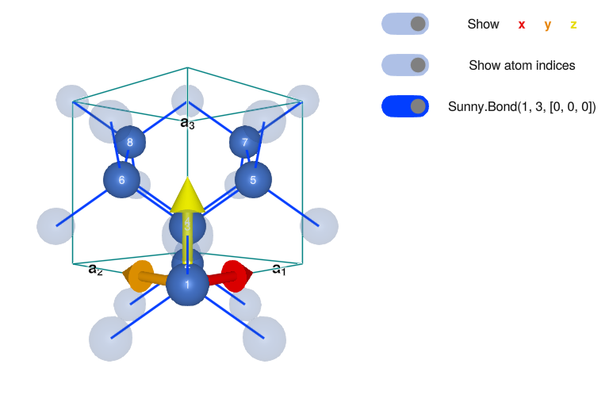
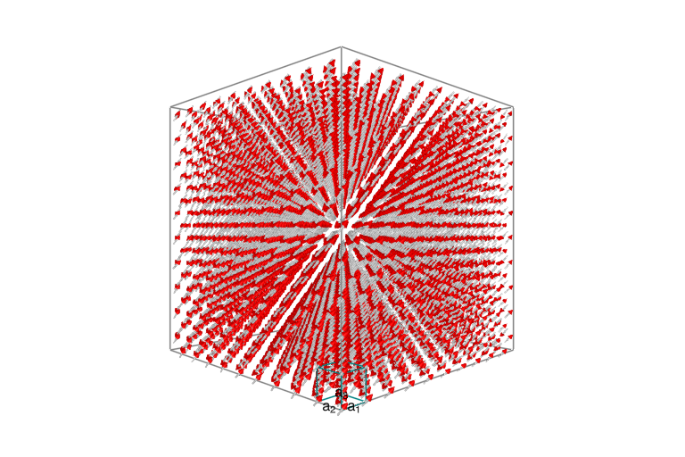
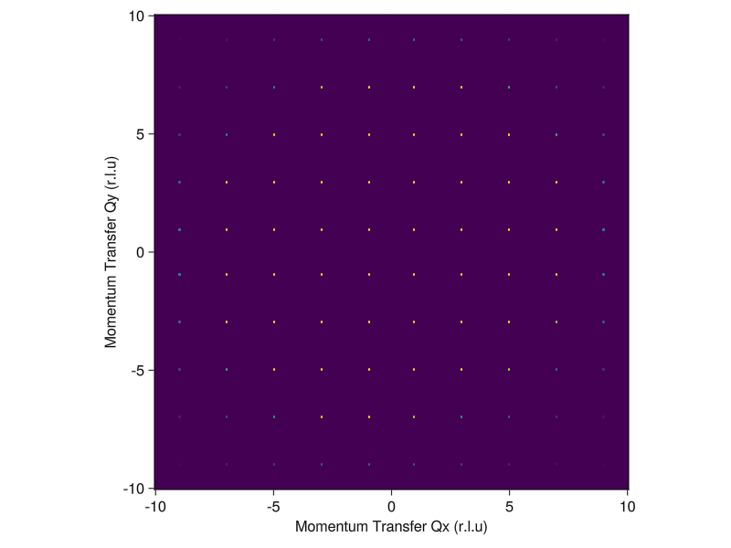
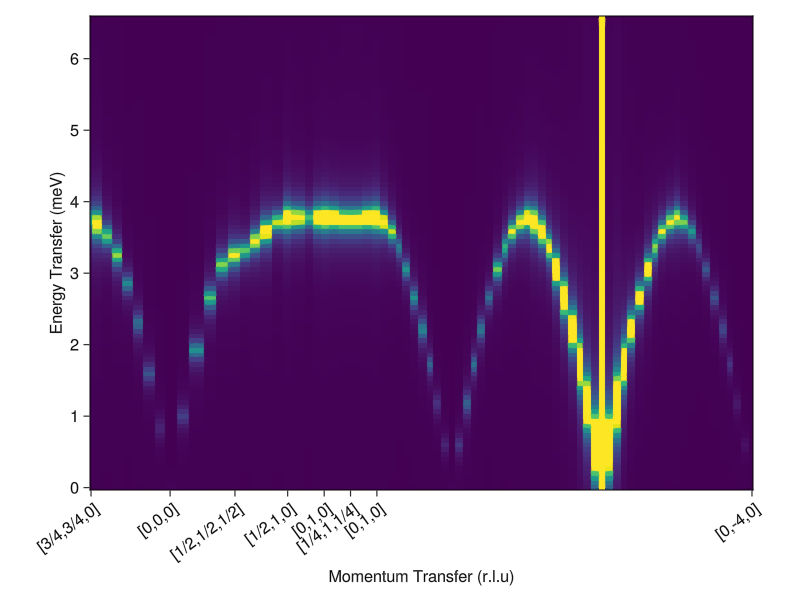

# Powder Averaged CoRh₂O₄ at Finite Temperature

**Inspired by**: [Ge et al., Phys. Rev. B 96, 064413 (2017)](https://doi.org/10.1103/PhysRevB.96.064413)

**Authors**: Martin Mourigal, David Dahlbom

**Date**: October 28, 2023  (Sunny 0.5.5)

**Goal**: This script is to calculate the temperature dependence of the magnon excitations in the
spin-3/2 Heisenberg Diamond Antiferromagnet and compare to powder-averaged results obtained for
the compound CoRh₂O₄

## Load pacakges.

````julia
using Sunny, GLMakie, ProgressMeter, Statistics, Random, Brillouin
cif_path = pkgdir(Sunny, "examples", "longer_examples", "CoRh2O4_#109301.cif");
````

## Define custom functions.

The function `quench!` randomizes the spins of a given `System`, fixes a
target temperature, and lets the system relax at this temperature for `nrelax`
integration steps.

````julia
function quench!(sys, integrator; kTtarget, nrelax)
    randomize_spins!(sys);
    integrator.kT = kTtarget;
    prog          = Progress(nrelax; dt=10.0, desc="Quenched and now relaxing: ", color=:green);
    for _ in 1:nrelax
        step!(sys, integrator)
        next!(prog)
    end
end
````

````
quench! (generic function with 1 method)
````

`dwell!` takes a `System`, sets a target temperature, and has the system
dwell at this temperature for `ndwell` integration steps.

````julia
function dwell!(sys, integrator; kTtarget, ndwell)
    integrator.kT = kTtarget;
    prog          = Progress(ndwell; dt=10.0, desc="Dwelling: ", color=:green);
    for _ in 1:ndwell
        step!(sys, integrator)
        next!(prog)
    end
end
````

````
dwell! (generic function with 1 method)
````

`anneal!` takes a temperature schedule and cools the `System` through it,
with `ndwell` steps of the integrator at each temperature in the schedule.
Returns the energy at the end of the dwell for each scheduled temperature.

````julia
function anneal!(sys,  integrator;  kTschedule, ndwell)
    nspins = prod(size(sys.dipoles));
    ensys  = zeros(length(kTschedule))
    prog   = Progress(ndwell*length(kTschedule); dt=10.0, desc="Annealing: ", color=:red);
    for (i, kT) in enumerate(kTschedule)
        integrator.kT = kT
        for _ in 1:ndwell
            step!(sys, integrator)
            next!(prog)
        end
        ensys[i] = energy(sys)
    end
    return ensys/nspins
end
````

````
anneal! (generic function with 1 method)
````

`sample_sf!` samples a structure factor, which may be either an instant or
dynamical structure factor. The integrator is run `ndecorr` times before each
one of the samples is taken.

````julia
function sample_sf!(sf, sys, integrator; nsamples, ndecorr)
    prog  = Progress(nsamples*ndecorr; dt=10.0, desc="Sampling SF: ", color=:red);
    for _ in 1:nsamples
        for _ in 1:ndecorr
            step!(sys, integrator)
            next!(prog)
        end
        add_sample!(sf, sys)    # Accumulate the newly sampled structure factor into `sf`
    end
end
````

````
sample_sf! (generic function with 1 method)
````

`powder_average` powder averages a structure factor. Works for both instant
and dynamical structure factors. To prevent smearing, removes Bragg peaks
before introducing energy broadening. Bragg peaks are added back at ω=0 after
broadening.

````julia
function powder_average(sc, rs, npts, formula; η=0.1)
    prog   = Progress(length(rs); dt=10., desc="Powder Averaging: ", color=:blue)
    ωs = available_energies(sc)
    output = zeros(Float64, length(rs), length(ωs))
    for (i, r) in enumerate(rs)
        qs = reciprocal_space_shell(sc.crystal, r, npts)
        vals = intensities_interpolated(sc, qs, formula)
        bragg_idxs = findall(x -> x > maximum(vals)*0.9, vals)
        bragg_vals = vals[bragg_idxs]
        vals[bragg_idxs] .= 0
        vals = broaden_energy(sc, vals, (ω,ω₀)->lorentzian(ω-ω₀, η))
        vals[bragg_idxs] .= bragg_vals
        output[i,:] .= mean(vals, dims=1)[1,:]
        next!(prog)
    end
    return output
end
````

````
powder_average (generic function with 1 method)
````

## System Definition for CoRh₂O₄

Define the crystal structure of CoRh₂O₄ in the conventional cell.

````julia
xtal    = Crystal(cif_path; symprec=1e-4)
magxtal = subcrystal(xtal,"Co1")
view_crystal(magxtal, 6.0)
````


Print the symmetry-allowed interactions.

````julia
print_symmetry_table(magxtal, 4.0)
````

````
Atom 1
Type 'Co1', position [0, 0, 0], multiplicity 8
Allowed g-tensor: [A 0 0
                   0 A 0
                   0 0 A]
Allowed anisotropy in Stevens operators:
    c₁*(𝒪[4,0]+5𝒪[4,4]) +
    c₂*(𝒪[6,0]-21𝒪[6,4])

Sunny.Bond(1, 3, [0, 0, 0])
Distance 3.6784429025744, coordination 4
Connects 'Co1' at [0, 0, 0] to 'Co1' at [1/4, 1/4, 1/4]
Allowed exchange matrix:[A B B
                         B A B
                         B B A]


````

Assign local Hilbert space

````julia
S = 3/2
lhs = [SpinInfo(1; S, g=2)]
formfactors = [FormFactor("Co2")];
````

Create `System` and randomize it

````julia
sunmode = :dipole
latsize = (10,10,10)
sys     = System(magxtal, latsize, lhs, sunmode; seed=1)
randomize_spins!(sys)
plot_spins(sys)
````


Define exchange interactions.

````julia
scaleJ = 0.63
valJ1  = 1.00*scaleJ
set_exchange!(sys, valJ1, Bond(1, 3, [0, 0, 0]));
````

## Thermalize system to an ordered, yet finite temperature, state

Define Langevin Integrator and Initialize it

````julia
Δt0        = 0.05/abs(scaleJ*S); ## Time steps in Langevin
λ0         = 0.1; ## Langevin damping, usually 0.05 or 0.1 is good.
kT0        = 0.01*abs(scaleJ*S); ## Initialize at some temperature
integrator = Langevin(Δt0; λ=λ0, kT=kT0);
````

Thermalization
Option 1: Quench the system from infinite temperature to a target temperature.
Note: this may lead to a poorly thermalized sample

````julia
quench!(sys, integrator; kTtarget=kT0, nrelax=10000);
````

Option 2: Anneal (according to a temperature schedule) then dwell once we've
reach base temperature.  (Uncomment to execute.)

````julia
# kTs = [abs(scaleJ)*valS*100 * 0.9^k for k in 0:100]
# anneal!(sys,integrator;kTschedule=kTs,ndwell=500)
# dwell!(sys,integrator;kTtarget=kTs[end],ndwell=2000)
````

Plot the resulting spin system to check ordering in real space

````julia
plot_spins(sys)
````


## Calculation of Neutron Scattering Responses

### Fourier transformed instantaneous two-point correlation functions

Calculate the instantaneous/equal-time structure factor.

````julia
eqsf = instant_correlations(sys)
````

````
SampledCorrelations (6.252 MiB)
[S(q) | 0 sample]
Lattice: (10, 10, 10)×8
6 correlations in Dipole mode:
╔ ⬤ ⬤ ⬤ Sx
║ ⋅ ⬤ ⬤ Sy
╚ ⋅ ⋅ ⬤ Sz

````

If desired, add additional samples by decorrelating and then re-calculating the eqsf.

````julia
nsamples   = 1
ndecorr    = 1000
@time sample_sf!(eqsf, sys, integrator; nsamples=nsamples, ndecorr=ndecorr);
````

````
  0.955808 seconds (1.89 M allocations: 118.815 MiB, 6.31% gc time, 49.74% compilation time)

````

Project onto a constant Q-Slice in momentum space.

````julia
nQpts  = 200
Qxpts  = range(-10.0, 10.0, length=nQpts)
Qypts  = range(-10.0, 10.0, length=nQpts)
qz     = 1.0
Qpts   = [[qx, qy, qz] for qx in Qxpts, qy in Qypts]
instant_formula = intensity_formula(eqsf, :perp; formfactors)
iq = instant_intensities_interpolated(eqsf, Qpts, instant_formula);
````

Plot the resulting I(Q)

````julia
heatmap(Qxpts, Qypts, iq;
    colorrange = (0, maximum(iq)/20),
    axis = (
        xlabel="Momentum Transfer Qx (r.l.u)", xlabelsize=16,
        ylabel="Momentum Transfer Qy (r.l.u)", ylabelsize=16,
        aspect=true,
    )
)
````


### Dynamical and energy-integrated two-point correlation functions

Calculate the time traces and Fourier transform: Dynamical Structure Factor (first sample).

````julia
ωmax     = 6.0  # Maximum  energy to resolve
nω       = 100  # Number of energies to resolve
sc  = dynamical_correlations(sys; Δt=Δt0, nω=nω, ωmax=ωmax, process_trajectory=:symmetrize)
@time add_sample!(sc, sys) # Add a sample trajectory
````

````
  5.568319 seconds (14.33 M allocations: 291.526 MiB, 0.76% gc time, 0.02% compilation time)

````

If desired, add additional decorrelated samples.

````julia
nsamples      = 10
ndecorr       = 1000
@time sample_sf!(sc, sys, integrator; nsamples=nsamples, ndecorr=ndecorr);
````

````

Sampling SF:  27%|██████████▎                           |  ETA: 0:00:33
Sampling SF:  49%|██████████████████▌                   |  ETA: 0:00:26
Sampling SF:  67%|█████████████████████████▌            |  ETA: 0:00:18
Sampling SF:  82%|███████████████████████████████▍      |  ETA: 0:00:10
Sampling SF: 100%|██████████████████████████████████████| Time: 0:00:54
 59.653844 seconds (143.58 M allocations: 2.866 GiB, 0.55% gc time, 0.24% compilation time)

````

Can use the Brillouin package for help on determining high symmetry points

````julia
kp        = irrfbz_path(227,[[1,0,0], [0,1,0], [0,0,1]])
kpc       = cartesianize(kp)
````

````
KPath{3} (6 points, 2 paths, 8 points in paths):
 points: :U => [1.570796, 6.283185, 1.570796]
         :W => [3.141593, 6.283185, 0.0]
         :K => [4.712389, 4.712389, 0.0]
         :Γ => [0.0, 0.0, 0.0]
         :L => [3.141593, 3.141593, 3.141593]
         :X => [0.0, 6.283185, 0.0]
  paths: [:Γ, :X, :U]
         [:K, :Γ, :L, :W, :X]
  basis: [-6.283185, 6.283185, 6.283185]
         [6.283185, -6.283185, 6.283185]
         [6.283185, 6.283185, -6.283185]
````

Project onto a constant QE-Slice in momentum-energy space.

````julia
densQpts  = 50
symQpts   = [[0.75, 0.75, 0.00],  # List of wave vectors that define a path
            [0.00, 0.00, 0.00],
            [0.50, 0.50, 0.50],
            [0.50, 1.00, 0.00],
            [0.00, 1.00, 0.00],
            [0.25, 1.00, 0.25],
            [0.00, 1.00, 0.00],
            [0.00,-4.00, 0.00]]
(Qpts, xticks) = reciprocal_space_path(magxtal, symQpts, densQpts)
formula = intensity_formula(sc, :perp; formfactors, kT=integrator.kT)
iqw = intensities_interpolated(sc, Qpts, formula);
````

If desired, broaden the sc in energy.

````julia
η     = 0.1 ## Lorentzian energy broadening parameter
iqwc  = broaden_energy(sc, iqw, (ω, ω₀) -> lorentzian(ω-ω₀, η));
````

If desired, calculated the energy-integrated structure factor

````julia
iqt = instant_intensities_interpolated(sc, Qpts, formula);
````

Plot the resulting I(Q,W).

````julia
ωs = available_energies(sc)
heatmap(1:size(iqwc, 1), ωs, iqwc;
    colorrange = (0, maximum(iqwc)/20000.0),
    axis = (;
        xlabel="Momentum Transfer (r.l.u)",
        ylabel="Energy Transfer (meV)",
        xticks,
        xticklabelrotation=π/5,
        aspect = 1.4,
    )
)
````


Projection into a powder-averaged neutron scattering intensity .

````julia
Qmax       = 3.5
nQpts      = 100
Qpow       = range(0, Qmax, nQpts)
npoints    = 100
pqw = powder_average(sc, Qpow, npoints, formula; η);
````

````

Powder Averaging:  76%|█████████████████████████▏       |  ETA: 0:00:03
Powder Averaging: 100%|█████████████████████████████████| Time: 0:00:13

````

Plot resulting Ipow(|Q|,W).

````julia
heatmap(Qpow, ωs, pqw;
    axis = (
        xlabel="|Q| (Å⁻¹)",
        ylabel="Energy Transfer (meV)",
        aspect = 1.4,
    ),
    colorrange = (0, 40.0)
)
````


### Calculation of temperature-dependent powder average spectrum

Define a temperature schedule

````julia
kTs        = [60 40 25 20 15 12 10 4] * Sunny.meV_per_K
pqw_res    = []
for kT in kTs
    dwell!(sys, integrator; kTtarget=kT, ndwell=1000);
    sc_loc = dynamical_correlations(sys; Δt=Δt0, nω, ωmax, process_trajectory=:symmetrize);
    add_sample!(sc_loc, sys)
    formula = intensity_formula(sc, :perp; formfactors, kT)
    push!(pqw_res, powder_average(sc_loc, Qpow, npoints, formula; η))
end
````

````
┌ Warning: Assignment to `formula` in soft scope is ambiguous because a global variable by the same name exists: `formula` will be treated as a new local. Disambiguate by using `local formula` to suppress this warning or `global formula` to assign to the existing global variable.
└ @ ~/Research/SunnyContributed/contributed-docs/build/CoRh2O4-tutorial.md:7

Powder Averaging:  81%|██████████████████████████▊      |  ETA: 0:00:02
Powder Averaging: 100%|█████████████████████████████████| Time: 0:00:12

Powder Averaging:  80%|██████████████████████████▍      |  ETA: 0:00:03
Powder Averaging: 100%|█████████████████████████████████| Time: 0:00:12

Powder Averaging:  83%|███████████████████████████▍     |  ETA: 0:00:02
Powder Averaging: 100%|█████████████████████████████████| Time: 0:00:12

Powder Averaging:  83%|███████████████████████████▍     |  ETA: 0:00:02
Powder Averaging: 100%|█████████████████████████████████| Time: 0:00:12

Powder Averaging:  81%|██████████████████████████▊      |  ETA: 0:00:02
Powder Averaging: 100%|█████████████████████████████████| Time: 0:00:12

Powder Averaging:  81%|██████████████████████████▊      |  ETA: 0:00:02
Powder Averaging: 100%|█████████████████████████████████| Time: 0:00:12

Powder Averaging:  81%|██████████████████████████▊      |  ETA: 0:00:02
Powder Averaging: 100%|█████████████████████████████████| Time: 0:00:12

Powder Averaging:  86%|████████████████████████████▍    |  ETA: 0:00:02
Powder Averaging: 100%|█████████████████████████████████| Time: 0:00:12

````

Plot the resulting Ipow(|Q|,W) as a function of temperature,
to compare with Fig.6 of https://arxiv.org/abs/1706.05881

````julia
fig = Figure(; resolution=(1200,600))
for i in 1:8
    r, c = fldmod1(i, 4)
    ax = Axis(fig[r, c];
        title = "kT = "*string(round(kTs[9-i], digits=3))*" (meV)",
        xlabel = r == 2 ? "|Q| (Å⁻¹)" : "",
        ylabel = c == 1 ? "Energy Transfer (meV)" : "",
        aspect = 1.4,
    )
    heatmap!(ax, Qpow, ωs, pqw_res[9-i]; colorrange = (0, 20.0))
end
fig
````


