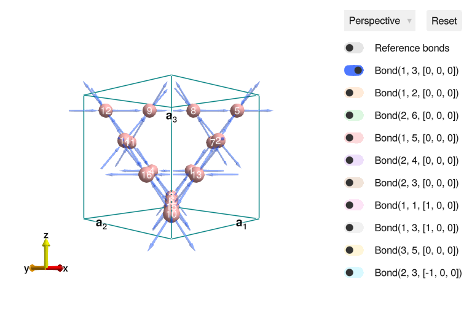
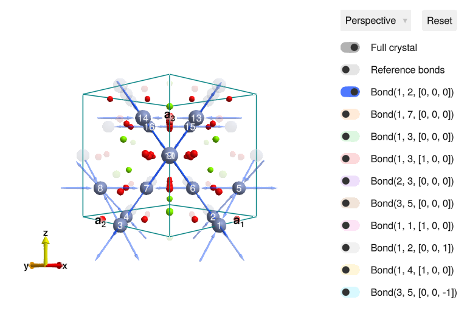
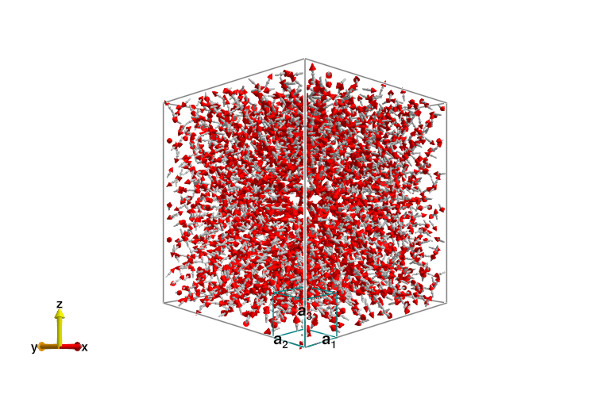
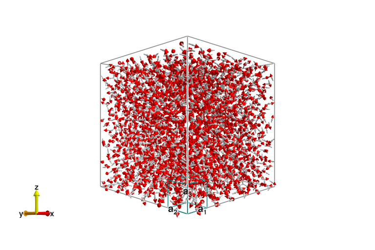
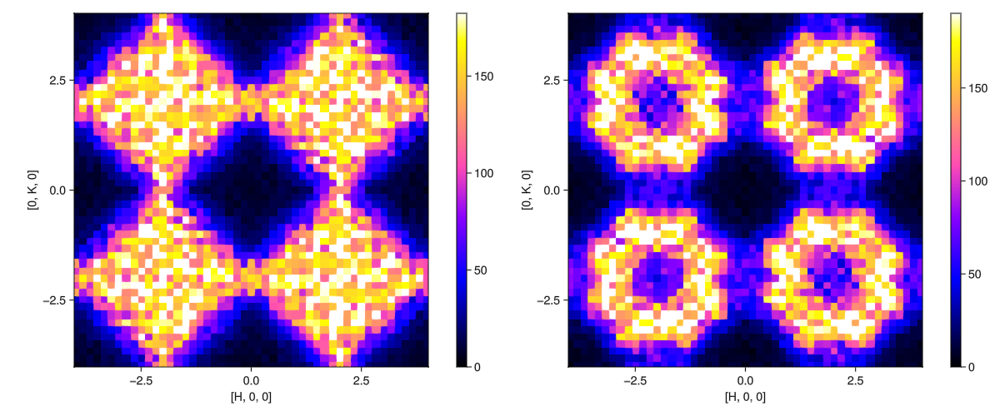
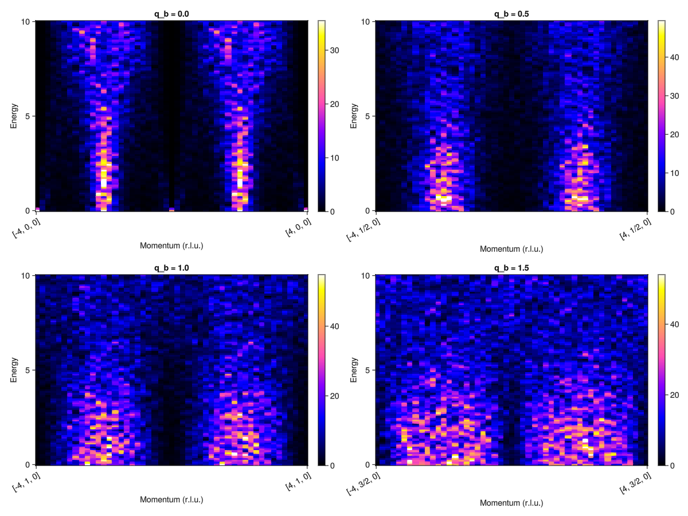
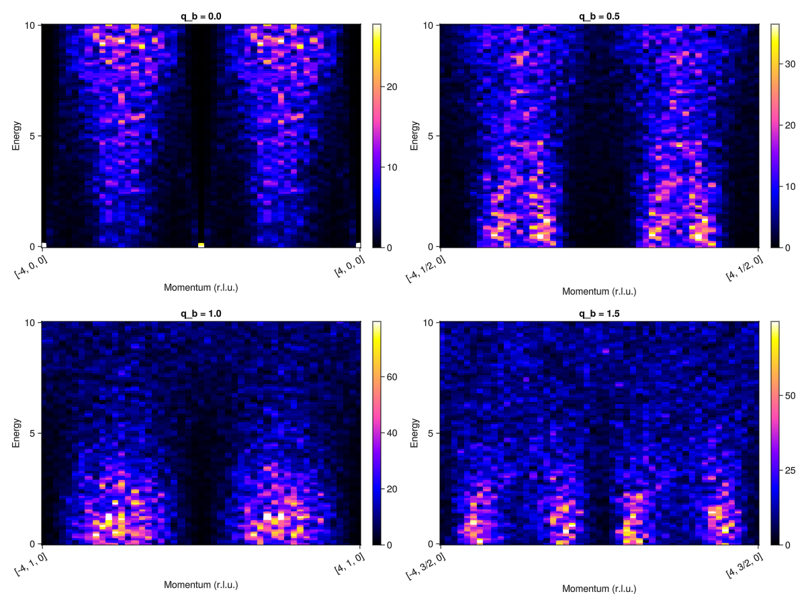
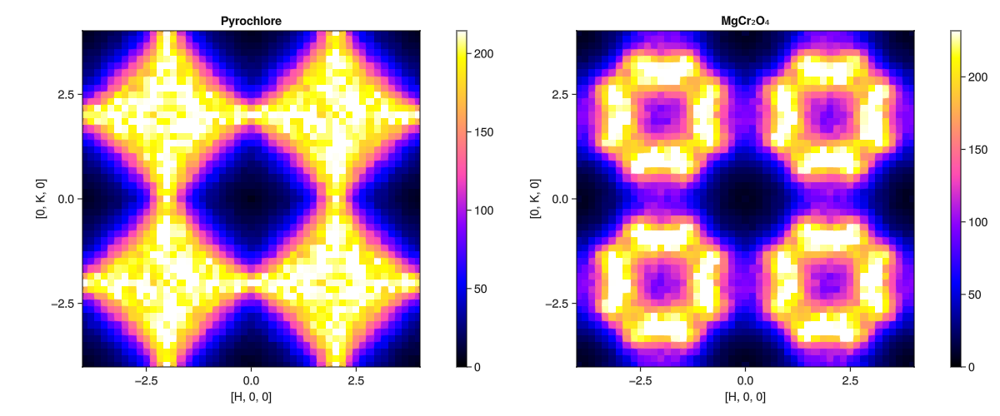

# MgCr2O4 at Finite Temperature

**Author**: Martin Mourigal

**Date**: September 9, 2022 (Updated January 21, 2025 using Sunny 0.7.5)

In this tutorial, we will walk through an example in Sunny and calculate
the spin dynamical properties of the Heisenberg pyrochlore antiferromagnet and
apply this knowledge to MgCr2O4 and ZnCr2O4, which are known to approximate
this model. Relevant publications include:

[1] [P. H. Conlon and J. T. Chalker, Phys. Rev. Lett. 102, 237206 (2009)](https://doi.org/10.1103/PhysRevLett.102.237206)

[2] [P. H. Conlon and J. T. Chalker, Phys. Rev. B 81, 224413 (2010)](https://doi.org/10.1103/PhysRevB.81.224413)

[3] [X. Bai, J. A. M. Paddison, _et al._ Phys. Rev. Lett. 122, 097201 (2019)](https://doi.org/10.1103/PhysRevLett.122.097201)

## Setting up Julia
To run the examples in the tutorial, you will need a working installation of
the Julia programming language and the Sunny package. Some useful references
for getting started are:

- [Getting started with Julia for Sunny](https://github.com/SunnySuite/Sunny.jl/wiki/Getting-started-with-Julia)
- [Sunny Docs](https://docs.juliahub.com/General/Sunny/stable/)

We will begin by loading the relevant packages.

````julia
using Sunny # The main package
using GLMakie # Plotting package
````

## Setting up the crystal structure

Before specifying the interactions of our system, we first must set up the
crystal. We will begin by specifying the pyrochlore lattice (illustrated
below) in the manner that is typical of theorists.


_Picture Credits: Theory of Quantum Matter Unit, OIST_

### "Theorist" Method

In this approach, we directly define the lattice vectors and specify the position
of each atom in fractional coordinates.

````julia
latvecs = lattice_vectors(8.3342, 8.3342, 8.3342, 90, 90, 90)
positions = [[0.875, 0.625, 0.375],
             [0.625, 0.125, 0.625],
             [0.875, 0.875, 0.125],
             [0.625, 0.875, 0.375],
             [0.875, 0.125, 0.875],
             [0.625, 0.625, 0.125],
             [0.875, 0.375, 0.625],
             [0.625, 0.375, 0.875],
             [0.375, 0.625, 0.875],
             [0.125, 0.125, 0.125],
             [0.375, 0.875, 0.625],
             [0.125, 0.875, 0.875],
             [0.375, 0.125, 0.375],
             [0.125, 0.625, 0.625],
             [0.375, 0.375, 0.125],
             [0.125, 0.375, 0.375]];
types = ["B" for _ in positions]
xtal_pyro   = Crystal(latvecs, positions; types) # We will call this crystal the Theoretical Pyrochlore
````

````
Crystal
Spacegroup 'F d -3 m' (227)
Lattice params a=8.334, b=8.334, c=8.334, α=90°, β=90°, γ=90°
Cell volume 578.9
Type 'B', Wyckoff 16c (site sym. '.-3m'):
   1. [7/8, 5/8, 3/8]
   2. [5/8, 1/8, 5/8]
   3. [7/8, 7/8, 1/8]
   4. [5/8, 7/8, 3/8]
   5. [7/8, 1/8, 7/8]
   6. [5/8, 5/8, 1/8]
   7. [7/8, 3/8, 5/8]
   8. [5/8, 3/8, 7/8]
   9. [3/8, 5/8, 7/8]
   10. [1/8, 1/8, 1/8]
   11. [3/8, 7/8, 5/8]
   12. [1/8, 7/8, 7/8]
   13. [3/8, 1/8, 3/8]
   14. [1/8, 5/8, 5/8]
   15. [3/8, 3/8, 1/8]
   16. [1/8, 3/8, 3/8]

````

To examine the result interactively, we can call `view_crystal`.

````julia
view_crystal(xtal_pyro, 3.2)
````


### "Experimentalist" Method #1 (Incorrect)
A real crystal is more complicated than this, however, and we will now
construct the system using the actual CIF file of MgCr2O4 from ICSD. This can
be done by copying over the data from a CIF file by hand, but this can be
dangerous, as shown below.

````julia
latvecs   = lattice_vectors(8.3342, 8.3342, 8.3342, 90, 90, 90)
positions = [[0.1250, 0.1250, 0.1250],
             [0.5000, 0.5000, 0.5000],
             [0.2607, 0.2607, 0.2607]]
types = ["Mg","Cr","O"]
xtal_mgcro_1 = Crystal(latvecs, positions; types)
````

````
Crystal
Spacegroup 'R 3 m' (160)
Lattice params a=8.334, b=8.334, c=8.334, α=90°, β=90°, γ=90°
Cell volume 578.9
Type 'Mg', Wyckoff 3a (site sym. '3m'):
   1. [1/8, 1/8, 1/8]
Type 'Cr', Wyckoff 3a (site sym. '3m'):
   2. [1/2, 1/2, 1/2]
Type 'O', Wyckoff 3a (site sym. '3m'):
   3. [0.2607, 0.2607, 0.2607]

````

Sunny returned a valid crystal, but it did get right space group for MgCr2O4.
This can be fixed by modifying the input to include the space group and the
setting.

### "Experimentalist" Method #2 (Correct)

As above, we will define the crystal structure of MgCr2O4 by copying the info
from a CIF file, but we will also specify the space group and setting
explicitly.

````julia
latvecs    = lattice_vectors(8.3342, 8.3342, 8.3342, 90, 90, 90)
positions  = [[0.1250, 0.1250, 0.1250],
              [0.5000, 0.5000, 0.5000],
              [0.2607, 0.2607, 0.2607]]
types      = ["Mg","Cr","O"]
spacegroup = 227 # Space Group Number
setting    = "2" # Space Group setting
xtal_mgcro_2 = Crystal(latvecs, positions, spacegroup; types, setting)
````

````
Crystal
Spacegroup 'F d -3 m' (227)
Lattice params a=8.334, b=8.334, c=8.334, α=90°, β=90°, γ=90°
Cell volume 578.9
Type 'Mg', Wyckoff 8a (site sym. '-43m'):
   1. [1/8, 1/8, 1/8]
   2. [5/8, 5/8, 1/8]
   3. [7/8, 3/8, 3/8]
   4. [3/8, 7/8, 3/8]
   5. [5/8, 1/8, 5/8]
   6. [1/8, 5/8, 5/8]
   7. [3/8, 3/8, 7/8]
   8. [7/8, 7/8, 7/8]
Type 'Cr', Wyckoff 16d (site sym. '.-3m'):
   9. [1/2, 0, 0]
   10. [3/4, 1/4, 0]
   11. [0, 1/2, 0]
   12. [1/4, 3/4, 0]
   13. [3/4, 0, 1/4]
   14. [1/2, 1/4, 1/4]
   15. [1/4, 1/2, 1/4]
   16. [0, 3/4, 1/4]
   17. [0, 0, 1/2]
   18. [1/4, 1/4, 1/2]
   19. [1/2, 1/2, 1/2]
   20. [3/4, 3/4, 1/2]
   21. [1/4, 0, 3/4]
   22. [0, 1/4, 3/4]
   23. [3/4, 1/2, 3/4]
   24. [1/2, 3/4, 3/4]
Type 'O', Wyckoff 32e (site sym. '.3m'):
   25. [0.7393, 0.0107, 0.0107]
   26. [0.5107, 0.2393, 0.0107]
   27. [0.2393, 0.5107, 0.0107]
   28. [0.0107, 0.7393, 0.0107]
   29. [0.5107, 0.0107, 0.2393]
   30. [0.7393, 0.2393, 0.2393]
   31. [0.0107, 0.5107, 0.2393]
   32. [0.2393, 0.7393, 0.2393]
   33. [0.2607, 0.2607, 0.2607]
   34. [0.4893, 0.4893, 0.2607]
   35. [0.7607, 0.7607, 0.2607]
   36. [0.9893, 0.9893, 0.2607]
   37. [0.4893, 0.2607, 0.4893]
   38. [0.2607, 0.4893, 0.4893]
   39. [0.9893, 0.7607, 0.4893]
   40. [0.7607, 0.9893, 0.4893]
   41. [0.2393, 0.0107, 0.5107]
   42. [0.0107, 0.2393, 0.5107]
   43. [0.7393, 0.5107, 0.5107]
   44. [0.5107, 0.7393, 0.5107]
   45. [0.0107, 0.0107, 0.7393]
   46. [0.2393, 0.2393, 0.7393]
   47. [0.5107, 0.5107, 0.7393]
   48. [0.7393, 0.7393, 0.7393]
   49. [0.7607, 0.2607, 0.7607]
   50. [0.9893, 0.4893, 0.7607]
   51. [0.2607, 0.7607, 0.7607]
   52. [0.4893, 0.9893, 0.7607]
   53. [0.9893, 0.2607, 0.9893]
   54. [0.7607, 0.4893, 0.9893]
   55. [0.4893, 0.7607, 0.9893]
   56. [0.2607, 0.9893, 0.9893]

````

This result is correct, but at this point we might as well import the CIF file
directly, which we now proceed to do.

### "Experimentalist" Method #3 (Correct -- if your CIF file is)

To import a CIF file, simply give the path to `Crystal`. One may optionally
specify a precision parameter to apply to the symmetry analysis.

````julia
cif = joinpath(@__DIR__, "MgCr2O4_160953_2009.cif")
xtal_mgcro_3 = Crystal(cif; symprec=0.001)
````

````
Crystal
Spacegroup 'F d -3 m' (227)
Lattice params a=8.333, b=8.333, c=8.333, α=90°, β=90°, γ=90°
Cell volume 578.6
Type 'Mg1', Wyckoff 8a (site sym. '-43m'):
   1. [1/8, 1/8, 1/8]
   2. [5/8, 5/8, 1/8]
   3. [7/8, 3/8, 3/8]
   4. [3/8, 7/8, 3/8]
   5. [5/8, 1/8, 5/8]
   6. [1/8, 5/8, 5/8]
   7. [3/8, 3/8, 7/8]
   8. [7/8, 7/8, 7/8]
Type 'Cr1', Wyckoff 16d (site sym. '.-3m'):
   9. [1/2, 0, 0]
   10. [3/4, 1/4, 0]
   11. [0, 1/2, 0]
   12. [1/4, 3/4, 0]
   13. [3/4, 0, 1/4]
   14. [1/2, 1/4, 1/4]
   15. [1/4, 1/2, 1/4]
   16. [0, 3/4, 1/4]
   17. [0, 0, 1/2]
   18. [1/4, 1/4, 1/2]
   19. [1/2, 1/2, 1/2]
   20. [3/4, 3/4, 1/2]
   21. [1/4, 0, 3/4]
   22. [0, 1/4, 3/4]
   23. [3/4, 1/2, 3/4]
   24. [1/2, 3/4, 3/4]
Type 'O1', Wyckoff 32e (site sym. '.3m'):
   25. [0.7388, 0.0112, 0.0112]
   26. [0.5112, 0.2388, 0.0112]
   27. [0.2388, 0.5112, 0.0112]
   28. [0.0112, 0.7388, 0.0112]
   29. [0.5112, 0.0112, 0.2388]
   30. [0.7388, 0.2388, 0.2388]
   31. [0.0112, 0.5112, 0.2388]
   32. [0.2388, 0.7388, 0.2388]
   33. [0.2612, 0.2612, 0.2612]
   34. [0.4888, 0.4888, 0.2612]
   35. [0.7612, 0.7612, 0.2612]
   36. [0.9888, 0.9888, 0.2612]
   37. [0.4888, 0.2612, 0.4888]
   38. [0.2612, 0.4888, 0.4888]
   39. [0.9888, 0.7612, 0.4888]
   40. [0.7612, 0.9888, 0.4888]
   41. [0.2388, 0.0112, 0.5112]
   42. [0.0112, 0.2388, 0.5112]
   43. [0.7388, 0.5112, 0.5112]
   44. [0.5112, 0.7388, 0.5112]
   45. [0.0112, 0.0112, 0.7388]
   46. [0.2388, 0.2388, 0.7388]
   47. [0.5112, 0.5112, 0.7388]
   48. [0.7388, 0.7388, 0.7388]
   49. [0.7612, 0.2612, 0.7612]
   50. [0.9888, 0.4888, 0.7612]
   51. [0.2612, 0.7612, 0.7612]
   52. [0.4888, 0.9888, 0.7612]
   53. [0.9888, 0.2612, 0.9888]
   54. [0.7612, 0.4888, 0.9888]
   55. [0.4888, 0.7612, 0.9888]
   56. [0.2612, 0.9888, 0.9888]

````

Finally, we wish to restrict attention to the magnetic atoms in the unit cell
while maintaining symmetry information for the full crystal, which is required
to determine the correct exchange and g-factor anisotropies. This can be
achieved with the `subcrystal` function.

````julia
xtal_mgcro = subcrystal(xtal_mgcro_2, "Cr")
````

````
Crystal
Spacegroup 'F d -3 m' (227)
Lattice params a=8.334, b=8.334, c=8.334, α=90°, β=90°, γ=90°
Cell volume 578.9
Type 'Cr', Wyckoff 16d (site sym. '.-3m'):
   1. [1/2, 0, 0]
   2. [3/4, 1/4, 0]
   3. [0, 1/2, 0]
   4. [1/4, 3/4, 0]
   5. [3/4, 0, 1/4]
   6. [1/2, 1/4, 1/4]
   7. [1/4, 1/2, 1/4]
   8. [0, 3/4, 1/4]
   9. [0, 0, 1/2]
   10. [1/4, 1/4, 1/2]
   11. [1/2, 1/2, 1/2]
   12. [3/4, 3/4, 1/2]
   13. [1/4, 0, 3/4]
   14. [0, 1/4, 3/4]
   15. [3/4, 1/2, 3/4]
   16. [1/2, 3/4, 3/4]

````

## Making a `System` and assigning interactions
### Making a `System`
Before assigning any interactions, we first have to set up a `System` using
our `Crystal`.

````julia
dims = (6, 6, 6)  # Supercell dimensions
momentinfo = [1 => Moment(s=3/2, g=2)]  # Specify local moment information, note that all sites are symmetry equivalent
sys_pyro = System(xtal_pyro, momentinfo, :dipole; dims)    # Make a system in dipole (Landau-Lifshitz) mode on pyrochlore lattice
sys_mgcro = System(xtal_mgcro, momentinfo, :dipole; dims); # Same on MgCr2O4 crystal
````

To understand what interactions we may assign to this system, we have to
understand the the symmetry properties of the crystal, which we turn to next.

### Symmetry analysis for exchange and single-ion anisotropies

`print_symmetry_table` reports all the exchange interactions, single-site
anisotropies, and g-factors allowed on our crystal. It takes a `Cyrstal` and a
distance. We'll look at both the "theorist's" pyrochlore lattice,

````julia
print_symmetry_table(xtal_pyro, 5.9)
````

````
Atom 1
Type 'B', position [7/8, 5/8, 3/8], Wyckoff 16c
Allowed g-tensor: [ A B -B
                    B A  B
                   -B B  A]
Allowed anisotropy in Stevens operators:
    c₁*(-𝒪[2,-2]-2𝒪[2,-1]+2𝒪[2,1]) +
    c₂*(7𝒪[4,-3]+2𝒪[4,-2]-𝒪[4,-1]+𝒪[4,1]+7𝒪[4,3]) + c₃*(𝒪[4,0]+5𝒪[4,4]) +
    c₄*(11𝒪[6,-6]+8𝒪[6,-3]-𝒪[6,-2]+8𝒪[6,-1]-8𝒪[6,1]+8𝒪[6,3]) + c₅*(-𝒪[6,0]+21𝒪[6,4]) + c₆*(-9𝒪[6,-6]-24𝒪[6,-5]-5𝒪[6,-2]-8𝒪[6,-1]+8𝒪[6,1]+24𝒪[6,5])

Bond(1, 3, [0, 0, 0])
Distance 2.946584668, coordination 6
Connects 'B' at [7/8, 5/8, 3/8] to 'B' at [7/8, 7/8, 1/8]
Allowed exchange matrix: [ A -D D
                           D  B C
                          -D  C B]
Allowed DM vector: [0 -D -D]

Bond(1, 2, [0, 0, 0])
Distance 5.103634354, coordination 12
Connects 'B' at [7/8, 5/8, 3/8] to 'B' at [5/8, 1/8, 5/8]
Allowed exchange matrix: [  A  C-E  D-F
                          C+E    B -C+E
                          D+F -C-E    A]
Allowed DM vector: [E F -E]

Bond(2, 6, [0, 0, 0])
Distance 5.893169336, coordination 6
Connects 'B' at [5/8, 1/8, 5/8] to 'B' at [5/8, 5/8, 1/8]
Allowed exchange matrix: [A D D
                          D B C
                          D C B]

Bond(1, 5, [0, 0, 0])
Distance 5.893169336, coordination 6
Connects 'B' at [7/8, 5/8, 3/8] to 'B' at [7/8, 1/8, 7/8]
Allowed exchange matrix: [ A D -D
                           D B  C
                          -D C  B]


````

and for the the MgCrO4 crystal,

````julia
print_symmetry_table(xtal_mgcro, 6.0)
````

````
Atom 1
Type 'Cr', position [1/2, 0, 0], Wyckoff 16d
Allowed g-tensor: [A B B
                   B A B
                   B B A]
Allowed anisotropy in Stevens operators:
    c₁*(𝒪[2,-2]+2𝒪[2,-1]+2𝒪[2,1]) +
    c₂*(-7𝒪[4,-3]-2𝒪[4,-2]+𝒪[4,-1]+𝒪[4,1]+7𝒪[4,3]) + c₃*(𝒪[4,0]+5𝒪[4,4]) +
    c₄*(11𝒪[6,-6]+8𝒪[6,-3]-𝒪[6,-2]+8𝒪[6,-1]+8𝒪[6,1]-8𝒪[6,3]) + c₅*(-𝒪[6,0]+21𝒪[6,4]) + c₆*(9𝒪[6,-6]+24𝒪[6,-5]+5𝒪[6,-2]+8𝒪[6,-1]+8𝒪[6,1]+24𝒪[6,5])

Bond(1, 2, [0, 0, 0])
Distance 2.946584668, coordination 6
Connects 'Cr' at [1/2, 0, 0] to 'Cr' at [3/4, 1/4, 0]
Allowed exchange matrix: [A C -D
                          C A -D
                          D D  B]
Allowed DM vector: [-D D 0]

Bond(1, 7, [0, 0, 0])
Distance 5.103634354, coordination 12
Connects 'Cr' at [1/2, 0, 0] to 'Cr' at [1/4, 1/2, 1/4]
Allowed exchange matrix: [  A  C-E  D-F
                          C+E    B -C+E
                          D+F -C-E    A]
Allowed DM vector: [E F -E]

Bond(1, 3, [0, 0, 0])
Distance 5.893169336, coordination 6
Connects 'Cr' at [1/2, 0, 0] to 'Cr' at [0, 1/2, 0]
Allowed exchange matrix: [A D C
                          D A C
                          C C B]

Bond(1, 3, [1, 0, 0])
Distance 5.893169336, coordination 6
Connects 'Cr' at [1/2, 0, 0] to 'Cr' at [1, 1/2, 0]
Allowed exchange matrix: [A D C
                          D A C
                          C C B]


````

Note that the exchange anisotropies allowed on the the pyrochlore lattice are
slightly different from those on the MgCr2O4 cyrstal due to the role of Mg
and O in the bonds. Also note that Sunny has correctly identified the two
inequivalent bonds 3a and 3b having the same length. A question may arises to
know which bond is J3a and which is J3b, let's plot the structure.

````julia
view_crystal(xtal_mgcro, 5.9)
````


The crystal viewer shows that the second interaction -- cyan color with
distance of 5.89Å -- is in fact the one hopping through a chromium site,
meaning it is J3a! We will need to be careful with that later.

### Building the exchange interactions for our system

We begin by setting the scale of our exchange interactions on each bond.

````julia
J1      = 3.27  # value of J1 in meV from Bai's PRL paper
J_pyro  = [1.00,0.000,0.000,0.000]*J1    # pure nearest neighbor pyrochlore
J_mgcro = [1.00,0.0815,0.1050,0.085]*J1; # further neighbor pyrochlore relevant for MgCr2O4
# val_J_mgcro = [1.00,0.000,0.025,0.025]*val_J1; # this is a funny setting from Conlon-Chalker
````

These values are then assigned to their corresponding bonds with `set_exchange!`.

````julia
# === Assign exchange interactions to pyrochlore system ===
set_exchange!(sys_pyro, J_pyro[1], Bond(1, 3, [0,0,0])) # J1
set_exchange!(sys_pyro, J_pyro[2], Bond(1, 2, [0,0,0])) # J2
set_exchange!(sys_pyro, J_pyro[3], Bond(2, 6, [0,0,0])) # J3a
set_exchange!(sys_pyro, J_pyro[4], Bond(1, 5, [0,0,0])) # J3b

# === Assign exchange interactions to MgCr2O4 system ===
set_exchange!(sys_mgcro, J_mgcro[1], Bond(1, 2, [0,0,0]))  # J1
set_exchange!(sys_mgcro, J_mgcro[2], Bond(1, 7, [0,0,0]))  # J2
set_exchange!(sys_mgcro, J_mgcro[3], Bond(1, 3, [0,0,0]))  # J3a -- Careful here!
set_exchange!(sys_mgcro, J_mgcro[4], Bond(1, 3, [1,0,0])); # J3b -- And here!
````

We will not be assigning any single-ion anisotropies, so we have finished
specifying our models. For good measure, we will set both systems to a random
(infinite temperature) initial condition.

````julia
randomize_spins!(sys_pyro)
randomize_spins!(sys_mgcro);
````

## Cooling our `System` amd calculating the instantaneous and dynamic structure factors at the final temperature ##

We begin by thermalizing our system at a particular temperature. We will
accomplish this by running Langevin dynamics. To do this, we must set up a
Langevin integrator.

````julia
dt = 0.01  # Integration time step in meV^-1
damping  = 0.1   # Phenomenological damping parameter
kT = 1.8   # Desired temperature in meV
langevin = Langevin(dt; damping, kT); # Construct integrator
````

We can now thermalize our systems by running the integrator.

````julia
for _ in 1:5000
    step!(sys_pyro, langevin)
    step!(sys_mgcro, langevin)
end
````

As a sanity check, we'll plot the real-space spin configurations of both
systems after themalization. First the pyrochlore,

````julia
plot_spins(sys_pyro)
````


and then the MgCr2O4,

````julia
plot_spins(sys_mgcro)
````


## Instantaneous Structure Factor
Next we can examine the instantaneous structure factor.

````julia
isf_pyro  = SampledCorrelationsStatic(sys_pyro; measure=ssf_perp(sys_pyro))
isf_mgcro = SampledCorrelationsStatic(sys_mgcro; measure=ssf_perp(sys_mgcro));
````

These are currently empty. Let's add spin-spin correlation data from 10
sampled spin configurations at kT = 1.8 meV.

````julia
for _ in 1:10
    # Run dynamics to decorrelate
    for _ in 1:500
        step!(sys_pyro, langevin)
        step!(sys_mgcro, langevin)
    end
    # Add samples
    add_sample!(isf_pyro, sys_pyro)
    add_sample!(isf_mgcro, sys_mgcro)
end
````

To retrieve the intensities, we call `intensities_static` on an array of wave
vectors, which we can generate with `q_space_grid`.

````julia
qpts_pyro = q_space_grid(xtal_pyro, [1, 0, 0], range(-4.0, 4.0, 200), [0, 1, 0], (-4, 4))
qpts_mgcro = q_space_grid(xtal_mgcro, [1, 0, 0], range(-4.0, 4.0, 200), [0, 1, 0], (-4, 4))

Sq_pyro  = intensities_static(isf_pyro, qpts_pyro)
Sq_mgcro = intensities_static(isf_mgcro, qpts_mgcro);
````

Finally, plot the results.

````julia
fig = Figure(; size=(1200,500))
plot_intensities!(fig[1,1], Sq_pyro)
plot_intensities!(fig[1,2], Sq_mgcro)
fig
````


## Dynamical Structure Factor
We can also estimate the dynamical structure factor.

````julia
energies = range(0, 10, 100)
sc_pyro  = SampledCorrelations(sys_pyro; dt, energies, measure=ssf_perp(sys_pyro))
sc_mgcro = SampledCorrelations(sys_mgcro; dt, energies, measure=ssf_perp(sys_mgcro));
````

Next we sample trajectories and calculate the spin-spin correlations of these.
Unlike `SampledCorrelationsStatic`, these samples now include time (energy)
information -- and take significantly longer to calculate.

````julia
for _ in 1:3
    # Run dynamics to decorrelate
    for _ in 1:500
        step!(sys_pyro, langevin)
        step!(sys_mgcro, langevin)
    end
    # Add samples
    add_sample!(sc_pyro, sys_pyro)
    add_sample!(sc_mgcro, sys_mgcro)
end
````

We can now examine the structure factor intensities along a path in momentum
space. First examine the pyrochlore model.

````julia
fig = Figure(; size=(1200,900))
qbs = 0.0:0.5:1.5 # Determine q_b for each slice
for (i, qb) in enumerate(qbs)
    qpts_pyro = q_space_path(xtal_pyro, [[-4, qb, 0], [4, qb, 0]], 200)
    Sqw_pyro = intensities(sc_pyro, qpts_pyro; energies=:available, kT)
    plot_intensities!(fig[fldmod1(i, 2)...], Sqw_pyro; title="q_b = $qb")
end
fig
````


Next generate the results along the same path for MgCr2O4.

````julia
fig = Figure(; size=(1200,900))
for (i, qb) in enumerate(qbs)
    qpts_mgcro = q_space_path(xtal_mgcro, [[-4, qb, 0], [4, qb, 0]], 200)
    Sqw_mgcro = intensities(sc_mgcro, qpts_mgcro; energies=:available, kT)
    plot_intensities!(fig[fldmod1(i, 2)...], Sqw_mgcro; title ="q_b = $qb")
end
fig
````


### Instantaneous structure factor from a dynamical structure factor

Finally, we note that the instant structure factor (what we generated with
`SampledCorrelationsStatic`) can be calculated from the dynamical structure
factor (generated with a `SampledCorrelations`). We simply call
`instant_static` rather than `intensities` on the `SampledCorrelations`. This
will calculate the instantaneous structure factor from from ``𝒮(𝐪,ω)`` by
integrating out ``ω`` . An advantage of doing this (as opposed to using a
`SampledCorrelationsStatic`) is that Sunny is able to apply a temperature- and
energy-dependent intensity rescaling before integrating out the dynamical
information. The results of this approach are more suitable for comparison
with experimental data.

````julia
qpts_pyro = q_space_grid(xtal_pyro, [1, 0, 0], range(-4, 4, 200), [0, 1, 0], (-4, 4))
qpts_mgcro = q_space_grid(xtal_mgcro, [1, 0, 0], range(-4, 4, 200), [0, 1, 0], (-4, 4))

Sq_pyro  = intensities_static(sc_pyro, qpts_pyro; kT)
Sq_mgcro = intensities_static(sc_mgcro, qpts_mgcro; kT);
````

We can plot the results below. It is useful to compare these to the plot above
generated with an `SampledCorrelationsStatic`.

````julia
fig = Figure(; size=(1200,500))
ax = plot_intensities!(fig[1,1], Sq_pyro; title="Pyrochlore")
ax = plot_intensities!(fig[1,2], Sq_mgcro; title="MgCr₂O₄")
fig
````


