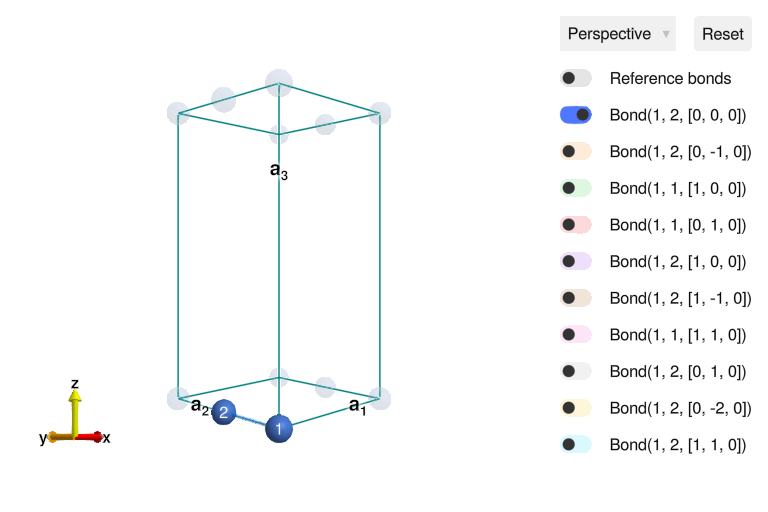
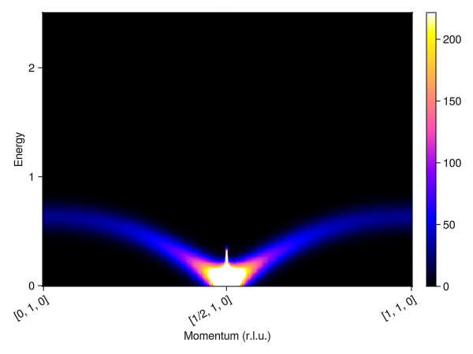
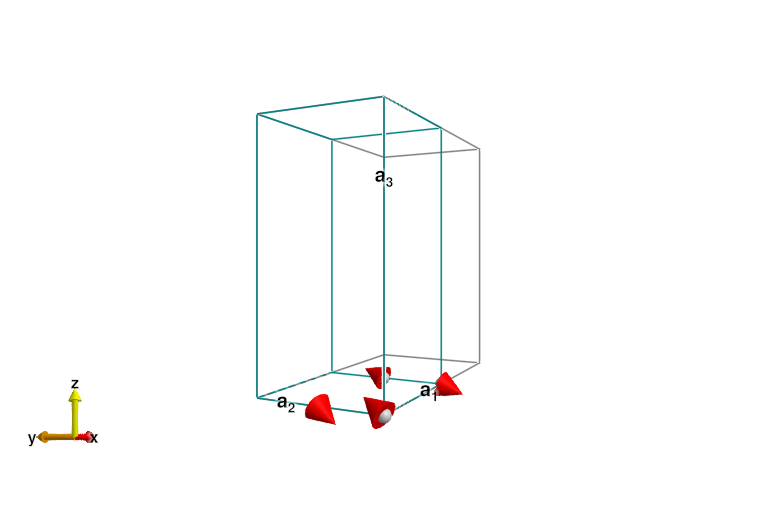
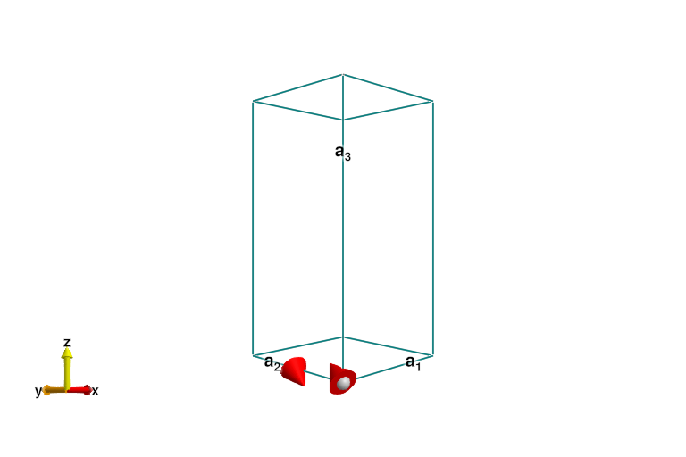
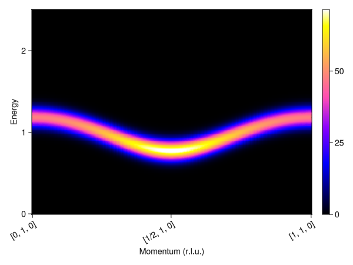
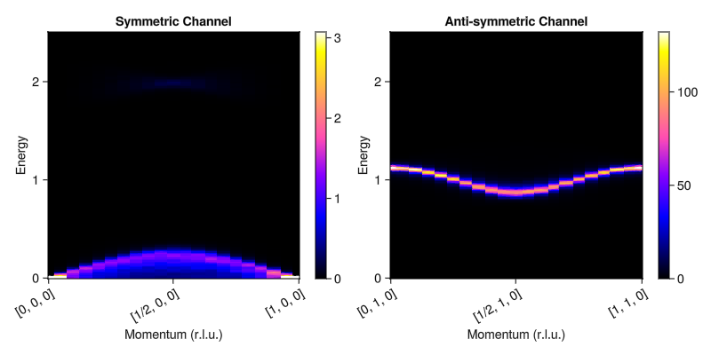
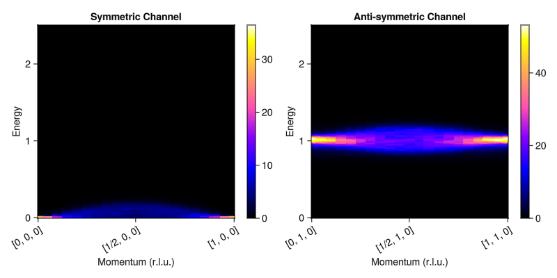
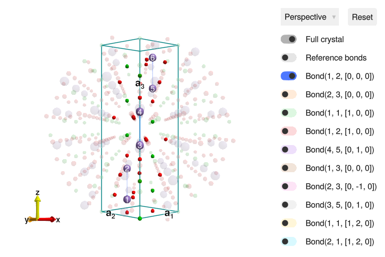
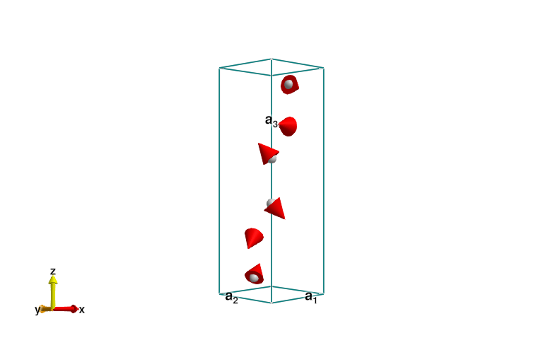

# Entangled Units Formalism
**AUTHOR** David Dahlbom (dahlbomda@ornl.gov), **DATE**: January 21, 2025

Traditional "large-_S_" classical methods start by modeling a spin system as a
set of two-level quantum systems (dipoles) on each site of a lattice. This is
the so-called product state assumption. In classical dynamics, these different
two-level systems interact with each other, but they are never entangled. The
classical dynamics evolves these product states into other product states,
meaning that one can always think about the state of a system as a set of
individual spins (dipoles or, equivalently, two-level quantum systems)
existing on each site of the lattice.

The SU(_N_) formalism extends this picture in a straightforward way. Instead
of having a two-level system on each site, one has an _N_-level system. The
product state assumption remains. This allows the local behavior to be richer
than that of a simple dipole. These local _N_-level systems interact with each
other in the classical picture, but they are never entangled. The treatment of
each individual _N_-level system is quantum mechanical, however. Thus, if one
puts two-spins inside each one of these sites, the entanglement between the
two spins will be faithfully represented and evolved.

This tutorial gives a simple illustration of this idea using Sunny's entangled
unit formalism. The first model we will consider is the the strong-rung
_S_=1/2 ladder.

## Making an `EntangledSystem` for the Heisenberg spin ladder

The approach to modeling systems with localized entangled is to first build a
`System` in the standard way, with an individual spin on each site.
Interactions are specified as usual. Note that this system must be built in
`:SUN` mode, even when _S_=1/2. Another important restriction is that any
group of spins which one wishes to entangle must lie entirely within a
crystalographic unit cell. This may require reshaping from the conventional
unit cell or displacing the atoms from their standard positions within the
unit cell. We plan to automate this step in later versions. The spin ladder
presents no difficulties in this regard.

Specify a the crystal.

````julia
using Sunny, LinearAlgebra, GLMakie

latvecs = lattice_vectors(1, 1, 2, 90, 90, 90)
positions = [[0, 0, 0], [0, 1/2 - 1e-4, 0]]
crystal = Crystal(latvecs, positions)
view_crystal(crystal)
````


To model a quasi-1D system, symmetry must be broken along the b-axis by making
bonds 1 -> 2 and 2 -> 1 inequivalent. This was achieved by offsetting the
position of the second atom slightly from `[0, 0.5, 0]`.

Specify a system and the two exchange interactions, J (rungs) and J′
(lengthwise bonds).

````julia
J = 1
J′ = 0.2J
sys = System(crystal, [1 => Moment(s=1/2, g=2)], :SUN; dims=(2, 1, 1))
set_exchange!(sys, J, Bond(1, 2, [0, 0, 0]))
set_exchange!(sys, J′, Bond(1, 1, [1, 0, 0]));
````

This completes specification of the model without consideration for
entanglement between the sites bonded by rungs. Examine a ground state of
this system.

````julia
randomize_spins!(sys)
minimize_energy!(sys)
plot_spins(sys)
````


## Spin Wave Calculations

The last result is the expected classical ordering, with full-length dipoles
arranged antiferromagnetically. This results in a `q=(π,π)` ordering. Because
this model is Heisenberg, the Hamiltonian has an SU(2) symmetry, and any such
ground state breaks this symmetry. This will lead to a Goldstone mode, as can
readily be seen when we calculate the excitations with spin wave theory.

````julia
swt = SpinWaveTheory(sys; measure=ssf_trace(sys))
qs = q_space_path(crystal, [[0, 1, 0], [1/2, 1, 0], [1, 1, 0]], 200)
energies = range(0, 2.5, 200)
res = intensities(swt, qs; energies, kernel=gaussian(; fwhm=0.2))
plot_intensities(res)
````


This result is incorrect for such a small J′. Instead, the ground state on
each bond should be a singlet, i.e. non-magnetic. Correspondingly, the
excitations should be gapped singlet-triplet excitations. This can be
reproduced using the entangled units formalism. An `EntangledSystem` is
constructed from an ordinary `System` by providing a list of sites "to
entangle" within each unit cell.

````julia
esys = Sunny.EntangledSystem(sys, [(1, 2)])
randomize_spins!(esys)
minimize_energy!(esys)
plot_spins(esys)
````


The ground state here is a pair of singlets, and the magnitude of the
dipoles on each site is zero (up to numerical precision). The ordering wave
vector is now `q=0`, so the system should be reshaped into the magnetic unit
cell (one bond) before performing spin wave calculations.

````julia
esys = reshape_supercell(esys, I(3))
plot_spins(esys)
````


Next create a `SpinWaveTheory` and calculate intensities just as would be
done for an ordinary Sunny `System`.

````julia
eswt = SpinWaveTheory(esys; measure=ssf_trace(esys))
res = intensities(eswt, qs; energies, kernel=gaussian(; fwhm=0.2))
plot_intensities(res)
````


This produces the expected gapped, triplon mode. Note that this mode is only
visible when looking at the antisymmetric channel. Since we placed our second
atom at a position of 1/2 along the b-axis, the excitations are visible along
[H, 1, 0].

## Finite-T Classical Calculations

As with ordinary `Systems`s, excitations may also be calculated at finite
temperature using classical dynamics using the SU(_N_) generalization of the
Landau-Lifshitz equations. Now we need to construct a system with enough sites
along the a-axis so that we have sufficient momentum resolution to resolve the
dispersion.

````julia
esys = repeat_periodically(esys, (20, 1, 1))

damping = 0.2
kT = 0.1J
integrator = Langevin(; damping, kT)
suggest_timestep(esys, integrator; tol=1e-2)
dt = integrator.dt = 0.13

for _ in 1:500
    step!(esys, integrator)
end;
````

````
Consider dt ≈ 0.1307 for this spin configuration at tol = 0.01.

````

Next construct an `SampledCorrelations` and collect the correlations of
sampled trajectories.

````julia
sc = SampledCorrelations(esys; energies, dt, measure=ssf_trace(esys))

for _ in 1:100
    for _ in 1:300
        step!(esys, integrator)
    end
    add_sample!(sc, esys)
end;
````

Finally we retrieve intensity information along the same path as above. For
comparison, also look along the zero-channel, where the intensities will look
much different.

````julia
qs_0 = q_space_path(crystal, [[0, 0, 0], [1/2, 0, 0], [1, 0, 0]], 200)
qs_π = q_space_path(crystal, [[0, 1, 0], [1/2, 1, 0], [1, 1, 0]], 200)

res_0 = intensities(sc, qs_0; energies=:available, kT)
res_π = intensities(sc, qs_π; energies=:available, kT)

fig = Figure(size=(800, 400))
plot_intensities!(fig[1,1], res_0; axisopts=(; title="Symmetric Channel"))
plot_intensities!(fig[1,2], res_π; axisopts=(; title="Anti-symmetric Channel"))
fig
````


Note that the classical dynamics reproduces the same dispersion as spin wave
theory. We can now easily examine the behavior of the system at much higher
temperatures where the classical theory can be expected to be even more
accurate.

````julia
sc = SampledCorrelations(esys; energies, dt, measure=ssf_trace(esys))

integrator.kT = 20.0J
for _ in 1:500
    step!(esys, integrator)
end

for _ in 1:100
    for _ in 1:300
        step!(esys, integrator)
    end
    add_sample!(sc, esys)
end

res_0 = intensities(sc, qs_0; energies=:available, kT)
res_π = intensities(sc, qs_π; energies=:available, kT)

fig = Figure(size=(800, 400))
plot_intensities!(fig[1,1], res_0; axisopts=(; title="Symmetric Channel"))
plot_intensities!(fig[1,2], res_π; axisopts=(; title="Anti-symmetric Channel"))
fig
````


A pseudogap persists even well above the ordering temperature, in agreement
with exact solutions. This is in contrast with traditional Landau-Lifshitz
dynamics, which remains gapless throughout all temperatures.

For a more complete study of this model, see [D. Dahlbom et al., PRB 110 (2024)](https://arxiv.org/abs/0804.4437).

````julia
# Material Example: Ba₃Mn₂O₈
````

As a more realistic example, this section briefly demonstrates how to reproduce
the zero-field dispersion of Ba₃Mn₂O₈. This material consists of triangular lattice
of $S=1$ bilayers in an ABC stacking.

First load the crystal and extract the magnetic subcrystal.

````julia
crystal_full = Crystal(joinpath(@__DIR__, "Ba3Mn2O8.cif"); symprec=0.01)
crystal = subcrystal(crystal_full, "Mn1")
view_crystal(crystal)
````


Each site hosts a single $S=1$ spin subject to an easy-axis anisotropy. The
spins interact with each other antiferromagnetically through a number of
Heisenberg exchange interactions.

````julia
sys = System(crystal, [1 => Moment(s=1, g=2)], :SUN)

J0 = 1.642
J1 = 0.118
J2 = 0.256
J3 = 0.142
J4 = 0.037
set_exchange!(sys, J0, Bond(1, 2, [0, 0, 0]))
set_exchange!(sys, J1, Bond(2, 3, [0, 0, 0]))
set_exchange!(sys, J2, Bond(1, 1, [1, 0, 0]))
set_exchange!(sys, J3, Bond(1, 2, [1, 0, 0]))
set_exchange!(sys, J4, Bond(4, 5, [0, 1, 0]))

D = -0.032
set_onsite_coupling!(sys, S -> D*S[3]^2, 1);
````

The strong antiferromagnetic exchange on the `1 -> 2`, `3 -> 4` and `5 -> 6`
bonds results in dimerization and a ground state that is a product of
singlets. This physics can be capture by treating each dimer as a single
entangled unit.

````julia
dimers = [(1, 2), (3, 4), (5, 6)]
esys = Sunny.EntangledSystem(sys, dimers)
````

````
EntangledSystem [SU(9)]
Supercell (1×1×1)×6
Energy per site 4431/1000

````

Examine the ground state.

````julia
randomize_spins!(esys)
minimize_energy!(esys)
plot_spins(esys)
````


Observe that there is effectively no magnetic moment, up to numerical
roundoff. This ground state can then be used to perform a spin wave
calculation.

````julia
formfactors = [1 => FormFactor("Mn5")]
measure = ssf_perp(esys; formfactors)
swt = SpinWaveTheory(esys; measure)

fwhm = 0.295
points = [
    [0.175, 0.175, 1.5],
    [0.85, 0.85, 1.5],
    [0.85, 0.85, 3],
    [0.0, 0.0, 3],
    [0.0, 0.0, 8],
]
qpts = q_space_path(crystal, points, 400)
energies = range(0.0, 4.0, 400)
res = intensities(swt, qpts; energies, kernel=gaussian(; fwhm))

plot_intensities(res)
````


Compare the resulting dispersion and intensities with the scattering data
reported in [Stone et al., PRL 100 (2008)](https://arxiv.org/abs/0804.4437).

