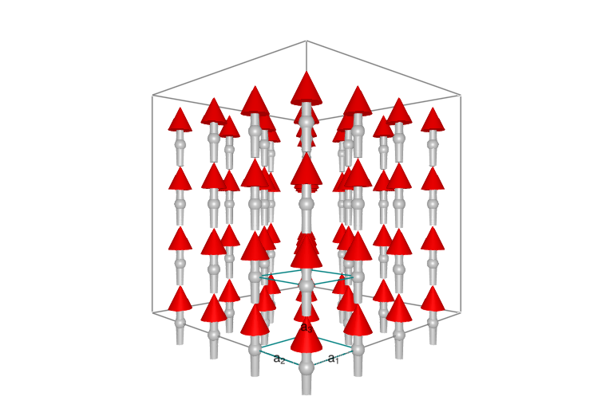

# This is a test of literate.

Here's a code block.

````julia
using Sunny, GLMakie

latvecs = lattice_vectors(1, 1, 1, 90, 90, 90)
cryst = Crystal(latvecs, [[0,0,0]])
sys = System(cryst, (4,4,4), [SpinInfo(1, S=1, g=2)], :SUN)
````

````
System [SU(3)]
Lattice: (4, 4, 4)×1

````

Hopefully you see some spins below.

````julia
plot_spins(sys)
````


The end.

