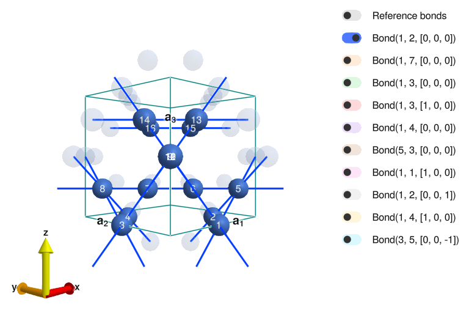
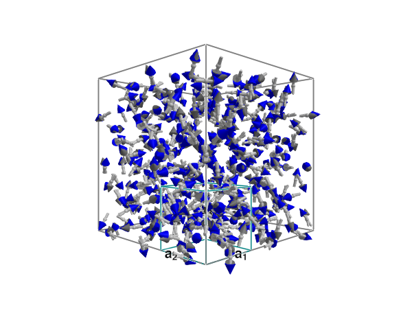
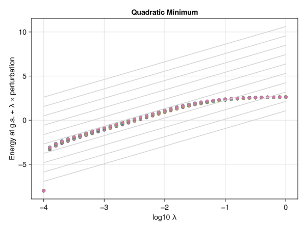

# Using Arnoldi to find Spin Glass Ground States

This script demonstrates how to use the `bogoliubov_arnoldi` function provided in `arnoldi.jl` to
analyze the low energy modes of a certain glassy/icy spin system.

````julia
using Sunny, LinearAlgebra, GLMakie, Statistics, Observables
````

A pyrochlore crystal with nearest neighbor antiferromagnetic interactions has a really big ground state degeneracy.
There are a few zero modes (directions in state space along which the energy does not change) *per tetrahedron*, so a system with a few tens of tetrahedrons has 50-150 zero modes.

We can consider a class of materials like the vanilla AFM pyrochlore, but with optional bilinear interaction and
global Ising anisotropy:

````julia
function mk_J1_sys(;bilin = 0.0,latsize = (3,3,3), ising = false)
  local pyrochlore
  pyrochlore = Crystal(I(3), [[1/2,0,0]],227,setting = "2")
  local sys
  sys = System(pyrochlore, latsize, [SpinInfo(1;S=1/2,g=2)],:SUN)
  set_pair_coupling!(sys,(Si, Sj) -> Si' * 1. * Sj - (Si' * bilin * Sj)^2,Bond(1,2,[0,0,0]))
  # Global Sz^2 anisotropy
  if ising
    se = Sunny.StevensExpansion(2,[0],[0,0,-0.1,0,0],zeros(Float64,9),zeros(Float64,13))
    for i = 1:16; sys.interactions_union[i].onsite = se;end;
  end
  randomize_spins!(sys)
  sys
end
````

````
mk_J1_sys (generic function with 1 method)
````

One unit cell has 8 tetrahedra (although it may be a bit tricky to count them due to the periodic wrapping of the unit cell; 5 are wholly contained in the unit cell, and 3 cross the border):

````julia
view_crystal(mk_J1_sys(;latsize=(1,1,1)).crystal)
````


For now, we will just consider the 3x3x3 (= 216 tetrahedra) vanilla system (no bilinear exchange and no ising anistropy):

````julia
sys = mk_J1_sys(;latsize = (3,3,3))
````

````
System [SU(2)]
Lattice (3×3×3)×16
Energy per site 0.005099

````

We can minimize the classical energy to find one ground state.

````julia
iters_to_min = minimize_energy!(sys;maxiters = 3000)
println("It took $iters_to_min iterations to minimize the energy. The energy per site is now $(energy_per_site(sys)).")
````

````
It took 216 iterations to minimize the energy. The energy per site is now -0.24999999999999928.

````

But keep in mind that this is just one of a very large dimensional manifold of degenerate ground states!
Which one? It depends on the initial spin configuration generated by `randomize_spins!`. Thus, we have
crudely imposed some particular prior distribution on what ground state we arrive at here.

Since this is a classical energy minimum, we can consider the Spin Wave Theory of fluctuations around this energy
minimum. Due to the ground state degeneracy, there will be lots of "goldstone" zero modes (= zero energy excitations
in the spin wave spectrum).

````julia
swt = SpinWaveTheory(sys)
````

````
SpinWaveTheory [Dipole correlations]
Atoms in magnetic supercell: 432

````

Observe that there are 432 atoms in the Spin Wave Theory unit cell.
Thus, the spin wave hamiltonian will have size 864x864; it has a few hundred thousand entries!

````julia
nmodes = Sunny.nbands(swt)
H = zeros(ComplexF64, 2*nmodes, 2*nmodes) # Preallocation

# Ask Sunny for the SWT Hamiltonian at q = 0
q_reshaped = Sunny.to_reshaped_rlu(swt.sys, [0,0,0])
if sys.mode == :SUN
  Sunny.swt_hamiltonian_SUN!(H, swt, q_reshaped)
else
  @assert sys.mode in (:dipole, :dipole_large_S)
  Sunny.swt_hamiltonian_dipole!(H, swt, q_reshaped)
end

println("$(length(H)) entries in SWT Hamiltonian")
````

````
746496 entries in SWT Hamiltonian

````

For this size Hamiltonian, it's better to work with a sparse representation.
It also helps (a lot) to add a small constant to the Hamiltonian.
The effect of this is to let the eigensolver know that it doesn't need to solve things up to
the full working precision, since `H` is no longer singular close to working precision; only to precision `1e-4`.

````julia
using SparseArrays
Hsp = sparse(H + 1e-4I(size(H,1)))
````

````
864×864 SparseMatrixCSC{ComplexF64, Int64} with 11232 stored entries:
⎡⣕⢝⠦⣌⠳⣷⣝⠦⠀⠀⠀⠀⠀⠀⠀⠳⢤⣠⡘⠷⣄⠑⢤⡘⠿⡳⣷⠄⠀⠀⠀⠀⠀⠀⠈⠳⢤⣄⠘⠦⎤
⎢⡈⢧⣻⢞⢦⡈⠋⢳⣔⢦⡀⠀⠀⠀⠀⡀⠻⣭⣻⠀⡈⢧⡟⠙⢦⠈⠊⡳⣴⣄⠀⠀⠀⠀⠀⡀⢧⣭⣗⠀⎥
⎢⢽⣦⡈⠳⠑⢄⢤⡈⠻⣷⣤⡀⠀⠠⣄⠻⠆⠀⠈⠳⣿⢦⡈⠲⠀⠀⢄⠙⠮⣷⢤⡀⠀⢠⡈⠳⠂⠀⠈⠳⎥
⎢⠳⡝⢯⣀⡀⠳⣕⢝⢮⡁⠉⣳⣜⢦⠈⠁⠀⠀⠀⠀⠻⡷⣅⢀⡈⠳⣄⠑⢌⠉⠁⡳⣷⣄⠉⠀⠀⠀⠀⠀⎥
⎢⠀⠀⠰⣝⢿⣦⠎⠳⣕⢝⢦⡈⠛⠳⣴⠄⠀⠀⠀⠀⠀⠀⠺⣷⣝⣴⠎⠳⣄⠱⣦⡈⠊⢳⡲⠀⠀⠀⠀⠀⎥
⎢⠀⠀⠀⠈⠀⠻⢧⣠⡈⠳⣕⢝⢦⡐⠾⣷⣝⠦⠀⠀⠀⠀⠀⠈⠘⠯⣇⢤⡘⠷⣌⠑⢄⠐⢿⡳⣷⠄⠀⠀⎥
⎢⠀⠀⠀⠀⠀⡀⠲⣝⢿⡀⢈⠳⣕⢝⢦⡈⠋⢳⣔⢦⠀⠀⠀⠀⠀⡀⠺⡷⣝⡀⣈⠳⣄⠑⢄⠙⠊⡳⣴⣄⎥
⎢⢤⡀⠀⠠⣤⡙⠆⠀⠐⠟⢾⣧⡈⠳⠑⢄⢤⡈⠻⣷⣄⠀⠀⠠⣌⠻⠂⠀⠐⠽⣟⢥⡈⠳⠀⠀⢤⡈⢪⣷⎥
⎢⠀⣳⡟⣦⠈⠁⠀⠀⠀⠀⠳⡝⢯⣀⡀⠳⣕⣽⣝⡈⠈⣣⢟⣦⠈⠀⠀⠀⠀⠈⠻⡷⣅⢀⡈⠣⣀⠳⣗⠉⎥
⎢⢶⡌⠛⠚⢦⡀⠀⠀⠀⠀⠀⠀⠰⣝⢿⣦⡓⠹⣕⢝⣦⡈⠛⠹⣄⠀⠀⠀⠀⠀⠀⠀⠺⣷⣽⣦⡋⠳⣄⠑⎥
⎢⢄⠙⠦⣌⠻⣟⢿⡦⠀⠀⠀⠀⠀⠀⠀⠙⠦⣠⡈⠻⣕⢝⠦⣌⠻⣷⣝⠆⠀⠀⠀⠀⠀⠀⠈⠳⢤⣤⡘⠷⎥
⎢⣀⠳⣟⠉⢢⡈⠁⢙⢾⣦⡀⠀⠀⠀⠀⡀⠻⣵⣟⡀⡈⢧⣛⢜⢦⠈⠉⣳⣜⢦⠀⠀⠀⠀⢀⡀⠳⣧⣛⠀⎥
⎢⢿⡣⡈⠓⠀⠀⢦⡈⢓⣽⡶⡄⠀⠠⣦⡙⠂⠀⠀⠙⢿⣦⡈⠓⠑⢄⢦⡈⢛⣷⣦⡀⠀⠰⣌⠛⠂⠀⠈⠓⎥
⎢⠙⠟⢮⡠⣄⠑⢄⠙⢮⡁⠉⣝⢾⡦⠈⠀⠀⠀⠀⠀⠳⠝⢧⣠⡈⠳⣕⢝⢮⡀⠁⣷⣝⠦⠈⠀⠀⠀⠀⠀⎥
⎢⠀⠀⠐⢿⢮⣧⡆⠑⢄⡙⢶⡌⠓⠹⣔⡄⡀⠀⠀⠀⠀⠀⠲⣝⢿⣴⠊⠳⣕⢝⢦⡈⠋⠳⣶⠀⡀⠀⠀⠀⎥
⎢⠀⠀⠀⠀⠀⠳⢥⡠⡈⠻⢆⠙⢦⡘⠟⣝⢿⡦⠀⠀⠀⠀⠀⠀⠈⠻⢥⣤⡈⠳⣕⢝⢦⡘⠯⣷⣝⠆⠀⠀⎥
⎢⠀⠀⠀⠀⠀⣀⠙⢿⢮⣀⢀⠑⢄⠙⢦⡈⠁⢙⢾⣦⠀⠀⠀⠀⢀⡀⠳⡝⢯⡀⣈⠳⣕⢝⢦⠈⠉⣳⣜⢦⎥
⎢⢦⡀⠀⠠⢦⡈⠃⠀⠘⠊⢿⡳⣄⠑⠀⠀⠦⡈⠳⣿⢦⡀⠀⠰⣦⠙⠂⠀⠘⠛⢯⣧⡈⠓⠑⢄⢦⡈⠻⣗⎥
⎢⠀⢷⡍⣷⠈⠀⠀⠀⠀⠀⠙⠟⢮⡠⡀⠳⢤⡘⢯⡈⠀⣷⠽⣦⠈⠀⠀⠀⠀⠈⠳⠝⢧⣠⡈⠳⢵⣷⢭⡈⎥
⎣⠲⡄⠙⠙⢦⡀⠀⠀⠀⠀⠀⠀⠐⢿⢮⣶⡝⠙⢄⠙⢶⡌⠛⠘⢦⠀⠀⠀⠀⠀⠀⠀⠲⣝⢿⢦⡃⠳⣕⢝⎦
````

In this case, our fill-in percentage (small percentage means large benefit from sparse representation) is:

````julia
println("$(Sunny.number_to_simple_string(100 * length(Hsp.nzval) / length(H),digits = 4))%")
````

````
1.505%

````

Now, we can use the Arnoldi algorithm (implementation provided in `arnoldi.jl`) to find a few
of the lowest energy excitations at a fraction of the cost of resolving the entire spin wave spectrum!

````julia
include("arnoldi.jl")
few = 25
energies = nothing
vectors = nothing
energies, vectors = bogoliubov_arnoldi(Hsp;nev = few,verbose = true)
````

````
Number of successfully converged eigenpairs: 25
Number of iterations required: 9
Number of matrix-vector multiplies performed: 199
Final Residual: 326018.1415485318

````

The excitation energies it found were:

````julia
energies
````

````
25-element Vector{Float64}:
 0.0002838647518230705
 0.0002879236862311863
 0.00029538955193589815
 0.00030002133910623943
 0.0003084269802081323
 0.00031519066521030326
 0.0003202769958758004
 0.00032262480817091347
 0.00033030204532653336
 0.0003370937059311029
 0.00034423624284989415
 0.0003470262183083236
 0.00035641309573384287
 0.0003629130423798987
 0.0003666965151541645
 0.00037514471593832566
 0.00037707651514383265
 0.00038380173325239735
 0.0003951296564294073
 0.00039890441872635784
 0.0004095800248038017
 0.00041118902692261405
 0.00041812340922208423
 0.0004225645774797582
 0.0004321629938804565
````

Now, we can visualize the zero modes using the spin wave viewer:

````julia
# This is the transformation matrix that maps an eigenvector for H
# into the corresponding perturbation of the coherent state.
na = Sunny.natoms(swt.sys.crystal)
bases = [swt.data.local_unitaries[:,:,i] for i = 1:na]
ix_uncondensed = 1:(sys.Ns[1]-1) # The original bosons, minus the one that got condensed away
vec_to_pert = blockdiag(map(x -> sparse(x[:,ix_uncondensed]),bases)...)
vec_to_pert = hcat(vec_to_pert, im * vec_to_pert)

zero_modes = [reshape(na * vec_to_pert * vectors[:,j],sys.Ns[1],na) for j = 1:few]

include("eigenmode_viewer.jl")
plot_eigenmode(Observable(copy(zero_modes[1]) / (5 * mean(abs.(zero_modes[1])))),swt)
````


We can verify that this is in fact a zero mode of the energy manually.
If we perturb the ground state by the perturbation, the energy landscape should be very flat:

````julia
λs = 10 .^ (-4:0.1:0)
function sys_at_lambda(λ,mode;phase = 0)
  # Do the same thing as SpinWaveTheory to put the system in a single
  # unit cell, but do not clobber interactions!!
  cellsize_mag = Sunny.cell_shape(sys) * diagm(Vec3(sys.latsize))
  new_sys = Sunny.reshape_supercell_aux(sys, (1,1,1), cellsize_mag)
  for j = 1:na
    ΔZ = λ * (cos(phase) * zero_modes[mode][1,j] .+ sin(phase) * zero_modes[mode][2,j])
    set_coherent!(new_sys,new_sys.coherents[1,1,1,j] .+ ΔZ, (1,1,1,j))
  end
  energy(new_sys)
end
f = Figure(); ax = Axis(f[1,1],xlabel = "log10 λ", ylabel = "Energy at g.s. + λ × perturbation", title = "Quadratic Minimum")
for mode = 1:few
  es = sys_at_lambda.(λs,mode)
  scatter!(ax,log10.(λs),log10.(1e-8 .+ es .- es[1]))
end
es = sys_at_lambda.(λs,1)
for j = 1:10
  lines!(ax,log10.([λs[1],λs[end]]),((log10(es[end] - es[1]) + 8) * j/10) .+ 2 * log10.([λs[1],λs[end]]),color = :lightgray)
end
f
````


---

*This page was generated using [Literate.jl](https://github.com/fredrikekre/Literate.jl).*

