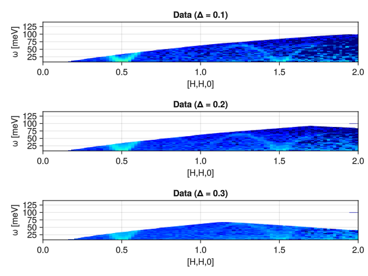
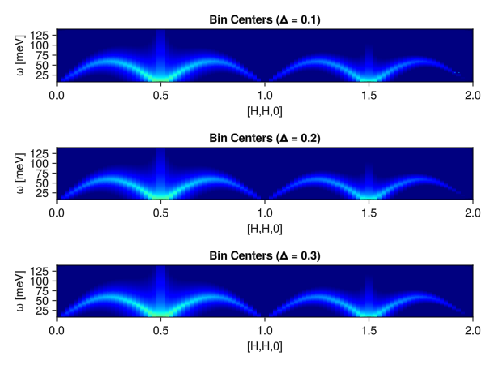
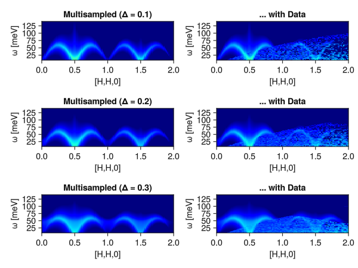

````julia
using Sunny, GLMakie, LinearAlgebra
````

# Effect of Bin Size on Neutron Spectra

In this explainer, we will demonstrate the effect of varying the (transverse) integration bin size.
This effect can be the leading source of error when quantitatively fitting model parameters,
so it is important to control and account for it.

Load the prepared data (originally named `normData_LaSrCrO4_120meV_5K_no_symmetrize_skew.nxs`):

````julia
if !(:params ∈ names(Main))
params, data = load_nxs("../inverse-toolkit/data/LaSrCrO4_prepared.nxs")
for i = 1:4
  # Adjust bin ends to lie within the last bin.
  # See documentation for BinningParameters for details
  params.binend[i] -= params.binwidth[i]/2
end
println(size(data))
end
````

````
┌ Warning: This file was not written with JLD2. Some things may not work.
└ @ JLD2 C:\Users\Sam\.julia\packages\JLD2\z3MOM\src\JLD2.jl:412
Warning: failed to load W_MATRIX from Mantid file ../inverse-toolkit/data/LaSrCrO4_prepared.nxs due to:
KeyError("experiment0")
Falling back to reading transform_from_orig
Warning: failed to read histogram axes from Mantid file ../inverse-toolkit/data/LaSrCrO4_prepared.nxs due to:
KeyError("coordinate_system")
Defaulting to low-accuracy reading of axes labels!
(100, 100, 100, 142)

````

Following the techniques described in the [Fitting Tutorial](fitting_tutorial.md), we
can use the following spin wave model to match the data:

````julia
# Set up the spin wave model
cryst0 = subcrystal(Crystal("../inverse-toolkit/example_cif.cif"; symprec=1e-4),"Cr")
J1 = 10.0
J2 = 0.16
A = 0.08
D = 0.01
K = 0.001
distance_renorm = 1.1
overall_scale = 3.0
linewidth = 5.0
cryst_renorm = Crystal(distance_renorm * cryst0.latvecs, cryst0.positions)
sys = System(cryst_renorm, (1,1,1), [SpinInfo(1,S=3/2,g=2)], :dipole)
set_exchange!(sys,J1,Bond(1,1,[1,0,0]))
set_exchange!(sys,J2,Bond(1,1,[1,1,0]))
Sz = spin_matrices(spin_label(sys,1))[3]
set_onsite_coupling!(sys,A*Sz^2,1)
nHat = normalize(cryst0.latvecs * (cryst0.positions[2] .- cryst0.positions[1]))
exchange_matrix = I(3) - 3(nHat * nHat')
set_pair_coupling!(sys,(Si,Sj) -> Si'*(D .* exchange_matrix)*Sj + (Si'*K*Sj)^2,Bond(1,2,[0,0,0]))
sys = reshape_supercell(sys, [1 1 0; 1 -1 0; 0 0 1])
sys.dipoles[1] = [0,-3/2,0]
sys.dipoles[2] = [0,3/2,0]
sys.dipoles[3] = [3/2,0,0]
sys.dipoles[4] = [-3/2,0,0]

swt = SpinWaveTheory(sys)
formula = intensity_formula(swt,:perp;
  # TODO: instrument-adapted broadening
  kernel = lorentzian(linewidth)
  ,formfactors = [FormFactor("Cr3")]
  )
````

````
Quantum Scattering Intensity Formula
At any (Q,ω), with S = S(Q,ωᵢ):

  Intensity(Q,ω) = ∑ᵢ Kernel(ω-ωᵢ) ∑_ij (I - Q⊗Q){i,j} S{i,j}
                                   
                                   (i,j = Sx,Sy,Sz)

Intensity(ω) reported

````

The original shape of the data is described by the loaded histogram parameters:

````julia
params
````

````
Binning Parameters
⊡   100 bins from +0.000 to +2.000 along [+0.50 dx +0.50 dy] (Δ = 0.028)
⊡   100 bins from -2.000 to +2.000 along [+0.50 dx -0.50 dy] (Δ = 0.057)
⊡   100 bins from -5.000 to +5.000 along [+1.00 dz] (Δ = 0.100)
⊡   142 bins from -2.000 to +140.000 along [+1.00 dE] (Δ = 1.000)

````

Now, to slice the data in various ways, we will use `bin_tools.jl`:

````julia
include("../inverse-toolkit/bin_tools.jl")

# Remove the elastic line
p, d = approximate_bintegrate(4,8.0,Inf,params,data,restrict = true)

# Integrate [0,0,L] axis over L = ±2 to get rid of it.
# There's little to no dispersion in that direction, so we don't
# need to consider the binning effect here.
p, d = approximate_bintegrate(3,-2,2,p,d)

````

````
Binning Parameters
⊡   100 bins from +0.000 to +2.000 along [+0.50 dx +0.50 dy] (Δ = 0.028)
⊡   100 bins from -2.000 to +2.000 along [+0.50 dx -0.50 dy] (Δ = 0.057)
∫ Integrated from -2.000 to +2.010 along [+1.00 dz] (Δ = 4.010)
⊡   132 bins from +8.000 to +140.000 along [+1.00 dE] (Δ = 1.000)

````

So far, we have reduced the data to two momentum directions and one energy direction.
The binning effect demonstrated here has to do with the way in which we reduce away the
remaining [K,-K,0] momentum direction to end up with an Energy vs [H,H,0] plot.

The resulting spectrum depends on the bin size in two related ways:

1. Wider bins capture more intensity, increasing the overall intensity (strictly only true when there is no dispersion in the bin direction).
2. If there is dispersion in the bin direction, then the actual shape of the spectrum changes.

Here, we want to focus on effect (2), which is more challenging to capture.
For this reason, we will plot spectra which are integrated over the bin in the [H,H,0], [0,0,L], and energy directions,
but in the [K,-K,0] direction we are focusing on, we divide by a number proportional to the bin width to compute
the spectral intensity--a quantity which is immune to effect (1).

To show the binning effect, we will integrate ranges of varying sizes along [K,-K,0], and
observe the effect on the remaining QE slice.
Notice how the `H = 0.5` feature becomes more filled in/less distinct with increased bin size:

````julia
function integrate_range(delta;kwargs...)
  # Integrate [K,-K,0] axis over an interval around K=0
  approximate_bintegrate(2,-delta/2,delta/2,p,d;kwargs...)
end

f = Figure()

for i = 1:3
  rs = [0.1,0.2,0.3]
  p0, d0 = integrate_range(rs[i])

  d0 ./= rs[i]/0.1 # Intensity along [K,-K,0]

  ax = Axis(f[i,1];title = "Data (Δ = $(rs[i]))",xlabel = "[H,H,0]",ylabel = "ω [meV]")
  bcs = axes_bincenters(p0)
  heatmap!(ax,bcs[1],bcs[4],log10.(abs.(d0[:,1,1,:])),colormap = :jet1,colorrange = (-4,2))
end
````


However, when we use `Sunny.intensities_bin_centers` to evaluate a spin wave model on those
exact same histogram parameters, there is no dependence on the bin size, except for a uniform increase in
intensity due to spreading the same intensity over a larger transverse bin:

````julia
f = Figure()
display(f)

for i = 1:3
  rs = [0.1,0.2,0.3]
  p0, _ = integrate_range(rs[i])

  d0_swt_centers = overall_scale .* Sunny.intensities_bin_centers(swt,p0,formula)

  # Sunny SWT calculates an intensity, so we need to multiply by the bin size to
  # "integrate" the intensity over the domain of the bin.
  d0_swt_centers *= prod(p0.binwidth)

  d0_swt_centers ./= rs[i]/0.1 # Intensity along [K,-K,0]

  ax = Axis(f[i,1];title = "Bin Centers (Δ = $(rs[i]))",xlabel = "[H,H,0]",ylabel = "ω [meV]")
  bcs = axes_bincenters(p0)
  heatmap!(ax,bcs[1],bcs[4],log10.(abs.(d0_swt_centers[:,1,1,:])),colormap = :jet1,colorrange = (-4,2))
end
````


If we instead use `Sunny.intensities_bin_multisample`, the correct dependence is restored:

````julia
f = Figure()

for i = 1:3
  rs = [0.1,0.2,0.3]
  p0, d0 = integrate_range(rs[i])

  # Custom MSAA strategy designed to give high-fidelity along the second axis
  msaa_strategy = [[0.5,j/20,0.5] for j = 1:20]

  # Energy axis 5x multi-sampling:
  energy_multisample = [(n + 0.5)/5 for n = 1:5]

  intensity, counts = Sunny.intensities_bin_multisample(swt, p0, msaa_strategy, energy_multisample, formula)
  d0_swt_multisample = overall_scale .* intensity ./ counts

  # Sunny SWT calculates an intensity, so we need to multiply by the bin size to
  # "integrate" the intensity over the domain of the bin.
  d0_swt_multisample *= prod(p0.binwidth)

  d0_swt_multisample ./= rs[i]/0.1 # Intensity along [K,-K,0]

  ax = Axis(f[i,1];title = "Multisampled (Δ = $(rs[i]))",xlabel = "[H,H,0]",ylabel = "ω [meV]")
  bcs = axes_bincenters(p0)
  heatmap!(ax,bcs[1],bcs[4],log10.(abs.(d0_swt_multisample[:,1,1,:])),colormap = :jet1,colorrange = (-4,2))

  ax = Axis(f[i,2];title = "... with Data",xlabel = "[H,H,0]",ylabel = "ω [meV]")
  bcs = axes_bincenters(p0)
  heatmap!(ax,bcs[1],bcs[4],log10.(abs.(d0_swt_multisample[:,1,1,:])),colormap = :jet1,colorrange = (-4,2))
  heatmap!(ax,bcs[1],bcs[4],log10.(abs.(d0[:,1,1,:] ./ (rs[i]/0.1))),colormap = :jet1,colorrange = (-4,2))
end
````


Multisampling simply means that several samples are taken inside of each bin, at relative positions determined
by the momentum and energy multisampling strategies specified above.
Here, we have chosen to take 20 samples along the dispersing direction ([K,-K,0] = second axis), which are at the
bin center (0.5) in the other directions.
For good measure, we have also 5x resolved in energy.
The resulting computation is 100x more expensive than the original, since we are using 100x more samples, but it is also
much more accurate.

In this case, 20 samples was likely overkill, and the number of samples can be adapted to the actual dispersion of the system
if it is known.
The important thing is that the qualitative feature of the filling-in of the dispersion curve is accounted for.
Even when the transverse integration is "only a single bin," it can still be very important to multisample in that direction,
e.g. if there is a nearby gap or kink in the dispersion relation.

---

*This page was generated using [Literate.jl](https://github.com/fredrikekre/Literate.jl).*

