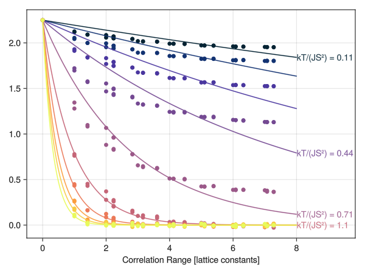
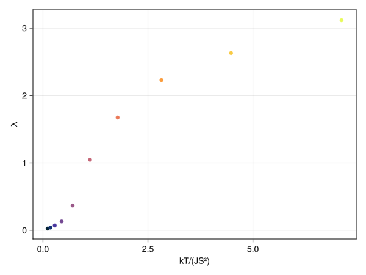
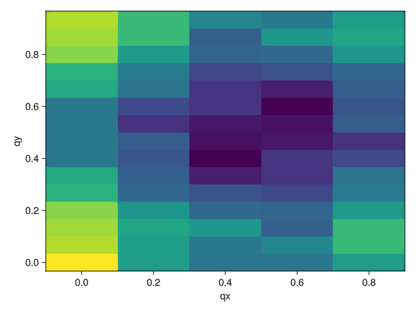
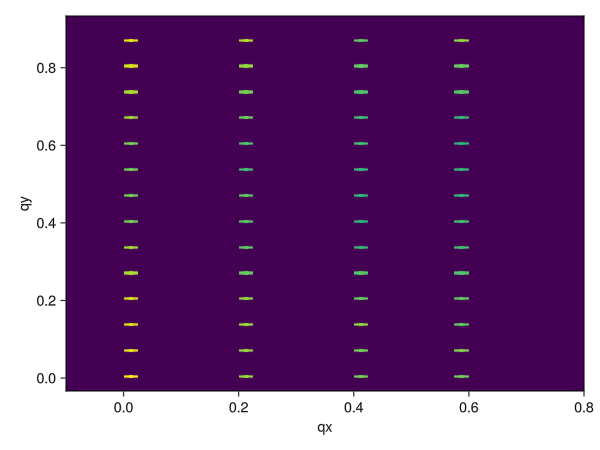
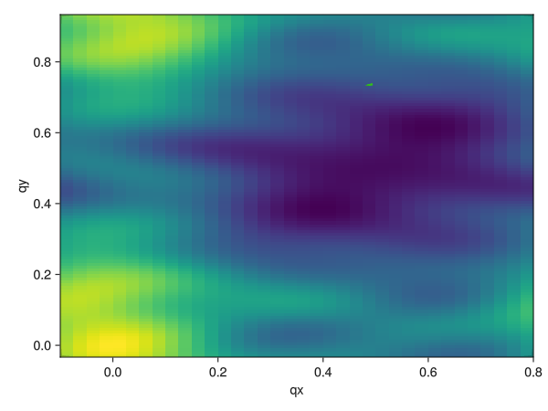
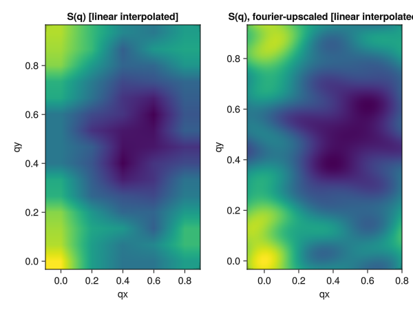
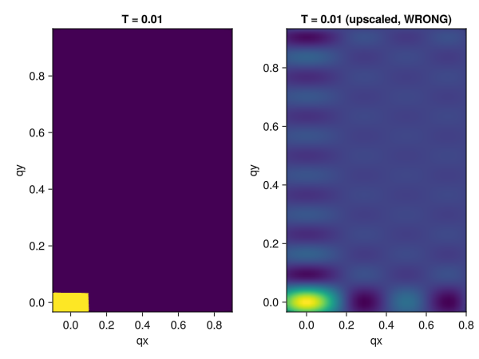

# Fourier-upscaling of Structure Factor $S(Q)$

This script demonstrates how to use the `intensity_formula_periodic_extension` function provided in `classical.jl` to
increase the momentum-space resolution of spatial correlations when certain conditions are met.

````julia
using Sunny, LinearAlgebra, GLMakie, ProgressMeter, FFTW, LsqFit
````

If a system only has correlations at distances shorter than some maximum distance, then
it is possible to "upscale" the fourier-space $S(q)$ by fourier interpolation.
For example, consider the ferromagnetic square lattice:

````julia
cryst = Crystal(I(3), [[0.,0,0]],1)
Nx = 5
Ny = 15
spin_S = 3/2
sys = System(cryst, (Nx,Ny,1), [SpinInfo(1,S=spin_S,g=2)], :dipole)
````

We will use a unit-strength $J=-1$ ferromagnetic exchange interaction:

````julia
# Ferromagnetic exchange
set_exchange!(sys,-1,Bond(1,1,[1,0,0]))
set_exchange!(sys,-1,Bond(1,1,[0,1,0]))
````

````
System [Dipole mode]
Lattice (5×15×1)×1
Energy per site -9/2

````

As we sweep the temperature from cold to hot, there will be a phase transition from the
ferromagnetic ordered state (with small thermal fluctuations) to a paramagnetic
state (with small amounts of "cooperation" between neighboring sites due to the exchange).

````julia
kTs = 2 .^ range(-2,4,length = 10)
````

We can quantify this by measuring the correlation as a function of distance
at each temperature:

````julia
correlations = zeros(Float64,Nx,Ny,length(kTs))
correlation_distance = ifftshift(sqrt.((-(Ny÷2):(Ny÷2))' .^ 2 .+ (-(Nx÷2):(Nx÷2)) .^2))
````

At each temperature, we will attempt to fit an exponential decay curve $C = S^2 e^{-\lambda R}$
with $R$ the distance between spins and $S^2$ being the known $R=0$ value of the correlation.
This fit may or may not succeed (depending if there is actually an exponential decay of correlations)
so we will also keep track of the fit residual.

````julia
lambdas = zeros(Float64,length(kTs))
fit_residuals = zeros(Float64,length(kTs))
````

Now we are ready to sweep!

````julia
f = Figure()
ax = Axis(f[1,1],xlabel = "Correlation Range [lattice constants]",ylabel = "")

for (i,kT) in enumerate(kTs)

  # Thermalize at this temperature
  langevin = Langevin(0.05;λ = 0.1, kT)
  for j = 1:10000
    step!(sys,langevin)
  end

  # Sample the spatial correlations
  isc = instant_correlations(sys,apply_g=false)
  n_sample = 200
  prog = Progress(n_sample,"Sampling")
  for n = 1:n_sample
    for j = 1:1000
      step!(sys,langevin)
    end
    add_sample!(isc,sys)
    next!(prog)
  end
  finish!(prog)

  # Inverse fourier transform S(q) to get real space correlations
  Sq = intensities_binned(isc,unit_resolution_binning_parameters(isc),intensity_formula(isc,:trace))[1][:,:,1,1]
  Sr = real(ifft(Sq) * prod(sys.latsize))
  correlations[:,:,i] .= Sr

  # Fit an exponential decay
  Ix = sortperm(correlation_distance[:])
  xdat = correlation_distance[Ix]
  xdat_fine = range(0,maximum(xdat)*1.1,length = 1000)
  ydat = Sr[Ix]
  zero_range_correlation_value = spin_S^2
  @. model(x, p) = spin_S^2 * exp(-p[1] * x)
  f = curve_fit(model,xdat,ydat,[1.0])
  lambdas[i] = f.param[1]
  fit_residuals[i] = norm(f.resid)

  # Plot results
  scatter!(ax,correlation_distance[:],Sr[:],color = log(kT),colorrange = extrema(log.(kTs)),colormap = :thermal)
  lines!(ax,xdat_fine,model.(xdat_fine,f.param[1]),color = log(kT),colorrange = extrema(log.(kTs)),colormap = :thermal)
  if i == 1 || i == 4 || i == 5 || i == 6
    x_txt = maximum(xdat) * 1.1
    y_txt = model(x_txt,f.param[1])
    text!(ax,x_txt,y_txt;text = "kT/(JS²) = $(Sunny.number_to_simple_string(kTs[i] / (1 * spin_S^2),digits = 2))",color = log(kT),colorrange = extrema(log.(kTs)),colormap = :thermal,align = (:left,:center))
  end
  xlims!(ax,-0.5,9.85)
end

````


The above plot shows that, for $kT \gg JS^2$, the spatial correlations fall off quickly to zero.
For $kT < JS^2$, the correlations don't fall off exponentially (the fit failed).
In the regime when the fall off *is* exponential, the rate of decay $\lambda$ increases with increasing temperature.

````julia
scatter(kTs ./ (1 * spin_S^2),lambdas,axis = (;xlabel = "kT/(JS²)",ylabel = "λ"),color = log.(kTs),colorrange = extrema(log.(kTs)),colormap = :thermal)
````


Since the correlations fall off quickly at high temperature, we can "upscale" the
$S(q)$ with fourier-interpolation. First, sample the correlations as usual:

````julia
high_temperature = 16.0
langevin = Langevin(0.05;λ = 0.1, kT = high_temperature)
for j = 1:10000
  step!(sys,langevin)
end

isc = instant_correlations(sys,apply_g=false)
n_sample = 400
prog = Progress(n_sample,"Sampling at high temperature")
for n = 1:n_sample
  for j = 1:1000
    step!(sys,langevin)
  end
  add_sample!(isc,sys)
  next!(prog)
end
finish!(prog)
````

````
SampledCorrelations (13.605 KiB)
[S(q) | 400 samples]
Lattice: (5, 15, 1)×1
6 correlations in Dipole mode:
╔ ⬤ ⬤ ⬤ Sx
║ ⋅ ⬤ ⬤ Sy
╚ ⋅ ⋅ ⬤ Sz

````

For reference, the non-upscaled $S(q)$ uses this set of `BinningParameters`:

````julia
params_lowres = unit_resolution_binning_parameters(isc)
````

````
Binning Parameters
⊡     5 bins from -0.100 to +0.900 along [+1.00 dx] (Δ = 0.200)
⊡    15 bins from -0.033 to +0.967 along [+1.00 dy] (Δ = 0.067)
∫ Integrated from -0.500 to +0.500 along [+1.00 dz] (Δ = 1.000)
∫ Integrated from -0.500 to +0.500 along [+1.00 dE] (Δ = 1.000)

````

and looks like this:

````julia
formula_no_upscale = intensity_formula(isc,:trace)
Sq_lowres = intensities_binned(isc,params_lowres,formula_no_upscale)[1][:,:,1,1]

bcs_lowres = axes_bincenters(params_lowres)
heatmap(bcs_lowres[1],bcs_lowres[2],Sq_lowres,axis = (;xlabel = "qx",ylabel = "qy"))
````


This is the maximum resolution achievable without upscaling; if we try to go
to higher resolution,

````julia
params_hires = copy(params_lowres)
params_hires.binwidth[1:2] ./= 8
params_hires
````

````
Binning Parameters
⊡    36 bins from -0.100 to +0.800 along [+1.00 dx] (Δ = 0.025)
⊡   116 bins from -0.033 to +0.933 along [+1.00 dy] (Δ = 0.008)
∫ Integrated from -0.500 to +0.500 along [+1.00 dz] (Δ = 1.000)
∫ Integrated from -0.500 to +0.500 along [+1.00 dE] (Δ = 1.000)

````

we get artifacts:

````julia
Sq_artifacts = intensities_binned(isc,params_hires,formula_no_upscale)[1][:,:,1,1]
bcs_hires = axes_bincenters(params_hires)
heatmap(bcs_hires[1],bcs_hires[2],Sq_artifacts,axis = (;xlabel = "qx",ylabel = "qy"))
````


To upscale properly, use the `_periodic_extension` formula with the higher-resolution
`BinningParameters`:

````julia
include("../realspace/classical.jl")

formula_upscale = intensity_formula_periodic_extension(isc,:trace)
Sq_upscale = intensities_binned(isc,params_hires,formula_upscale)[:,:,1,1]
heatmap(bcs_hires[1],bcs_hires[2],Sq_upscale,axis = (;xlabel = "qx",ylabel = "qy"))
````


To see that the fancy fourier-upscaling is really required, we can compare to
the built-in linear interpolation of `GLMakie`:

````julia
f = Figure()
ax1 = Axis(f[1,1],title = "S(q) [linear interpolated]",xlabel = "qx",ylabel = "qy")
ax2 = Axis(f[1,2],title = "S(q), fourier-upscaled [linear interpolated]",xlabel = "qx",ylabel = "qy")
heatmap!(ax1,bcs_lowres[1],bcs_lowres[2],Sq_lowres,interpolate = true)
heatmap!(ax2,bcs_hires[1],bcs_hires[2],Sq_upscale,interpolate = true)
````


Lastly, see what happens if we make the physically unmotivated choice to upscale
at the lower temperatures, where the real-space correlations didn't fall off to zero:

````julia
# Sample correlations
low_temperature = 1e-2
langevin = Langevin(0.05;λ = 0.1, kT = low_temperature)
for j = 1:10000
  step!(sys,langevin)
end

isc = instant_correlations(sys,apply_g=false)
n_sample = 400
for n = 1:n_sample
  for j = 1:1000
    step!(sys,langevin)
  end
  add_sample!(isc,sys)
end

# Upscale
formula_no_upscale = intensity_formula(isc,:trace)
Sq_low_temp = intensities_binned(isc,params_lowres,formula_no_upscale)[1][:,:,1,1]

formula_upscale = intensity_formula_periodic_extension(isc,:trace)
Sq_low_temp_upscale = intensities_binned(isc,params_hires,formula_upscale)[:,:,1,1]

f = Figure()
ax1 = Axis(f[1,1],title = "T = 0.01",xlabel = "qx",ylabel = "qy")
ax2 = Axis(f[1,2],title = "T = 0.01 (upscaled, WRONG)",xlabel = "qx",ylabel = "qy")
heatmap!(ax1,bcs_lowres[1],bcs_lowres[2],Sq_low_temp)
heatmap!(ax2,bcs_hires[1],bcs_hires[2],Sq_low_temp_upscale,interpolate = true)
````


The unjustified upscaling has turned our very nice one-pixel Bragg peak into a perfectly ellipsoidal grid-resolution-dependent abomination (plus apparently some ringing artifacts).
Let this be a cautionary tale to ensure that your real space correlations actually fall off quickly before using the upscaling!

---

*This page was generated using [Literate.jl](https://github.com/fredrikekre/Literate.jl).*

