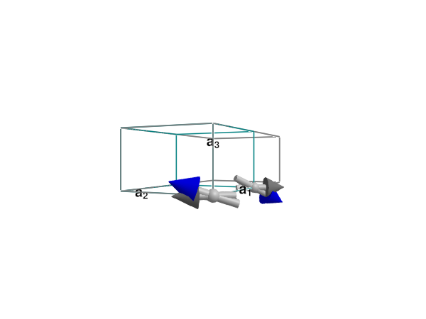
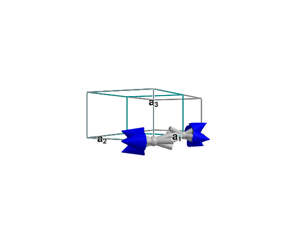

# Eigenmode Viewer

This script demonstrates how to use the eigenmode viewer:

````julia
include("eigenmode_viewer.jl")
````

To launch the interactive eigenmode viewer, use this command: `interact_eigenmodes(swt, qs, formula)`
(same arguments as `intensities_interpolated(::SpinWaveTheory, ...)`).

The same script also provides a function `get_eigenmodes`, which gives programmatic access to the
LSWT eigenmodes.
We will demonstrate how to use this with the basic example of a spin-1 antiferromagnet with easy-xy-plane anisotropy:

````julia
function example_afm()
  a = b = 8.539
  c = 5.2414
  latvecs = lattice_vectors(a, b, c, 90, 90, 90)
  crystal = Crystal(latvecs,[[0.,0,0]],1)
  latsize = (2,1,1)
  sys = System(crystal, latsize, [SpinInfo(1; S=1, g=2)], :SUN; seed=5)
  set_exchange!(sys, 0.85,  Bond(1, 1, [1,0,0]))   # J1
  set_onsite_coupling!(sys, S -> 0.3 * S[3]^2,1)

  #sys.dipoles[1] = SVector{3}([0,0,1])
  #sys.dipoles[2] = SVector{3}([0,0,-1])
  randomize_spins!(sys)
  minimize_energy!(sys)

  swt = SpinWaveTheory(sys)
  qs = [[k,k,0] for k = range(0,1,length=2000)]
  formula = intensity_formula(swt,:perp, kernel = Sunny.delta_function_kernel)
  swt, qs, formula
end

example_afm_swt, qs, formula = example_afm()

display(example_afm_swt.sys)
````

Now, we can run the LSWT eigenanalysis at a particular wavevector, which gives us
several pieces of data:

````julia
particular_wavevector = qs[35]
result = get_eigenmodes(example_afm_swt, particular_wavevector, verbose = true)
H, V, bases, eigenmode_displacements, energies = result
````

````
V matrix:
Diagonalized V'HV:
Bases
Eigenmodes (columns are atoms)

Mode #1 with energy 3.4131344384359776

Mode #2 with energy 3.3868146653340614

Mode #3 with energy 1.067454062634183

Mode #4 with energy 0.18918406881074443
Eigenenergies
Nm = 2, N = 3, Nf = 2, nmodes = 4

````

The LSWT Hamiltonian at $q$:

````julia
@show size(H);
````

````
size(H) = (8, 8)

````

The bogoliubov matrix diagonalizing $H$:

````julia
@show size(V);
````

````
size(V) = (8, 8)

````

The local quantization basis at each site:

````julia
@show size(bases);
````

````
size(bases) = (3, 3, 2)

````

The eignmodes themselves:

````julia
@show size(eigenmode_displacements);
````

````
size(eigenmode_displacements) = (3, 2, 8)

````

The array of `eigenmode_displacements` has size N × [number of atoms] × [number of bands] and
contains the perturbation of the SU(N) coherent state of the ground state associated with
each band in the band structure, for each atom in the unit cell.
We can plot the ground state together with the displacement for a particular band as follows:

````julia
band = 3
plot_eigenmode(Observable(eigenmode_displacements[:,:,band]),example_afm_swt)
````


However, since the eignmodes are generally circular precessions of the spins,
it's generally a good idea to look at a few different times:

````julia
f = Figure(); ax = LScene(f[1,1],show_axis = false);
for t = [0,π/2,π,3π/2]
  plot_eigenmode!(ax,Observable(eigenmode_displacements[:,:,band]),example_afm_swt; t = Observable(t))
end
f
````


Better yet, **the full eigenmode viewer can be started with this command**: `interact_eigenmodes(swt, qs, formula)`.
Below are two more example systems that can be used to try out `interact_eigenmodes`:

````julia
function example_eigenmodes()
  sys = System(Sunny.cubic_crystal(), (1,2,1), [SpinInfo(1;S=1/2,g=1)], :SUN, units = Units.theory)
  set_external_field!(sys,[0,0,0.5]) # Field along Z
  set_exchange!(sys,-1.,Bond(1,1,[0,1,0])) # Strong Ferromagnetic J
  randomize_spins!(sys)
  minimize_energy!(sys)
  minimize_energy!(sys)
  minimize_energy!(sys)

  swt = SpinWaveTheory(sys)
  qs = [[0,k,0] for k = range(0,1,length=20)]
  get_eigenmodes(swt,qs[3]; verbose = true)
  formula = intensity_formula(swt,:perp, kernel = delta_function_kernel)
  interact_eigenmodes(swt, qs, formula)
end


function example_fei2()
  a = b = 4.05012
  c = 6.75214
  latvecs = lattice_vectors(a, b, c, 90, 90, 120)

  positions = [[0, 0, 0], [1/3, 2/3, 1/4], [2/3, 1/3, 3/4]]

  types = ["Fe", "I", "I"]
  FeI2 = Crystal(latvecs, positions; types)
  cryst = subcrystal(FeI2, "Fe")
  sys = System(cryst, (4,4,4), [SpinInfo(1, S=1, g=2)], :SUN, seed=2)
  J1pm   = -0.236
  J1pmpm = -0.161
  J1zpm  = -0.261
  J2pm   = 0.026
  J3pm   = 0.166
  J′0pm  = 0.037
  J′1pm  = 0.013
  J′2apm = 0.068

  J1zz   = -0.236
  J2zz   = 0.113
  J3zz   = 0.211
  J′0zz  = -0.036
  J′1zz  = 0.051
  J′2azz = 0.073

  J1xx = J1pm + J1pmpm
  J1yy = J1pm - J1pmpm
  J1yz = J1zpm

  set_exchange!(sys, [J1xx   0.0    0.0;
                      0.0    J1yy   J1yz;
                      0.0    J1yz   J1zz], Bond(1,1,[1,0,0]))
  set_exchange!(sys, [J2pm   0.0    0.0;
                      0.0    J2pm   0.0;
                      0.0    0.0    J2zz], Bond(1,1,[1,2,0]))
  set_exchange!(sys, [J3pm   0.0    0.0;
                      0.0    J3pm   0.0;
                      0.0    0.0    J3zz], Bond(1,1,[2,0,0]))
  set_exchange!(sys, [J′0pm  0.0    0.0;
                      0.0    J′0pm  0.0;
                      0.0    0.0    J′0zz], Bond(1,1,[0,0,1]))
  set_exchange!(sys, [J′1pm  0.0    0.0;
                      0.0    J′1pm  0.0;
                      0.0    0.0    J′1zz], Bond(1,1,[1,0,1]))
  set_exchange!(sys, [J′2apm 0.0    0.0;
                      0.0    J′2apm 0.0;
                      0.0    0.0    J′2azz], Bond(1,1,[1,2,1]))

  D = 2.165
  S = spin_operators(sys, 1)
  set_onsite_coupling!(sys, -D*S[3]^2, 1)

  randomize_spins!(sys)
  minimize_energy!(sys);

  sys_min = reshape_supercell(sys, [1 0 0; 0 1 -2; 0 1 2])
  randomize_spins!(sys_min)
  minimize_energy!(sys_min)

  swt = SpinWaveTheory(sys_min)

  q_points = [[0,0,0], [1,0,0], [0,1,0], [1/2,0,0], [0,1,0], [0,0,0]];
  density = 50
  path, xticks = reciprocal_space_path(cryst, q_points, density);
  formula = intensity_formula(swt,:perp, kernel = delta_function_kernel)
  interact_eigenmodes(swt, path, formula)
end
````

---

*This page was generated using [Literate.jl](https://github.com/fredrikekre/Literate.jl).*

