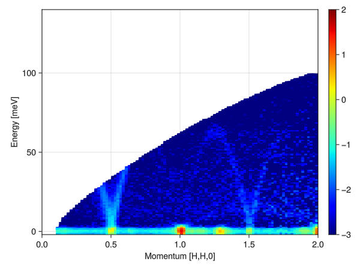
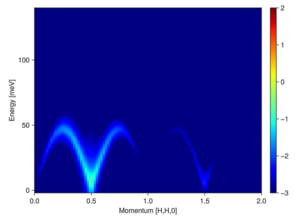
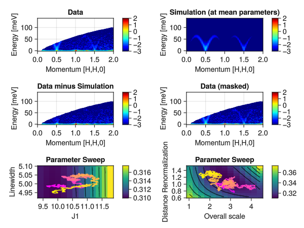

````julia
using Sunny, GLMakie
````

# Fitting a Slice

Load the prepared data (originally named `normData_LaSrCrO4_120meV_5K_no_symmetrize_skew.nxs`):

````julia
if !(:params ∈ names(Main))
params, data = load_nxs("../inverse-toolkit/data/LaSrCrO4_prepared.nxs")
for i = 1:4
  params.binend[i] -= params.binwidth[i]/2
end
println(size(data))
end
````

````
┌ Warning: This file was not written with JLD2. Some things may not work.
└ @ JLD2 C:\Users\Sam\.julia\packages\JLD2\z3MOM\src\JLD2.jl:412
Warning: failed to load W_MATRIX from Mantid file ../inverse-toolkit/data/LaSrCrO4_prepared.nxs due to:
KeyError("experiment0")
Falling back to reading transform_from_orig
Warning: failed to read histogram axes from Mantid file ../inverse-toolkit/data/LaSrCrO4_prepared.nxs due to:
KeyError("coordinate_system")
Defaulting to low-accuracy reading of axes labels!
(100, 100, 100, 142)

````

The shape of the data is described by the histogram parameters:

````julia
params
````

````
Binning Parameters
⊡   100 bins from +0.000 to +2.000 along [+0.50 dx +0.50 dy] (Δ = 0.028)
⊡   100 bins from -2.000 to +2.000 along [+0.50 dx -0.50 dy] (Δ = 0.057)
⊡   100 bins from -5.000 to +5.000 along [+1.00 dz] (Δ = 0.100)
⊡   142 bins from -2.000 to +140.000 along [+1.00 dE] (Δ = 1.000)

````

Now, to slice the data into a usable format, we will use `bin_tools.jl`:

````julia
include("../inverse-toolkit/bin_tools.jl")

# Integrate [K,-K,0] axis over an interval around K=0
p, d = approximate_bintegrate(2,-0.1,0.12,params,data)

# Leave energy axis unrestricted
p, d = approximate_bintegrate(4,-Inf,Inf,p,d,restrict = true)

# Optionally: Restrict energy axis to [8meV,∞)
##p, d = approximate_bintegrate(4,8.0,Inf,p,d,restrict = true)

````

There is a tradeoff in this data (due to kinematic constraints) between
integrating over a large range of `[0,0,L]` to get good statistics vs how much
of the dispersion cuver near `[0.5,0.5,0]` is visible. In our case, we don't
expect any dispersion in `L`, so we integrate over a large range `L = ±2`
and later only sample a small number of points within that large L bin.
In general, one would need to choose a multisampling strategy (like `msaa4` below)
which is adapted to this larger bin size.

````julia
# Integrate [0,0,L] axis over L = ±2 to get rid of it.
p, d = approximate_bintegrate(3,-2,2,p,d)

# Reduce resolution
p, d = chunk_params(p,d;chunking = (1,1,1,1))

params_use, data_use = p, d

params_use
````

````
Binning Parameters
⊡   100 bins from +0.000 to +2.000 along [+0.50 dx +0.50 dy] (Δ = 0.028)
∫ Integrated from -0.080 to +0.124 along [+0.50 dx -0.50 dy] (Δ = 0.288)
∫ Integrated from -2.000 to +2.010 along [+1.00 dz] (Δ = 4.010)
⊡   142 bins from -2.000 to +140.000 along [+1.00 dE] (Δ = 1.000)

````

Now, we plot the slice:

````julia
bcs = axes_bincenters(params_use)
f = Figure();
ax0 = Axis(f[1,1],xlabel = "Momentum [H,H,0]",ylabel="Energy [meV]")
hm = heatmap!(ax0,bcs[1],bcs[4],log10.(abs.(data_use[:,1,1,:])),colormap = :jet1,colorrange = (-3,2))
Colorbar(f[1,2],hm)
````


There is a clear signature of an anti-ferromagnetic spin wave dispersion in this slice, so we should be able to fit
a model to it.
There are also other things: Bragg peaks and general high intensity features at the elastic line, and then
relatively diffuse phonon bands intermixed with the spin wave.

The first thing to do is to specify the forward solver.
Here, we calculate the value in each bin by evaluating Sunny's spin wave
calculator at a few points inside each bin:

````julia
function get_intensities(sys::System,linewidth)

  # Go to ground state
  attempts = 0
  while true

    if attempts == 0
      # Try this state first
      sys.dipoles[1] = [0,-3/2,0]
      sys.dipoles[2] = [0,3/2,0]
      sys.dipoles[3] = [3/2,0,0]
      sys.dipoles[4] = [-3/2,0,0]
      randomize_spins!(sys)
    else
      # If that fails, try a random initial state
      randomize_spins!(sys)
    end

    minimize_energy!(sys;maxiters=3000,subiters=80)

    if minimize_energy!(sys;maxiters=5) >= 0
      break
    else
      attempts = attempts + 1
      # Max 8 attempts
      if attempts > 8
        println("Failed to find ground state!")
        return NaN .* data_use
      end
    end
  end

  swt = SpinWaveTheory(sys)
  formula = intensity_formula(swt,:perp;
    # TODO: instrument-adapted broadening
    kernel = lorentzian(linewidth)
    ,formfactors = [FormFactor("Cr3")]
    )

  # Multi-sampling magic numbers!

  # for single-sampling:
  msaa1 = [[0.5, 0.5, 0.5]]

  # for 4x multi-sampling:
  msaa4 = [[0.625, 0.625, 0.125]
          ,[0.875, 0.125, 0.375]
          ,[0.375, 0.375, 0.875]
          ,[0.125, 0.875, 0.625]]

  # Energy axis 5x multi-sampling:
  energy_multisample = [(n + 0.5)/5 for n = 1:5]

  # Calculate intensities using multiple samples per bin
  intensity, counts = Sunny.intensities_bin_multisample(swt, params_use, msaa4, energy_multisample, formula)

  # Sunny Multisample LSWT is computing a density; even if the bin size goes to zero the value
  # returned is still finite. We need to multiply by the bin size!
  intensity * prod(params_use.binwidth) ./ counts
end
````

````
get_intensities (generic function with 1 method)
````

Now, we need to build the parameter-dependent `System`.
Our fitting parameters will be `J1`, the linewidth, the overall scale, and a "distance renormalization"
that modifies the lattice constant.
That last parameter is a proxy that allows us to fit the form factor, since the lattice constant enters
the form factor calculation.

````julia
cryst0 = subcrystal(Crystal("../inverse-toolkit/example_cif.cif"; symprec=1e-4),"Cr")
function forward_problem(J1,linewidth;J2 = 0.16, A = 0.08, D = 0.01, K = 0.001, distance_renorm = 1.0)

  # "Renormalize" the distance between atoms as a means to fit the form factor
  cryst_renorm = Crystal(distance_renorm * cryst0.latvecs, cryst0.positions)
  sys = System(cryst_renorm, (1,1,1), [SpinInfo(1,S=3/2,g=2)], :dipole)

  # Nearest neighbor exchange
  set_exchange!(sys,J1,Bond(1,1,[1,0,0]))

  # Next-Nearest neighbor exchange
  set_exchange!(sys,J2,Bond(1,1,[1,1,0]))

  # Getting the right ground state depends sensitively on
  # the next three couplings:
  # (see DOI 10.1103/PhysRevB.105.L180411 )

  # Easy-plane anisotropy
  Sz = spin_matrices(spin_label(sys,1))[3]
  set_onsite_coupling!(sys,A*Sz^2,1)

  # Interlayer couplings D and K
  nHat = normalize(cryst0.latvecs * (cryst0.positions[2] .- cryst0.positions[1]))
  exchange_matrix = I(3) - 3(nHat * nHat')
  set_pair_coupling!(sys,(Si,Sj) -> Si'*(D .* exchange_matrix)*Sj + (Si'*K*Sj)^2,Bond(1,2,[0,0,0]))

  # Neel state unit cell for spin wave calculator
  sys = reshape_supercell(sys, [1 1 0; 1 -1 0; 0 0 1])

  intensity = try
    get_intensities(sys,linewidth)
  catch e
    println("LSWT error!")
    println("params: $J1, $J2, $A, $D, $K, $linewidth")
    println(e)
    NaN .* data_use
  end

  return intensity
end
````

````
forward_problem (generic function with 1 method)
````

Now, calling `forward_problem` calculates the spin wave intensity at the given parameter values.
For example, here's what it looks like for parameters close to (but not quite exactly) the true parameters:

````julia
is = 8.5 * forward_problem(8.0,3.0;distance_renorm = 0.6)
bcs = axes_bincenters(params_use)
f = Figure();
ax0 = Axis(f[1,1],xlabel = "Momentum [H,H,0]",ylabel="Energy [meV]")
hm = heatmap!(ax0,bcs[1],bcs[4],log10.(abs.(is[:,1,1,:])),colormap = :jet1,colorrange = (-3,2))
Colorbar(f[1,2],hm)
````


Notice a few things about the simulation compared to the data:

1. The elastic line is missing
2. The phonons are missing
3. The full range of momenta and energy are available, unlike in the data

All of these will need to be considered when designing the loss function and fitting
algorithm. Let's start with the loss function. Collecting the four fitting parameters,

1. J1
2. Linewidth
3. Overall scale
4. Lattice constant renormalization

into a vector `x`, we can write the "χ²" loss, which means the sum of squared errors
at every histogram bin, as:

````julia
function loss(x;weighted = false)

  # Unpack vector
  J1, linewidth, overall_scale, dist_renorm = x

  # Compute simulated intensity
  is_sim = overall_scale .* forward_problem(J1,linewidth; distance_renorm = dist_renorm)

  # Optional weighting to help filter phonons
  weight = if weighted
    weight = is_sim .^ 2
    weight[isnan.(data_use)] .= 0
    weight ./= sum(weight)
    weight
  else
    ones(Float64,size(is_sim)...)
  end

  squared_errors = (is_sim .- data_use).^2 .* weight

  # Set specific squared errors to zero to ignore them
  squared_errors[isnan.(data_use)] .= 0 # Filter out missing experiment data
  squared_errors[:,:,:,1:5] .= 0 # Filter elastic line

  sum(squared_errors)
end
````

````
loss (generic function with 1 method)
````

The filtering out of the elastic line is effectively a 'mask' over the data
so that it doesn't penalize the (inelastic) spin wave calculator for not fitting
that part of the data.

Using the loss function, we can try to hand-fit the spin wave by using sliders to control each parameter.
Include the source file for this tutorial and run `hand_fit()` to try it out!

````julia
function hand_fit()
  function pos_log10_abs(x)
    ##x[x .< 0] .= 0
    log10.(abs.(x))
  end

  f = Figure()

  # First panel (experiment minus model)
  ax = Axis(f[1,1],xlabel = "Momentum [H,H,0]",ylabel="Energy [meV]", title = "Data minus Simulation")
  sim_data = Observable(copy(data_use[:,1,1,:]))
  log_sim_data = map(x -> pos_log10_abs(x),sim_data)
  heatmap!(ax,bcs[1],bcs[4],log_sim_data,colormap = :winter,colorrange = (-3,2))
  dat_show_diff = map(x -> pos_log10_abs(data_use[:,1,1,:] .- x),sim_data)
  hm = heatmap!(ax,bcs[1],bcs[4],dat_show_diff,colormap = :jet1,colorrange = (-3,2))
  Colorbar(f[1,2],hm)

  # Other panels (experiment and model)
  ax_is = Axis(f[1,4],xlabel = "Momentum [H,H,0]",ylabel="Energy [meV]", title = "Simulation")
  heatmap!(ax_is,bcs[1],bcs[4],log_sim_data,colormap = :jet1,colorrange = (-3,2))

  ax_goal = Axis(f[1,3],xlabel = "Momentum [H,H,0]",ylabel="Energy [meV]", title = "Data")
  heatmap!(ax_goal,bcs[1],bcs[4],pos_log10_abs(copy(data_use[:,1,1,:])),colormap = :jet1,colorrange = (-3,2))

  # Controls
  sg = SliderGrid(f[2,1],
    (label = "J1", range = 0.05:0.01:35, startvalue = 1.0, format = x -> "$(Sunny.number_to_simple_string(x; digits = 4))"),
    (label = "Linewidth", range = 0.01:0.01:20, startvalue = 9.8, format = x -> "$(Sunny.number_to_simple_string(x; digits = 4))"),
    (label = "Scale", range = 0:0.01:45, startvalue = 7.1, format = x -> "$(Sunny.number_to_simple_string(x; digits = 4))"),
    (label = "Distance renorm", range = 0.1:0.001:3, startvalue = 1.2, format = x -> "$(Sunny.number_to_simple_string(x; digits = 4))")
   )

  J1 = sg.sliders[1].value
  linewidth = sg.sliders[2].value
  scale = sg.sliders[3].value
  d = sg.sliders[4].value

  # Re-run the calculator whenever the sliders change
  function do_update()
    sim_data[] .= scale[] * forward_problem(J1[], linewidth[];distance_renorm = d[],D=0,K=0)[:,1,1,:]
    notify(sim_data)
  end

  on(x -> do_update(),J1)
  on(x -> do_update(),linewidth)
  on(x -> do_update(),scale)
  on(x -> do_update(),d)

  # This button allows you to check if your spin wave model is deterministic
  # by re-running several times at the same parameter values. Try setting the
  # interlayer coupling K=0 to allow degenerate ground states; this makes the
  # exact ground state chosen non-deterministic, and this enters the final intensities
  # via :perp, so the intensity will change each time the button is clicked.
  rand_button = Button(f[2,2], label = "Reroll")
  on(rand_button.clicks;update = true) do event
    do_update()
  end

  display(f)
end
````

````
hand_fit (generic function with 1 method)
````

Given a loss function and a reasonable starting guess, we can refine it and estimate errors using
the thermal basin.
What this does is repeatedly perturb the fit parameters according to the
probability distribution `exp(-loss/T)`, and accumlate statistics about the set of
parameter values visited. The mean and covariance then give good-fit parameters
and a measure of the uncertainty in each parameter (relative to uncertainty in the other parameters).

````julia
include("../inverse-toolkit/thermal_basin.jl")
function do_basin()

  initial_guess = [10., 5., 3.0, 0.8]
  temperature = 0.005 # Temperature for probability distribution
  noise_scale = [0.2,0.01,0.3,0.1]/5 # Scale for how much to perturb each parameter each step
  j_max = 1000 # Number of steps
  cent, cov, xs = thermal_basin(loss, initial_guess, temperature; noise_scale, j_max,verbose = true)

  F = eigen(cov;sortby = λ -> -λ)
  display(cov)
  display(F)
  n(x) = Sunny.number_to_simple_string(x,digits = 8)
  for i = 1:4
    println("x[$i] = $(n(cent[i])) ± $(n(sqrt(cov[i,i])))")
  end
  println()
  println("Loosest mode (σ = $(sqrt(F.values[1]))):")
  println(F.vectors[:,1])
  println("Strictest mode (σ = $(sqrt(F.values[end]))):")
  println(F.vectors[:,end])

  is_fit = cent[3] .* forward_problem(cent[1],cent[2]; distance_renorm = cent[4])

  f = Figure();
  ax0 = Axis(f[1,1],xlabel = "Momentum [H,H,0]",ylabel="Energy [meV]", title = "Data")
  hm = heatmap!(ax0,bcs[1],bcs[4],log10.(abs.(data_use[:,1,1,:])),colormap = :jet1,colorrange = (-3,2))
  Colorbar(f[1,2],hm)

  ax = Axis(f[1,3],xlabel = "Momentum [H,H,0]",ylabel="Energy [meV]", title = "Simulation (at mean parameters)")
  hm = heatmap!(ax,bcs[1],bcs[4],log10.(abs.(is_fit[:,1,1,:])),colormap = :jet1,colorrange = (-3,2))
  Colorbar(f[1,4],hm)

  ax = Axis(f[2,1],xlabel = "Momentum [H,H,0]",ylabel="Energy [meV]", title = "Data minus Simulation")
  hm = heatmap!(ax,bcs[1],bcs[4],log10.(abs.(data_use[:,1,1,:] .- is_fit[:,1,1,:])),colormap = :jet1,colorrange = (-3,2))
  Colorbar(f[2,2],hm)

  ax = Axis(f[2,3],xlabel = "Momentum [H,H,0]",ylabel="Energy [meV]", title = "Data (masked)")
  fit_goal = copy(data_use[:,1,1,:])
  fit_goal[:,1:3] .= NaN
  hm = heatmap!(ax,bcs[1],bcs[4],log10.(abs.(fit_goal)),colormap = :jet1,colorrange = (-3,2))
  Colorbar(f[2,4],hm)

  println("Sweeping...")
  ax = Axis(f[3,1],xlabel = "J1",ylabel = "Linewidth",title="Parameter Sweep")
  sig = [sqrt(cov[i,i]) for i = 1:4]
  sweep = [(cent[i] - 3sig[i]):(sig[i]/2):(cent[i]+3sig[i]) for i = 1:4]
  ls = [loss([j1,lw,cent[3],cent[4]]) for j1 = sweep[1], lw = sweep[2]]
  hm = heatmap!(ax,sweep[1],sweep[2],ls)
  Colorbar(f[3,2],hm)
  contour!(ax,sweep[1],sweep[2],ls,color = :black)
  lines!(ax,map(x -> x[1],xs),map(x -> x[2],xs),color = 1:length(xs),colormap = :spring)

  ax = Axis(f[3,3],xlabel = "Overall scale",ylabel = "Distance Renormalization",title="Parameter Sweep")
  lsn = [loss([cent[1],cent[2],sc,drn]) for sc = sweep[3], drn = sweep[4]]
  hm = heatmap!(ax,sweep[3],sweep[4],lsn)
  Colorbar(f[3,4],hm)
  contour!(ax,sweep[3],sweep[4],lsn,color = :black)
  lines!(ax,map(x -> x[3],xs),map(x -> x[4],xs),color = 1:length(xs),colormap = :spring)

  f
end
do_basin()
````



The last two plots above are parameter sweeps of the loss landscape superimposed with
the thermal basin trajectory. They can be used to assessed to decide whether the `noise_scale` and `temperature`
parameters were appropriate; if they were, then the eigendecomposition `F` of the covariance matrix can be used
to put error bars on the parameters representing how well constrained they are by the data.

---

*This page was generated using [Literate.jl](https://github.com/fredrikekre/Literate.jl).*

