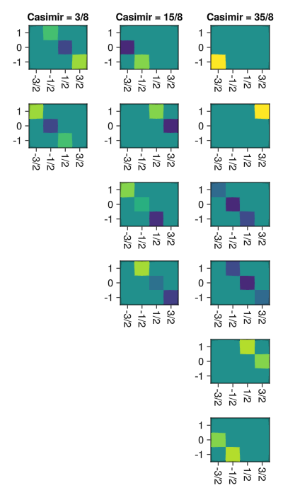

# Quadratic Casimirs

````julia
using Sunny, GLMakie, LinearAlgebra, SparseArrays
````

## Background: The Killing Form and its associated Quadratic Casimir

A Lie algebra $L$ is a vector space with a bracket operation $[\cdot,\cdot] : L \times L \to L$ satisfying certain properties.
Since Lie algebra elements are often square matrices, it will be convenient to flatten them into vectors to treat them using linear algebra:

````julia
matrix_to_flat(M) = M[:]
flat_to_matrix(v) = reshape(v,Int64(sqrt(length(v))),Int64(sqrt(length(v))))
````

The partially applied bracket $\mathrm{ad}_X = [X,\cdot] : L \to L$ (where $X \in L$) is called the *adjoint representation* of $L$.
In the extremely common case that the bracket operation is the matrix commutator, we can easily write down a matrix representation of $\mathrm{ad}_X$ with respect to some basis:

````julia
function basis_to_transformation_matrix(basis)
  basis = matrix_to_flat.(basis)
  mat_size = length(basis[1])
  basis_elems = length(basis)

  # A matrix mapping (a,b,c) -> a * basis[1] + b * basis[2] + c * basis[3]
  [basis[i][j] for j = 1:mat_size, i = 1:basis_elems]
end

function adX_matrep(X,basis)
  M = basis_to_transformation_matrix(basis)
  adX = zeros(ComplexF64,length(basis),length(basis))
  for j = 1:length(basis)
    adX[:,j] = M \ matrix_to_flat(X * basis[j] - basis[j] * X)
  end
  adX
end
````

Since $\mathrm{ad}_X$ is just a linear map, we can multiply it with itself and take a trace, $B(X,Y) = \mathrm{tr}(\mathrm{ad}_X \mathrm{ad}_Y)$, which defines the Killing form $B$:

````julia
function killing_form(basis)
  B = zeros(ComplexF64,length(basis),length(basis))
  ad = map(X -> adX_matrep(X,basis),basis)
  for i = 1:length(basis), j = 1:length(basis)
    B[i,j] = tr(ad[i] * ad[j])
  end
  round.(B;digits = 12) # Chop tiny numbers
end
````

````
killing_form (generic function with 1 method)
````

If $\{A,B,C\}$ is a basis for $L$, then $2A-4B$ is in $L$, but none of $AB$, $AB - BA$, or $C^2$ is in $L$, in the same way that $\hat x\hat y$ is not in $\mathbb{R}^3$.
In order to make sense of these formal products of Lie algebra elements, one needs to consider the so-called Universal Enveloping Algebra (UEA) $U(L)$, which is the free algebra over $L$ (meaning arbitrary products of elements of $L$ are allowed), but quotiented by the relation $[X,Y] = XY-YX$ (meaning that the formal expression $AB - BA$ is considered equal to whatever $[A,B]$ evaluates to).

Within any Lie algebra (including a UEA), the *center* is the subspace of the Lie algebra that commutes with everything: $X$ is in the center if and only if $[X,Y] = 0$ for all $Y$.
The term "Casimir" sometimes refers to simply *any* element of the center of a Lie algebra, but we will be interested in defining a specific conventional (and basis-independent) Casimir element.

Given a Lie algebra $L$, the *Killing form-derived quadratic casimir* is the following element of UEA of $L$: $\Omega \equiv \sum_{ij} [B^{-1}]^{ij} X^i X^j$ where $[B^{-1}]^{ij}$ is the inverse matrix of $B_{ij}$ in the $X^i$ basis.

````julia
function killing_casimir(basis; B = killing_form(basis))
  C = (permutedims(basis) * inv(B) * basis)[1]
  round.(C;digits = 12) # Chop tiny numbers
end
````

````
killing_casimir (generic function with 1 method)
````

# Example: SU(2)

The $\mathfrak{su}(2)$ Lie algebra consists of real linear combinations of $S^x$, $S^y$ and $S^z$ (defined as half the pauli matrices), with the commutation relations $[S^x, S^y] = iS^z$ (pauli matrices would have $2i$ instead of $i$) and so on.

````julia
su2 = spin_matrices(1/2)
@assert su2[1] * su2[2] - su2[2] * su2[1] ≈ im * su2[3] # Check commutation relation
````

The center of $\mathfrak{su}(2)$ is empty (only includes zero).
The Killing form is diagonal, $B(S^i,S^j) = 2\delta^{ij}$.

````julia
killing_form(su2)
````

````
3×3 Matrix{ComplexF64}:
  2.0-0.0im  -0.0-0.0im   0.0-0.0im
 -0.0-0.0im   2.0-0.0im  -0.0-0.0im
  0.0-0.0im  -0.0-0.0im   2.0-0.0im
````

The UEA $U(\mathfrak{su}(2))$ consists of arbitrary spin polynomials $[S^x]^2$, $[S^y]^3S^x - 4 S^z$, etc, with only the commutation relations imposed (and *no* further "coincidental" representation-dependent relations like $[S^x]^2 = I$ imposed).
The Killing form-derived quadratic casimir of $\mathfrak{su}(2)$ is $\frac{1}{2}S^2 \equiv \frac{1}{2}([S^x]^2 + [S^y]^2 + [S^z]^2)$:

````julia
killing_casimir(su2)
````

````
2×2 Matrix{ComplexF64}:
 0.375+0.0im    0.0+0.0im
   0.0+0.0im  0.375+0.0im
````

We will now demonstrate that this is basis independent.
Consider first the Pauli matrices $\sigma^i = 2 S^i$:

````julia
pauli = 2 .* su2
killing_form(pauli)
````

````
3×3 Matrix{ComplexF64}:
  8.0-0.0im  -0.0-0.0im   0.0-0.0im
 -0.0-0.0im   8.0-0.0im  -0.0-0.0im
  0.0-0.0im  -0.0-0.0im   8.0-0.0im
````

The killing form is different; but the casimir is the same:

````julia
@assert killing_casimir(su2) ≈ killing_casimir(pauli)
````

Next, consider the ladder basis $(S^z, S^+, S^-)$, where the killing form is even off-diagonal:

````julia
ladder = [su2[3], su2[1] + im * su2[2], su2[1] - im * su2[2]]
Sz, Splus, Sminus = ladder

# Verify ladder operator properties
@assert Sz * Splus - Splus * Sz ≈ +Splus
@assert Sz * Sminus - Sminus * Sz ≈ -Sminus

killing_form(ladder)
````

````
3×3 Matrix{ComplexF64}:
 2.0+0.0im  0.0+0.0im  0.0+0.0im
 0.0+0.0im  0.0+0.0im  4.0+0.0im
 0.0+0.0im  4.0+0.0im  0.0+0.0im
````

Yet the casimir is the same:

````julia
killing_casimir(ladder)
````

````
2×2 Matrix{ComplexF64}:
 0.375+0.0im    0.0+0.0im
   0.0+0.0im  0.375+0.0im
````

In all representations of $\mathfrak{su}(2)$, i.e. for any spin $S$, the killing form-derived quadratic casimir is $S(S+1)/2$:

````julia
println()
println("su(2) representations and their casimir values:")
for S = (1/2):(1/2):5
  spinS = spin_matrices(S)
  C = killing_casimir(spinS)
  @assert C ≈ (S*(S+1)/2) * I(Int64(2S+1))
  casimir = Float64(C[1,1])
  println("S = $(Sunny.number_to_math_string(S)), S(S+1)/2 = $casimir")
end
````

````

su(2) representations and their casimir values:
S = 1/2, S(S+1)/2 = 0.375
S = 1, S(S+1)/2 = 1.0
S = 3/2, S(S+1)/2 = 1.875
S = 2, S(S+1)/2 = 3.0
S = 5/2, S(S+1)/2 = 4.375
S = 3, S(S+1)/2 = 6.0
S = 7/2, S(S+1)/2 = 7.875
S = 4, S(S+1)/2 = 10.0
S = 9/2, S(S+1)/2 = 12.375
S = 5, S(S+1)/2 = 15.0

````

## Stevens Operator Bases

The $N^2 - 1$ non-identity stevens operators form a basis for the defining representation of $\mathfrak{su}(N)$. We can collect them into a basis:

````julia
function stevens_basis(S; Smax = S)
  O = stevens_matrices(S)
  basis = Vector{Any}(undef,0)
  for n = 1:Int64(2Smax)
    for k = -n:n
      push!(basis,O[n,k])
    end
  end
  basis
end
````

````
stevens_basis (generic function with 1 method)
````

Meanwhile, the 0,0 stevens operator is the identity matrix. Since the quadratic casimir of $\mathfrak{su}(2)$ is always a scalar multiple of the identity matrix, `print_stevens_expansion(killing_casimir(spin_matrices(S)))` is a convenient way to print the quadratic casimir constant (which is the unique eigenvalue of the quadratic casimir):

````julia
println()
print("For S = 5, Ω = ")
print_stevens_expansion(killing_casimir(spin_matrices(5)))
````

````

For S = 5, Ω = 15

````

Using the Stevens operators, we can compute Killing forms and derive quadratic casimir invariants from them.
Note that, in the $\mathfrak{su}(N)$ case, the quadratic means quadratic in the $\mathfrak{su}(N)$ generators, *not* in the spin operators.

````julia
sparse(killing_form(stevens_basis(1)))
````

````
8×8 SparseMatrixCSC{ComplexF64, Int64} with 8 stored entries:
 12.0+0.0im       ⋅           ⋅           ⋅          ⋅           ⋅          ⋅           ⋅    
      ⋅      12.0-0.0im       ⋅           ⋅          ⋅           ⋅          ⋅           ⋅    
      ⋅           ⋅      12.0-0.0im       ⋅          ⋅           ⋅          ⋅           ⋅    
      ⋅           ⋅           ⋅      12.0-0.0im      ⋅           ⋅          ⋅           ⋅    
      ⋅           ⋅           ⋅           ⋅      3.0+0.0im       ⋅          ⋅           ⋅    
      ⋅           ⋅           ⋅           ⋅          ⋅      36.0+0.0im      ⋅           ⋅    
      ⋅           ⋅           ⋅           ⋅          ⋅           ⋅      3.0-0.0im       ⋅    
      ⋅           ⋅           ⋅           ⋅          ⋅           ⋅          ⋅      12.0-0.0im
````

Since the Killing form is always diagonal in the Steven's operator basis, we just need the numbers on the diagonal:

````julia
diag(killing_form(stevens_basis(3/2)))
````

````
15-element Vector{ComplexF64}:
  40.0 + 0.0im
  40.0 + 0.0im
  40.0 + 0.0im
  96.0 + 0.0im
  24.0 - 0.0im
 288.0 + 0.0im
  24.0 + 0.0im
  96.0 + 0.0im
 144.0 + 0.0im
  24.0 - 0.0im
 240.0 + 0.0im
 360.0 + 0.0im
 240.0 + 0.0im
  24.0 - 0.0im
 144.0 + 0.0im
````

Using S = Inf to have Sunny produce spin polynomials, we can compute the killing form-derived quadratic casimirs in spin polynomial form.
First, we do this for S = 1/2:

````julia
# Compute the Killing form numerically, using numerical stevens matrices
B_su2 = killing_form(stevens_basis(1/2)) # = diag(2,2,2)

# Compute the casimir operator symbolically
Ω = killing_casimir(stevens_basis(Inf;Smax = 1/2); B = real.(B_su2))
println()
println("su(2): Ω = $(round(Ω,digits=5))")
````

````

su(2): Ω = 0.5*𝒮ˣ^2 + 0.5*𝒮ʸ^2 + 0.5*𝒮ᶻ^2

````

The output expression, $\Omega = \frac{1}{2}\sum_i [S^i]^2$, takes place the UEA.
Recall that for our usual spin-1/2 representation, we have $[S^i]^2 = \frac{1}{4}$ for $i=x,y,z$, so $\Omega = \frac{1}{2}(3 \times \frac{1}{4}) = 3/8$, which agrees with the $S(S+1)/2 = 0.375$ value from earlier.

Plugging in the spin-1/2 representation for the $S^i$ makes this quantum mechanical.
We could instead evaluate this spin polynomial by inserting the classical x,y,z components of the spin dipole to find the classical version: $\Omega = \frac{1}{2}\lvert S\rvert^2 = 0.125 \neq 0.375$ (assuming $\lvert S \rvert = \frac{1}{2}$ for spin-1/2, i.e. $\kappa = 1$).
Sunny can do part of this computation for us, by writing $\Omega$ as a polynomial in $\lvert S\rvert^2$, via printing the stevens expansion, which is just the prefactor to the identity matrix O[0,0]:

````julia
print("  stevens: ")
print_stevens_expansion(Ω)
````

````
  stevens: (1/2)𝒮²

````

The situation is similar but more complicated for spin-1:

````julia
B_su3 = killing_form(stevens_basis(1)) # = diag(12,12,12,12,3,36,3,12)
Ω = killing_casimir(stevens_basis(Inf;Smax = 1); B = real.(B_su3))
println()
println("su(3): Ω = (1/36) * [$(round(Ω * 36,digits = 5))]")
print("  stevens: ")
print_stevens_expansion(Ω)
````

````

su(3): Ω = (1/36) * [3.0*𝒮ˣ^2 + 3.0*𝒮ʸ^2 + 3.0*𝒮ᶻ^2 + 4.0*𝒮ˣ^4 + 8.0*𝒮ʸ^2*𝒮ˣ^2 + 4.0*𝒮ʸ^4 + 8.0*𝒮ᶻ^2*𝒮ˣ^2 + 8.0*𝒮ᶻ^2*𝒮ʸ^2 + 4.0*𝒮ᶻ^4]
  stevens: (1/12)𝒮² + (1/9)𝒮⁴

````

However, the situation becomes more clear numerically, where all these complicated expressions turn out proportional to the identity matrix, similar to the representations of $\mathfrak{su}(2)$:

````julia
println()
println("su(N) defining representations and their casimir values")
sun_cas = []
for S = (1/2):(1/2):3
  suN = stevens_basis(S)
  C = killing_casimir(suN)
  @assert allequal(diag(C))
  casimir = Float64(C[1,1])
  push!(sun_cas,casimir)
  println("S = $(Sunny.number_to_math_string(S)), Casimir diagonal = $casimir")
end
````

````

su(N) defining representations and their casimir values
S = 1/2, Casimir diagonal = 0.375
S = 1, Casimir diagonal = 0.444444444444
S = 3/2, Casimir diagonal = 0.46875
S = 2, Casimir diagonal = 0.48
S = 5/2, Casimir diagonal = 0.486111111111
S = 3, Casimir diagonal = 0.489795918367

````

The casimir value for $\mathfrak{su}(N)$ can be predicted as $\frac{1}{2}\frac{N^2-1}{N^2}$, and it approaches $\frac{1}{2}$ as $N\to\infty$.

We can make a more complete table using the basis provided by D.D., original given in *Nemoto (2000), "Generalized coherent states for SU(n) systems."*, although we quickly run into scaling issues for larger $N$:

````julia
dd_file = "../../Dahlbom-ORNL\\generators-and-invariants\\sun_generators.jl"
if !isfile(dd_file)
  println("Couldn't find David's file :(")
else
  include(dd_file)
  println()
  println("su(N) casimir values")
  for S = (1/2):(1/2):4
    suN = sun_generators(Int64(2S+1))
    C = killing_casimir(suN)
    @assert allequal(diag(C))
    casimir = Float64(C[1,1])
    println("S = $(Sunny.number_to_math_string(S)), Casimir diagonal = $casimir")
  end
end
````

````

su(N) casimir values
S = 1/2, Casimir diagonal = 0.375
S = 1, Casimir diagonal = 0.444444444444
S = 3/2, Casimir diagonal = 0.46875
S = 2, Casimir diagonal = 0.48
S = 5/2, Casimir diagonal = 0.486111111111
S = 3, Casimir diagonal = 0.489795918367
S = 7/2, Casimir diagonal = 0.4921875
S = 4, Casimir diagonal = 0.493827160494

````

## Killing form is rotation-invariant

The group of physics rotations, $\mathrm{SO}(3)$, acts on $\mathfrak{su}(N)$ by rotating the stevens operators amongst themselves.
In particular, the group action is block diagonal in the stevens operators, only mixing between `O[q,k]` with fixed `q`.
The following shows that, although the Killing form `B_su3` restricted to the `q=2` "quadrupole" part is not proportional to the identity matrix,

````julia
multipolar_killing_form = B_su3[4:8,4:8]
sparse(round.(multipolar_killing_form;digits = 8))
````

````
5×5 SparseMatrixCSC{ComplexF64, Int64} with 5 stored entries:
 12.0-0.0im      ⋅           ⋅          ⋅           ⋅    
      ⋅      3.0+0.0im       ⋅          ⋅           ⋅    
      ⋅          ⋅      36.0+0.0im      ⋅           ⋅    
      ⋅          ⋅           ⋅      3.0-0.0im       ⋅    
      ⋅          ⋅           ⋅          ⋅      12.0-0.0im
````

it is still preserved under physical rotations:

````julia
# A random orthogonal matrix (a physical rotation)
R = Sunny.Mat3(Matrix(qr(randn(3,3)).Q))

# The matrix implementing the rotation of stevens operators
V = Sunny.operator_for_stevens_rotation(2,R)

V * multipolar_killing_form * transpose(V) ≈ multipolar_killing_form
````

````
true
````

This can be checked more rigorously at the Lie algebra level by showing that the killing form is preserved under all infinitesimal rotations.
In this case, the infinitesimal rotations are generated by the spin-2 representation of $\mathfrak{su}(2)$, since quadrupoles have dimension $5 = 2(2) + 1$, and $\mathfrak{su}(2) \cong \mathfrak{so}(3)$ is the Lie algebra of physical rotations.
The basis of stevens operators is related to the basis the spin matrices by the `Sunny.stevens_α` and `Sunny.stevens_αinv` matrices, so we use those to map the spin-2 Lie algebra `Sunny.spin_matrices(2)` to the Lie algebra generating rotations of stevens operators:

````julia
spin_generator_to_stevens_generator(S) = Sunny.stevens_α[2] * conj(S) * Sunny.stevens_αinv[2]
steven_gens = map(spin_generator_to_stevens_generator,Sunny.spin_matrices(2))
````

For example, the $S^x$ gets mapped to the following 5x5 generator of multipolar rotations:

````julia
sparse(steven_gens[1])
````

````
5×5 SparseMatrixCSC{ComplexF64, Int64} with 6 stored entries:
     ⋅          ⋅          ⋅      0.0-2.0im      ⋅    
     ⋅          ⋅          ⋅          ⋅      0.0-0.5im
     ⋅          ⋅          ⋅      0.0-6.0im      ⋅    
 0.0+0.5im      ⋅      0.0+0.5im      ⋅          ⋅    
     ⋅      0.0+2.0im      ⋅          ⋅          ⋅    
````

Now, we can differentiate the rotation `V * B * transpose(V)` by setting $V = I + \epsilon A$ and taking a derivative with respect to $\epsilon$ at $\epsilon = 0$.
The result is `A * B + B * transpose(A)` plus $O(\epsilon^2)$.
Thus, we can show that `B = multipolar_killing_form` is invariant under any rotation:

````julia
for A in steven_gens
  # Computes the derivative of the killing form matrix elements
  # with respect to the angle of rotation
  deriv = A * multipolar_killing_form .+ multipolar_killing_form * transpose(A)

  # If all angular derivatives vanish, it's invariant to rotations
  println(norm(deriv) < 1e-12)
end
````

````
true
true
true

````

## Polarization Identity for Entangled Sites

Consider two coupled spins, $S = 1$ for the left spin and $S=3/2$ for the right spin.
The total spin operator "$S_T = S_L + S_R$" is defined more carefully by $S_T^i = S_L^i \otimes I + I\otimes S_R^i$ for each component $i = x,y,z$:

````julia
sL = spin_matrices(1)
IL = I(3)

sR = spin_matrices(3/2)
IR = I(4)

sT = [kron(sL[i],IR) + kron(IL,sR[i]) for i = [1,2,3]]
````

We can verify a few facts about the spectrum of the total spin operators in terms of the individual spin operators, just to check that we have everything set up correctly.
For example, the eigenvalues of $[S_T^x]^2$ are the squares of sums of eigenvalues of $S_L^x$ and $S_R^x$:

````julia
total_spin_x_vals = eigvals(sT[1]^2)
squared_left_plus_right_x_vals = sort([(a + b)^2 for a = eigvals(sL[1]), b = eigvals(sR[1])][:])
display(round.([total_spin_x_vals squared_left_plus_right_x_vals],digits = 12))
````

This happens because eigenstates of $[S_T^x]^2$ are *also* eigenstates of both $S_L^x$ and $S_R^x$, which can be verified because these operators commute $[(S_T^x)^2,S_L^x\otimes I] = 0 = [(S_T^x)^2,I \otimes S_R^x]$:

````julia
println(norm(sT[1]^2 * kron(sL[1],IR) - kron(sL[1],IR) * sT[1]^2) < 1e-12)
println(norm(sT[1]^2 * kron(IL,sR[1]) - kron(IL,sR[1]) * sT[1]^2) < 1e-12)
````

````
true
true

````

Now that we know $S_T$ is correct, we can look at it's killing form:

````julia
κ_total = killing_form(sT)
κ_symbolic = killing_casimir(stevens_basis(Inf;Smax = 1/2); B = κ_total)
````

Observe that the killing form is still just diagonal in $[S_T^i]^2$, even though the matrices are larger and more complicated.
Here, we have used the `stevens_basis(Inf;Smax = 1/2)` as a symbolic representation for the *total* spin, so $Sˣ$ in the readout above means $S_T^x$.

However, something interesting happens when we look at the actual matrix form of the killing casimir.
Firstly, it's (real and) non-diagonal!

````julia
Ω = killing_casimir(sT)
@assert all(imag.(Ω) .== 0)
sparse(real.(Ω))
````

````
12×12 SparseMatrixCSC{Float64, Int64} with 24 stored entries:
 4.375   ⋅        ⋅        ⋅        ⋅        ⋅        ⋅        ⋅        ⋅        ⋅        ⋅        ⋅ 
  ⋅     3.375     ⋅        ⋅       1.22474   ⋅        ⋅        ⋅        ⋅        ⋅        ⋅        ⋅ 
  ⋅      ⋅       2.375     ⋅        ⋅       1.41421   ⋅        ⋅        ⋅        ⋅        ⋅        ⋅ 
  ⋅      ⋅        ⋅       1.375     ⋅        ⋅       1.22474   ⋅        ⋅        ⋅        ⋅        ⋅ 
  ⋅     1.22474   ⋅        ⋅       2.875     ⋅        ⋅        ⋅        ⋅        ⋅        ⋅        ⋅ 
  ⋅      ⋅       1.41421   ⋅        ⋅       2.875     ⋅        ⋅       1.22474   ⋅        ⋅        ⋅ 
  ⋅      ⋅        ⋅       1.22474   ⋅        ⋅       2.875     ⋅        ⋅       1.41421   ⋅        ⋅ 
  ⋅      ⋅        ⋅        ⋅        ⋅        ⋅        ⋅       2.875     ⋅        ⋅       1.22474   ⋅ 
  ⋅      ⋅        ⋅        ⋅        ⋅       1.22474   ⋅        ⋅       1.375     ⋅        ⋅        ⋅ 
  ⋅      ⋅        ⋅        ⋅        ⋅        ⋅       1.41421   ⋅        ⋅       2.375     ⋅        ⋅ 
  ⋅      ⋅        ⋅        ⋅        ⋅        ⋅        ⋅       1.22474   ⋅        ⋅       3.375     ⋅ 
  ⋅      ⋅        ⋅        ⋅        ⋅        ⋅        ⋅        ⋅        ⋅        ⋅        ⋅       4.375
````

Further, it's eigenvalues are all over the place!

````julia
function pretty_eigen(M)
  F = eigen(M)
  for i = 1:length(F.values)
    println("λ = $(Sunny.number_to_math_string(real(F.values[i])));\tv = [$(string(map(x -> x * ", ",Sunny.number_to_math_string.(real.(F.vectors[:,i])))...))\b\b]")
  end
end

pretty_eigen(Ω)
````

````
λ = 3/8;	v = [0, 0, 0, 1/√2, 0, 0, -1/√3, 0, 0, 1/√6, 0, 0, ]
λ = 3/8;	v = [0, 0, 1/√6, 0, 0, -1/√3, 0, 0, 1/√2, 0, 0, 0, ]
λ = 15/8;	v = [0, √2/√5, 0, 0, -√3/√5, 0, 0, 0, 0, 0, 0, 0, ]
λ = 15/8;	v = [0, 0, 0, 0, 0, 0, 0, -√3/√5, 0, 0, √2/√5, 0, ]
λ = 15/8;	v = [0, 0, -√8/√15, 0, 0, 1/√15, 0, 0, √2/√5, 0, 0, 0, ]
λ = 15/8;	v = [0, 0, 0, -√2/√5, 0, 0, -1/√15, 0, 0, √8/√15, 0, 0, ]
λ = 35/8;	v = [1, 0, 0, 0, 0, 0, 0, 0, 0, 0, 0, 0, ]
λ = 35/8;	v = [0, 0, 0, 0, 0, 0, 0, 0, 0, 0, 0, 1, ]
λ = 35/8;	v = [0, 0, -√3/√10, 0, 0, -√3/√5, 0, 0, -1/√10, 0, 0, 0, ]
λ = 35/8;	v = [0, 0, 0, -1/√10, 0, 0, -√3/√5, 0, 0, -√3/√10, 0, 0, ]
λ = 35/8;	v = [0, 0, 0, 0, 0, 0, 0, √2/√5, 0, 0, √3/√5, 0, ]
λ = 35/8;	v = [0, √3/√5, 0, 0, √2/√5, 0, 0, 0, 0, 0, 0, 0, ]

````

Contrast this to the situation we encountered previously for e.g. $\mathfrak{su}(N)$, where all killing casimirs were proportional to the identity matrix:

````julia
pretty_eigen(killing_casimir(stevens_basis(3/2)))
````

````
λ = 15/32;	v = [1, 0, 0, 0, ]
λ = 15/32;	v = [0, 1, 0, 0, ]
λ = 15/32;	v = [0, 0, 1, 0, ]
λ = 15/32;	v = [0, 0, 0, 1, ]

````

The main reason for this difference is that the $\mathfrak{su}(N)$ representations are irreducible, while the tensor product representation for the left and right sites together is not.
Let's prove that:

It's clear that, since the casimir $\Omega$ commutes with every $X$ in the Lie algebra, we get $\Omega (X w) = X \Omega w$ for free, for all $w$ in the representation space.
In particular, if $w$ is an eigenvector of $\Omega$ with eigenvalue $\lambda$, then $(Xw)$ is another eigenvector of $\Omega$ with the same eigenvalue.
That is, **every eigenspace of $\Omega$ is an invariant subspace of the Lie algebra!**
Thus, $\Omega$ having multiple distinct eigenspaces gives us multiple distinct invariant subspaces--which is the definition of a *reducible* Lie algebra.

In fact, the eigenspaces of the killing casimir coincide with the Clebsch-Gordon decomposition.
In our case, taking a spin-1 (dimension 3) site and a spin-3/2 (dimension 4) site together gives $3 \times 4 = 2 + 4 + 6$ three eigenspaces with dimensions 2, 4, and 6.
Observe that, if we reshape the entries in each eigenvector according to the uncoupled basis, they form diagonal bands (like level curves of $f(x,y) = x+y$) because each vector has a fixed total spin:

````julia
f = Figure(;size = (400,700))
F = eigen(Ω)
λs = round.(F.values,digits = 12)
subspaces = unique(λs)

dim_L = size(sL[1],1)
dim_R = size(sR[1],1)

λs_L = eigvals(sL[1])
λs_R = eigvals(sR[1])

nms = Sunny.number_to_math_string

for (i,λ) = enumerate(subspaces)
  ixs = findall(λ .== λs)
  for j = 1:length(ixs)
    ax = Axis(f[j,i], title = j == 1 ? "Casimir = $(nms(λ))" : "",xticks = (λs_R,nms.(λs_R)), yticks = (λs_L,nms.(λs_L)),aspect = DataAspect(),xticklabelrotation = -π/2)
    reshaped_vector = reshape(F.vectors[:,ixs[j]],dim_R,dim_L)
    heatmap!(ax,λs_R,λs_L,reshaped_vector,colorrange = (-1,1))
  end
end

f
````


With this in place, we move on to the main purpose of this section: **the polarization identity**.
Given a quadratic form $q$ on a vector space (e.g., $q$ could be the norm-squared $q(v) = \lVert v \rVert^2$), we can use it to define a symmetric bilinear form using the "polarization identity":
$g(v,w) := \frac{1}{2}(q(v + w) - q(v) - q(w))$.
If one *defines* $q$ by $q(v) := g(v,v)$, then the polarization identity is just a fact about $g$.
But in the present context, we will start from $q$ and *defining* $g$ using the polarization "identity."

Now for the trick: we will use the quadratic casimir, given by `killing_casimir`, as a quadratic form on some module of Lie algebras!
Usually, a quadratic form takes a **vector**, e.g. $q([0,3,4])$, and produces a **scalar**, e.g. $25$.
But now, `killing_casimir(sR)` takes in the entire **Lie algebra** `sR` (the spin-3/2 Lie algebra on the right site) and produces an **operator**:

````julia
killing_casimir(sR)
````

````
4×4 Matrix{ComplexF64}:
 1.875+0.0im    0.0+0.0im    0.0+0.0im    0.0+0.0im
   0.0+0.0im  1.875+0.0im    0.0+0.0im    0.0+0.0im
   0.0+0.0im    0.0+0.0im  1.875+0.0im    0.0+0.0im
   0.0+0.0im    0.0+0.0im    0.0+0.0im  1.875+0.0im
````

Firstly, in order for `v` (single-site spin algebra) and `v+w` (multi-site spin algebra) to be in the same space, we need to (trivially) embed the individual spin operators into the space including both sites:

````julia
inj_left(sl,dim_R) = kron(sl,I(dim_R))
inj_right(dim_L,sr) = kron(I(dim_L),sr)

# Verify sLʸ ⊗ I + I ⊗ sRʸ = sTʸ
@assert inj_left(sL[2],size(sR[1],1)) + inj_right(size(sL[1],1),sR[2]) == sT[2]
````

Now we can defin the "sum" of Lie algebras (which recall we need to use in the $v+w$ term of the polarization identity).
It's given by constructing the total spin operator(s) from the individual spin operator(s):

````julia
function total_spin(s_left,s_right)
  @assert length(s_left) == length(s_right)
  dim_L = size(s_left[1],1)
  dim_R = size(s_right[1],1)
  [inj_left(s_left[i],dim_R) + inj_right(dim_L,s_right[i]) for i = eachindex(s_left)]
end

# Check this definition reproduces sT from before
@assert all(total_spin(sL,sR) .== sT)
````

Now for the punchline!
The polarization identity allows us to define a dot product between neighboring sites:

````julia
function polarization_dot(sL,sR)
  dim_L = size(sL[1],1)
  dim_R = size(sR[1],1)

  # Just g(sL,sR) = (1/2) * (q(sL+sR) - q(sL) - s(sR))
  qLR = killing_casimir(total_spin(sL,sR))
  qL  = killing_casimir(inj_left.(sL,dim_R))
  qR  = killing_casimir(inj_right.(dim_L,sR))
  (1/2) * (qLR - qL - qR)
end

polarization_gLR = polarization_dot(sL,sR)
````

````
12×12 Matrix{ComplexF64}:
 0.75+0.0im       0.0+0.0im       0.0+0.0im       0.0+0.0im       0.0+0.0im       0.0+0.0im       0.0+0.0im       0.0+0.0im       0.0+0.0im       0.0+0.0im       0.0+0.0im   0.0+0.0im
  0.0+0.0im      0.25+0.0im       0.0+0.0im       0.0+0.0im  0.612372+0.0im       0.0+0.0im       0.0+0.0im       0.0+0.0im       0.0+0.0im       0.0+0.0im       0.0+0.0im   0.0+0.0im
  0.0+0.0im       0.0+0.0im     -0.25+0.0im       0.0+0.0im       0.0+0.0im  0.707107+0.0im       0.0+0.0im       0.0+0.0im       0.0+0.0im       0.0+0.0im       0.0+0.0im   0.0+0.0im
  0.0+0.0im       0.0+0.0im       0.0+0.0im     -0.75+0.0im       0.0+0.0im       0.0+0.0im  0.612372+0.0im       0.0+0.0im       0.0+0.0im       0.0+0.0im       0.0+0.0im   0.0+0.0im
  0.0+0.0im  0.612372+0.0im       0.0+0.0im       0.0+0.0im       0.0+0.0im       0.0+0.0im       0.0+0.0im       0.0+0.0im       0.0+0.0im       0.0+0.0im       0.0+0.0im   0.0+0.0im
  0.0+0.0im       0.0+0.0im  0.707107+0.0im       0.0+0.0im       0.0+0.0im       0.0+0.0im       0.0+0.0im       0.0+0.0im  0.612372+0.0im       0.0+0.0im       0.0+0.0im   0.0+0.0im
  0.0+0.0im       0.0+0.0im       0.0+0.0im  0.612372+0.0im       0.0+0.0im       0.0+0.0im       0.0+0.0im       0.0+0.0im       0.0+0.0im  0.707107+0.0im       0.0+0.0im   0.0+0.0im
  0.0+0.0im       0.0+0.0im       0.0+0.0im       0.0+0.0im       0.0+0.0im       0.0+0.0im       0.0+0.0im       0.0+0.0im       0.0+0.0im       0.0+0.0im  0.612372+0.0im   0.0+0.0im
  0.0+0.0im       0.0+0.0im       0.0+0.0im       0.0+0.0im       0.0+0.0im  0.612372+0.0im       0.0+0.0im       0.0+0.0im     -0.75+0.0im       0.0+0.0im       0.0+0.0im   0.0+0.0im
  0.0+0.0im       0.0+0.0im       0.0+0.0im       0.0+0.0im       0.0+0.0im       0.0+0.0im  0.707107+0.0im       0.0+0.0im       0.0+0.0im     -0.25+0.0im       0.0+0.0im   0.0+0.0im
  0.0+0.0im       0.0+0.0im       0.0+0.0im       0.0+0.0im       0.0+0.0im       0.0+0.0im       0.0+0.0im  0.612372+0.0im       0.0+0.0im       0.0+0.0im      0.25+0.0im   0.0+0.0im
  0.0+0.0im       0.0+0.0im       0.0+0.0im       0.0+0.0im       0.0+0.0im       0.0+0.0im       0.0+0.0im       0.0+0.0im       0.0+0.0im       0.0+0.0im       0.0+0.0im  0.75+0.0im
````

Now, since the individual component Lie algebras were reducible, `qL` and `qR` are proportional to the identity matrix.
This means that `polarization_gLR` (in this case) is just a shifted-and-scaled `killing_casimir(sT)`.

What use is this killing-casimir-polarization dot product, when we have the simple definition $S_L\cdot S_R = \sum_i S^i_L \otimes S^i_R$?

````julia
naive_dot(sL,sR) = sum([kron(sL[i],sR[i]) for i = 1:length(sL)])

# Check this matches our more complicated definition
@assert all(round(2 * polarization_dot(sL,sR) == naive_dot(sL,sR),digits = 12) .== 0)
````

The answer is that (besides the possibly important factor 1/2 coming from the killing form), `polarization_dot` can handle non-orthogonal transformations of the spin operators:

````julia
# Arbitrary
M = rand(3,3)

# polarization_dot is invariant
println("Polarization dot: ",isapprox(polarization_dot(sL,sR),polarization_dot(M*sL,M*sR),atol = 1e-8))

# naive_dot is not!
println("Naive dot: ",isapprox(naive_dot(sL,sR),naive_dot(M*sL,M*sR),atol = 1e-8))
````

````
Polarization dot: true
Naive dot: false

````

In other words, the `naive_dot` uses an externally imposed geometry $\delta_{ij}$, while `polarization_dot` infers the geometry intrinsically from the commutation relations.

---

*This page was generated using [Literate.jl](https://github.com/fredrikekre/Literate.jl).*

